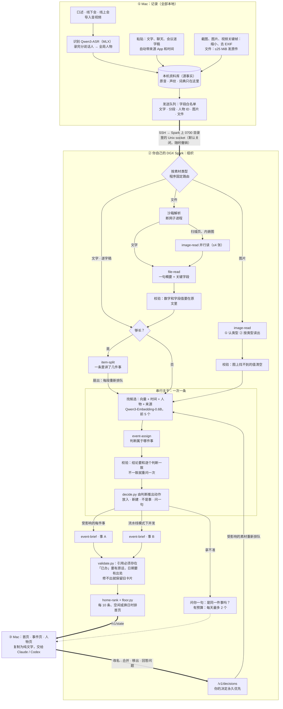

<p align="center"></p>

<h1 align="center">织机 Mindloom</h1>

<p align="center"><b>只管丢进来，不用整理。</b><br>会议、口述、聊天、截图和文件都从一个入口进来；Mac 在本地听清、认出是谁；<br>你自己桌上的 NVIDIA DGX Spark 用一组 Agent Skills 把它们织成一件件事。</p>

<p align="center"><a href="https://www.bilibili.com/video/BV1CbaW6pEcX/">演示视频（B 站，3 分钟）</a> · <a href="https://blog.csdn.net/BronyaZaychik818/article/details/166849977">「十日谈」征文（CSDN）</a> · <a href="https://github.com/Yusong-Enceladus/mindloom/tree/submitted-2026-09-29">截止时提交的版本</a></p>

第三届 NVIDIA DGX Spark 黑客松 · Agent Skills 开发挑战赛参赛项目。个人版：一个人、一台 Mac、一台自己的 Spark。截止时的版本打了标签 [`submitted-2026-09-29`](https://github.com/Yusong-Enceladus/mindloom/tree/submitted-2026-09-29)，之后的改动都是带日期的提交：主要是补评测、改文档，另有 Mac 端的新图标和人物页的一处小改。

## 一分钟看懂

| | |
|---|---|
| **是什么** | 一个人的「记录 → 组织 → 行动」：一个入口接住所有场景；Spark 把散落的素材织成一件件事（现在到哪一步、谁参与、下一个截止）；要推进时，一键复制成纯文字交给 Claude / Codex |
| **在哪跑** | Mac：录音、识别、认人、存储、界面。你自己的 DGX Spark：整理（vLLM 上的 Qwen3.6-35B-A3B NVFP4 + MTP）。**没有云端** |
| **Agent Skills** | 6 个在路由里：image-read、file-read、item-split、event-assign、event-brief、home-rank；另有 1 个占位 recall。按素材类型分路、长素材拆段扇出、串行判断归属、受影响的几件事各自重写卡片，每步都有确定性校验，拿不准就问一句，你的纠正永远优先（[架构图](#spark-上的-skill-图不是一条流水线)） |
| **SKILL.md 正文有用吗** | 同一模型只去掉正文：事件归属 B³ F1 0.782 → 0.612，读图关键字段 97.5% → 62.6%，文件概要一次合格 36/38 → 1–2/38（[评测](#评测)） |
| **规模实测** | 三个合成场景，各是一个人五到六周里的 1,510–1,600 条素材：B³ F1 0.58–0.64，是无模型基线的 2.0–3.6 倍（留出场景 startup 2.2 倍）；每分钟整理约 4 条 |
| **最大短板** | 碎片化：预测的事件数是真值的 11–17 倍；item-split 把 22–33% 只讲一件事的素材也切开了 |
| **隐私** | 音频、声纹、词典从不离开 Mac：发送类型里没有这些字段，有哨兵测试守着。文字和你放进来的截图、文件只经你打开的 SSH 链路去你自己的 Spark。三个规模场景结束后逐字节核对：Spark 收到的只有文字和截图，162 张截图里没有 GPS |
| **模型对比** | 同一代码、同一留出集比了 9 个开放权重模型：Qwen3.8-27B、Muse Glimmer-30B 到 0.83，但每条 52–57 秒；默认 Qwen3.6 是 0.738、每条 9 秒 |

<details>
<summary>English summary</summary>

Mindloom is a personal capture-and-organize system for the NVIDIA DGX Spark Agent Skills hackathon. Everything goes into one inbox on the Mac: meetings, dictation, chats, screenshots and files. The Mac transcribes speech and recognizes speakers locally; audio, voiceprints and the dictionary never leave it. Text, and the screenshots and files you add, go only to your own DGX Spark over an SSH link you switch on and can revoke. There, six Agent Skills (routed by code, schema-guided, each followed by a deterministic validator) turn the stream into matters with a status line, people and deadlines. On three synthetic scenarios (one person's five to six weeks each, 1,510–1,600 items) the organizer reaches B³ F1 0.58–0.64 (2.0–3.6x a no-model baseline); removing only the SKILL.md bodies drops held-out B³ F1 from 0.782 to 0.612. Its main weakness is over-fragmentation. All Spark-side data is synthetic.

</details>


*首页（lab 场景，合成数据，真实 App 渲染）：最近在动的五件事各是一根带子，圆点是已经发生的进展，旗子是接下来的截止。*

## 一个入口，接住所有场景

同一件事常常散在五个地方、三天里：线下当面说了一句，线上会议讨论了十分钟，之后又在聊天截图、邮件和 PDF 里变了几次。织机不要你建文件夹、打标签、选项目，也不用先想「这该放哪」。

| 场景 | 你做的 | 织机做的 |
|---|---|---|
| 线下开会 | 电脑放在桌上，点录音 | Mac 本地转写；录完自动分出说话人，用声纹认出是谁 |
| 线上会议 | 按 App 内录电脑里的声音（不需要虚拟声卡），或导入会议软件的逐字稿 | 同上；腾讯会议、飞书、Zoom、VTT/SRT 逐字稿里的署名直接成为发言人 |
| 随口一句 | 在任何 App 里按住 Fn 说 | 字插到光标处（松手到出字 P50 545 ms），同时存进资料库 |
| 聊天、邮件、网页 | 粘贴 | 自动记下来源 App 和时间；「名：…」的行成为人物 |
| 截图、文件、录像 | 拖进窗口 | Spark 读图、读文件（[33 种格式的评测](#读文件33-种格式)）；录像在 Mac 上取音轨转文字，另取最多 12 张关键帧给 Spark 读 |
| 手机 | 在任意 App 里点「分享到织机」 | 经你自己的 SSH 密钥进你自己 Spark 的收件箱，Mac 取走后照常整理（快捷指令还没在真 iPhone 上跑过） |
| AI 的回答 | 把 Claude / Codex 的回答粘贴回来 | 放回它所属的那件事 |

**谁说的：人也是一条线索。**

- **录音里认人**：线下会、线上会、Fn 口述和导入的录音走同一条本地说话人管线：录完之后先分出说话人，再用声纹匹配到一套**全局人物**。相似度够高自动认出，处在中间的请你确认一下。给一个声音起过名字，以后在哪种录音里都认得。声纹只在 Mac 上；发给 Spark 的逐字稿里，说话人只以时间、人物 ID 和你起的名字出现。
- **文字里的人**：会议逐字稿的署名、聊天里「名：…」的行、聊天截图的发送人也会成为人物，和录音里认出的人汇成同一个人物。名字相近但不完全一样（「小满」和「林小满」）时只提问，不自动合并。
- **人物页**：点开一个人，看到他说过的话和有他的事，每句都带时间、来源 App 和所属的事。


*人物页（lab 场景，合成数据，真实 App 渲染）。这批规模素材是以文字粘贴进来的，没有音频，所以周明澜「说过的话」来自会议逐字稿和聊天里的署名，不是声纹识别。「出现在 43 件事」是碎片化时的原始输出：lab 的真值只有 22 件事（见[规模场景](#评测)）。*

**记录 → 组织 → 行动。** 记录：你只管丢，Mac 负责听清和认人。组织：交给你自己的 Spark。行动：一键带走，回到你手里。织机不内置聊天 Agent，也不替你发消息或做决定。


*事件页（lab 场景，合成数据，真实 App 渲染）：Twin-7 叠衣服真机实验，143 条素材（聊天、Fn 口述、手机上打的字、腾讯会议逐字稿、表格、截图、Codex 的输出）归成一件事，卡片给出毛巾 82%（41/50）、T 恤 74%（37/50）、袋子 66%（33/50），每条都有日期和出处。页面上的「187 条」按行计：长素材拆成几段时，每段算一行。来源里的「织机键盘」是只有设计的手机输入法，这类素材是按设计模拟的。*

## Spark 上的 Skill 图：不是一条流水线

素材先按类型分路，长素材拆段后扇出成几条，再逐条进入一条**串行主干**判断属于哪件事；受影响的几件事各自重写卡片，最后排首页。拿不准时问你一句；你在界面上的纠正回到 Spark，永远压过模型。



- **程序固定路由**：每类任务用哪个 Skill 由代码决定（`spark/organizer/skills.py` 的 `JOB_TO_SKILL`）；模型不自己挑 Skill，也不能调用工具。
- **同一个 harness**：每次调用 = 全局规则 + SKILL.md 正文 + 输出 schema（引导式 JSON）+ 放在 `<data>` 里、声明为资料的素材。每个 Skill 后面跟一个确定性校验器（`scripts/validate.py`），不合格带着错误重问一次；event-assign 的动作由 `decide.py` 从模型对每个候选的判断推出，不信模型自己写的结论字段。每次调用都记录 Skill 名、版本、模型、提示哈希、输入摘要、输出、校验结果和耗时。
- **只有一段是串行的**：判断归属按队列顺序一次一条，开多少线程结果都一样。读图、读文件、拆段、算向量可以提前并行；写卡片在流水线模式（`ORGANIZER_WORKERS` > 1，规模测试用 4）下几件事一起写。视频关键帧直接跟原视频进同一件事，不再判断。
- **两个回路**：拿不准时问一句（「是同一件事吗」「是同一个人吗」，各有预算，72 小时没答就下线，已经放好的位置不变）；你在界面上的改名、合并、移出、回答作为明确的决定发回 Spark，受影响的素材重新排队、卡片重写，以后永远压过模型。
- **退路**：模型服务不可用时任务稍后重排；向量服务挂了就只按时间、人物和来源找候选；链路断开时 Mac 照常记录，事件页改用本机整理。

完整的节点、并行关系和重试规则见 [docs/ARCHITECTURE.md](docs/ARCHITECTURE.md)。

| Skill | 做什么 | 文档 |
|---|---|---|
| image-read 1.0.0 | 读图：先认类型（聊天截图、图表看板、幻灯片、白板、小票发票、扫描件、标签面单，其他归 other），再按类型读出内容和一句概要 | [SKILL.md](skills/image-read/SKILL.md) · [BENCHMARK.md](skills/image-read/BENCHMARK.md) |
| file-read 1.0.0 | 读文件：程序在沙箱里抽出文字，模型只写一句概要和票据类关键字段 | [SKILL.md](skills/file-read/SKILL.md) · [BENCHMARK.md](skills/file-read/BENCHMARK.md) |
| item-split 1.2.0 | 一条里讲了几件事：把会议逐字稿、长口述切成连续的几段，分别判断归属 | [SKILL.md](skills/item-split/SKILL.md) · [BENCHMARK.md](skills/item-split/BENCHMARK.md) |
| event-assign 2.1.0 | 判断属于哪件事：逐个候选比较「是不是同一个对象」，动作由 `decide.py` 推出 | [SKILL.md](skills/event-assign/SKILL.md) · [BENCHMARK.md](skills/event-assign/BENCHMARK.md) |
| event-brief 1.4.0 | 写这件事到哪一步：短标题、一句现状、1–4 条带出处的事实；日期只用素材给了的，「定了」不算「办完了」 | [SKILL.md](skills/event-brief/SKILL.md) · [BENCHMARK.md](skills/event-brief/BENCHMARK.md) |
| home-rank 1.3.0 | 排首页：给每件事打「现在对你有多重要」，再由 `floor.py` 保证 7 天内还有待办的事不被挤下去 | [SKILL.md](skills/home-rank/SKILL.md) · [BENCHMARK.md](skills/home-rank/BENCHMARK.md) |
| recall 0.1.0（占位） | 留给本机其它 Agent 的只读关键词回忆入口；不在路由里，没有评测 | [SKILL.md](skills/recall/SKILL.md) |

item-split 的代码是 1.2.0，但 BENCHMARK 里完整评测的是 1.1.1；两个版本都只在调参集 split-dev 上评过，1.2.0 只和 1.1.1 做了对比。它在真实规模数据上的表现见下面的[过度拆分](#item-split-在规模数据上切得太多)。

## 隐私：先知道每样东西去了哪

要敢把一整天都丢进来，前提是知道每样东西去了哪、谁能碰到、怎么收回。「模型在本地跑」只回答了谁在算；下面七条是代码里做到、有测试的：

1. **Spark 听不到你的声音。** 识别、分说话人、声纹匹配都在 Mac 上。发送类型里根本没有音频、声纹、词典、窗口标题的字段；一个「哨兵」测试把这些埋进合成资料库，断言发出的报文里一个都没有。
2. **Spark 不对网络开端口。** 整理服务只在一个 0700 目录里的 Unix socket 上监听；Mac 用你自己的 SSH 密钥连过去，每个请求前都核对本机转发端口确实是 App 自己启动的 ssh 在监听。令牌另走一条 SSH 读进内存，不写盘、不进日志。App 没有内置主机，你不填就不连任何机器。
3. **关掉就是撤销。** 链路默认关闭，只发打开之后开始的记录。关掉的那一刻隧道断开、待发队列清空；再打开也不补发关着期间的内容。状态读不准时一律按关闭处理。
4. **隐私不拿功能换。** 口述、录音、识别、插入、搜索都不经过 Spark。Spark 断开时待发内容在 Mac 上排队，事件页改用本机整理。
5. **只发必要的。** 只在你按 ⌘V 或拖入时才读剪贴板；密码管理器标成隐藏或临时的内容整份拒收；截图发的是缩小后的副本，不带 EXIF 里的位置和设备；拖进来的网页链接不会被抓取。
6. **素材只当数据。** Spark 只返回事件、标题、进展、排序这类派生结果；它那边的素材表只能新增，不能改、不能删。素材里写着「删除所有事件」也只是一条内容。纠正只能从界面发出。
7. **开发期也守边界。** 真实资料库在代码层面就发不出去（按文件身份识别，所有构建配置都一样）；Spark 上的评测和演示全部用合成数据。Spark 上的模型都是开放权重，只在本机 127.0.0.1 上服务；解析文件的子进程直接断网。

**三个诚实的边界：**

1. **Mac 上删了，Spark 上不会跟着删。** v1 没有远程删除接口，关掉链路也不收回已经送到的内容。Spark 上的数据库是普通 SQLite，没有额外加密，保护靠 Spark 账户权限（0700 目录）；删除方法见 [PRIVACY.md](docs/PRIVACY.md)。
2. **「音频不出 Mac」指的是录音和按音视频导入的文件。** 你主动拖进来的其他文件，比如压缩包、导入列表之外的音视频格式、相机 RAW，只要不超过 25 MiB，会原样发到 Spark，里面的音频或位置信息也一起过去。
3. **有几个环节还没实证。** 真实资料库还没打通（发布开关关着，Spark 整理只在合成资料库上跑过）；手机快捷指令没在真 iPhone 上跑过；Spark 上的对话模型服务由你自己启动，它有没有关掉 vLLM 的使用统计，本仓库证明不了（我们启动的向量服务显式关掉了）。

威胁与对应防护、Spark 上存了什么、怎么删，见 [docs/PRIVACY.md](docs/PRIVACY.md)。

## 评测

全部是合成数据（虚构的人、公司、单号），如实报告，包括不好看的数字。n 很小：留出集只有 46 条，大多数条件只跑 1–2 次；默认模型在同一份代码上跑两次，B³ F1 就差 0.065。完整表格和出处在 [docs/EVALUATION.md](docs/EVALUATION.md)，机器可读的全部数字在 [eval/results-2026-09-29/eval.json](eval/results-2026-09-29/eval.json)。

**指标一句话：**

- **B³ F1**：对每条素材，看和它分在一起的是不是真该在一起（精确率）、该在一起的是不是都在一起（召回），再取调和平均；衡量分组，0–1，越高越好。
- **Link F1**：先把预测的事和真事一对一配对，再看每条素材是否挂在配对的那件事上；段级 Link F1 按拆出的段算。
- **易混事件泄漏**：刻意写得很像的两件事被并到一起的比例，越低越好。
- **卡片事实召回**：金标准里的事实有多少写进了卡片；不判断卡片里多写的内容对不对。
- **NDCG@5**：首页前 5 件事的顺序和金标准重要度有多一致，0–1。
- **R@5**：正确的事在不在检索出的前 5 个候选里（event-assign 只在这 5 个里选，所以它是归属准确率的上限）。
- **ECE**：模型说的置信度和实际准确率平均差多少，越小说明置信度越可信。**CER**：字错率。

### 用了哪些模型，在哪跑

| 功能 | 模型 | 在哪 | 关键数字 |
|---|---|---|---|
| 事件归属、卡片、首页、拆段 | Qwen3.6-35B-A3B NVFP4（vLLM，MTP×3，fp8 KV） | 你的 Spark | 留出集 B³ F1：最终版本 0.782（n=2）；当前代码两次均值 0.738；单流约 100 tok/s |
| 读图 image-read、读文件 file-read | 同一个 Qwen3.6（解析文件的部分是确定性代码，不用模型） | 你的 Spark | 98 张测试图关键字段 96.2% / 98.8%；33 种格式答案出现率 0.82 / 0.81（两次） |
| 候选检索 | Qwen3-Embedding-0.6B | 你的 Spark | 候选 R@5：dev 98.6%、留出 100%；单条 25 ms |
| 口述识别 · 终稿 | Qwen3-ASR 1.7B 8-bit（MLX）＋ 41 条词表 | Mac | CER 3.74%，松手到出字 P50 545 ms / P90 635 ms |
| 口述识别 · 实时稿 | SenseVoice small int8（Core ML） | Mac | CER 5.75%，解码中位 150 ms |
| 口述整理 | 规则 ＋ Qwen3-0.6B 8-bit LoRA ＋ 忠实度护栏 | Mac | 对校对稿精确率 98.12%，生成中位 193 ms |
| 说话人 / 人物 | FluidAudio 0.15.5 ＋ fluid-speaker-diarization-coreml | Mac | AMI 公开真人留出集：说话人混淆 2.07%，已知人误认 0，陌生人 16/16 拒认；DER 24.93% 偏高 |

每个功能比过哪些备选、为什么选它，见 [docs/MODELS.md](docs/MODELS.md)。

### 规模场景：三个人，各 1,500–1,600 条


三个虚构人物（实验室研究生、创业公司 CTO、大厂产品经理），每人五到六周的素材（lab 五周，startup 和 pm 各六周）由 Mac 端 harness 一次性粘贴进去，一台 Spark 整理完再打分。金标准来自确定性计划，不来自模型。基线是不调模型的字符二元组相似度（三个阈值里取最好）。

| | lab（dev） | startup（**留出**） | pm（dev） |
|---|---|---|---|
| 素材 / 真事件 / 真人物 | 1,510 / 22 / 36 | 1,600 / 20 / 43 | 1,600 / 21 / 42 |
| **B³ F1**（基线） | **0.642**（0.179） | **0.584**（0.266） | **0.606**（0.299） |
| **Link F1**（基线） | **0.630**（0.136） | **0.582**（0.116） | **0.563**（0.186） |
| 易混事件泄漏 ↓（基线） | 0.225（0.258） | 0.068（0.833） | 0.140（0.920） |
| 事件数：预测 / 真 | 242 / 22 | 348 / 20 | 227 / 21 |
| 卡片事实召回 | 0.489 | 0.583 | 0.652 |
| 吞吐（条/分钟） · GPU 利用率 | 4.00 · 93.6% | 3.85 · 94.1% | 3.71 · 87.0% |

- **比基线好很多**：B³ F1 是基线的 3.6 / 2.2 / 2.0 倍，Link F1 是 3.0–5.0 倍。
- **易混的事**：startup 和 pm 上泄漏远低于基线（0.83 → 0.07、0.92 → 0.14）；lab 几乎没有改善（0.258 → 0.225），8 对易混种子只分开了 1 对。
- **最大的问题是碎片化**：预测事件数是真值的 11–17 倍，只有 1 条素材的事有 109–233 件。精确率（0.68–0.71）高于召回（0.51–0.59）：宁可拆开，也不乱合并。人物关联只有 0.23–0.26，首页排序在几百件事的规模上也不行（lab NDCG@5 0.128，低于只按时间排的 0.206）。

### 技能正文到底有没有用：有 / 没有 SKILL.md 正文


「没有正文」= 同一个模型，保留全局规则、JSON schema、校验器和重试，只把 SKILL.md 正文换成一行任务名（`eval_common.strip_skill_text`）。所以它量的是**技能说明文字本身**的贡献，不是整个架构对裸模型的优势。数字来自各 Skill `BENCHMARK.md` 的「最终版本」一节（代码 13c3ae1）。

| Skill | 指标 · 数据 | 有正文 | 没有正文 |
|---|---|---|---|
| event-assign | B³ F1 · 留出集 46 条 | **0.782** | 0.612（向量基线 0.336、词法基线 0.463） |
| event-brief | 卡片事实召回 · 留出集 | **0.511** | 0.431 |
| home-rank | NDCG@5 · 留出集 | **0.923** | 0.806（只按时间 0.886） |
| image-read | 关键字段准确 · 98 张测试图 | **97.5%** | 62.6% |
| image-read | 类型判对 · 98 张测试图 | **99.0%** | 83.7% |
| file-read | 概要一次合格 · 38 个有文字的文件 | **36/38** | 1–2/38 |

正文主要提高召回（把该放一起的放一起）和一次合格率；没有正文时模型更保守，更多输出被校验器拒掉。event-assign、event-brief、home-rank、item-split 四个 Skill 的 `evals/evals.json` 里带机器检查的 30 个用例（全部来自 dev 或虚构）在当前代码上各跑 3 次：25 个用例 3 次全过，共 80/90 次通过；三个提示词注入用例里模型都没有照着注入的指令做。

### 整理模型对比（同一代码、同一留出集）


所有行都在同一份代码（2e532bc）、同一套技能提示、同一个检索模型上跑，关闭思考，每个模型独占一台 Spark（DeepSeek 占两台）。留出集 holdout-week-v2：46 条、7 件事、2 个难干扰。46 条里有 4 张图片：DeepSeek、GLM、gpt-oss 是纯文本模型，Mistral 为了避开出过问题的视觉路径，这几行的图片都交给 Qwen3.6 读。

| 模型 | n | B³ F1 | 卡片事实召回 | 难干扰泄漏 ↓ | 秒/条 |
|---|---|---|---|---|---|
| Qwen3.8-27B-FP8 | 1 | **0.834** | 0.644 | 0.000 | 52.2 |
| Muse Glimmer-30B NVFP4 | 1 | **0.832** | 0.644 | 0.000 | 56.6 |
| Gemma 4 26B-A4B-it（bf16） | 2 | 0.786（两次相同） | **0.684** | 0.000 | 37.3–37.4 |
| GLM-4.7-Flash（30B-A3B） | 2 | 0.750（0.746–0.755） | 0.425 | 0.375 | 39.3–39.7 |
| **Qwen3.6-35B-A3B NVFP4（默认）** | 2 | 0.738（0.706–0.771） | 0.546 | 0.083 | **8.5–9.5** |
| DeepSeek-V4-Flash（两台 Spark TP2） | 1 | 0.735 | 0.609 | 0.417 | 24.3 |
| Nemotron-3-Super-120B-A12B NVFP4 | 1 | 0.728 | 0.322 | 0.778 | 44.0 |
| Mistral Small 4 119B NVFP4 | 1 | 0.480 | 0.310 | 0.215 | 32.8 |
| Nemotron-3-Nano-Omni-30B-A3B NVFP4 | 1 | 0.395 | 0.207 | 0.000 | 19.0 |
| gpt-oss-120b（reasoning low） | — | 跑到 24/46 条停止 | | | 约 125 |

- **默认模型的真实水平是 0.738**：之前文档里的 0.782 是更早的最终版本代码（13c3ae1，还没有 item-split）上的两次结果，不能拿来和这张表比；同代码两次之间就差 0.065。
- **更准的都慢得多**：Qwen3.8 和 Muse Glimmer 到 0.83、难干扰泄漏 0，但每条 52–57 秒，1,600 条串行要 23–25 小时；Muse Glimmer 在 dev 上只有 0.672，不稳定。Gemma 4 26B-A4B 是这次最值得跟进的：两次结果一致，卡片事实召回最高，每条 37 秒。
- **为了跑起来做的适配**：Mistral Small 4 要在进程内补上 transformers 改名的两个 Pixtral 函数、去掉请求里的 `chat_template_kwargs` 才跑通（结果是最差一档）；gpt-oss-120b 推理关不掉，给足输出额度后能正常输出，但每条 125 秒，跑到一半停下，已完成部分的分组和默认模型相当。Gemma 4 31B QAT（w4a16）和 Nemotron-3.5-Lightning 在这里的 vLLM 0.30.0 上起不来或只输出无效结果，原因都记在 [docs/MODELS.md](docs/MODELS.md)。
- **结论**：默认仍是 Qwen3.6（一台 Spark 同时做文字和读图、最快）。

### 速度和 token：每个技能花多少


直接统计三个规模场景 Spark 上的调用记录（共 21,542 次调用，全部是 Qwen3.6），没有另跑模型。

| 技能 | 调用次数 | p50 / p95（秒） | 平均输入 / 输出 token | 最终被接受 | 占输入 token（startup） |
|---|---|---|---|---|---|
| event-assign | 8,796 | 4.5 / 7.5 | 6,989 / 205 | 99.8% | 27% |
| event-brief | 8,056 | 11.3 / 16.7 | 16,467 / 567 | **42.7%** | **59%** |
| item-split | 3,468 | 4.2 / 11.3 | 3,641 / 191 | 95.7% | 5% |
| home-rank | 1,060 | 22.4 / 37.5 | 16,372 / 1,975 | 99.8% | 8% |
| screenshot-read（规模场景跑在 image-read 之前的代码上） | 162 | 6.7 / 19.7 | 2,825 / 405 | 100% | <1% |

- 每条素材 4.45–4.68 次模型调用、46,104–49,107 个输入 token；端到端每分钟约 4 条，三个场景各跑了 6.3–7.2 小时。判断归属必须按顺序做，是瓶颈；其余可以并发，有效并发约 2.4。
- **最大的可省之处**：event-brief 有 49–64% 的调用最后被校验拒掉（多是没有原话支持的「已完成」和相对日期），这些调用吃掉全部输入 token 的 34–44%。被拒时保留旧卡片，所以代价是卡片滞后，而不是写错。

### item-split 在规模数据上切得太多

之前只在调参集 split-dev 上评过（切不切判断 1.000、段 F1 0.937）。这次直接用三个规模场景里整理器**实际切出的段**对照分段真值，没有另跑模型。

| | lab | startup（留出） | pm |
|---|---|---|---|
| 只讲一件事却被切开 ↓ | 32.8% | 30.2% | 22.4% |
| 多件事的素材里，每件事被找回 | 0.692 | 0.716 | 0.832 |
| 切出的段的纯度 | 0.969 | 0.933 | 0.971 |

切出来的段是干净的，但切得太多：被切开的单件事素材里，各段又被分进两件以上事的占 49–56%，这是碎片化的来源之一。调参集上的好成绩在规模数据上没有保持住。

### 读文件：33 种格式


`eval/files-multiformat` 的测试集 115 个合成文件（33 种格式、412 道带金标准的问题）逐个送进整理器真实的读文件路径（沙箱解析 → 扫描页和内嵌图交给 image-read → file-read 写概要），跑了 2 次。每道题的「回答」就是整份读取结果，所以这个数是「**金标准答案有没有出现在整理器读到的东西里**」，是任何基于这份读取结果作答的上限。

| 分组 | 文件 | 只解析、不调模型 | 解析 ＋ 读图 ＋ 概要（两次） |
|---|---|---|---|
| 有文字层 | 66 | 0.911 | 0.915 / 0.915 |
| 部分内容只在图里 | 13 | 0.674 | 0.978 / 0.913 |
| 纯图片、扫描、视频 | 36 | 0.015 | 0.592 / 0.577 |
| **全部 33 种** | 115 | 0.602 | **0.820 / 0.808** |
| 不含 HEIC、MP4、MOV 的 30 种 | 104 | 0.665 | **0.906 / 0.893** |

- HEIC 和视频在 Spark 上报「不支持」是设计如此：Mac 负责转码 HEIC、取视频的音轨和关键帧。但这条 Mac 端路径没有在这套评测集上跑过，所以这 3 种格式的产品效果**未测**。
- 两个可以直接修的缺陷：XML 的属性值没有读出来（答案出现率 0.20）；GIF 只读了首帧（0.47）。0 个文件崩溃。
- file-read 自己的评测集 files-v1（20 类模板、40 个测试文件）：类型判对 40/40，概要一次合格 36/38。

### 读图、候选检索和 System One

- **读图（产品路径）**：mm-v1 测试集 98 张合成图，先认 7 类再按类抽取、校验器拒绝图上找不到的值：类型判对 98.0% / 100%，关键字段准确 96.2% / 98.8%，编造数字 0.9% / 0.5%，单张 p50 约 4 秒。比过 10 个读图模型：Qwen3.8-27B-FP8 关键字段最高（98.8%），但单路慢约 4 倍；OCR 专用小模型不会按 schema 出 JSON。真实照片、多图和图里的提示词注入还没有评测集。
- **候选检索**：Qwen3-Embedding-0.6B 的候选 R@5 dev 98.6% / 留出 100% / 压力池 98.1%；4B 只高 0–1.4 个点，时延 1.6–3.2 倍。
- **System One**（一次前向给出「归哪件事 / 新事 / 不是事」的校准概率，只做评测、默认关闭）：在 Spark 上用 Spark 生成的数据微调 Qwen3-Reranker-0.6B，TEST 1,953 个决定上准确率 76.9%、ECE 0.021，在 97% 精确率下能直接决定 46.6%；但**没有超过**只取检索第一名的 77.3%，不看文字的 25 维检索特征逻辑回归反而有 84.0%。所以没有接进整理器。开源的 Laya（mmBERT-base）在这个任务上零样本只有 4.2%。详见 [eval/system_one/RESULTS.md](eval/system_one/RESULTS.md)。

### Mac 端：识别和说话人

| 识别器（240 条用户自己的口述，同一口径） | CER | 英文词召回 | 解码中位 |
|---|---|---|---|
| **Qwen3-ASR 1.7B 8-bit ＋ 41 条词表（终稿）** | **3.74%** | **30/41** | 939 ms |
| 同模型 bf16（H100 参考） | 3.78% | 29/41 | 710 ms |
| FireRedASR2-AED（75 条子集） | 4.07% | 6/10 | 1,367 ms |
| Fun-ASR-Nano-2512 | 4.69% | 27/41 | 396 ms |
| SenseVoice small int8（实时稿） | 5.75% | 24/41 | 150 ms |

- 口述时常驻 5.17 GB，空闲后释放到 0.93 GB。否决过的方向：用个人历史做 ASR LoRA（CER 2.57% → 8.43%）。
- 说话人（公开 AMI 真人留出集）：说话人混淆 2.07%，已知人误认 0，错误合并 0，已知查询 15/16，陌生人 16/16 拒认，RTF 0.0056；DER 24.93%、JER 31.78% 偏高，记为局限。说话人任务在录完之后跑，不是边录边出名字。

### 隐私：Spark 实际收到了什么


在三个规模场景的 Spark 上只读打开整理器数据库，逐条统计 Mac 发来的内容，只输出汇总。

| 场景 | 收到的素材 | 文字 | 文档文字 | 截图 | 音视频文件头 | 长度 ≥32 的浮点向量 | EXIF 里的 GPS |
|---|---|---|---|---|---|---|---|
| lab | 1,508 | 1.31 MB | 1.02 MB | 52 张 8.0 MB | 0 | 0 | 0/52 |
| startup | 1,600 | 1.19 MB | 0.91 MB | 55 张 5.5 MB | 0 | 0 | 0/55 |
| pm | 1,600 | 1.13 MB | 0.91 MB | 55 张 10.5 MB | 0 | 0 | 0/55 |

这批素材本来就没有音频，所以「音频 0 字节」在这里不算证明；「不发音频、声纹、词典」靠的是 Mac 发送类型里没有这些字段，以及上面说的哨兵测试。这组数字说明的是另一件事：出网内容可以这样逐字节核对。

### 弱点和没测的

1. **碎片化**：事件数是真值的 11–17 倍；item-split 过度拆分是来源之一。
2. **人物**：人物关联 0.23–0.26；同名加英文后缀的记录没合并，代码里的 `ValueError` 被当成了人。
3. **首页排序扛不住规模**：小留出集 NDCG@5 0.92，规模场景 0.13–0.35。
4. **卡片校验太严**：49–64% 的 event-brief 调用最后被拒，白白用掉 34–44% 的输入 token。
5. **没测的**：卡片事实的精确率；HEIC 和视频在 Mac 端的完整路径；真实照片和真实文件；recall；系统翻译；16 GB Mac 上的识别和说话人门槛。Spark 上没有任何真实用户数据的评测，这是隐私规则要求的。

## 对照评分项

| 评分项 | 在哪里看 |
|---|---|
| 价值与创新 | 一个入口接住所有场景；Spark 把散落的素材织成一件件事；隐私边界做到了代码和测试里（[隐私](#隐私先知道每样东西去了哪)） |
| 智能体与模型深度 · 多智能体与 Skills | 6 个 Skill 组成的图：按类型分路、扇出、串行主干、并发写卡片、确定性校验、提问回路、纠正回路（[架构](#spark-上的-skill-图不是一条流水线)）；SKILL.md 正文的消融（[对比](#技能正文到底有没有用有--没有-skillmd-正文)） |
| 智能体与模型深度 · 模型调优 | System One：在 Spark 上用 Spark 生成的数据微调并校准 Qwen3-Reranker-0.6B（ECE 0.021，但准确率没有超过只取检索第一名，所以没接进整理器）；Mac 端口述整理模型 Qwen3-0.6B LoRA；过拟合审计后把提示里的开发集原话换成虚构例子，dev F1 从 0.787 降到 0.740，如实记录 |
| 完整性 | Mac 客户端、Spark 服务、7 个 Skill 目录（各带 SKILL.md、scripts、evals、BENCHMARK）、评测驱动和评分器、三个规模场景；[不装 Mac 也能验证](#不装-mac-也能验证) |
| 平台适配（Spark、NVIDIA 技术栈、开源模型） | 单台 Spark 上 Qwen3.6-35B-A3B NVFP4 + MTP 单流约 100 tok/s，规模场景 GPU 利用率 87–94%；DeepSeek-V4-Flash 跨两台 Spark 做 TP2；Step3-VL-10B 原生接口适配，同一张截图 70.17 s → 19.16 s；在 Spark 上试了 20 多个开放权重模型，起不来的也记下了原因（[模型对比](#整理模型对比同一代码同一留出集)）；合成数据由多台 Spark 并行生成 |
| 演示视频 · 征文 | [B 站](https://www.bilibili.com/video/BV1CbaW6pEcX/) · [CSDN](https://blog.csdn.net/BronyaZaychik818/article/details/166849977) |

## 不装 Mac 也能验证

Spark 端是纯 Python，任何有 Python 3.12 的机器都能跑测试；评测只要一个 OpenAI 兼容的对话端点（建议 Qwen3.6-35B-A3B）和一个向量端点。

```bash
python3.12 -m venv .venv && .venv/bin/pip install -e "spark[test]"
(cd spark && ../.venv/bin/python -m pytest -q)                       # 整理服务、链路、沙箱、校验器的测试

# 不调模型：用已入库的快照重算留出集第一次评测的分数
.venv/bin/python eval/score.py --gold eval/scenarios/holdout-week-v2/scenario.json \
  --snapshots eval/runs/holdout2-skills-qwen-r1/snapshots

# 接你自己的端点，在留出集上跑三个条件（合成数据）
H=eval/scenarios/holdout-week-v2/scenario.json
.venv/bin/python eval/run_eval.py --scenario $H --condition skills         --out /tmp/h2-skills   --llm-url http://127.0.0.1:8000/v1 --embed-url http://127.0.0.1:8002/v1
.venv/bin/python eval/run_eval.py --scenario $H --condition without-skills --out /tmp/h2-noskill  --llm-url http://127.0.0.1:8000/v1 --embed-url http://127.0.0.1:8002/v1
.venv/bin/python eval/run_eval.py --scenario $H --condition baseline --embed hash --out /tmp/h2-baseline
```

Mac 客户端在 [mac/](mac/README.md)，代码、工程名和 Bundle ID 沿用开发代号 bestASR（`com.bestasr.app`）；构建需要 Xcode 27 和一个外置构建卷，目前没有发布安装包。

## 部署

1. **Spark（整理端）**：所有服务在用户空间运行，只监听 `127.0.0.1` 或私有 Unix socket。用 vLLM 启动 Qwen3.6-35B-A3B NVFP4 的 OpenAI 兼容服务（`--host 127.0.0.1`，按模型卡开 MTP）；`spark/serve_embed.sh` 起 Qwen3-Embedding-0.6B；再部署整理服务：
   ```bash
   spark/deploy.sh YOUR_SPARK                                     # 在 Mac 上：把 spark/ 和 skills/ 同步到 Spark
   ssh YOUR_SPARK 'bash ~/hack/organizer/spark/setup_venv.sh'     # 整理服务自己的 venv
   ssh YOUR_SPARK '~/hack/organizer/spark/ctl.sh start'           # 或按 docs/DEPLOY_DEMO.md 装成 systemd 用户服务
   ```
   关键环境变量和首次启动生成的链路令牌见 [spark/README.md](spark/README.md)。
2. **Mac（收集端）**：按 [mac/README.md](mac/README.md) 构建，然后把链路指向自己的 Spark：
   ```bash
   defaults write com.bestasr.app preferences.spark-organizer-host YOUR_SPARK
   defaults write com.bestasr.app preferences.spark-organizer-socket-path '~/hack/organizer-data/organizer.sock'
   defaults write com.bestasr.app preferences.spark-organizer-token-path '~/hack/organizer-data/link_token'
   ```
   开发和演示时用 `mac/script/make_synthetic_data_root.sh <绝对路径>` 建一个合成数据目录，用 `-BestASRDataRoot <绝对路径>` 启动 App，再在设置里打开 Spark 开关。
3. **手机（可选）**：按 [docs/PHONE.md](docs/PHONE.md) 给手机单独配一把只能写收件箱的 SSH 密钥。

## 探索与未完成

这些做过或设计过，但不在主线上：

- **System One 快路径**：只做评测、默认关闭（见上）。**event-merge 离线合并**：在 lab 上把事件数从 242 降到 184、B³ F1 从 0.642 升到 0.660，但只在实验分支上，没有进入这个快照。
- **Mac 上的翻译（Fn+⇧）和语音指令（Fn+空格）**：用系统翻译和本机小模型，质量没有评测（[docs/MODELS.md](docs/MODELS.md)）。
- **手机**：快捷指令「分享到织机」的收件箱和 Mac 端拉取已实现并有测试，但没在真 iPhone 上跑过；手机输入法只有设计。
- **recall**：只读回忆入口的占位，不在路由里。

## 开发时间线

- **黑客松之前（2026-07 至 2026-09-23）**：Mac 端的口述底座从 2026-07-23 就在开发（此前 266 个提交）：音频采集与落盘、按 App 的系统内录、说话人与全局人物、本地口述识别与整理、投递层。织机的「按住 Fn 口述」建立在这个底座上。
- **黑客松期间（北京时间 2026-09-26 至 09-29 23:59 截止）**：
  - Spark 端全部新做（90 个提交）：整理服务、6 个在路由里的 Agent Skills 和 1 个占位、读图和读文件、长素材拆段、手机收件箱、评测驱动与评分器、小场景和三个规模场景、多轮评测与过拟合审计、System One、20 多个开放权重模型的对比。
  - Mac 端 52 个提交（188 个文件，+34,933 / −571 行）：Mac↔Spark 可撤销链路（端口归属核对、链路令牌、按修订号发送、合成数据闸门）；粘贴 / 拖入任何文件并带来源 App；会议逐字稿导入；视频关键帧；手机收件箱拉取；导出为纯文字；首页、事件页、人物页；规模场景的端到端 harness。
- **截止之后**（标签 `submitted-2026-09-29` 之后）：Spark 端 7 个提交，补评测、改文档和导出规则；Mac 端 3 个提交，换成新图标，人物页每件事引一句原话。
- 公开仓库不含私有仓库的历史：每次发布都是从私有仓库导出的一份快照提交（去掉个人数据工具、设备与签名信息和内部笔记）。

## 仓库结构

| 路径 | 内容 |
|---|---|
| [mac/](mac/README.md) | macOS 客户端（Swift，代号 bestASR）：采集、识别、本机资料库、链路、界面；PRD、技术设计与实现状态 |
| [spark/](spark/README.md) | Spark 端整理服务（Python）与测试 |
| [skills/](skills/) | Agent Skills（每个目录：SKILL.md、scripts/、evals/、BENCHMARK.md） |
| [eval/](eval/README.md) | 合成场景、评测驱动、评分器、各次运行的结果；[eval/results-2026-09-29/](eval/results-2026-09-29/README.md) 是本 README 评测数字的汇总 |
| [ops/](ops/spark_demo.sh) | 演示实例控制脚本 |
| [docs/](docs/) | 架构、隐私、文件类型、手机入口、模型清单、部署和评测 |

## 许可

Apache-2.0，见 [LICENSE](LICENSE)。第三方组件和模型许可见 [THIRD-PARTY-NOTICES.md](THIRD-PARTY-NOTICES.md)。仓库不包含任何模型权重、音频或真人数据。
