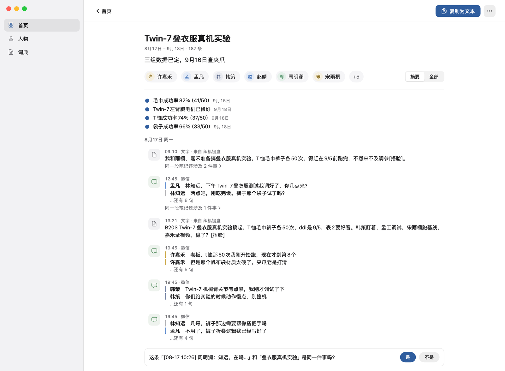
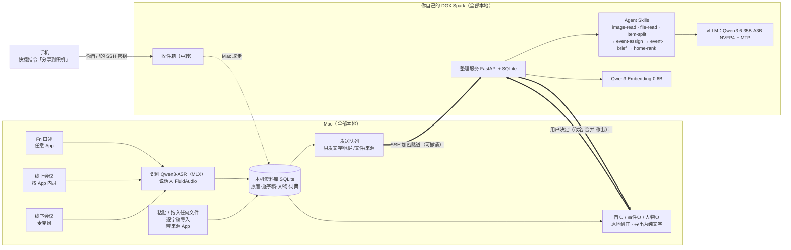

# 织机 Mindloom

> 只管把东西丢进来，不用整理。开会、口述、聊天、邮件、网页、截图、文件，都从一个入口进来；录音在 Mac 上就转成文字，认出每句话是谁说的；你自己桌上的 DGX Spark 用一组 Agent Skills 把它们织成一件件事，每件事有现状、有人、有截止。要推进某件事时，把它复制成一段纯文字交给 Claude 或 Codex，答案粘贴回来，还归进同一件事。

第三届 NVIDIA DGX Spark 黑客松 · Agent Skills 开发挑战赛参赛项目。个人版：一个人、一台 Mac、一台自己的 Spark。

**演示视频 / 征文**：[演示视频：待补 B 站链接] · [「十日谈」征文（CSDN）](https://blog.csdn.net/BronyaZaychik818/article/details/166849977)

## 记录 → 组织 → 行动

同一件事常常散在五个地方、三天里：线下当面说了一句，线上会议讨论了十分钟，之后又在聊天截图、邮件和 PDF 里变了几次。会议纪要工具只管一场会，口述工具只管一句话，笔记软件要人自己整理，每次找 AI 帮忙还得把来龙去脉重讲一遍。织机把这个过程拆成三步，**中间那一步不用你做**：

1. **记录（你）**：只管丢进来。在 Mac 上开会、按 Fn 说话、粘贴、拖文件，在手机上点「分享」。每条自动带上来源 App 和时间。
2. **组织（你自己的 Spark）**：Spark 上的 Agent Skills 先读图、读文件，把一场会切成几段，再把每段归进它所属的那件事，写下标题、「现在到哪一步」、谁参与了、接下来的截止；拿不准时只问一句「是同一件事吗」。卡片上的日期只用素材里给了的，只说「定了」的话不会被写成「已办完」；你在界面上的改名、合并、移出永远优先。
3. **行动（你）**：把一件事导出成一段纯文字（标题、现状、人物、带时间和出处的原件），交给 Claude、Codex 或发给别人；拿回来的答案粘贴回来，还归进同一件事。织机不内置聊天 Agent，也不替你做决定。

### Spark 上跑什么

- **Agent Skills**（程序固定路由，每个都有 `SKILL.md`、确定性校验脚本、评测集和 `BENCHMARK.md`）：image-read 读图 → file-read 读文件 → item-split 把一场会切成几段 → event-assign 归到哪件事 → event-brief 写卡片 → home-rank 排首页。离线合并实验另用了 event-merge；recall 是留给本机其它 Agent 的只读回忆入口（占位）。
- **开放权重模型**：默认 Qwen3.6-35B-A3B NVFP4（vLLM + MTP，整理和读图同一个模型）和 Qwen3-Embedding-0.6B（候选检索）。对照过最新的 Qwen3.8-27B-FP8：小场景上整理更准（dev / 留出集 B³ F1 0.837 / 0.834，现用模型留出集 0.782），但每条慢 2.7–3.3 倍，所以作为「质量选项」。
- **数据生成、评测和服务都在 Spark 上**：用 Spark 上的大模型生成合成场景，在 Spark 上训练和校准 System One，整理、读图和读文件的评测都在 Spark 上跑，整理服务也常驻在 Spark 上。
- **实测**（合成数据）：三个一个多月量级的场景（1,510 / 1,600 / 1,600 条），归组 B³ F1 分别是 0.642 / 0.584 / 0.606，无模型基线 0.179 / 0.266 / 0.299；每分钟整理约 4 条。眼下最大的短板是碎片化：lab 的 22 件真事被整理成 242 件，离线合并后是 184 件。细节见下文 ③。


*首页（lab 场景，合成数据，真实 App 渲染）：最近在动的五件事各是一根带子，圆点是已经发生的进展，旗子是接下来的截止。*

## 一个入口，接住所有场景

不用建文件夹、打标签、选项目，也不用先想「这该放哪」。

| 场景 | 你做的 | 织机做的 |
|---|---|---|
| 线下开会 | 电脑放在桌上，点录音 | Mac 本地转写，分出说话人，认出每句话是谁说的 |
| 线上会议 | 按 App 内录电脑里的声音；或把会议软件导出的转写导进来 | 同上；长会由 item-split 切成几段，分别归进各自的事 |
| 随口一句 | 在任何 App 里按住 Fn 说 | 字插到光标处，同时存进资料库 |
| 聊天、邮件、网页 | 粘贴 | 记下来源 App 和时间；聊天里「名：…」的行成为人物 |
| 文件 | 拖进窗口 | Office、PDF 和扫描件、表格、幻灯片、邮件、日程、名片、电子书、压缩包、网页存档、代码都能读（评测集覆盖 33 种格式）；录像取音轨和关键帧 |
| 手机 | 在任意 App 里点「分享到织机」 | 经你自己的 SSH 密钥进你自己 Spark 的收件箱，Mac 取走后照常整理（快捷指令还没在真 iPhone 上跑过） |
| AI 的回答 | 把 Claude / Codex 的回答粘贴回来 | 归进它所属的那件事 |

### 谁说的：人也是一条线索

- **认出是谁**：线下会、线上会、Fn 口述和导入的录音走同一条本地说话人管线：先分出说话人，再用声纹匹配到一套**全局人物**。给一个声音起过名字，以后在哪种录音里都认得是同一个人。声纹只在 Mac 上；发给 Spark 的逐字稿里，说话人只以时间、人物 ID 和你起的名字出现。
- **文字里的人**：聊天粘贴里「名：…」的行、截图里的发送人也会成为人物；相近的名字只提问，不自动合并。
- **人物页**：点开一个人，看到她在哪些事里、说过哪些话，每句都带时间、来源 App 和所属的事。


*人物页（合成数据，真实 App 渲染）：导师周明澜说过的话，每句都标出时间、来源和属于哪件事。*

## 隐私：这是前提，不是附加功能

录音在 Mac 上就转成文字、认出是谁；离开 Mac 的只有文字，以及你自己放进来的截图和文件。

- **音频、声纹和词典永不离开 Mac。** 识别、说话人分离、声纹匹配全部在 Mac 上。
- **文字、截图和文件只去你自己的 Spark**：经一条你显式打开、随时可以撤销的 SSH 加密链路，只用于整理。**没有任何云端路径**：没有云模型 API，没有遥测。
- 录音、识别、插入和搜索都不依赖这条链路；关掉或断开时，Mac 照常工作并退回本机整理器。
- 收进来的内容永远只当数据，不当指令：素材里写「删除所有事件」只会被当成内容。
- 开发和演示只用合成数据：只有带 `SYNTHETIC_DATA_ROOT` 标记的数据目录才能打开链路，真实资料库按文件身份识别并拒绝。详见 [docs/PRIVACY.md](docs/PRIVACY.md)。

## 核心工作：一个研究生的五周

lab 场景是一位虚构的具身智能实验室博三学生五周里的 1,510 条素材：腾讯会议、飞书和 Zoom 的会议转写，Fn 口述，手机输入法打的字，微信和企业微信聊天，邮件、共享表格、截图、PDF，还有他问 Claude 和 Codex 得到的回答（手机输入法还只有设计，这类素材按设计模拟）。下面两件最能代表他的日常工作，数字都来自这次整理的实际输出。

**Twin-7 叠衣服真机实验。** 143 条素材（59 段聊天、36 条 Fn 口述、23 条手机上打的字、13 段腾讯会议转写，还有表格、截图和 Codex 的输出）被归成一件事。卡片直接给出三组结果：毛巾 82%（41/50）、T 恤 74%（37/50）、袋子 66%（33/50），每条都有日期和出处；拿不准的一条，它在页面里问一句「是同一件事吗？」。



*事件页（合成数据，真实 App 渲染）。页面上的「187 条」按行计：长素材切成几段时，每段算一行；对应 143 条素材。*

**TES 论文 RoboPrior 大修返修。** 89 条素材（12 封邮件、28 段腾讯会议和 Zoom 转写、19 条 Fn 口述，以及聊天和文件）理成一件事，现状是「R2 已完成，9 月 21 日交回复信」，并记下 9 月 19 日「回复信草稿已拟」。要写回复信时，点「复制为文本」，把这件事的标题、现状、人物和带出处的原件一次交给 Claude；他先后问了 Claude 5 次（cover letter 模板、逐条回复表格的格式、回复信开头的感谢段、怎样礼貌地不同意审稿人、R3 说 3.2 节不清楚该怎么改），每次的回答粘贴回来，都归进了这件事。

## 首页：今天该管什么

顶部一行回答「今天该管什么」：今天到期几件、明天几件、几个问题等你确认、几条还没归到事里（都能点开）。下面是一张时间图：两周前到今天，再往后一周；最近在动的五件事各是一根带子，越重要越靠上，带子宽窄是那几天的动静；带子上的圆点是已经发生、带日期的进展（直接写着短句），未来一侧的旗子是接下来的截止（红色今天 / 明天，黄色本周，灰色更晚）。鼠标停在某一天能看到那天的素材，一场会讲到的几件事用竖线连起来；点一下进到那件事的那一段；右上角可以只看和某个人有关的事。其余的事在图下按行列出。

## ① Spark 上做了什么

DGX Spark 在这个项目里承担四件事：**用大模型生成合成数据**（多台 Spark 并行，三个规模场景各约 1,500–1,600 条）、**训练 System One**（一个小的快速判断模型）、**跑整理、读图和读文件的全部评测**（每个规模场景都在一台 Spark 上从头整理完），以及**在线服务整理**（vLLM 上的 Qwen3.6-35B-A3B NVFP4 + MTP、Qwen3-Embedding-0.6B 和整理服务）。

### 多模态：所有文件类型都能收

Mac 收下任何东西；**图片和文件在 Spark 上读**，**音频只在 Mac 上处理**（Spark 只收逐字稿和分段）。

| 输入 | 在哪处理 | 用什么 |
|---|---|---|
| 口述、会议、电脑内录、导入的音视频 | 只在 Mac | Qwen3-ASR（MLX）识别，FluidAudio 说话人；视频另取最多 12 张关键帧发给 Spark 读 |
| 图片（聊天截图、图表、幻灯片、白板、小票、扫描件、标签） | Mac 本机读字供搜索；Spark 上 image-read 按 7 类读 | Qwen3.6-35B-A3B NVFP4（同一个模型读图） |
| 文档、表格、幻灯片、PDF、邮件、日程、名片、电子书、压缩包、网页存档、代码 | Spark 沙箱子进程确定性解析，图片页交给 image-read，file-read 写概要和关键字段 | 解析不用模型；概要用 Qwen3.6 |
| 粘贴的文字、聊天记录、会议软件逐字稿 | Spark | item-split 切段，event-assign 归事件 |

完整清单和限制见 [docs/FILE_TYPES.md](docs/FILE_TYPES.md) 与 [docs/FILE_READ.md](docs/FILE_READ.md)。

### 每个功能用什么模型、为什么、指标

每个功能的模型、运行位置、比过哪些备选和实测数字都在 **[docs/MODELS.md](docs/MODELS.md)**（含最新模型的对比）。摘要：

| 功能 | 默认模型（位置） | 为什么 | 关键指标（合成数据） |
|---|---|---|---|
| 读图 image-read | Qwen3.6-35B-A3B NVFP4（Spark） | 四个本地 VLM 比过：Q8_0 同样准但慢一倍；Step3-VL-10B 读图表差且最慢；Qwen3-VL-8B 会补出图里没有的时间 | mm-v1 test 98 张：关键字段完全一致 96.2% / 98.8%（无技能正文 65.7% / 59.4%），p50 4.09 / 3.87 s |
| 读文件 file-read | 解析：确定性代码；概要：Qwen3.6（Spark） | 文字靠解析器逐字读出，不让模型转写；模型只写一句概要和票据字段，校验器要求数字都能在原文里找到 | files-v1 test 40 个文件：类型 40/40，概要首次合规 36/38（无技能正文 1/38） |
| 候选检索 | Qwen3-Embedding-0.6B（Spark） | 4B 的 R@5 只高 0–1.4 个点，时延 1.6–3.2 倍 | dev R@5 98.6% |
| 归事件 / 卡片 / 首页 / 切段 | Qwen3.6-35B-A3B NVFP4（Spark） | DeepSeek-V4-Flash（两台 Spark TP2）质量相近但更慢、要占两台、不能读图 | 留出集 B³ F1 0.782（无技能正文 0.612，向量 / 词法基线 0.336 / 0.463） |
| 口述识别 | Qwen3-ASR 1.7B 8-bit（Mac） | 中英混说时英文召回决定选型 | CER 3.74%，松手到插入 P50 545 ms |

**最新模型对比**（2026-09 发布的开源模型，单次运行，详见 [docs/MODELS.md](docs/MODELS.md)）：

- **读图**：Qwen3.8-27B-FP8 最准（关键字段 98.8%），但只比现用的 Qwen3.6 NVFP4 高 0.2 个点、单路慢约 4 倍；Muse Glimmer 紧随其后；Nemotron-3-Nano-Omni 是新模型里最快的（p50 4.68 s），关键字段 87.8%。
- **整理**（dev / 留出集）：Qwen3.8-27B-FP8 B³ F1 0.837 / 0.834、难干扰泄漏 0 / 0，最好；代价是每条慢 2.7–3.3 倍。DeepSeek-V4-Flash 0.784 / 0.735，要占两台 Spark。
- **向量**：Qwen3-VL-Embedding-8B 在 dev 上最好（R@5 0.868），留出集上三者接近。
- **没跑起来**：Gemma 4 31B QAT、DeepSeek-OCR-2、Mistral Small 4、Phi-4-reasoning-vision 在这里的 vLLM 0.30.0 上起不来或只输出无效结果（原因见 MODELS.md）。
- **默认不变**：整理器是边收边整理的后台服务，1,600 条的场景用 Qwen3.6 要 6.3–7.2 h，慢 2.7–3.3 倍就要拉长到约 17–24 h。Qwen3.8-27B-FP8 作为「质量选项」（例如夜间重整理）。

### System One：快速、带校准置信度的判断（默认关闭）

受 Jev 的「System One」思路启发：大部分归事件判断其实很容易，不必每次都让 35B 模型花 14 秒去想。System One 一次前向就给出「属于哪个候选事件 / 新建 / 不是事」的**校准概率**；最高概率过阈值 τ 就走快路径，否则交给 System Two（LLM 的 event-assign）。同一个模型也给「是不是同一个人 / 同一件事」的合并判断打分。

- **开源的 Laya（mmBERT-base，兼容 Jev）失败了**：零样本 TEST 准确率 4.2%（几乎总选「新建」），在共享的 Spark 上短时微调后 14.1%，只比 1/10 的随机好一点。
- **微调的 Qwen3-Reranker-0.6B + 检索特征头**：VALIDATION 上准确率 82.1%、ECE 0.031，在 τ = 0.897 时 54.8% 的判断走快路径、精确率 97.0%，p50 419 ms。但在 TEST 上准确率 76.9%，略低于只取检索第一名的 77.3%；校准保住了（ECE 0.021，46.6% 覆盖、97.4% 精确率）。
- **最好的快速路径其实是不看文字的 25 维检索特征逻辑回归**：TEST 准确率 84.0%、ECE 0.038，65.6% 覆盖、97.3% 精确率，CPU 上不到 1 ms。按协议它在 VALIDATION 上输了，所以只算基线。
- **合并判断**：reranker 的人物 AUC 0.872、事件 AUC 0.794，适合先排除明显不是同一件的事，把真正的候选交给 LLM 或用户，不应自动合并。
- **状态**：只做评测，默认关闭，整理器不调用它；在规模场景上只用于离线合并实验。数据、训练、校准、服务和完整结果见 [eval/system_one/RESULTS.md](eval/system_one/RESULTS.md)。

## ② 三端配合：手机、Mac、Spark

| 端 | 做什么 | 状态 |
|---|---|---|
| **手机** | iOS 快捷指令「分享到织机」：任意 App 里点「分享」，内容经你自己的 SSH 密钥送到你自己 Spark 的收件箱，等 Mac 取走后删除正文 | 收件箱和 Mac 端拉取已实现并有测试；快捷指令**还没在真 iPhone 上跑过** |
| | 手机输入法（按住说话、在任何 App 里出字） | 只有设计 |
| **Mac** | Fn 口述（任何 App）、按 App 内录会议、麦克风录音、粘贴 / 拖入任何文件、会议软件逐字稿导入；本机资料库；首页 / 事件页 / 人物页；导出为纯文字 | 已实现 |
| **Spark** | 整理：读图、读文件、切段、归事件、写卡片、排首页、问问题 | 已实现 |

手机入口的数据流和搭建步骤见 [docs/PHONE.md](docs/PHONE.md)。

## ③ 三个大场景（合成数据）

为了看它在一个人一个多月的真实量级上会怎样，我们用大模型在多台 Spark 上生成了三个场景，金标准来自确定性计划，不来自模型。每个场景由 Mac 端 harness 一次性灌进去，Spark 上的整理器处理完再打分（[eval/scale/README.md](eval/scale/README.md)）：

| | lab（实验室研究生） | startup（创业公司 CTO） | pm（大厂产品经理） |
|---|---|---|---|
| 素材 / 真事件 / 真人物 | 1,510 / 22 / 36 | 1,600 / 20 / 43 | 1,600 / 21 / 42 |
| 集合 | dev | holdout | dev |
| **B³ F1**（无模型基线） | **0.642**（0.179） | **0.584**（0.266） | **0.606**（0.299） |
| **Link F1**（基线） | 0.630（0.136） | 0.582（0.116） | 0.563（0.186） |
| 易混事件泄漏：难 ↓（基线） | 0.225（0.258） | 0.068（0.833） | 0.140（0.920） |
| 卡片事实召回 | 0.489 | 0.583 | 0.652 |
| 事件数：预测 / 真值 | 242 / 22 | 348 / 20 | 227 / 21 |
| 吞吐 | 4.00 条/分钟 | 3.85 条/分钟 | 3.71 条/分钟 |

- **分数**：归组是无模型基线的 2.0–3.6 倍，易混的两件事基本能分开；卡片基本可信：计划写成已完成按护栏计 0，查不到来源的日期 0–2 个。
- **弱点：碎片化。** 预测的事件数是真值的 11–17 倍，只有 1 条的事件有 109–233 件；人物关联只有 0.23–0.26（同名加英文后缀没合并，`ValueError` 被当成人）。
- **诊断**：event-brief 被校验拒掉的调用吃掉约 60% 的输入 token；event-assign 串行执行；一条讲几件事的素材几件都找全的只有 0.20–0.30。
- **合并前后**（lab，离线合并实验，System One 判官 + event-merge 判断，只有判为同一件才合并）：B³ F1 0.642 → 0.660，Link F1 0.630 → 0.662，事件数 242 → 184，只有 1 条的事件 143 → 99，人物关联 0.255 → 0.298，易混事件没有被合并。碎片化只缓解了一部分。

## 架构



- **链路**：Mac 用 `ssh -N -L 127.0.0.1:<随机端口>:<socket 绝对路径> -- <你的 Spark>` 把本机随机回环端口转发到 Spark 数据目录（0700）里的私有 Unix socket；每次请求前核对这个端口的监听者就是 App 自己的 ssh 子进程；链路令牌只读进内存。Spark 主机没有默认值，不配置就不连任何机器。
- **固定路由**：每类任务用哪个 Skill 由程序决定（`spark/organizer/skills.py` 的 `JOB_TO_SKILL`），模型不自己发现或选择 Skill，也不能调用系统工具。
- 细节见 [docs/ARCHITECTURE.md](docs/ARCHITECTURE.md)。

## 技术栈

| 层 | 组件 | 本地（Mac） | 本地（自己的 Spark） | 云端 |
|---|---|---|---|---|
| App | Swift 6.4 / SwiftUI，macOS 14.2+，Apple Silicon | ✓ | | 无 |
| 口述识别 | Qwen3-ASR 1.7B 8-bit + ForcedAligner（MLX Swift）；实时字幕 SenseVoice-Small（Core ML） | ✓ | | 无 |
| 说话人 / 人物 | FluidAudio + speaker-diarization Core ML | ✓ | | 无 |
| 系统内录 | Core Audio Process Tap（按 App，不需要虚拟声卡） | ✓ | | 无 |
| 口述整理 | 规则清理 + 可选的个人整理模型（不随仓库分发） | ✓ | | 无 |
| 本机存储 | SQLite（GRDB，WAL） | ✓ | | 无 |
| 链路 | OpenSSH 隧道 + Unix socket + 链路令牌 | ✓ | ✓ | 无 |
| 整理服务 | Python 3.12、FastAPI、SQLite | | ✓ | 无 |
| 主力模型 | Qwen3.6-35B-A3B NVFP4，vLLM + MTP，引导式 JSON | | ✓ | 无 |
| 向量检索 | Qwen3-Embedding-0.6B，vLLM pooling | | ✓ | 无 |
| 快速判断（评测） | System One：Qwen3-Reranker-0.6B 微调 + 特征头 | | ✓ | 无 |
| 合成数据生成 | Qwen3.6-35B-A3B NVFP4（多台 Spark）+ DeepSeek-V4-Flash（两台 Spark TP2） | | ✓ | 无 |
| 对照模型 | Qwen3.8-27B-FP8、DeepSeek-V4-Flash、Nemotron、Step3-VL-10B 等 | | ✓ | 无 |

整条链路没有云端推理。模型权重只在安装阶段从 Hugging Face 等来源下载一次。

## 部署说明

### 1. DGX Spark（整理端）

所有服务都在用户空间运行（不需要 docker 或 sudo），只监听 `127.0.0.1` 或私有 Unix socket，从 Mac 经 SSH 访问。

1. **聊天模型**：用 vLLM 启动 Qwen3.6-35B-A3B NVFP4 的 OpenAI 兼容服务，只绑定回环地址，例如 `vllm serve <NVFP4 模型目录> --host 127.0.0.1 --port 8000 --served-model-name qwen3.6-35b-a3b-nvfp4`，并按模型卡开启 MTP 投机解码。也可以换成 llama.cpp 的 `llama-server`。
2. **向量模型**：`spark/serve_embed.sh` 用 vLLM pooling runner 提供 Qwen3-Embedding-0.6B（显存份额 `EMBED_GPU_UTIL`，脚本默认 0.06）。
3. **整理服务**：
   ```bash
   spark/deploy.sh YOUR_SPARK                                     # 在 Mac 上：把 spark/ 和 skills/ 同步到 Spark
   ssh YOUR_SPARK 'bash ~/hack/organizer/spark/setup_venv.sh'     # 整理服务自己的小 venv
   ssh YOUR_SPARK '~/hack/organizer/spark/ctl.sh start'           # 或按 docs/DEPLOY_DEMO.md 装成 systemd 用户服务
   ```
   关键环境变量：`ORGANIZER_LLM_URL`、`ORGANIZER_EMBED_URL`、`ORGANIZER_DATA_DIR`（必须 0700）、`ORGANIZER_TZ`、`ORGANIZER_CLOCK`。首次启动在数据目录生成 `link_token`（0600）。完整说明见 [spark/README.md](spark/README.md) 和 [docs/DEPLOY_DEMO.md](docs/DEPLOY_DEMO.md)。

### 2. Mac（收集端）

按 [mac/README.md](mac/README.md) 准备 Xcode 27 和外置构建卷，`script/build_and_run.sh` 构建运行。把链路指向自己的 Spark：

```bash
defaults write com.bestasr.app preferences.spark-organizer-host YOUR_SPARK
defaults write com.bestasr.app preferences.spark-organizer-socket-path '~/hack/organizer-data/organizer.sock'
defaults write com.bestasr.app preferences.spark-organizer-token-path '~/hack/organizer-data/link_token'
```

开发和演示时用 `mac/script/make_synthetic_data_root.sh <绝对路径>` 建一个合成数据目录，并用 `-BestASRDataRoot <绝对路径>` 启动 App；最后在设置里打开 Spark 开关。

### 3. 手机（可选）

按 [docs/PHONE.md](docs/PHONE.md) 在 Spark 上给手机单独配一把只能写收件箱的 SSH 密钥，在 iPhone 上建快捷指令「分享到织机」。

### 4. 大模型优化

- **NVFP4 + MTP**：Qwen3.6-35B-A3B（MoE，激活约 3B）在单台 Spark 上用 vLLM 加 MTP 投机解码；实测单流输出约 100 token/s，读入 5.7k–7.2k token/s。
- **引导式 JSON 解码 + 关闭思考 + temperature 0**：每次调用都带输出 JSON schema，每个 Skill 有自己的输出上限。
- **DeepSeek-V4-Flash 双机 TP2**：跨两台 Spark 张量并行，输出约 34 token/s；必须关闭思考，否则输出预算全被推理用完。只作对照和合成数据写手。
- **Step3-VL-10B 原生适配**：改走 llama.cpp 原生 `/completion` 并预填空的思考块后，同一张截图从 70.17 s 降到 19.16 s。
- **Mac 端**：识别模型 8-bit 量化（与 bf16 字错率 3.74% 对 3.78%）、说话停顿处提前解码、模型空闲 10 分钟后释放。

## Agent Skills

只有天然适合的整理任务被做成 Skill，由程序固定路由。每个 Skill 目录按 Agent Skills 规范组织：`SKILL.md`（frontmatter + 输入、规则、输出 schema）、`scripts/`（确定性代码，如 `decide.py`、`validate.py`）、`evals/evals.json`、`BENCHMARK.md`（实测结果）。

| Skill | 做什么 | 文档 |
|---|---|---|
| image-read 1.0.0 | 先判断图片类型（7 类 + other），再读出该类型的内容和一句摘要 | [SKILL.md](https://github.com/Yusong-Enceladus/mindloom/blob/main/skills/image-read/SKILL.md) · [BENCHMARK.md](https://github.com/Yusong-Enceladus/mindloom/blob/main/skills/image-read/BENCHMARK.md) |
| file-read 1.0.0 | 程序先抽出文件文字，模型写一句概要，票据类另给原样的关键字段 | [SKILL.md](https://github.com/Yusong-Enceladus/mindloom/blob/main/skills/file-read/SKILL.md) · [BENCHMARK.md](https://github.com/Yusong-Enceladus/mindloom/blob/main/skills/file-read/BENCHMARK.md) |
| item-split 1.2.0 | 把一条讲了几件事的长素材（会议转写、长口述）切成连续的几段，每段分别归事件 | [SKILL.md](https://github.com/Yusong-Enceladus/mindloom/blob/main/skills/item-split/SKILL.md) · [BENCHMARK.md](https://github.com/Yusong-Enceladus/mindloom/blob/main/skills/item-split/BENCHMARK.md) |
| event-assign 2.1.0 | 判断新素材属于哪个候选事件、新建、不是事（留在「未归档」），还是要问用户；模型只判断，动作由 `decide.py` 推出 | [SKILL.md](https://github.com/Yusong-Enceladus/mindloom/blob/main/skills/event-assign/SKILL.md) · [BENCHMARK.md](https://github.com/Yusong-Enceladus/mindloom/blob/main/skills/event-assign/BENCHMARK.md) |
| event-brief 1.4.0 | 为事件写短标题、1–4 条带出处的事实和一行「现在到哪一步」；日期只用素材给了的，决定不算办完 | [SKILL.md](https://github.com/Yusong-Enceladus/mindloom/blob/main/skills/event-brief/SKILL.md) · [BENCHMARK.md](https://github.com/Yusong-Enceladus/mindloom/blob/main/skills/event-brief/BENCHMARK.md) |
| home-rank 1.3.0 | 给每个事件打「现在对你有多重要」的分数，首页按置顶 + 分数 + 时效排序 | [SKILL.md](https://github.com/Yusong-Enceladus/mindloom/blob/main/skills/home-rank/SKILL.md) · [BENCHMARK.md](https://github.com/Yusong-Enceladus/mindloom/blob/main/skills/home-rank/BENCHMARK.md) |
| recall 0.1.0（占位） | 给本机其它 Agent 的只读关键词回忆入口；不在路由表里，没有评测 | [SKILL.md](https://github.com/Yusong-Enceladus/mindloom/blob/main/skills/recall/SKILL.md) · [BENCHMARK.md](https://github.com/Yusong-Enceladus/mindloom/blob/main/skills/recall/BENCHMARK.md) |

另有 event-merge（判断两件事是否同一件，必须引用两边原文，只有判为同一件才合并）只在 lab 的离线合并实验里用过，还在实验分支上，没有进入默认路由和这个快照。

一次整理调用的组成：全局规则 + SKILL.md 正文 + 输出 schema，素材放在 `<data>…</data>` 里并声明为数据；schema 之外每个 Skill 的 `scripts/validate.py` 做业务校验（引用的素材必须存在、「已完成」必须有原话、日期必须能在素材里找到），不合格重试一次；每次运行记录 Skill 名、版本、模型、提示哈希、输入摘要、输出、校验结果和耗时。

## 评测（全部为合成数据，如实报告）

汇总在 [docs/EVALUATION.md](docs/EVALUATION.md)，每个数字的来源和命令在各 Skill 的 `BENCHMARK.md`、[eval/scale/README.md](eval/scale/README.md)、[eval/system_one/RESULTS.md](eval/system_one/RESULTS.md) 和 [docs/MODELS.md](docs/MODELS.md)。

- **小场景留出集 holdout-week-v2**（46 条、7 个事件，由没看过技能的代理盲写并冻结哈希）：有技能 B³ F1 0.782，无技能正文 0.612，向量 / 词法基线 0.336 / 0.463；卡片里素材没给的日期 0；首页 NDCG@5 比只按时间多约 0.04。每个条件 n = 2。
- **三个规模场景**（1,510 / 1,600 / 1,600 条）：见上面 ③。
- **读图 / 读文件**：image-read 关键字段 96.2% / 98.8%；file-read 类型 40/40。
- **过拟合审计**：早期版本的提示里混入了开发集原话和留出集措辞，审计后换成虚构领域的例子，dev F1 从 0.787 降到 0.740；这个代价如实记录。
- **System One**：见上面 ①；只做评测，默认关闭。

## 开发时间线

- **黑客松之前（2026-07 至 2026-09-23）**：Mac 端的口述底座从 2026-07-23 就在开发（此前 266 个提交）：音频采集与落盘、按 App 的系统内录、说话人与全局人物身份、本地口述识别与整理、投递层。织机的「按住 Fn 口述」建立在这个已有的底座上。
- **黑客松期间（北京时间 2026-09-26 至 09-29）**：
  - Spark 端全部新做（89 个提交）：整理服务、7 个 Agent Skills、读图和读文件、长会议切段、手机收件箱、评测驱动与评分器、小场景和三个规模场景、多轮评测与过拟合审计、System One 的数据 / 训练 / 校准 / 服务、最新模型对比；在 Spark 上部署 vLLM NVFP4 + MTP、llama.cpp、双机 DeepSeek-V4-Flash 和多个对照模型。
  - Mac 端 52 个提交（188 个文件，+34,933 / −571 行）：Mac↔Spark 可撤销整理链路（端口归属核对、链路令牌、按修订号发送、合成数据闸门）；粘贴 / 拖入任何文件并带来源 App；会议逐字稿导入；视频关键帧；手机收件箱拉取；事件导出为纯文字；首页、事件页、人物页；规模场景的端到端 harness 和渲染。
- 公开仓库是一个全新的单提交快照（不含私有仓库的历史）。

## 局限

- 所有准确率数字都来自合成数据，没有真人数据上的数字；每个条件 n = 1–2，vLLM 在 temperature 0 下也不完全可复现。
- 规模场景里碎片化严重，人物关联弱；一条素材讲几件事时常常只找到一件。
- event-brief 的严格校验让卡片滞后，也浪费大量 token；1,600 条要约 7 小时。
- System One 在 TEST 上没有赢过检索基线，默认关闭；Laya 没能用起来。
- 手机快捷指令没在真 iPhone 上跑过；手机输入法只有设计。
- recall 只是占位。个人口述整理模型用本人数据训练，不公开。

## 仓库结构

| 路径 | 内容 |
|---|---|
| [mac/](mac/README.md) | macOS 客户端（Swift）：采集、识别、本机资料库、链路、界面；PRD、技术设计与实现状态 |
| [spark/](spark/README.md) | Spark 端整理服务（Python）与测试 |
| [skills/](skills/) | Agent Skills |
| [eval/](eval/README.md) | 合成场景、评测驱动、评分器、规模场景汇总、System One 和各次运行的结果文件 |
| [ops/](ops/spark_demo.sh) | 演示实例控制脚本 |
| [docs/](docs/) | 架构、隐私、文件类型、手机入口、模型清单、部署和评测汇总 |

## 许可

Apache-2.0，见 [LICENSE](LICENSE)。第三方组件和模型许可见 [THIRD-PARTY-NOTICES.md](THIRD-PARTY-NOTICES.md)。仓库不包含任何模型权重、音频或真人数据。
