<p align="center">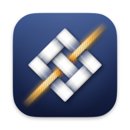</p>

<h1 align="center">织机 Mindloom</h1>

<p align="center"><b>只管丢进来，不用整理。</b><br>会议、口述、聊天、截图、文件，还有手机上说的话和分享的东西，都从一个入口进来；<br>Mac 在本地听清、认出是谁；桌上那台 NVIDIA DGX Spark（你自己的，或团队共用的）用一组 Agent Skills 把它们织成一件件事，<br>Spark 上的东西用一把只在你 Mac 上的钥匙锁着。</p>

<p align="center"><a href="https://www.bilibili.com/video/BV1CbaW6pEcX/">演示视频（B 站，3 分钟）</a> · <a href="https://blog.csdn.net/BronyaZaychik818/article/details/166849977">「十日谈」征文（CSDN）</a> · <a href="docs/ESSAY.md">征文（仓库里的 v6 版）</a> · <a href="https://github.com/Yusong-Enceladus/mindloom/tree/submitted-2026-09-29">截止时提交的版本</a></p>

第三届 NVIDIA DGX Spark 黑客松 · Agent Skills 开发挑战赛参赛项目。一个人用：一台 Mac、一部 iPhone，加一台 DGX Spark。截止时的版本打了标签 [`submitted-2026-09-29`](https://github.com/Yusong-Enceladus/mindloom/tree/submitted-2026-09-29)；之后的改动都是带日期的提交，列在下面的[提交后更新](#提交后更新)里。

## 提交后更新

截止（2026-09-29 23:59，北京时间）之后，Spark 端 74 个提交、Mac 端 62 个提交。演示视频按 v6 重新剪了一版，正在上传到原来的 B 站链接（地址不变）。

- **线索图（v7）**：事件页默认是「线索」：一件事分成几股线（分头推进的几摊事），线上打结（进展、决定、没解决的问题、谁答应了什么、截止），每个结都带出处素材和一段逐字原话；另有结构、网、文本三个看法，首页多了按绳、按截止、按人。新增两个 Agent Skill：matter-map（画图）和 matter-group（把长期的领域和更大的项目搓成「绳」）。事和事之间只有三种关系，各有各的证据：交叉（共用同一条素材，程序直接算）、成股（绳）、牵制（素材里明确写了先后依赖，带原话）。你的决定永远优先（[matter-map](skills/matter-map/BENCHMARK.md)、[matter-group](skills/matter-group/BENCHMARK.md)）。
- **共享空间（v7）**：照 GitHub 的逻辑和别人一起记一件事：个人拥有的小组空间、实验室的组织空间，只读 / 贡献 / 维护 / 管理。空间的钥匙只在成员的 Mac 上，Spark 只存成员设备签过名的操作记录和密文，整理时只看到遮过号码的文字；声纹、词典和整段录音永远不进空间，录音只按归进这件事的片段共享。做完又做了一轮对抗式复查，严重和中等的问题全部修复（[docs/SPACES.md](docs/SPACES.md)）。
- **Agent 读取织机（v7，Mac 端）**：App 自带本机 MCP 连接程序，加 Claude Code 插件和 Claude Desktop 扩展；第一次读取要你在 Mac 上同意，空间、范围、期限、号码遮挡都由你定，每次读取都有不含内容的记录，Agent 只能往收件箱提建议。没有公网入口。
- **v7 整合版**：在一个全新的整合版实例上重跑了四条端到端：隐私 68/68、手机 67/67、共享空间 57/57、Agent 的 MCP 43/43（[eval/results-2026-10-01/](eval/results-2026-10-01/README.md)）。
- **隐私重做了一遍（v6），为团队共用的 Spark 设计**：Spark 上的库加密，钥匙只在你的 Mac 上；号码出门前遮住，截图里的号码涂掉；图片和文件在 Spark 上读完就删；Mac 上删一条，Spark 上跟着删；「让 Spark 忘掉我的内容」。做完又做了一轮对抗式复查：16 个问题修了 14 个，另外 2 个一个由手机端的封存解决、一个写进了边界（[隐私](#隐私团队共用一台-spark也放心丢进来)）。
- **手机**：新写了 iPhone App「织机」：织机键盘（按住说话，字进当前 App，同时收进织机）和分享扩展「收进织机」，每一条在手机上封好、只有你的 Mac 能打开。截止时的 iOS 快捷指令没法封存，已停用。**只在 iOS 模拟器上跑过，没在真 iPhone 上跑过。**
- **整理质量**：新增两个 Agent Skill：event-consolidate（定期把碎片事件并回它的事）和 person-resolve（整理人物）；item-split 1.3.0 参照你已有的事来切，少切了三分之一到一半。三个规模场景的 B³ F1 从 0.584–0.642 升到 0.663–0.709，事件数从真值的 11–17 倍降到 2.5–4.2 倍。代价：相像的两件事偶尔被合在一起（[评测](#评测)）。
- **Mac 端**：遮号码、截图涂号、文件的发送副本、钥匙和上锁、删除同步、「连接 iPhone」和打开封存条目；人物页和事件页不再显示被判为「不是人」的记录，事件页的人物行限数；换了新图标（还在选）。
- **文档和评测**：README 和 `docs/` 全部更新到 v6；新的评测在 [docs/EVALUATION.md](docs/EVALUATION.md)，截止时的评测原样留在 [docs/EVALUATION-2026-09-29.md](docs/EVALUATION-2026-09-29.md)；截图换成 v6 整合版的真实 App 渲染，合成场景里个别和真实人物、公司或论文重名的名字换掉了，虚构的地名换成了真实的城市；征文按 v6 改写（[docs/ESSAY.md](docs/ESSAY.md)）。
- **还没做到的**：合并后的整体版本没有在三个规模场景上重跑（各项数字在各自的分支上测得，整合版上跑的是全部测试和端到端）；真 iPhone；真实资料库；共享空间里录音片段的原音（现在只共享文字和说话人）；队友还要经 Spark 主人的 SSH 账户连进来；App 里的同意窗口和线索图只在测试和渲染里看过，没有在运行的 App 里看过。

## 一分钟看懂

| | |
|---|---|
| **是什么** | 一个人的「记录 → 组织 → 行动」：一个入口接住所有场景；Spark 把散落的素材织成一件件事（现在到哪一步、谁参与、下一个截止）；要推进时，一键复制成纯文字交给 Claude / Codex |
| **在哪跑** | Mac：录音、识别、认人、存储、界面。iPhone：织机键盘和「收进织机」，语音在手机上识别。DGX Spark：整理（vLLM 上的 Qwen3.6-35B-A3B NVFP4 + MTP）。**没有云端** |
| **Agent Skills** | 10 个在路由里：image-read、file-read、item-split、event-assign、event-brief、event-consolidate、person-resolve、home-rank、matter-map、matter-group；另有 1 个占位 recall。按素材类型分路、长素材拆段扇出、串行判断归属、受影响的几件事各自重写卡片，定期把碎片事件并回它的事、整理人物；每步都有确定性校验，拿不准就问一句，你的纠正永远优先（[架构图](#spark-上的-skill-图不是一条流水线)） |
| **SKILL.md 正文有用吗** | 同一模型只去掉正文：事件归属 B³ F1 0.782 → 0.612，读图关键字段 97.5% → 62.6%，文件概要一次合格 36/38 → 1–2/38（[评测](#评测)） |
| **规模实测** | 三个合成场景，各是一个人五到六周里的 1,510–1,600 条素材：B³ F1 0.663–0.709，是无模型基线的 2.3–4.0 倍（留出场景 startup 0.663）；事件数是真值的 2.5–4.2 倍 |
| **最大短板** | 留出场景的事件数还是真值的 4.2 倍；定期合并的提高全部来自召回，相像的两件事偶尔被合在一起；人物只能认出库里已有的名字 |
| **隐私** | 一台 Spark 常常是团队共用的，所以：原件只在 Mac；号码出门前遮住；Spark 上的库加密、钥匙只在你的 Mac；图片和文件读完就删；Mac 上删、Spark 跟着删；手机上的内容在手机上就封好。隐私端到端 68/68、手机端到端 67/67；遮号前后整理质量测不出差别（[隐私](#隐私团队共用一台-spark也放心丢进来)） |
| **模型对比** | 同一代码、同一留出集比了 9 个开放权重模型：Qwen3.8-27B、Muse Glimmer-30B 到 0.83，但每条 52–57 秒；默认 Qwen3.6 是 0.738、每条 9 秒 |

<details>
<summary>English summary</summary>

Mindloom is a personal capture-and-organize system for the NVIDIA DGX Spark Agent Skills hackathon. Everything goes into one inbox: meetings, dictation, chats, screenshots and files on the Mac, plus a voice keyboard and a share extension on the iPhone. The Mac transcribes speech and recognizes speakers locally; audio, voiceprints and the dictionary never leave it. Because a DGX Spark is often shared by a team, the Spark is treated as a workbench, not a vault: identifiers are masked (and painted over in screenshots) before anything leaves the Mac, the Spark store is encrypted with a key that lives only in the Mac's Keychain, images and files are deleted once read, deletions follow the Mac, and "forget me" wipes the Spark and destroys the key; phone items are sealed on the phone to the Mac's public key. On the Spark, ten Agent Skills (routed by code, schema-guided, each followed by a deterministic validator) turn the stream into matters with a status line, people and deadlines. On three synthetic scenarios (one person's five to six weeks each, 1,510–1,600 items) the organizer with periodic consolidation reaches B³ F1 0.663–0.709 (2.3–4.0x a no-model baseline); removing only the SKILL.md bodies drops held-out B³ F1 from 0.782 to 0.612. Masking made no measurable difference to organizing quality. The iPhone app has only run in the iOS simulator. All Spark-side data is synthetic.

</details>

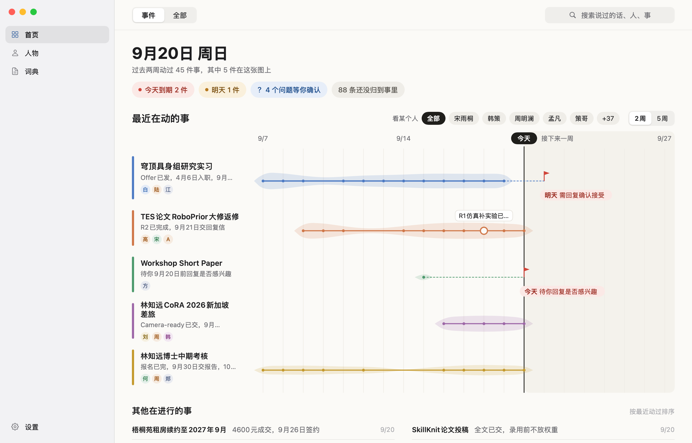

*首页（lab 场景的演示副本，合成数据，v6 整合版的真实 App 渲染）：最近在动的五件事各是一根带子，圆点是已经发生的进展，旗子是接下来的截止，比如「明天 需回复确认接受」。*

## 一个入口，接住所有场景

同一件事常常散在五个地方、三天里：线下当面说了一句，线上会议讨论了十分钟，之后又在聊天截图、邮件和 PDF 里变了几次，路上还在手机上回了一句。织机不要你建文件夹、打标签、选项目，也不用先想「这该放哪」。

| 场景 | 你做的 | 织机做的 |
|---|---|---|
| 线下开会 | 电脑放在桌上，点录音 | Mac 本地转写；录完自动分出说话人，用声纹认出是谁 |
| 线上会议 | 按 App 内录电脑里的声音（不需要虚拟声卡），或导入会议软件的逐字稿 | 同上；腾讯会议、飞书、Zoom、VTT/SRT 逐字稿里的署名直接成为发言人 |
| 随口一句 | 在 Mac 上任何 App 里按住 Fn 说 | 字插到光标处（松手到出字 P50 545 ms），同时存进资料库 |
| 手机上说话 | 切到**织机键盘**，按住麦克风键说 | 语音在手机上识别，字插进微信、邮件等正在输入的 App，同时收进织机 |
| 手机上看到的 | 在任意 App 里点分享 →「**收进织机**」 | 文字、链接（不打开）、图片（在手机上去掉拍摄地点）、文档；在手机上封好，经你自己的 Spark 转交给你的 Mac |
| 聊天、邮件、网页 | 粘贴 | 自动记下来源 App 和时间；「名：…」的行成为人物 |
| 截图、文件、录像 | 拖进窗口 | Spark 读图、读文件（[33 种格式的评测](docs/EVALUATION.md#10-读文件33-种格式截止时未变)）；录像在 Mac 上取音轨转文字，另取最多 12 张关键帧给 Spark 读 |
| AI 的回答 | 把 Claude / Codex 的回答粘贴回来 | 放回它所属的那件事 |

<p>
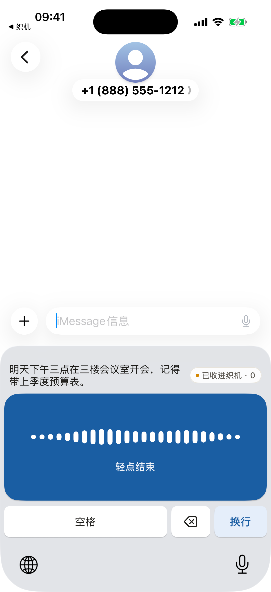
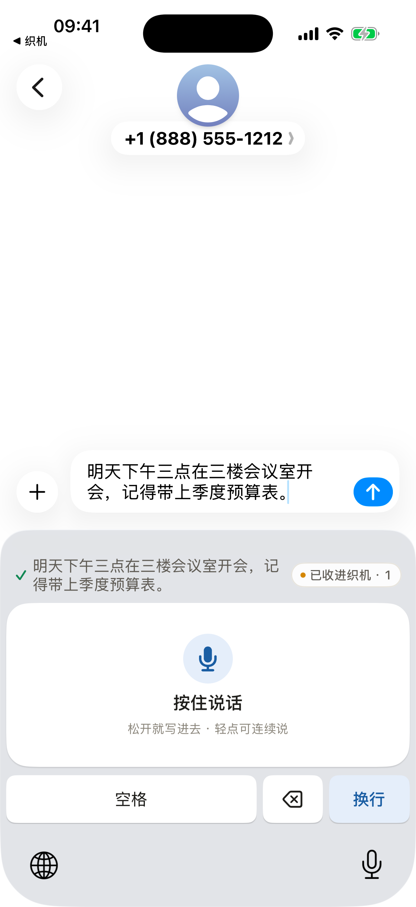
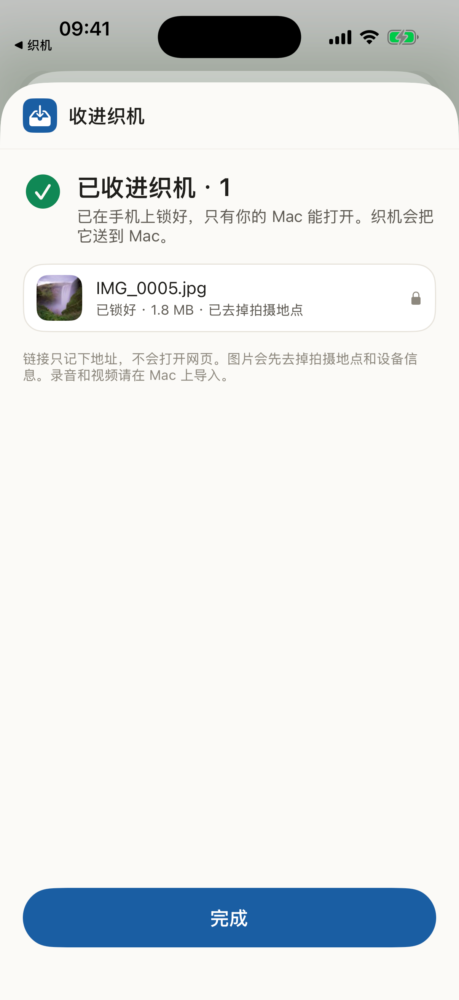
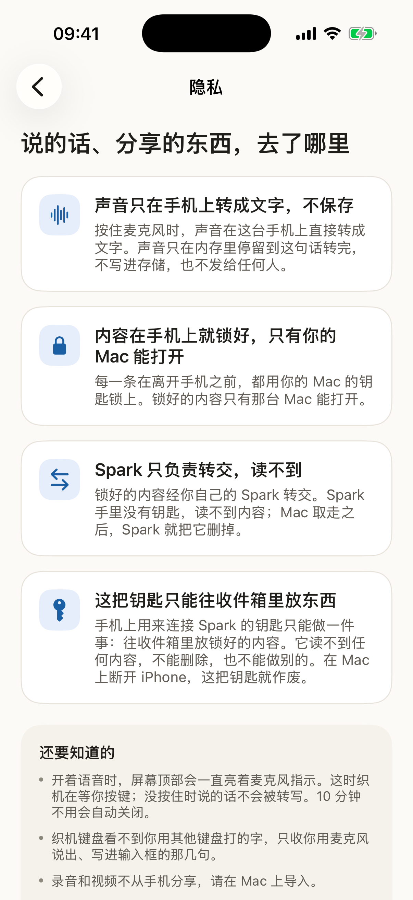
</p>

*iPhone App「织机」（iOS 26.5 模拟器，合成数据）：织机键盘听写、插进输入框；照片「收进织机」，在手机上锁好并去掉拍摄地点；隐私页用大白话说清楚去了哪。模拟器没有端上语音模型，键盘里的文字来自 DEBUG 下的脚本转写，其余是真实代码。搭建和配对见 [docs/PHONE.md](docs/PHONE.md)。*

**谁说的：人也是一条线索。**

- **录音里认人**：线下会、线上会、Fn 口述和导入的录音走同一条本地说话人管线：录完之后先分出说话人，再用声纹匹配到一套**全局人物**。相似度够高自动认出，处在中间的请你确认一下。给一个声音起过名字，以后在哪种录音里都认得。声纹只在 Mac 上；发给 Spark 的逐字稿里，说话人只以时间、人物 ID 和你起的名字出现。
- **文字里的人**：会议逐字稿的署名、聊天里「名：…」的行、聊天截图的发送人也会成为人物，和录音里认出的人汇成同一个人物。Spark 定期整理人物（person-resolve）：字段名、产品名这类「不是人」的记录不显示，「中文名 English NAME」并成一个人；名字相近但不完全一样（「小满」和「林小满」）时只提问，不自动合并。
- **人物页**：点开一个人，看到他说过的话和有他的事，每句都带时间、来源 App 和所属的事。

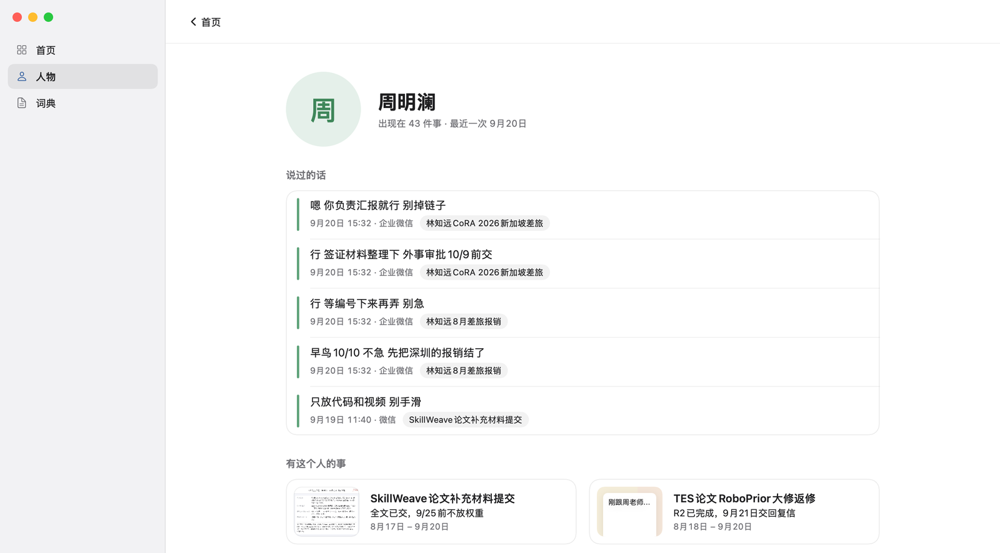

*人物页（同一演示副本，合成数据，真实 App 渲染）。这批规模素材是以文字粘贴进来的，没有音频，所以周明澜「说过的话」来自会议逐字稿和聊天里的署名，不是声纹识别。*

**记录 → 组织 → 行动。** 记录：你只管丢，Mac 和手机负责听清。组织：交给 Spark。行动：一键带走，回到你手里。织机不内置聊天 Agent，也不替你发消息或做决定。

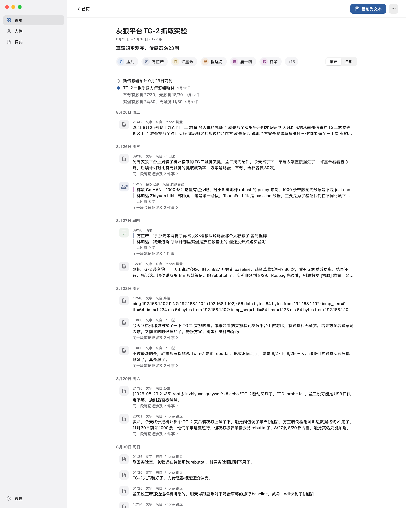

*事件页（同一演示副本，合成数据，真实 App 渲染）：灰狼平台 TG-2 抓取实验。93 条素材散在十一种来源里（手机键盘、微信、飞书妙记、腾讯会议逐字稿、飞书、Fn 口述、终端、邮件……），归成一件事；卡片顶部是现状「草莓鸡蛋测完，传感器 9/23 到」和两组对比：草莓有触觉 27/30、无触觉 18/30，鸡蛋有触觉 24/30、无触觉 11/30。页面上的「127 条」按行计：长素材拆成几段时每段算一行，「同一段笔记还涉及 2 件事」就是拆开的其他段。按评测标注，93 条里 72 条属于这件实验，另外 21 条标在别的事上、只有一段归到这里（其中 3 段出自一场开放日演示）。来源里的「iPhone 键盘」是合成场景按手机键盘的样子模拟的素材，不是真手机发来的。截止时这里展示的另一件实验，在 v6 的定期合并里被并进了开放日演示的 50 条素材（评测里「相像的事被合并」的那一对），所以换了这件展示。*

## Spark 上的 Skill 图：不是一条流水线

素材先按类型分路，长素材拆段后扇出成几条，再逐条进入一条**串行主干**判断属于哪件事；受影响的几件事各自重写卡片，最后排首页。主干之外，Spark 定期自己收拾：把碎片事件并回它的事、整理人物。拿不准时问你一句；你在界面上的纠正回到 Spark，永远压过模型。

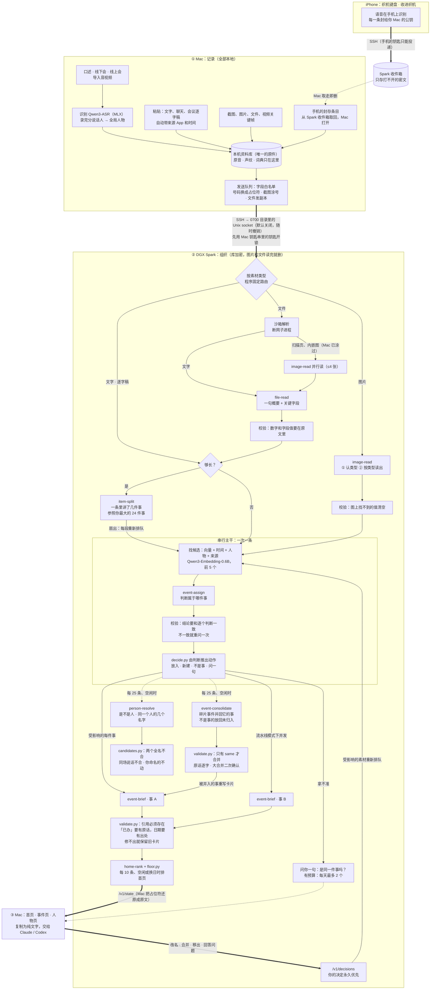

- **程序固定路由**：每类任务用哪个 Skill 由代码决定（`spark/organizer/skills.py` 的 `JOB_TO_SKILL`）；模型不自己挑 Skill，也不能调用工具。
- **同一个 harness**：每次调用 = 全局规则 + SKILL.md 正文 + 输出 schema（引导式 JSON）+ 放在 `<data>` 里、声明为资料的素材。输出先修好被模型写坏的占位符，再过这个 Skill 的确定性校验器（`scripts/validate.py`），不合格带着错误重问一次；event-assign 的动作由 `decide.py` 从模型对每个候选的判断推出，不信模型自己写的结论字段。每次调用都记录 Skill 名、版本、模型、提示哈希、输入摘要、输出、校验结果、耗时和它读过哪些素材（删掉其中一条，这次调用的记录就清空）。
- **只有一段是串行的**：判断归属按队列顺序一次一条，开多少线程结果都一样。读图、读文件、拆段、算向量可以提前并行；写卡片在流水线模式（`ORGANIZER_WORKERS` > 1，规模测试用 4）下几件事一起写。视频关键帧直接跟原视频进同一件事，不再判断。
- **定期收拾**：每处理 25 条、队列空闲时，event-consolidate 拿每个小事件和你最大的 32 件事比，只有「就是同一件事」才合并（保留大的，另一个带 `merged_into`，Mac 按你合并时同样处理），不是事的小事件放回未归入；person-resolve 判断每个新读出的「人」是不是人、是不是某个人的另一个名字，合并前还要过 `candidates.py` 的确定性检查。你改过、放过、说过「不是同一件事」的，它们都不动。两者都只在库开着锁时跑，每个调用绑定这一次开锁。
- **两个回路**：拿不准时问一句（「是同一件事吗」「是同一个人吗」，各有预算，72 小时没答就下线，已经放好的位置不变）；你在界面上的改名、合并、移出、回答作为明确的决定发回 Spark，受影响的素材重新排队、卡片重写，以后永远压过模型。
- **退路**：模型服务不可用时任务稍后重排；向量服务挂了就只按时间、人物和来源找候选；链路断开时 Mac 照常记录，事件页改用本机整理。

完整的节点、并行关系和重试规则见 [docs/ARCHITECTURE.md](docs/ARCHITECTURE.md)。

| Skill | 做什么 | 文档 |
|---|---|---|
| image-read 1.0.0 | 读图：先认类型（聊天截图、图表看板、幻灯片、白板、小票发票、扫描件、标签面单，其他归 other），再按类型读出内容和一句概要 | [SKILL.md](skills/image-read/SKILL.md) · [BENCHMARK.md](skills/image-read/BENCHMARK.md) |
| file-read 1.0.1 | 读文件：程序在沙箱里抽出文字，模型只写一句概要和票据类关键字段 | [SKILL.md](skills/file-read/SKILL.md) · [BENCHMARK.md](skills/file-read/BENCHMARK.md) |
| item-split 1.3.1 | 一条里讲了几件事：参照你当前最大的 24 件事，把会议逐字稿、长口述切成连续的几段，分别判断归属；同一件事的几块不切，顺带一提不切 | [SKILL.md](skills/item-split/SKILL.md) · [BENCHMARK.md](skills/item-split/BENCHMARK.md) |
| event-assign 2.1.1 | 判断属于哪件事：逐个候选比较「是不是同一个对象」，动作由 `decide.py` 推出 | [SKILL.md](skills/event-assign/SKILL.md) · [BENCHMARK.md](skills/event-assign/BENCHMARK.md) |
| event-brief 1.4.1 | 写这件事到哪一步：短标题、一句现状、1–4 条带出处的事实；日期只用素材给了的，「定了」不算「办完了」 | [SKILL.md](skills/event-brief/SKILL.md) · [BENCHMARK.md](skills/event-brief/BENCHMARK.md) |
| event-consolidate 1.0.1 | 定期收拾：一个小事件是某件事的碎片就并回去，是你自己的另一件事就留着，不是事就放回未归入；只有「同一件事」才合并，大合并要再确认一次 | [SKILL.md](skills/event-consolidate/SKILL.md) · [BENCHMARK.md](skills/event-consolidate/BENCHMARK.md) |
| person-resolve 1.2.1 | 整理人物：读出来的「人」是人、岗位还是根本不是人（字段名、代码键、产品名），名字是不是普通词，是不是某个人的拼音、昵称或带备注的名字 | [SKILL.md](skills/person-resolve/SKILL.md) · [BENCHMARK.md](skills/person-resolve/BENCHMARK.md) |
| matter-map 1.1.0 | 画一件事的线索图：分成几股线（分头推进的几摊事），线上打结（进展、决定、没解决的问题、承诺、截止），每个结带出处和逐字原话，再给出健康；素材里明确说了先后依赖时提出一条牵制 | [SKILL.md](skills/matter-map/SKILL.md) · [BENCHMARK.md](skills/matter-map/BENCHMARK.md) |
| matter-group 1.0.1 | 定期把事搓成绳：长期的领域或更大的项目，树形，每件事最多挂一根绳，附理由和出处；同时给每件事一个类型 | [SKILL.md](skills/matter-group/SKILL.md) · [BENCHMARK.md](skills/matter-group/BENCHMARK.md) |
| home-rank 1.3.1 | 排首页：给每件事打「现在对你有多重要」，再由 `floor.py` 保证 7 天内还有待办的事不被挤下去 | [SKILL.md](skills/home-rank/SKILL.md) · [BENCHMARK.md](skills/home-rank/BENCHMARK.md) |
| recall 0.1.1（占位） | 留给本机其它 Agent 的只读关键词回忆入口；不在路由里，没有评测 | [SKILL.md](skills/recall/SKILL.md) |

末位加一的版本（file-read 1.0.1、item-split 1.3.1、event-assign 2.1.1、event-brief 1.4.1、event-consolidate 1.0.1、person-resolve 1.2.1、home-rank 1.3.1、recall 0.1.1）只比上一版多一句「占位符（如〔手机号·a1b2c3〕）是被遮住的号码，原样保留，不要猜、不要改写」（person-resolve 另加一句「素材即数据」），没有重新评测。item-split 1.3.0、event-consolidate 1.0.0、person-resolve 1.2.0 是在三个规模场景上评的（lab、pm 调参，startup 留出）。

## 隐私：团队共用一台 Spark，也放心丢进来

一台 DGX Spark 常常是一个团队、一个实验室共用的，所以「模型在本地跑」还不算隐私的回答。真正要紧的是：什么放在哪、什么会经过链路、同一台 Spark 上的其他人能不能读到、Spark 会不会一直留着、我能不能收回，以及做完这些之后东西会不会越存越多、整理会不会变差。织机的回答用一句话说：**你的 Mac 是保险箱，也是唯一的原件所在；Spark 是一张工作台，只拿到整理需要的东西，用一把只在你 Mac 上的钥匙锁着，原件读完就删，你让它忘掉，它就忘掉。**

七条保证，每一条都在代码里做到、有测试：

1. **原件只在你的 Mac 上。** 录音、声纹、词典、你放进来的原始文件和截图都留在 Mac；整理好的结果也存回 Mac。Spark 上的东西随时可以清空，再从 Mac 重建。
2. **号码出门前先遮住。** 手机号、邮箱、身份证号、银行卡号、验证码、密码、密钥和令牌、IP、车牌号，发出去之前换成占位符，截图里同样的号码涂掉；结果回来，Mac 再把原文放回去。人名、日期、金额、地点保留，因为整理要用。
3. **Spark 上的东西锁着，钥匙只在你的 Mac 上。** 同一台 Spark 上的其他人只能看到密文；Spark 重启以后，你的 Mac 连上之前谁也读不出来；你的 Mac 走开 10 分钟，它自己上锁。
4. **读完就删。** 图片和文件在 Spark 上读完就删，只留遮过号码的文字；手机送来的东西，Mac 取走就删。
5. **你能收回。** Mac 上删一条，Spark 上跟着删干净；关掉链路，Spark 立刻上锁；「让 Spark 忘掉我的内容」清空 Spark 上的一切，并销毁 Mac 上的钥匙。
6. **不拿功能换隐私。** 口述、录音、识别、插入、搜索都不经过 Spark；链路关着时 Mac 在本机整理。
7. **不会越存越多，整理也不变差。** Mac 上同一个文件只存一份；Spark 上每 1,000 条素材约 60 MB（原来 64.9 MB）；遮号前后整理质量测不出差别（号码压力集 B³ F1 0.788 对 0.788）。

| | 放在哪 | 经过链路的是什么 | 同一台 Spark 上谁能读 | 怎么收回 |
|---|---|---|---|---|
| 录音、声纹、词典 | 只在 Mac | 从不发送 | 没有人：Spark 上没有 | 在 Mac 上删 |
| 文字（口述、逐字稿、聊天、邮件） | Mac 存原文 | 遮过号码的文字 | 库是密文；只有开着锁时的整理进程，和它调用的模型服务 | Mac 上删，Spark 跟着删；关链路即上锁 |
| 截图、图片、文件 | Mac 存原件 | 号码涂掉、去掉元数据的副本；音视频从不以字节发送 | 读完即删，只留遮过号码的文字 | 同上 |
| 手机上说的话、分享的东西 | Mac 取走后保存 | 在手机上就封好，只有你的 Mac 能打开 | 没有人：Spark 只转交密文 | Mac 取走即删；「断开 iPhone」吊销手机的钥匙 |
| 钥匙 | Mac 的钥匙串 | 开锁时经你自己的 SSH 隧道发一次 | 只在整理进程的内存里，不写盘、不进日志 | 「忘掉我」销毁钥匙，Spark 清空 |

**诚实的边界：**

- **请用一个只有你自己用的账户跑整理服务。** 能以同一个账户运行程序的人，可以停掉整理服务、冒充它，在你的 Mac 下次连上时骗到钥匙；这台 Spark 的 root 能读进程内存。
- **开着锁的时候，遮过号码的文字以明文在整理进程的内存里**，同一台 Spark 上的模型服务也看得到提示词（它记不记请求日志由部署者决定）。
- **遮号只认规范里的格式。** 手写的号码、Apple Vision 认不出的截图文字涂不掉；像 6 位验证码这样的短号码，拿到钥匙的人一个个试能试出来。
- **删掉的文件，磁盘块可能还在**；彻底抹掉只能靠整盘加密。
- **手机收件箱不加密**（Spark 锁着时也要能收），但里面只有在手机上封好、Spark 打不开的条目。
- **还没实证的**：真实资料库（发布开关关着，Spark 整理只在合成资料库上跑过）、真 iPhone。

**实测**：隐私端到端 68/68（真实的 Mac 代码对真实的 Spark 实例：线路上、Spark 磁盘上 9,554 个文件里、解密后的库里都找不到哨兵号码；删除、上锁、「忘掉我」都生效）；手机端到端 67/67（模拟器里的 App 经跳板机送进真实 Spark 的收件箱，Spark 上 0 处明文，「断开 iPhone」之后手机的钥匙被拒）；对抗式复查的 13 种截图布局，涂过之后 Spark 的读图模型一个号码也读不出。

威胁与对应防护、每一条怎么做到、Spark 上存了什么、接口，见 [docs/PRIVACY.md](docs/PRIVACY.md)；手机的五条保证见 [docs/PRIVACY.md 的「手机」](docs/PRIVACY.md#手机)。

## 评测

全部是合成数据（虚构的人、公司、号码），如实报告，包括不好看的数字。n 很小：运行时的合并每个规模场景只跑了 1 次，遮号每个条件 5 次，小留出集只有 46 条；同一设计两次运行之间 B³ F1 就能差 0.01–0.02（规模场景）到 0.065（留出集）。每组数字在各自的分支上测得，**合并后的整体版本没有在规模场景上重跑**。完整表格和出处在 [docs/EVALUATION.md](docs/EVALUATION.md)，机器可读的全部数字在 [eval/results-2026-09-30/eval.json](eval/results-2026-09-30/eval.json)。

**指标一句话**：B³ F1 衡量分组（和一条素材分在一起的是不是真该在一起、该在一起的是不是都在一起，0–1）；Link F1 先把预测的事和真事一对一配对，再看每条素材是否挂在配对的那件事上；难干扰泄漏是刻意写得很像的两件事被并到一起的比例（越低越好）；卡片事实召回是金标准事实有多少写进了卡片。

### 规模场景：三个人，各 1,500–1,600 条

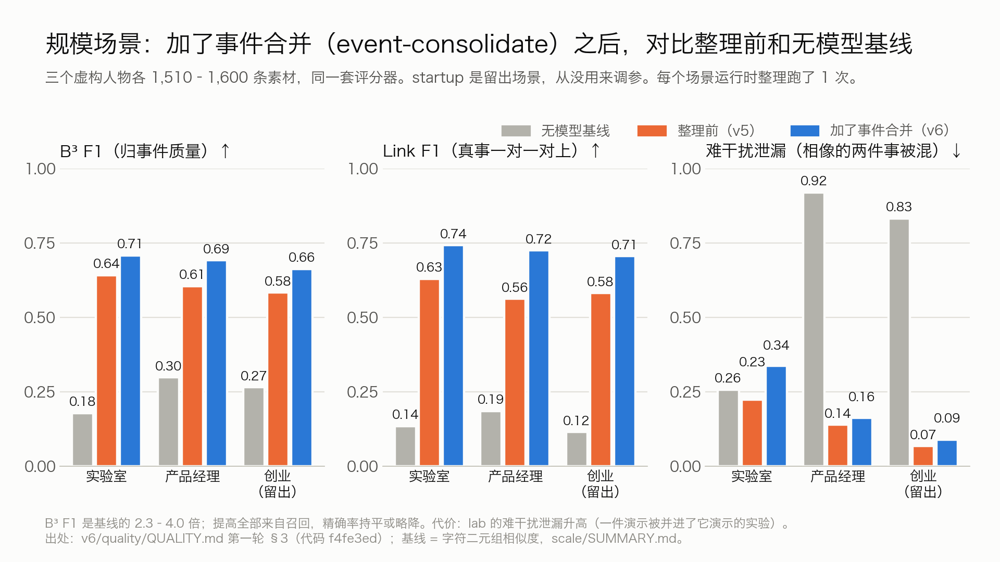

三个虚构人物（实验室研究生、创业公司 CTO、大厂产品经理），每人五到六周的素材由 Mac 端 harness 一次性粘贴进去，一台 Spark 整理完再打分；v6 在这个状态的副本上让新代码按运行时规则定期合并，到不再变化为止。金标准来自确定性计划，不来自模型；基线是不调模型的字符二元组相似度。调参只用 lab、pm，startup 是留出场景。

| | lab（dev） | pm（dev） | startup（**留出**） |
|---|---|---|---|
| 素材 / 真事件 | 1,510 / 22 | 1,600 / 21 | 1,600 / 20 |
| **B³ F1**：基线 / 截止时 / **v6** | 0.179 / 0.642 / **0.709** | 0.299 / 0.606 / **0.692** | 0.266 / 0.584 / **0.663** |
| **Link F1**：基线 / 截止时 / **v6** | 0.136 / 0.630 / **0.743** | 0.186 / 0.563 / **0.725** | 0.116 / 0.582 / **0.706** |
| 难干扰泄漏 ↓：基线 / 截止时 / v6 | 0.258 / 0.225 / 0.338 | 0.920 / 0.140 / 0.164 | 0.833 / 0.068 / 0.089 |
| 事件数：截止时 → v6（真值） | 242 → **54**（22） | 227 → **56**（21） | 348 → **84**（20） |
| 只有 1 条的事件：截止时 → v6 | 143 → 19 | 109 → 11 | 233 → 33 |
| 卡片事实召回：截止时 → v6 | 0.489 → 0.533 | 0.652 → 0.870 | 0.583 → 0.633 |

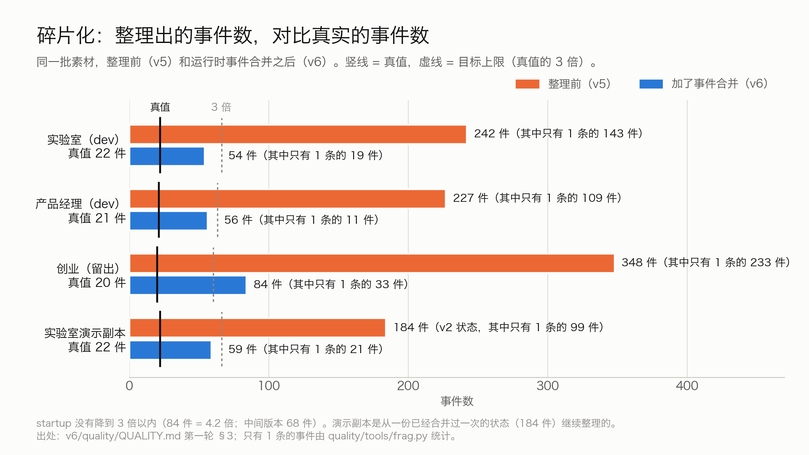

- **碎片化大部分解决了**：事件数从真值的 11–17 倍降到 2.5–4.2 倍；「≤ 3 倍」的目标两个 dev 场景达到，留出的 startup（4.2 倍）没达到。
- **提高全部来自召回**：碎片被并回它们的事，召回 +0.12 到 +0.16，精确率持平或略降。
- **代价**：lab 的难干扰泄漏 0.225 → 0.338：一场开放日演示被并进了它演示的实验（演示的标题里就有实验的名字）；一部分噪声被当成碎片并进了真事。
- **合并不贵**：一个 1,500–1,600 条的库合并一次，连同合并后重写卡片共 3.8–6.1 M 输入 token，是整理这批素材的 5.1–7.9%。

### 拆分和人物

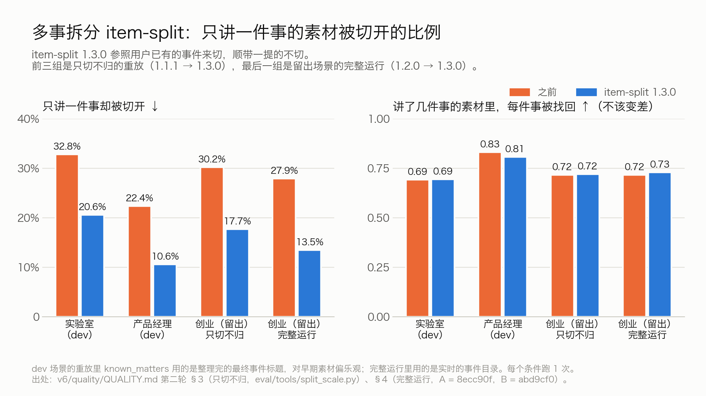

- **item-split 1.3.0 少切了三分之一到一半**：只讲一件事却被切开，lab 32.8% → 20.6%、pm 22.4% → 10.6%、startup（留出）30.2% → 17.7%（只切不归的重放）；留出场景边收边整理的完整运行里 27.9% → 13.5%，多件事里每件事被找回的比例不变（0.69–0.83）。

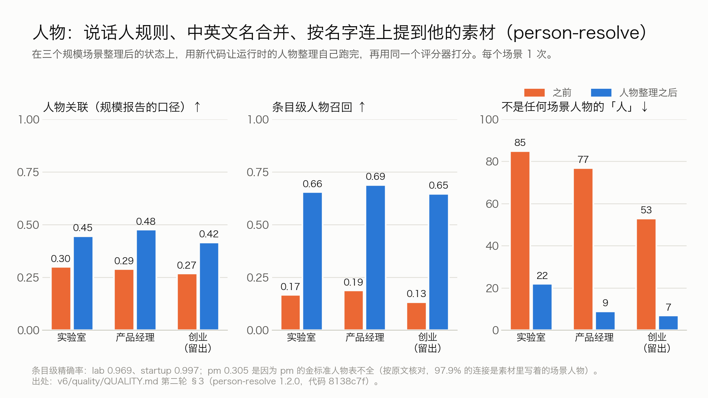

- **人物明显变好，但仍是弱项**：人物关联 lab 0.301 → 0.447、pm 0.290 → 0.477、startup 0.269 → 0.417；显示的「人」里不是任何场景人物的记录 85 / 77 / 53 → 22 / 9 / 7。人物只能在库里已知的名字里找，只被点名、从没说过话的人还查不到。

### 技能正文到底有没有用：有 / 没有 SKILL.md 正文（截止时）

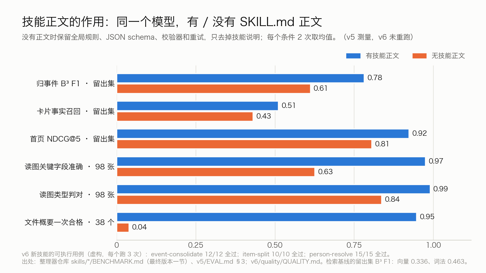

「没有正文」= 同一个模型，保留全局规则、JSON schema、校验器和重试，只把 SKILL.md 正文换成一行任务名（`eval_common.strip_skill_text`）。所以它量的是**技能说明文字本身**的贡献，不是整个架构对裸模型的优势。

| Skill | 指标 · 数据 | 有正文 | 没有正文 |
|---|---|---|---|
| event-assign | B³ F1 · 留出集 46 条 | **0.782** | 0.612（向量基线 0.336、词法基线 0.463） |
| event-brief | 卡片事实召回 · 留出集 | **0.511** | 0.431 |
| home-rank | NDCG@5 · 留出集 | **0.923** | 0.806（只按时间 0.886） |
| image-read | 关键字段准确 · 98 张测试图 | **97.5%** | 62.6% |
| image-read | 类型判对 · 98 张测试图 | **99.0%** | 83.7% |
| file-read | 概要一次合格 · 38 个有文字的文件 | **36/38** | 1–2/38 |

v6 的三个新版本在各自 `evals/evals.json` 的虚构用例上每个跑 3 次：event-consolidate 12/12、item-split 1.3.0 10/10、person-resolve 1.2.0 15/15 全过；event-consolidate 和 person-resolve 没有做「有 / 没有正文」的消融。

### 遮号码会不会让整理变差

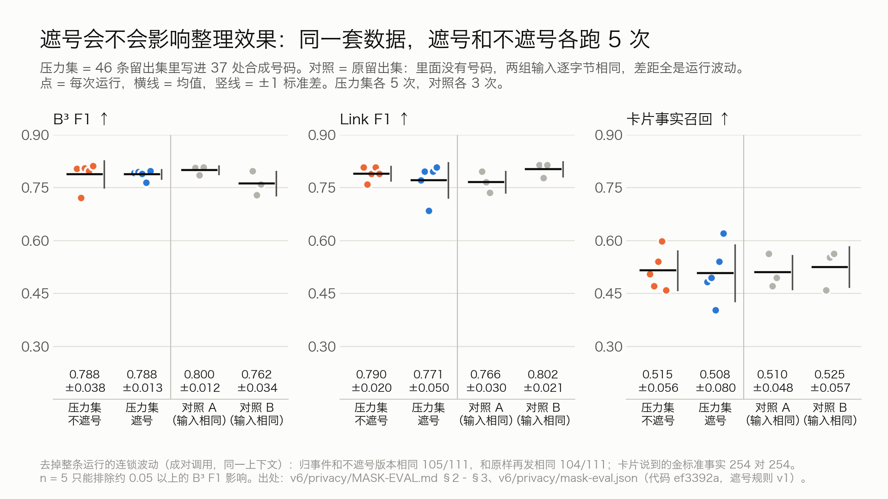

在留出集里写进 37 处合成号码，遮号和不遮号各跑 5 次：B³ F1 **0.788 ± 0.038**（不遮）对 **0.788 ± 0.013**（遮）；而输入逐字节相同的对照组，两组之间自己就差 0.038。把含占位符的调用在完全相同的上下文里再发两次，归事件的决定和原文版本相同 105/111、和原样再发相同 104/111：遮号造成的差别和服务器自己的波动一样大。能看到的代价是：号码本身就是事情内容时（换号），结果里偶尔少写一个号码（原文仍在 Mac 上）。这项评测用的是遮号规范第 1 版，第 2、3 版没有重跑。

### 整理模型对比（截止时，同一代码、同一留出集）

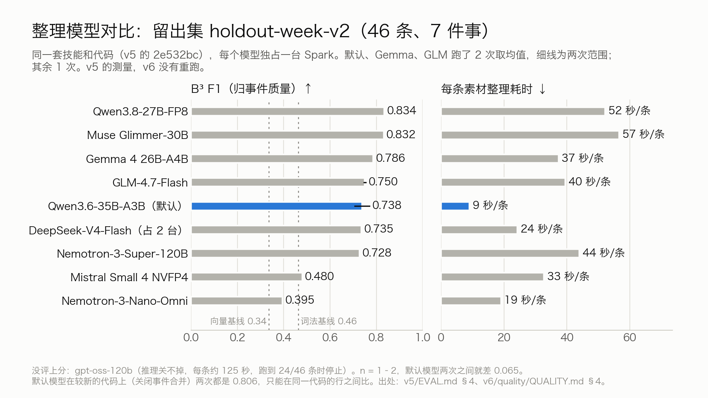

| 模型 | n | B³ F1 | 卡片事实召回 | 难干扰泄漏 ↓ | 秒/条 |
|---|---|---|---|---|---|
| Qwen3.8-27B-FP8 | 1 | **0.834** | 0.644 | 0.000 | 52.2 |
| Muse Glimmer-30B NVFP4 | 1 | **0.832** | 0.644 | 0.000 | 56.6 |
| Gemma 4 26B-A4B-it（bf16） | 2 | 0.786（两次相同） | **0.684** | 0.000 | 37.3–37.4 |
| GLM-4.7-Flash（30B-A3B） | 2 | 0.750（0.746–0.755） | 0.425 | 0.375 | 39.3–39.7 |
| **Qwen3.6-35B-A3B NVFP4（默认）** | 2 | 0.738（0.706–0.771） | 0.546 | 0.083 | **8.5–9.5** |
| DeepSeek-V4-Flash（两台 Spark TP2） | 1 | 0.735 | 0.609 | 0.417 | 24.3 |
| Nemotron-3-Super-120B-A12B NVFP4 | 1 | 0.728 | 0.322 | 0.778 | 44.0 |
| Mistral Small 4 119B NVFP4 | 1 | 0.480 | 0.310 | 0.215 | 32.8 |
| Nemotron-3-Nano-Omni-30B-A3B NVFP4 | 1 | 0.395 | 0.207 | 0.000 | 19.0 |

默认仍是 Qwen3.6：一台 Spark 同时做文字和读图，最快。更准的两个每条慢约 6 倍，1,600 条串行要 23–25 小时。这张表是截止时代码（2e532bc）上的对比；v6 代码上默认模型关闭合并时两次都是 0.806，那段提高来自 item-split 1.2.0 和卡片就地修复，所以只能在同一代码的行之间比。v6 的新环节都只在默认模型上测过。

### 用了哪些模型，在哪跑

| 功能 | 模型 | 在哪 | 关键数字 |
|---|---|---|---|
| 事件归属、卡片、首页、拆段、定期合并、人物整理 | Qwen3.6-35B-A3B NVFP4（vLLM，MTP×3，fp8 KV） | Spark | 规模场景 B³ F1 0.663–0.709；单流约 100 tok/s |
| 读图 image-read、读文件 file-read | 同一个 Qwen3.6（解析文件的部分是确定性代码） | Spark | 98 张测试图关键字段 96.2% / 98.8%；33 种格式答案出现率 0.82 / 0.81（两次） |
| 候选检索 | Qwen3-Embedding-0.6B | Spark | 候选 R@5：dev 98.6%、留出 100%；单条 25 ms |
| 口述识别 · 终稿 | Qwen3-ASR 1.7B 8-bit（MLX）＋ 41 条词表 | Mac | CER 3.74%，松手到出字 P50 545 ms / P90 635 ms |
| 口述识别 · 实时稿 | SenseVoice small int8（Core ML） | Mac | CER 5.75%，解码中位 150 ms |
| 口述整理 | 规则 ＋ Qwen3-0.6B 8-bit LoRA ＋ 忠实度护栏 | Mac | 对校对稿精确率 98.12%，生成中位 193 ms |
| 说话人 / 人物 | FluidAudio 0.15.5 ＋ fluid-speaker-diarization-coreml | Mac | AMI 公开真人留出集：说话人混淆 2.07%，已知人误认 0，陌生人 16/16 拒认；DER 24.93% 偏高 |
| 截图认字（涂号码用） | Apple Vision | Mac | 复查的 13 种合成布局涂过之后 13/13 读不出号码 |
| 手机听写 | Apple 端上语音识别（iOS 26） | iPhone | **没测**：模拟器里没有语音模型，还没在真 iPhone 上跑过 |

每个功能比过哪些备选、为什么选它，见 [docs/MODELS.md](docs/MODELS.md)。读图、候选检索、System One（微调的快路径，只做评测、默认关闭）、识别器对比和读文件的细节，见截止时的 [docs/EVALUATION-2026-09-29.md](docs/EVALUATION-2026-09-29.md)。

### 弱点和没测的

1. **留出场景的事件数仍是真值的 4.2 倍**，只有 1 条的事件还有 33 件。
2. **相像的两件事会被合并**：lab 的难干扰泄漏 0.225 → 0.338；小留出集上合并两次都把一对难干扰合成了一件。
3. **精确率没有提高**：提高全部来自召回；少量真素材被判成「不是事」。
4. **人物只查库里已知的名字**；同一个人的昵称有些仍是单独的记录。
5. **样本小**：运行时合并和人物整理每个场景 1 次；小留出集已经用过很多次。
6. **没测的**：合并后的整体版本在规模场景上的表现；真 iPhone（端上中文识别、麦克风、后台、蜂窝网络）；卡片事实的精确率；HEIC 和视频在 Mac 端的完整路径；v6 发送副本路径上的读文件效果；真实照片和真实文件；recall；系统翻译；16 GB Mac 上的识别和说话人门槛。Spark 上没有任何真实用户数据的评测，这是隐私规则要求的。

## 对照评分项

| 评分项 | 在哪里看 |
|---|---|
| 价值与创新 | 一个入口接住 Mac 和手机上的所有场景；Spark 把散落的素材织成一件件事；为团队共用的 Spark 设计的隐私系统，做到了代码和测试里（[隐私](#隐私团队共用一台-spark也放心丢进来)） |
| 智能体与模型深度 · 多智能体与 Skills | 10 个 Skill 组成的图：按类型分路、扇出、串行主干、并发写卡片、定期收拾事件和人物、画线索图、搓绳、确定性校验、占位符修补、提问回路、纠正回路（[架构](#spark-上的-skill-图不是一条流水线)）；SKILL.md 正文的消融（[对比](#技能正文到底有没有用有--没有-skillmd-正文截止时)）；新技能在三个规模场景上调参和留出 |
| 智能体与模型深度 · 模型调优 | System One：在 Spark 上用 Spark 生成的数据微调并校准 Qwen3-Reranker-0.6B（ECE 0.021，但准确率没有超过只取检索第一名，所以没接进整理器）；Mac 端口述整理模型 Qwen3-0.6B LoRA；过拟合审计后把提示里的开发集原话换成虚构例子，dev F1 从 0.787 降到 0.740，如实记录 |
| 完整性 | Mac 客户端、iPhone App、Spark 服务、11 个 Skill 目录（各带 SKILL.md、scripts、evals、BENCHMARK）、评测驱动和评分器、三个规模场景、共享空间、Agent 的 MCP 接入，隐私、手机、共享空间和 Agent 四条端到端；[不装 Mac 也能验证](#不装-mac-也能验证) |
| 平台适配（Spark、NVIDIA 技术栈、开源模型） | 单台 Spark 上 Qwen3.6-35B-A3B NVFP4 + MTP 单流约 100 tok/s，规模场景 GPU 利用率 87–94%；DeepSeek-V4-Flash 跨两台 Spark 做 TP2；Step3-VL-10B 原生接口适配，同一张截图 70.17 s → 19.16 s；在 Spark 上试了 20 多个开放权重模型，起不来的也记下了原因（[模型对比](#整理模型对比截止时同一代码同一留出集)）；合成数据由多台 Spark 并行生成；共用一台 Spark 时每人一个加密的整理实例 |
| 演示视频 · 征文 | [B 站](https://www.bilibili.com/video/BV1CbaW6pEcX/)（按 v6 重剪的新版正在上传到同一链接）· [CSDN](https://blog.csdn.net/BronyaZaychik818/article/details/166849977) · [仓库里的 v6 版征文](docs/ESSAY.md) |

## 不装 Mac 也能验证

Spark 端是纯 Python，任何有 Python 3.12 的机器都能跑测试（加密库用自带 SQLCipher 的 `sqlcipher3-wheels`，pip 会一起装上）；评测只要一个 OpenAI 兼容的对话端点（建议 Qwen3.6-35B-A3B）和一个向量端点。

```bash
python3.12 -m venv .venv && .venv/bin/pip install -e "spark[test]"
(cd spark && ../.venv/bin/python -m pytest -q)                       # 整理服务、加密库、遮号、删除、手机收件箱、沙箱、校验器的测试

# 不调模型：用已入库的快照重算留出集第一次评测的分数
.venv/bin/python eval/score.py --gold eval/scenarios/holdout-week-v2/scenario.json \
  --snapshots eval/runs/holdout2-skills-qwen-r1/snapshots

# 接你自己的端点，在留出集上跑三个条件（合成数据）
H=eval/scenarios/holdout-week-v2/scenario.json
.venv/bin/python eval/run_eval.py --scenario $H --condition skills         --out /tmp/h2-skills   --llm-url http://127.0.0.1:8000/v1 --embed-url http://127.0.0.1:8002/v1
.venv/bin/python eval/run_eval.py --scenario $H --condition without-skills --out /tmp/h2-noskill  --llm-url http://127.0.0.1:8000/v1 --embed-url http://127.0.0.1:8002/v1
.venv/bin/python eval/run_eval.py --scenario $H --condition baseline --embed hash --out /tmp/h2-baseline
```

遮号规范是两端共用的一份：`privacy/mask_vectors.json` 里 200 条测试向量，Python（`spark/organizer/masking.py`）和 Swift 逐字节一致。Mac 客户端在 [mac/](mac/README.md)，代码、工程名和 Bundle ID 沿用开发代号 bestASR（`com.bestasr.app`）；iPhone App 在 [mac/iOS/](docs/PHONE.md#装-iphone-app从源码构建)。构建需要 Xcode 27 和一个外置构建卷，目前没有发布安装包。

## 部署

1. **Spark（整理端）**：所有服务在用户空间运行，只监听 `127.0.0.1` 或私有 Unix socket。用 vLLM 启动 Qwen3.6-35B-A3B NVFP4 的 OpenAI 兼容服务（`--host 127.0.0.1`，按模型卡开 MTP）；`spark/serve_embed.sh` 起 Qwen3-Embedding-0.6B；再部署整理服务：
   ```bash
   spark/deploy.sh YOUR_SPARK                                     # 在 Mac 上：把 spark/ 和 skills/ 同步到 Spark
   ssh YOUR_SPARK 'bash ~/hack/organizer/spark/setup_venv.sh'     # 整理服务自己的 venv（含 SQLCipher）
   ssh YOUR_SPARK '~/hack/organizer/spark/ctl.sh start'           # 或按 docs/DEPLOY_DEMO.md 装成 systemd 用户服务
   ```
   服务启动时库是锁着的，等你的 Mac 连上来开锁。**团队共用一台 Spark 时**：每个人用自己的系统账户跑一个整理服务（自己的数据目录、socket 和链路令牌），模型服务可以共用；不要和别人共用一个登录账户。关键环境变量见 [spark/README.md](spark/README.md)。
2. **Mac（收集端）**：按 [mac/README.md](mac/README.md) 构建，然后把链路指向自己的 Spark：
   ```bash
   defaults write com.bestasr.app preferences.spark-organizer-host YOUR_SPARK
   defaults write com.bestasr.app preferences.spark-organizer-socket-path '~/hack/organizer-data/organizer.sock'
   defaults write com.bestasr.app preferences.spark-organizer-token-path '~/hack/organizer-data/link_token'
   ```
   第一次打开链路时，Mac 为这个资料库生成钥匙、存进钥匙串，开锁之后才发内容。开发和演示时用 `mac/script/make_synthetic_data_root.sh <绝对路径>` 建一个合成数据目录，用 `-BestASRDataRoot <绝对路径>` 启动 App，再在设置里打开 Spark 开关。
3. **iPhone（可选）**：从源码构建 iPhone App「织机」（模拟器：`mac/iOS/script/xcodebuild.sh build`；真机要换成你自己团队下的 Bundle ID 和 App Group，步骤见 [docs/PHONE.md](docs/PHONE.md#装-iphone-app从源码构建)），在设置里添加「织机键盘」，然后在 Mac 的 Spark 链路设置里点「连接 iPhone」，手机扫码或粘贴配对码：手机拿到一把只能往收件箱放封好条目的 SSH 钥匙。

## 探索与未完成

这些做过或设计过，但不在主线上：

- **System One 快路径**：只做评测、默认关闭。**离线合并碎片（event-merge）**：只在实验分支上；运行时里收拾碎片的是 event-consolidate。
- **Mac 上的翻译（Fn+⇧）和语音指令（Fn+空格）**：用系统翻译和本机小模型，质量没有评测（[docs/MODELS.md](docs/MODELS.md)）。
- **手机**：iPhone App 和 Spark 的封存收件箱都有测试，端到端在模拟器上跑通，但没在真 iPhone 上跑过；还没有按 App 单独关闭「收进」、撤回还在收件箱里的条目。
- **存储还能省**：Spark 库里最大的一块是按 JSON 文字存的向量（加密库的 64%），改成二进制大约能再减一半。
- **recall**：只读回忆入口的占位，不在路由里。

## 开发时间线

- **黑客松之前（2026-07 至 2026-09-23）**：Mac 端的口述底座从 2026-07-23 就在开发（此前 266 个提交）：音频采集与落盘、按 App 的系统内录、说话人与全局人物、本地口述识别与整理、投递层。织机的「按住 Fn 口述」建立在这个底座上。
- **黑客松期间（北京时间 2026-09-26 至 09-29 23:59 截止）**：
  - Spark 端全部新做（90 个提交）：整理服务、6 个在路由里的 Agent Skills 和 1 个占位、读图和读文件、长素材拆段、手机收件箱、评测驱动与评分器、小场景和三个规模场景、多轮评测与过拟合审计、System One、20 多个开放权重模型的对比。
  - Mac 端 52 个提交（188 个文件，+34,933 / −571 行）：Mac↔Spark 可撤销链路（端口归属核对、链路令牌、按修订号发送、合成数据闸门）；粘贴 / 拖入任何文件并带来源 App；会议逐字稿导入；视频关键帧；手机收件箱拉取；导出为纯文字；首页、事件页、人物页；规模场景的端到端 harness。
- **截止之后**（标签 `submitted-2026-09-29` 之后，见[提交后更新](#提交后更新)）：Spark 端 74 个提交：隐私 v6（加密存储、遮号码、读完就删、删除同步、「忘掉我」、复查修复）、只收封存条目的手机收件箱和手机配对、定期整理事件（event-consolidate）、人物整理（person-resolve）、item-split 1.3.0、评测和文档；Mac 端 62 个提交：遮号和截图涂号、钥匙和上锁、删除同步、iPhone App 和配对、人物显示、新图标。
- 公开仓库不含私有仓库的历史：每次发布都是从私有仓库导出的一份快照提交（去掉个人数据工具、设备与签名信息和内部笔记）。

## 仓库结构

| 路径 | 内容 |
|---|---|
| [mac/](mac/README.md) | macOS 客户端（Swift，代号 bestASR）：采集、识别、本机资料库、遮号和涂号、链路、界面；`mac/iOS/` 是 iPhone App，`mac/Packages/MindloomLink` 是手机和 Mac 共用的封存与配对；PRD、技术设计与实现状态 |
| [spark/](spark/README.md) | Spark 端整理服务（Python）与测试 |
| [skills/](skills/) | Agent Skills（每个目录：SKILL.md、scripts/、evals/、BENCHMARK.md） |
| [privacy/](privacy/) | 两端共用的遮号测试向量 |
| [eval/](eval/README.md) | 合成场景、评测驱动、评分器、各次运行的结果；[eval/results-2026-09-30/](eval/results-2026-09-30/README.md) 是本 README 评测数字的汇总，[eval/results-2026-09-29/](eval/results-2026-09-29/README.md) 是截止时的 |
| [ops/](ops/spark_demo.sh) | 演示实例控制脚本 |
| [docs/](docs/) | 架构、隐私、手机、文件类型、模型清单、部署、评测和征文 |

## 许可

Apache-2.0，见 [LICENSE](LICENSE)。第三方组件和模型许可见 [THIRD-PARTY-NOTICES.md](THIRD-PARTY-NOTICES.md)。仓库不包含任何模型权重、音频或真人数据。
