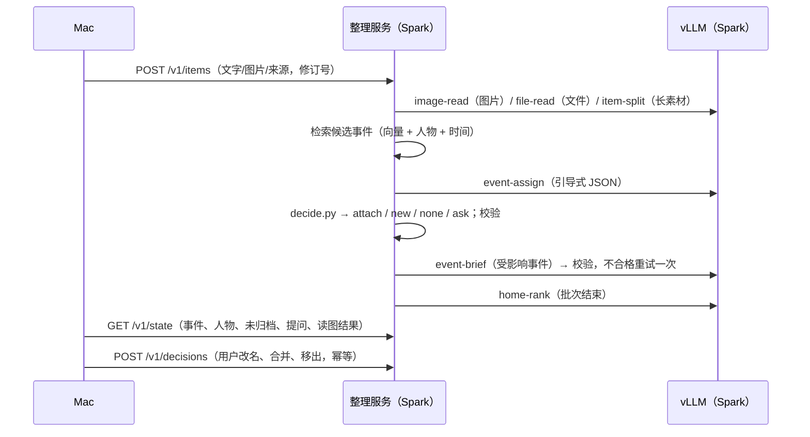

# 架构

织机 Mindloom 分三端：Mac 负责收集、识别、存储和展示；用户自己的 DGX Spark 负责整理；手机可以经 iOS 快捷指令把内容分享到 Spark 上的收件箱（见 [PHONE.md](PHONE.md)）。两边之间只有一条用户显式开启、可随时撤销的 SSH 链路。详细设计见 Mac 端的 [TECHNICAL_DESIGN.md](../mac/docs/architecture/TECHNICAL_DESIGN.md)、[PRD §0.3](../mac/PRODUCT_REQUIREMENTS.md) 和 Spark 端的 [spark/README.md](../spark/README.md)。

## Mac（`mac/`）

- **收集**：任意 App 里的 Fn 口述；按 App 内录系统声音（Core Audio Process Tap，线上会议）；麦克风录音（线下会议）；粘贴或拖入的文字、截图和任何文件（类型清单见 [FILE_TYPES.md](FILE_TYPES.md)）；会议软件导出的逐字稿；从 Spark 收件箱取回的手机分享。每条都记录来源 App（粘贴取织机之前的前台 App，拖入取拖拽来源，文件为 Finder）。
- **识别**：Qwen3-ASR 1.7B 8-bit + ForcedAligner（MLX），实时字幕用 SenseVoice；说话人用 FluidAudio 的本地 diarization 和声纹，所有输入模式共用一套全局人物身份。
- **存储**：本机 SQLite（GRDB）。原音默认永久保留，模型输出从不覆盖原始证据。粘贴/拖入的内容是 `userItem` 会话，和录音一样可以搜索、删除、归入事件。
- **发送队列**：按素材修订号发送文字、图片和来源标签（文件名和原件不外发）；发送时取最新内容。
- **数据来源闸门（开发期）**：只有带 `SYNTHETIC_DATA_ROOT` 标记文件的数据目录才允许打开链路，所有构建配置都一样。真实资料库（`~/Library/Application Support/bestASR`）按文件身份识别并拒绝，换什么路径写法都一样；标记目录里的数据库和 assets 必须是这个目录自己的文件，不能是链接。演示用 `mac/script/make_synthetic_data_root.sh <绝对路径>` 新建并标记一个空目录，再用启动参数 `-BestASRDataRoot <绝对路径>` 打开：这个参数只从本次启动参数读取、不写进偏好，不能指向真实资料库或它的上下级目录，写错时直接启动失败，不会退回真实资料库。
- **读图结果**：Spark 发回的 `readings`（读到的文字、逐条消息、单独的一句摘要）显示在事件页的时间线和导出里；摘要标成「读图概要」放在原文外面，搜索用原始读取结果。
- **界面**：首页（时间图 + 其余事件列表 + 按人物筛选）、事件页（标题、现在到哪一步、人物、按时间排列的原件）、人物页；在界面上原地改名、确认同一人/同一件事、把素材移出事件，这些都作为明确的用户决定发给 Spark；一键把事件导出为纯文本。
- **首页时间图（已实现）**：顶部是今天 / 明天到期、待确认问题、未归入的计数；时间轴为两周前到今天再加一周；最近在动的五件事各是一根带子（宽窄 = 当天素材量），圆点是带日期的已完成 / 进行中事实，旗子是今天起一周内的计划事实和下一步；悬停某天显示素材并用竖线连起同一条素材涉及的几件事；可按人物筛选；其余的事按行列在下方。
- **回退**：链路关闭或不可用时，Mac 照常收集、识别、插入和搜索，并使用本机整理器。整理从不进入口述热路径（松键到插入之间）。

## 链路

1. Mac 用 `ssh -N -T -o BatchMode=yes -o StrictHostKeyChecking=yes -L 127.0.0.1:<随机端口>:<socket 绝对路径> -- <Spark 主机>` 把本机一个随机回环端口转发到 Spark 数据目录（0700）里的私有 Unix socket `organizer.sock`，而不是固定 TCP 端口。Spark 主机没有默认值：`preferences.spark-organizer-host` 没写时链路保持关闭，Mac 不会连任何机器。
2. 每个请求前，App 用 libproc 确认本地端口的监听者是自己的 ssh 子进程，否则不发送并重建隧道。
3. 链路令牌（64 位十六进制，0600）经另一条已认证的 `ssh <主机> cat <路径>` 读入内存，不落盘、不进日志、不出现在进程参数里；收到 401 就丢弃重读。
4. Spark 的 `store_id` 变化（数据库被重置）时，Mac 清空投影和游标并重传已送达素材的最新修订。
5. 关闭开关立即断开并清空待发；App 崩溃后遗留的 ssh 进程在下次启动时按记录核对后清理。

## Spark（`spark/` + `skills/`）

- **整理服务**：Python 3.12、FastAPI、SQLite、单后台 worker；素材按 `item_id` + 修订号追加保存，重复传输不重复创建记录。
- **固定路由**：`image_detect`、`image_read → image-read`（取代 screenshot-read），`file_read → file-read`，`split → item-split`，`assign → event-assign`，`brief → event-brief`，`rank → home-rank`。模型不发现、不选择 Skill，也没有工具调用。
- **读图片和文件**：image-read 先判断图片类型再读出内容，file-read 为程序抽出的文件文字写概要和关键字段，item-split 把讲了几件事的长素材切段。聊天截图读成可见文字、逐条消息和一句摘要，按素材修订号保存，经 `/v1/state` 的 `readings` 增量发回 Mac（`text`、`messages`、`summary` 分开）。event-brief 看到的摘要标为 `reading_summary`，只帮它看懂截图，不能当作原话或日期出处。
- **人物**：声音里的人、截图的发送人，以及粘贴聊天文字里「名：…」行和「名 10:05」署名（本人和 `ORGANIZER_OWNER_ALIASES` 不算）。相近的名字只提问，不自动合并；粘贴文字里的人名不参与候选检索和归事件判断。
- **卡片规则**：event-brief 的校验器要求每个日期都能在所引素材里找到（`skills/event-brief/scripts/dates.py` 把「下周」「月底」「N 个工作日」换算成范围），只说定下来的话不能证明已签、已付、已发货；home-rank 打分后再用 `skills/home-rank/scripts/floor.py` 保证 7 天内还有未办待办的事件不排在只剩信息或已过去的事件后面。
- **每条素材的处理顺序**：（截图先读成文字）→ 检索最多 5 个候选事件（`skills/event-assign/scripts/candidates.py`：向量相似度、时间接近、共同人物（不含机主本人）、同一来源 App 加权）→ event-assign 判断 → `decide.py` 推出 attach / new / none / ask → 受影响事件的 event-brief → 批次结束后 home-rank。
- **模型服务**：OpenAI 兼容的 `/v1/chat/completions`（默认 vLLM 上的 Qwen3.6-35B-A3B NVFP4 + MTP）和 `/v1/embeddings`（Qwen3-Embedding-0.6B）。向量服务不可用时退化为时间、人物和来源检索，健康接口会明确显示。
- **收件箱**：`POST/GET /v1/inbox` 与 `/ack` 只做手机分享的中转，Mac 确认取走后删掉正文；整理只发生在 Mac 把它作为素材送回之后。
- **System One（评测，默认关闭）**：一个微调的 Qwen3-Reranker-0.6B 给归事件和合并判断打校准概率，整理器默认不调用它（[eval/system_one/RESULTS.md](../eval/system_one/RESULTS.md)）。
- **时钟**：`ORGANIZER_CLOCK=wall | replay | fixed:<ISO>`。评测用回放时钟：历史素材以最新素材时间为「现在」，不拿今天去判断。

