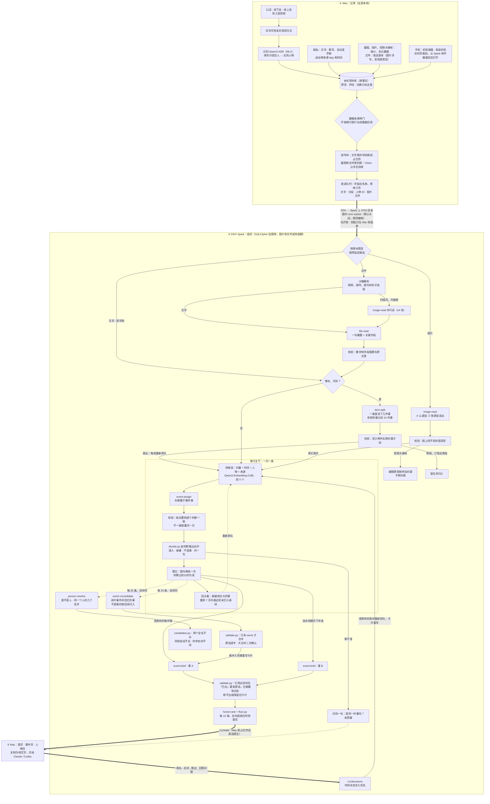

# 架构

织机 Mindloom 分三端：Mac 负责记录、识别、存储和展示；你自己的 DGX Spark 负责组织；手机上的 iPhone App「织机」（织机键盘和分享扩展「收进织机」）把每一条在手机上封好（只有你的 Mac 能打开），经你自己的 SSH 密钥放进 Spark 上的收件箱（见 [PHONE.md](PHONE.md)）。Mac 和 Spark 之间只有一条你显式开启、随时可以撤销的 SSH 链路；发出去的文字先遮住号码、截图先涂掉号码，Spark 上的库用一把只在你 Mac 钥匙串里的钥匙加密（[PRIVACY.md](PRIVACY.md)）。详细设计见 Mac 端的 [TECHNICAL_DESIGN.md](../mac/docs/architecture/TECHNICAL_DESIGN.md)、[PRD §0.3](../mac/PRODUCT_REQUIREMENTS.md) 和 Spark 端的 [spark/README.md](../spark/README.md)。Mac 客户端的代码、工程名和 Bundle ID 沿用开发代号 bestASR。

一句话结构：多个入口汇到 Mac → 过一道边界 → Spark 按素材类型分路 → 长素材拆段扇出 → 一条串行主干判断归属 → 受影响的几件事各自重写卡片 → 排首页 → 回到 Mac → 你的决定回流并永远优先。主干之外，Spark 定期自己收拾：把碎片事件并回它所属的事（event-consolidate），整理人物（person-resolve）。

## Mac（`mac/`）：记录

- **入口**：任意 App 里的 Fn 口述；线下会议录音（麦克风）；线上会议按 App 内录（Core Audio Process Tap，同时录本机麦克风，两轨分开，不需要虚拟声卡）；导入的录音和视频；粘贴或拖入的文字、截图和任何文件（类型清单见 [FILE_TYPES.md](FILE_TYPES.md)）；会议软件导出的逐字稿；从 Spark 收件箱取回的手机分享。每条都记录来源 App（粘贴取织机之前的前台 App，拖入取拖拽来源，文件为 Finder）和带本地时区的时间。
- **录音先落盘**：先写进可恢复的录音日志，再识别；原音默认一直保留，直到你明确删除。
- **识别**：终稿用 Qwen3-ASR 1.7B 8-bit + ForcedAligner（MLX），口述在停顿时就开始预解码；实时字幕用 SenseVoice。
- **说话人和人物**：说话人任务排在逐字稿之后，读保留的原音，用 FluidAudio 做说话人分离并提取声纹，可以中断后续跑。口述、线下会、线上会、导入的录音共用一套全局人物，一个人口述也走同一条流程。声纹相似度够高自动认出，处在中间的请你确认。声纹和说话人向量只在 Mac 上；发给 Spark 的分段只带起止毫秒、人物 ID 和你起的名字。
- **口述插回原处**：规则整理加个人整理模型，模型改动过多就退回规则结果，然后插到光标处。整理和组织都不进这条热路径。
- **存储**：本机 SQLite（GRDB）是源事实。模型输出从不覆盖原始证据。
- **本机先读一遍**：截图用 Apple Vision 认字，留在本机做搜索，也用来涂掉发送副本里的号码（放大分块再认、按行 / 列 / 阅读顺序拼读，连续 7 位以上数字一律涂掉）；PDF、网页、文本先抽出文字，作为文件的兜底文字一起发送；图片规格化到长边 2560 px、12 MB 以内，不带任何元数据。
- **遮号码**：发出去的每个文字字段（素材正文、分段、文档文字、来源名、文件名）先过遮号：手机号、邮箱、身份证号、银行卡号、验证码、密码、密钥和令牌、IP、车牌号换成 `〔手机号·a1b2c3〕` 这样的占位符，编号由资料库自己的遮号钥匙算出，同一个号码在同一个资料库里永远是同一个占位符。映射表只在本机资料库里；从 Spark 回来的每个字符串显示前再还原。规则和 Spark 端是同一份规范（`privacy/mask_vectors.json` 200 条共享向量）。
- **文件的发送副本**：音视频无论什么扩展名都不以字节发送（能读就在本机转写）；压缩包在本机展开，逐个成员按同样的规则处理；Mac 读不出文字的文档发一份重做的副本：里面的图片涂掉号码，音视频和嵌入对象清空，扫描页重绘后涂掉，带 `pictures_redacted` 标记。
- **钥匙**：第一次打开链路时为这个资料库生成 32 字节随机钥匙，存进钥匙串；Spark 用它推出开库的钥匙和算占位符的钥匙。「让 Spark 忘掉我的内容」清空 Spark 并销毁这把钥匙。
- **数据来源闸门（开发期）**：只有带 `SYNTHETIC_DATA_ROOT` 标记文件的数据目录才允许打开链路，所有构建配置都一样。真实资料库按文件身份识别并拒绝，换什么路径写法都一样。演示用 `mac/script/make_synthetic_data_root.sh <绝对路径>` 新建并标记一个空目录，再用启动参数 `-BestASRDataRoot <绝对路径>` 打开：这个参数只从本次启动参数读取、不写进偏好，不能指向真实资料库或它的上下级目录，写错时直接启动失败。
- **发送队列**：只有链路打开之后开始的记录才进队列；按素材修订号发送，发送时取最新内容，失败后退避，最长间隔 300 秒。音频从不在队列里。删掉一条已经送达过的素材，它的编号进删除队列（不含内容），关掉链路也不清空，下次连上最先发。
- **存储**：同样的文件字节只存一份（按 SHA-256 内容寻址，删除按引用计数）。
- **界面**：首页（顶部是今天 / 明天到期、待确认问题、未归入的计数；时间图上最近在动的五件事各是一根带子，圆点是已发生的进展，旗子是接下来的截止；可按人物筛选）、事件页、人物页（这个人说过的话和有他的事，每句带时间、来源 App 和所属的事）。在界面上原地改名、确认同一人 / 同一件事、把素材移出事件，都作为明确的决定发给 Spark；一键把事件导出为纯文字，原文一律以引用形式出现并注明是资料。
- **回退**：链路关闭或不可用时，Mac 照常记录、识别、插入和搜索，事件页使用本机整理（端上 embedding，不可用时退回词法匹配）。

## 链路

1. Mac 用 `ssh -N -T -o BatchMode=yes -o StrictHostKeyChecking=yes -L 127.0.0.1:<随机端口>:<socket 绝对路径> -- <Spark 主机>` 把本机一个随机回环端口转发到 Spark 数据目录（0700）里的私有 Unix socket `organizer.sock`，而不是固定 TCP 端口。Spark 主机没有默认值：`preferences.spark-organizer-host` 没写时链路保持关闭，Mac 不会连任何机器。
2. 每个请求前，App 用 libproc 确认本地端口的监听者是自己的 ssh 子进程，否则不发送并重建隧道。
3. 链路令牌（64 位十六进制，0600）经另一条已认证的 `ssh <主机> cat <路径>` 读入内存，不落盘、不进日志、不出现在进程参数里；收到 401 就丢弃重读。
4. 拿到令牌后，第一个数据请求是 `POST /v1/unlock`，带上钥匙串里的资料库钥匙（钥匙不对时 Spark 回答 409，Mac 提示「Spark 上的内容属于另一把钥匙」）；之后每个数据请求都带从钥匙推出的访问凭证 `X-Mindloom-Access`。
5. Mac 的链路循环一次只发一个请求：积压的删除最先发，然后是你的决定，再然后是新素材；之后取手机收件箱、拉结果、等待。Spark 超过 10 分钟没有来自 Mac 的数据请求就自己上锁，Mac 下次重新开锁。
6. Spark 的 `store_id` 变化（数据库被重置）时，Mac 清空本机镜像和游标，并重传已送达素材的最新修订。
7. 关闭开关时先发上锁（2 秒超时），再断开隧道、清空待发；再打开不补发关着期间的内容。Mac 睡眠和退出时也先上锁。App 崩溃后遗留的 ssh 进程在下次启动时按记录核对后清理。

## iPhone（`mac/iOS/`）：手机上的入口

- **织机键盘**：键盘扩展不能用麦克风，所以按住麦克风键时，键盘经 Darwin 通知和 App Group 文件请 App 的语音会话来听；App 用 iOS 26 的端上语音识别（中文）把这一句转成文字交回，键盘用 `textDocumentProxy.insertText` 插进当前输入框。声音只在内存里留到这句转完。语音会话最后一次用完 10 分钟后关闭，期间系统的麦克风指示一直亮着；只有按住键时说的话会被转写。
- **收进织机**（分享扩展）：文字、链接（不打开）、图片（在手机上重新编码，去掉拍摄地点等元数据）、文档（≤ 25 MiB）；音视频不收，请在 Mac 上导入。
- **封存**：每一条离开手机前封给 Mac 的 X25519 公钥（`mlseal1`：临时密钥 X25519 + HKDF-SHA256 + ChaCha20-Poly1305，条目 id 在认证数据里），放进 App 和扩展共用的发件箱。发送由 App 在回到前台、每次键盘出字后和后台刷新时进行。
- **送达**：手机专用的 ed25519 SSH 钥匙连到 Spark（需要时经跳板机），主机密钥在配对时固定，对不上就断开；Spark 上这把钥匙被强制命令锁在 `zhiji-inbox gate`，只能 `add --sealed` 和 `status`。Spark 把封好的字符串原样放进单独的 `inbox.db`（锁着时也收），打不开它。
- **Mac 取件**：链路开着时 `GET /v1/inbox`，用封存私钥和条目 id 打开，按文字、链接、图片、文件各走本地的正常入口，来源 App 是「iPhone 键盘」/「iPhone 分享」，时间是手机上的创建时间；写进本地库之后才确认，Spark 随即删掉。之后和其他素材一样遮号、整理。
- **配对**：Mac 的 Spark 链路设置里「连接 iPhone」：生成手机的钥匙，经 Mac 自己的 SSH 在 Spark（和跳板机）上各装一行受限的授权，显示二维码和配对码；「断开 iPhone」删掉这两行。细节见 [PHONE.md](PHONE.md)。

## Spark（`spark/` + `skills/`）：组织

整理服务是 Python 3.12、FastAPI、SQLCipher 加密的 SQLite；后台一次领一条任务交给 `process_item`。库在服务启动时是锁着的，Mac 连上后用只在它钥匙串里的钥匙开锁，关掉链路就上锁；图片和文件读完即删字节，读出的文字先遮号码再存（[PRIVACY.md](PRIVACY.md)）。Mac 开锁以后，每个数据请求还要带从钥匙推出的访问凭证，Mac 超过 10 分钟不来 Spark 就自己上锁；所有后台任务（整理素材、定期整理事件、人物整理）只在开着锁时运行，写入绑定这一次开锁，上锁或「忘掉我」之后还在路上的模型调用什么都写不进去。走哪个 Skill 由固定路由表 `JOB_TO_SKILL`（`spark/organizer/skills.py`）决定，八个 Skill 在路由里（image-read、file-read、item-split、event-assign、event-brief、event-consolidate、person-resolve、home-rank），模型从不自己挑 Skill，也没有工具调用。

### 按类型分路

| 素材类型 | 先做什么 | 之后 |
|---|---|---|
| 图片 | image-read 两步：先认类型，再按类型读出 | 视频关键帧直接跟原视频进同一件事，不判断。其它图片：记人物（聊天截图的发送人）→ 算向量 → 判断归属（图片不拆段） |
| 文件 | 沙箱解析 → 文件里的图并行读（≤4 张）→ file-read 写一句概要和关键字段 | 按文档处理，够长可以拆段 |
| 口述、线下会、线上会、导入录音 | 不用读，直接用 Mac 发来的逐字稿和带人物 ID 的分段 | 可能拆段 |
| 粘贴的文字、文档 | 不用读 | 像会议逐字稿（腾讯会议、飞书、Zoom、VTT/SRT）就按发言解析出人物；可能拆段 |
| 拆出来的段 | 不用读 | 不再拆，直接判断归属 |

### 拆段 = 扇出

1. **预筛**：不是拆出来的段、你没亲手动过这一整条、够长（≥90 字且至少 3 个单元）、类型可拆，才送去 item-split。
2. **拆段**：item-split 同时看到你当前最大的 24 件事（至少 3 条素材的事件的标题），列出这条里有几件事，给出每件对应的单元范围、一句说明和它属于上面哪一行；属于同一行的几块由程序合成一件。
3. **校验**：至少有两件「实质的事」（≥ 2 个单元或 ≥ 12 个字，并且占这条有事部分的 ≥ 15% 或自己就有 ≥ 150 个字）才真拆，否则整条处理；不合格的输出能修就修（漏了段、顺序乱了、说明太长），不再整条不拆。
4. **扇出**：每段得到稳定的子 ID，重新进队列，各自走后面的全流程。被标成「不是事」的段（寒暄、订饭、念通知）直接留在未归入，不调用判断。

### 串行主干：判断属于哪件事

| 步骤 | 做什么 | 代码 |
|---|---|---|
| 找候选 | 0.55 向量相似 + 0.20 时间接近 + 0.15 共同人物 + 0.10 同一来源 App，取前 5 个。你说过「不是这件」的事不进候选；机主和粘贴文字里的人名不算共同人物 | `skills/event-assign/scripts/candidates.py` |
| 判断属于哪件事 | 先写出这条素材说的具体对象，再逐个和候选的固定对象比：同一个 / 拿不准 / 只是同一个人 / 只是同类话题 / 无关；同时判断它算不算一件事 | `skills/event-assign/SKILL.md` |
| 校验 | 结论必须和它自己对每个候选的判断一致，不一致就重问一次 | `skills/event-assign/scripts/validate.py` |
| 推出动作 | 不信模型的结论字段：有「同一个」就放进去（对象用字几乎对不上时改成问）；只有「拿不准」就问；不算事就不放；其余新建 | `skills/event-assign/scripts/decide.py` |
| 落位 | 写入前在锁内再核一遍，模型思考期间你挪过它就以你为准；要问问题时素材先落位，不等回答 | `spark/organizer/organizer.py` |
| 回头看 | 新建或长大的事，把 7 天内相近的未归入素材重排（每条最多 2 次） | 同上 |

**为什么只有这一段必须串行**：判断在两种模式下都按队列顺序一次一条，同一个队列开多少线程，得到的事、标题和问题都一样。读图、读文件、拆段、算向量可以提前并行；写卡片和排首页在流水线模式下并发。

### 问一句，有预算

问题有两类：「是同一件事吗」和「是同一个人吗」，分开计数。同时开着的各不超过 2 个；按素材日期算每天不超过 2 个，同一件事每天不超过 1 个；同一类问题每条素材最多问一次；72 小时没答就下线，已经放好的位置不变。问题来自三处：判断拿不准；写卡片时发现某条其实不是这件事（那条先留着，不再拿来匹配）；人名相近但不完全一样（只提问，不自动合并）。

### 写卡片：并发，加证据校验

- **写卡片**（event-brief）：看这件事最近 30 条以内的原件，写标题（你改过就不动）、一句「现在到哪一步」、1–4 条带状态和出处的事实。
- **日期**：`skills/event-brief/scripts/dates.py` 事先把「下周二」「月底」换成确切日期，卡片的「截至」取这件事最新一条的时间。
- **证据校验**（`skills/event-brief/scripts/validate.py`）：写「已办」要摘原话，而且原话里没有将来或条件的说法；只说「定了」不能写成已签、已付；每个日期都要能在所引素材里找到；不许用「明天」这类相对说法。
- **不合格怎么办**：证据、日期、长度类的错误由代码直接修，不再问第二次；只有格式错才重问一次；实在修不出，就保留旧卡片。
- **并发**：串行模式（默认 `ORGANIZER_WORKERS=1`）下，放好一条就立刻重写受影响的事；流水线模式（规模测试用 4）下，几件事的卡片一起写，结果滞后 2 条再应用。

### 定期整理：把碎片并回它的事

一条一条归素材时，一件事的前几条常常各自成了小事件，闲聊和群发通知也会单独成事件。整理器定期自己收拾（`spark/organizer/consolidate.py`）：每处理 25 条一轮，队列空闲时攒够 5 条新素材、空闲 5 分钟或上一轮刚改过东西时再跑一轮，每轮最多判断 40 个事件。确定性的部分在 `skills/event-consolidate/scripts/directory.py`：事件目录（最大的 32 件，整轮固定）、要判断的事件（从小到大）、每件最像的几件和允许合并的对象。event-consolidate 对每个小事件写出最像的那件事、两者关系（same / part / related / none）和结论；只有 same 才合并（保留较大的，另一个带 `merged_into` 删除，Mac 按你合并时同样处理），不是事的小事件放回未归入。大的合并要只给这一对再确认一次，两个大事件标题要有两个共同词才合；你改过名、置顶、亲手放过素材的事不动，你说过「不是同一件事」的不合。

### 人物整理

同样的调度下，人物整理（`spark/organizer/people_pass.py`）用今天的规则重读说话人（字段名、代码键、一句话不再算人），把中英文名和带备注的联系人名并到同一个人，person-resolve 判断每个新「人物」是人、岗位还是根本不是人，名字是不是普通词，是不是某个候选的另一种叫法；模型说「同一个人」还要过 `skills/person-resolve/scripts/candidates.py` 的确定性检查。被判为人、名字够特别的，在素材文字里查找，以「提到」连到事件和人物页，但不参与归属判断、卡片和排序。

### 排首页

每处理 10 条、队列空了或换了一天时运行 home-rank：最多 40 件候选事送去打分，给出 0–1 的重要度和一句理由，其余按新旧给低分。`skills/home-rank/scripts/floor.py` 保证 7 天内还有没办的待办的事，不会排在只剩信息或已经过去的事后面。

### 回到 Mac，你的决定回流

- **拉取结果**：`/v1/state?since=游标`。Mac 把它存成本机镜像，再把你还没送达的决定按顺序叠上去，所以改动立刻可见。
- **纠正**：改名、移出、移到…、单独成一件、给人起名、置顶、少看、回答问题。每个动作都是一个明确的决定，经 `POST /v1/decisions` 或 `/v1/questions/{id}/answer` 发给 Spark。
- **决定的效力**（`spark/organizer/decisions.py`）：决定永久记录，带回执，重发不会重复应用。它会让受影响的素材重新排队、受影响的事重写卡片，永远压过模型。

### 同一个 harness

每次模型调用 = 全局规则 + SKILL.md 正文 + 输出 schema（引导式 JSON，关闭思考，temperature 0）+ 放在 `<data>` 里、声明为资料而不是指令的素材。输出在校验之前先修好被模型写坏的占位符（例如「邮箱验证码3feb18」改回〔验证码·3feb18〕，只修这次输入里出现过的）。每次调用记录 Skill 名、版本、模型 ID、提示哈希、输入摘要、输出、校验结果、耗时和它读过哪些素材（删掉其中一条，这次调用的记录就清空）；在线服务不记录素材原文（只在合成数据评测时打开）。

### 重试与退路

- **所有 Skill**：不合格就带着错误重问一次。判断归属从不因为拿不准就放进去；卡片修不出就保留旧卡片；读图、读文件不猜，清空不被支持的值。
- **模型服务不可用**：任务 10 秒后重排，不计入失败次数；其它错误最多重试 3 次。
- **向量服务挂了**：只按时间、人物和来源找候选，健康接口会明确显示。
- **Mac 发送失败**：退避后重发；本机原件变了或丢了，这条就留在 Mac 上，不发。

### 其它

- **模型服务**：OpenAI 兼容的 `/v1/chat/completions`（默认 vLLM 上的 Qwen3.6-35B-A3B NVFP4 + MTP，同一个模型做文字和读图）和 `/v1/embeddings`（Qwen3-Embedding-0.6B），都只监听 `127.0.0.1`。
- **收件箱**：`POST/GET /v1/inbox` 与 `/ack` 只做手机条目的中转，而且只收在手机上封好的条目（Spark 打不开），Mac 确认取走后删掉；整理只发生在 Mac 打开它、作为素材送回之后。
- **时钟**：`ORGANIZER_CLOCK=wall | replay | fixed:<ISO>`。评测用回放时钟：历史素材以最新素材的时间为「现在」。

## 设计了但没实现或没接入

| 状态 | 内容 |
|---|---|
| 只做评测 | **System One**（微调的 Qwen3-Reranker-0.6B 快路径）默认关闭，整理器不调用（[eval/system_one/RESULTS.md](../eval/system_one/RESULTS.md)） |
| 只在实验分支 | **event-merge 和离线合并碎片**：没有合入；运行时里收拾碎片的是 event-consolidate |
| 占位 | **recall** 不在路由表里，不用模型，只在标题和进展里做关键词匹配 |
| 未实测 | **iPhone App** 只在 iOS 模拟器上跑过，没在真 iPhone 上跑过；以前的快捷指令路径没法封存，已停用 |
| 两端对不上 | **GIF 的后几帧**：Mac 发了最多 3 帧，Spark 的素材定义里没有这个字段，只读了第一帧 |
| 开发期关闭 | **真实资料库上链路**：`productReleaseAllowsOwnLibrary = false` |
| 默认关闭 | **按图片类型换模型**（`ORGANIZER_IMAGE_ROUTES`）已实现但没配置，所有类型都用同一个 Qwen3.6 |
