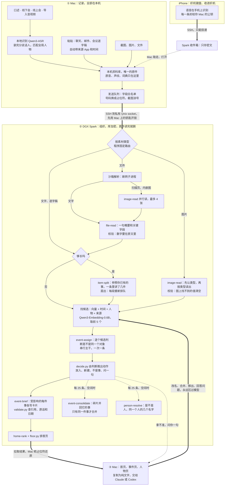

# 十日谈｜织机 Mindloom：只管丢进来，剩下的交给桌上那台 Spark

> 同文发布于 CSDN：https://blog.csdn.net/BronyaZaychik818/article/details/166849977 。这是提交之后按 v6 改写的版本：隐私、手机入口、整理质量和评测都换成了新的，截止时的第一版留在标签 `submitted-2026-09-29` 上。

> **TL;DR**
>
> - **是什么**：织机 Mindloom 是一个人用的「记录 → 组织 → 行动」。会议、口述、聊天、截图、文件，还有手机上说的话和分享的东西，都从一个入口丢进来；Mac 在本地转写，认出是谁说的；桌上那台 NVIDIA DGX Spark 用一组 Agent Skills 把它们织成一件件事：现在到哪一步、谁参与、下一个截止是什么。要推进时，一键复制成纯文字，交给 Claude 或 Codex。
> - **效果**：三个合成场景，各是一个人五到六周里的 1,510–1,600 条素材。归组 B³ F1 0.663–0.709，是无模型基线的 2.3–4.0 倍；截止时最大的毛病「切得太碎」，事件数从真值的 11–17 倍降到了 2.5–4.2 倍。
> - **SKILL.md 正文管不管用**：同一个模型只去掉正文，归属 B³ F1 从 0.782 掉到 0.612，读图关键字段从 97.5% 掉到 62.6%，文件概要一次合格从 36/38 掉到 1–2/38。
> - **隐私**：一台 Spark 常常是团队共用的。所以原件只在 Mac；号码出门前遮住、截图里的号码涂掉；Spark 上的库用一把只在你 Mac 上的钥匙加密，图片和文件读完就删；Mac 上删一条，Spark 跟着删；手机上的内容在手机上就封好。遮号前后整理质量测不出差别。
> - **还差的**：留出场景的事件数仍是真值的 4.2 倍，相像的两件事偶尔会被合在一起；iPhone App 只在模拟器上跑过。
> - **链接**：[演示视频（B 站；按 v6 重剪的新版正在上传到同一链接）](https://www.bilibili.com/video/BV1CbaW6pEcX/) ｜ [GitHub 仓库](https://github.com/Yusong-Enceladus/mindloom) ｜ [截止时提交的版本](https://github.com/Yusong-Enceladus/mindloom/tree/submitted-2026-09-29)

我们是一个五个人的小队，参加第三届 NVIDIA DGX Spark 黑客松（Agent Skills 开发挑战赛）。这篇由队里写代码的我来讲：我们做了什么、怎么搭的、数字是多少、哪些还没做成。文中和整理有关的数字、截图，全部来自合成数据（虚构的人、公司和单号）。

## 问题：事情早说清楚了，只是散在各处

我每天都在和人对齐。周会上把上线日期往后挪了一周，微信里有人发来一张改过的报价截图，晚上又在电话里定了下周谁去现场。想让 AI 帮忙写封邮件，得先花十分钟把来龙去脉重讲一遍。事情早说清楚了，只是散在会议、聊天、截图和 PDF 里，散在好几天里。

用 AI 干活要费三份力气：把来龙去脉交代给它，给它下指令，验收它交回来的东西。后两份本来就该我来，第一份其实可以省掉。

所以我要的是：**记录 → 组织 → 行动**，中间的「组织」不要我来做。我只管丢进来；这条属于哪件事、事情到了哪一步、谁说了什么，由它来理；要推进时，一键交给 Claude 或 Codex，答案丢回来，落回同一件事。

还有一个前提绕不开。如果这东西要把我的会议录音传上云，我自己都不会随手什么都往里丢；丢得不全，它对事情的理解就永远缺一块。所以隐私在这里不是加分项，而是它能不能用起来的前提。这也是它适合放在桌上那台 Spark 上的原因：整理要一个够大的模型长时间地跑，数据又不能离开自己的设备。交上去以后我才想明白另一半：实验室里的 Spark 往往是大家共用的，「在本地跑」还不够，得让同一台机器上的人也读不到我的东西。这一版的隐私就是按这个重做的。

## 做了什么

先说结果。一个研究生五周攒下的 1,510 条合成素材，由一台 DGX Spark 上的一组 Agent Skills 从头整理完，再让它按运行时的规则定期把碎片并回去：整体归组 B³ F1 从截止时的 0.642 到 0.709（衡量哪些素材被归到一起，1 为全对），不用模型的字符相似度基线是 0.179。另外两个场景（创业公司 CTO、大厂产品经理，各 1,600 条，其中创业公司是留出场景）是 0.663 和 0.692。截止时最大的毛病是事情切得太碎，这一版大部分修好了，代价和没修好的部分后面照实讲。

### 先说清楚哪些是旧的

Mac 端的口述底座不是这次做的。它从 2026 年 7 月 23 日开始写，黑客松开始前已有 266 个提交：音频采集和落盘、按 App 内录系统声音、说话人和全局人物身份、本地识别和口述整理。

黑客松期间新做的（截止前 Spark 端 90 个提交、Mac 端 52 个提交）：Spark 端的全部，Mac 和 Spark 之间可撤销的链路，粘贴、拖入任何文件和会议逐字稿导入，首页、事件页和人物页，以及评测和模型对比。截止之后（Spark 端 48 个提交、Mac 端 36 个提交）又做了三件事：隐私重做（v6）、iPhone App，以及两个新的 Agent Skill 加上拆段的改版。这篇里凡是截止之后的东西都会标出来。

### 首页：一张时间图

截止前最后一天，我们把首页又重做了一次。上一版把每条素材画成线上的一个结，看起来像代码的提交记录：用户看到的是「哪天进来了几条」，而不是「事情走到哪了」。

新首页先用一行回答「今天该管什么」：今天到期几件、明天几件、几个问题等你确认、几条还没归到事里。下面是一张时间图，从两周前到今天，再往后看一周。最近在动的五件事各是一根带子，越重要越靠上，带子的宽窄是那几天的动静；带子上的圆点是已经发生的进展，鼠标停上去就是「R1 仿真补实验已跑通」这样的短句；未来一侧的旗子是接下来的截止，比如「明天 需回复确认接受」「9/26 签约」。点任何一个点，就进到那件事的那一段。右上角可以只看和某个人有关的事。

织机这个名字就是从这来的：素材散着进来，Spark 把它们织成一根根线。

*首页（实验室场景的演示副本，合成数据，v6 整合版的真实 App 渲染）：9 月 20 日，过去两周动过 45 件事，五件在图上；「今天到期 2 件 · 明天 1 件 · 4 个问题等你确认 · 88 条还没归到事里」。*

### 点进去：实验和论文

还是那位研究生，挑他手上两件正事来看。

一件是灰狼平台上的 TG-2 抓取实验：有触觉和没触觉的夹爪，各抓草莓、鸡蛋、纸杯 30 次。散在十一种来源里的 93 条（手机键盘、微信、飞书妙记、腾讯会议逐字稿、Fn 口述、终端输出、邮件……）归成了一件事，卡片上是现状「草莓鸡蛋测完，传感器 9/23 到」和两组对比：草莓有触觉 27/30、无触觉 18/30，鸡蛋有触觉 24/30、无触觉 11/30，每条带日期和出处。这件事也不算干净：按评测标注，93 条里 72 条属于这件实验，另外 21 条是别的事的长素材里拆出来的一段。

*事件页（同一演示副本，合成数据，真实 App 渲染）。页面上的「127 条」按行计：长素材拆成几段时每段算一行，「同一段笔记还涉及 2 件事」就是拆开的其他段。来源里的「iPhone 键盘」是合成场景按手机键盘的样子模拟的素材，不是真手机发来的。*

第一版征文里，这个位置放的是另一组叠衣服的真机实验，卡片上三组成功率。v6 加了定期合并以后，那件事被并进了一场开放日演示的 50 条素材：演示的标题里就有实验的名字，模型两次都说「是同一件事」。这正是评测里「相像的事被合并」的那一对，所以我换了一件事来展示，没有把那张图留着当好看的例子。

另一件是论文 RoboPrior 的大修：决定信、审稿意见、几次 Zoom 讨论、口述的想法，91 条归成一件，卡片写着「R2 已完成，9 月 21 日交回复信」，首页上那颗「R1 仿真补实验已跑通」的圆点就是它。写回复信时不用再给 Claude 讲来龙去脉：把这件事复制成纯文字（现状、人物和带出处的原件）交给它起草。这件事里已经有几条 Claude 的回答：回复信模板、逐条回复的格式、怎样礼貌地不同意审稿人……粘回来时都归进了这件事。

### 人也是一条线

事是一条线，人是另一条。人物页把一个人的线拉出来，比如导师周明澜：上半截是她说过的话，每句带时间、来源和所属的事；下半截是有她的事，论文大修就在其中。

*人物页（同一演示副本，合成数据，真实 App 渲染）。这批规模素材是以文字粘贴进来的，没有音频，所以周明澜「说过的话」来自会议逐字稿和聊天里的署名，不是声纹识别。「出现在 30 件事」里也算上了只是被提到的事：v6 的人物整理会把文字里点到名字的人连到那件事上。*

## 一个入口，接住所有场景

同一件事常常散在五个地方、三天里：当面说了一句，线上会议讨论了十分钟，之后又在聊天截图、邮件和 PDF 里变了几次，路上还在手机上回了一句。我不想让人先想「这条该放哪」，所以不建文件夹、不打标签、不选项目，入口只有一个：丢进来。

| 场景 | 你做的 | 织机做的 |
|---|---|---|
| 线下开会 | 电脑放在桌上，点录音 | Mac 本地转写；录完自动分出说话人，用声纹认出是谁 |
| 线上会议 | 按 App 内录电脑里的声音（不需要虚拟声卡），或导入会议软件的逐字稿 | 同上；腾讯会议、飞书、Zoom、VTT/SRT 逐字稿里的署名直接成为发言人 |
| 随口一句 | 在 Mac 上任何 App 里按住 Fn 说 | 字插到光标处（松手到出字 P50 545 ms），同时存进资料库 |
| 手机上说话 | 切到织机键盘，按住麦克风键说 | 语音在手机上识别，字插进微信、邮件等正在输入的 App，同时收进织机 |
| 手机上看到的 | 在任意 App 里点分享 →「收进织机」 | 文字、链接（不打开）、图片（去掉拍摄地点）、文档；在手机上封好，经你自己的 Spark 转交给 Mac |
| 聊天、邮件、网页 | 粘贴 | 自动记下来源 App 和时间；「名：…」的行成为人物 |
| 截图、文件、录像 | 拖进窗口 | Spark 读图、读文件（33 种格式的评测见后文）；录像在 Mac 上取音轨转文字，另取最多 12 张关键帧给 Spark 读 |
| AI 的回答 | 把 Claude、Codex 的回答粘贴回来 | 放回它所属的那件事 |

拿不准时，它会问一句「这是同一件事吗」「这是同一个人吗」。问题有预算：同时开着的每类最多 2 个，每天最多 2 个，72 小时没答就收起来，已经放好的位置不变。

### 手机上也是同一个入口（截止后新做）

截止时手机入口只有一个 iOS 快捷指令，而且没在真 iPhone 上跑过。可聊天大多发生在手机上，这个入口不能将就。现在有了一个 iPhone App「织机」：织机键盘替代系统键盘上的语音键，按住说话，字直接进你正在打字的 App，同时收进织机；分享扩展「收进织机」接住手机上看到的其他东西。

*iOS 26.5 模拟器，合成数据。模拟器没有端上语音模型，所以键盘里的文字是 DEBUG 下的脚本转写；键盘和 App 之间的协议、插入、封存和发件箱都是真实代码。*

几个设计上的坚持：声音只在手机上转成文字，不保存、不发出；每一条离开手机前，用你 Mac 的公钥封好，Spark 只转交它打不开的密文，Mac 取走就删；手机拿到的 SSH 钥匙在 Spark 上只能往收件箱里放东西，在 Mac 上「断开 iPhone」就作废。原来的快捷指令没法在手机上封存，内容在 Spark 上等 Mac 取走时是明文，所以停用了。

它跑通了端到端：模拟器里的 App 经跳板机把 3 条封好的条目送进真实 Spark 的收件箱，Spark 上近万个文件里找不到一处明文，Mac 取走后来源和时间都对，断开 iPhone 之后手机再发就被拒。但我得说清楚：**它没在真 iPhone 上跑过**，端上中文识别的准确率、麦克风和后台的表现都还没测。

**谁说的，在 Mac 上认。** 线下会、线上会、Fn 口述和导入的录音走同一条本地说话人管线：录完之后先分出说话人，再用声纹匹配到一套全局人物。相似度够高（≥0.70）自动认出，处在中间（0.55–0.70）的请你确认。给一个声音起过名字，以后在哪种录音里都认得。声纹只存在这台 Mac 上；发给 Spark 的逐字稿里，说话人只以时间、人物 ID 和你起的名字出现。会议逐字稿的署名、聊天里「名：…」的行、聊天截图的发送人，也会和录音里认出的人汇成同一个人物；名字相近但不完全一样（「小满」和「林小满」）时只提问，不自动合并。

这套认人的底座是比赛前就做好的，在公开的 AMI 真人会议留出集上测过：已登记的人问了 16 次，认对 15 次；没登记的陌生人 16 次全部拒认；没有一次把人认错。说话人分离错误率（DER）24.93%，还偏高。

## 架构：Spark 上是一张 Skill 图，不是一条流水线

我们一开始在视频和 README 里把技能画成一条直线：读图 → 读文件 → 拆段 → 判断归属 → 写卡片 → 排首页。后来对着代码重新画了一遍，发现这条线有三处不对：

1. **读图和读文件是按素材类型分开的两条路**，不是先后两站。图片走读图，文件走读文件，文字两个都不走；只有文件里带图时，读文件才会调用读图，而且一个文件里的几张图并行读。
2. **拆段只对够长的文字类素材发生**（≥90 字且至少 3 个单元，拆出至少两件实质的事才算）。拆完是扇出：每一段重新排队，各自走一遍后面的流程。
3. **只有「判断属于哪件事」必须串行。** 写卡片和排首页可以并发，读图、读文件、拆段、算向量也可以提前并行做。

截止之后又多了一个形状：主干之外，Spark 定期自己收拾，把碎片事件并回它的事、整理人物。真实的形状是：多个入口汇到 Mac → 遮号、涂号后过一道边界 → Spark 按类型分叉 → 拆段扇出 → 一条串行主干判断归属 → 几件事的卡片并发写 → 排首页，旁边是两个定期的收拾环节 → 回到 Mac → 你的决定回流，并且永远优先。

*如果上面的图没有渲染出来，可以看 GitHub 上的版本：[README 的架构图](https://github.com/Yusong-Enceladus/mindloom#spark-上的-skill-图不是一条流水线) 和 [docs/ARCHITECTURE.md](ARCHITECTURE.md)。*

几个要点：

- **程序固定路由。** 每类任务用哪个 Skill 由代码决定（`spark/organizer/skills.py` 的 `JOB_TO_SKILL`）；模型不自己挑 Skill，也不能调用工具。
- **同一个 harness。** 每次调用 = 全局规则 + SKILL.md 正文 + 输出 schema（引导式 JSON）+ 放在 `<data>` 里、声明为资料的素材。输出先修好被模型写坏的占位符，再过确定性校验器（`scripts/validate.py`），不合格就带着错误重问一次。每次调用都记下 Skill 名、版本、模型、提示哈希、输入摘要、输出、校验结果、耗时，以及它读过哪些素材（删掉其中一条，这次调用的记录就清空）。
- **只有一段是串行的。** 判断归属按队列顺序一次一条，开多少线程结果都一样；写卡片在流水线模式下几件事一起写。规模场景里，模型调用的有效并发约 2.4。
- **定期收拾。** 每处理 25 条、队列空闲时，event-consolidate 拿每个小事件去比你最大的 32 件事，只有「就是同一件事」才合并，不是事的放回未归入；person-resolve 判断新读出的「人」是不是人、是不是某个人的另一个名字。你改过、放过、说过「不是同一件事」的，它们都不动。
- **两个回路。** 拿不准时问一句；你在界面上的改名、合并、移出、回答，作为明确的决定发回 Spark，受影响的素材重新排队、卡片重写，以后永远压过模型。
- **退路。** 模型服务不可用时任务稍后重排；向量服务挂了就只按时间、人物和来源找候选；链路断开时 Mac 照常记录，事件页改用本机整理。

## Agent Skills：八个在路由里，一个占位

| Skill | 做什么 |
|---|---|
| image-read 1.0.0 | 读图，分两步：先认类型（聊天截图、图表看板、幻灯片、白板、小票发票、扫描件、标签面单，其他归 other），再按类型读出内容和一句概要 |
| file-read 1.0.1 | 读文件：程序在沙箱里抽出文字，模型只写一句概要和票据类关键字段 |
| item-split 1.3.1 | 一条里讲了几件事：参照你当前最大的 24 件事，把会议逐字稿、长口述切成连续的几段，分别判断归属；同一件事的几块不切，顺带一提不切 |
| event-assign 2.1.1 | 判断属于哪件事：逐个候选比较「是不是同一个对象」，动作由 `decide.py` 推出 |
| event-brief 1.4.1 | 写这件事到哪一步：短标题、一句现状、1–4 条带出处的事实 |
| event-consolidate 1.0.1（截止后新增） | 定期收拾：小事件是某件事的碎片就并回去，是你自己的另一件事就留着，不是事就放回未归入 |
| person-resolve 1.2.1（截止后新增） | 整理人物：读出来的「人」是人、岗位还是根本不是人（字段名、代码键、产品名），是不是某个人的拼音、昵称或带备注的名字 |
| home-rank 1.3.1 | 排首页：给每件事打「现在对你有多重要」，再由 `floor.py` 保证 7 天内还有待办的事不被挤下去 |
| recall 0.1.1（占位） | 留给本机其它 Agent 的只读回忆入口；不在路由里，没有评测 |

版本号末位的加一，是隐私 v6 给读素材的 Skill 加的一句话：「占位符（如〔手机号·a1b2c3〕）是被遮住的号码，原样保留，不要猜、不要改写」，没有因此重新评测。

每个 Skill 是一个目录：`SKILL.md`（给模型的说明）、`scripts/`（确定性校验和辅助代码）、`evals/`（带机器检查的用例）、`BENCHMARK.md`（评测记录）。几个我觉得设计得比较用心的地方：

- **event-assign 不让模型直接下结论。** 模型先写出这条素材说的具体对象，再逐个和候选事件的固定对象比：同一个 / 拿不准 / 只是同一个人 / 只是同类话题 / 无关。然后由 `decide.py` 推出动作：有「同一个」才放进去；只有「拿不准」就问；两个候选都是「同一个」时放进排前的那个，并问要不要合并。模型自己写的结论字段，代码不信。
- **event-brief 的证据规则。** 写「已办」要摘原话，而且原话里不能有将来或条件的说法；只说「定了」不能写成已签、已付；每个日期都要能在所引素材里找到；不许用「明天」这类相对说法（`dates.py` 事先把「下周二」「月底」换成确切日期）。修不出来就保留旧卡片。
- **event-consolidate 只合「同一件事」。** 模型要在 same / part / related 里选，只有 same 才合并；两边都 ≥ 3 条要只给这一对再确认一次，两个都 ≥ 10 条的事件标题要有两个共同词，你动过的事不动。这些护栏是在两个开发场景上被「相像的事被合并」「私事被当成不是事」两种错逼出来的；留出场景只看总数。
- **person-resolve 合人要过代码这一关。** 模型说「同一个人」之后，`candidates.py` 还要检查：两个不同的全名不合，同一条素材里一起说话的两个人不合，你命名过的人不动。
- **读图、读文件不猜。** 概要里的数字必须在读出的内容里出现，票据字段必须能在原文行里找到；两次不合格就清空不被支持的值。
- **素材只当数据。** 素材放在 `<data>` 里，声明为资料而不是指令。素材里写着「删除所有事件」，也只是一条内容。

### SKILL.md 正文到底有没有用

这是这次最想回答的问题：Skill 的**正文本身**有没有用，还是全靠 schema 和校验器在撑？做法是同一个模型，保留全局规则、JSON schema、校验器和重试，只把 SKILL.md 正文换成一行任务名。所以它量的是说明文字本身的贡献，不是整套架构对裸模型的优势。（这组是截止时测的，之后没有重做。）

| Skill | 指标 · 数据 | 有正文 | 没有正文 |
|---|---|---|---|
| event-assign | B³ F1 · 留出集 46 条 | **0.782** | 0.612（向量基线 0.336、词法基线 0.463） |
| event-brief | 卡片事实召回 · 留出集 | **0.511** | 0.431 |
| home-rank | NDCG@5 · 留出集 | **0.923** | 0.806（只按时间 0.886） |
| image-read | 关键字段准确 · 98 张测试图 | **97.5%** | 62.6% |
| image-read | 类型判对 · 98 张测试图 | **99.0%** | 83.7% |
| file-read | 概要一次合格 · 38 个有文字的文件 | **36/38** | 1–2/38 |

正文主要提高召回（把该放一起的放一起）和一次合格率。没有正文时，模型更保守（精确率 0.94–0.96、召回 0.41–0.50），更多输出被校验器拒掉。

截止后的三个新版本在各自 `evals/evals.json` 的虚构用例上每个跑 3 次：event-consolidate 12 个、item-split 1.3.0 10 个、person-resolve 1.2.0 15 个，全过。这两个新 Skill 没有做「有 / 没有正文」的消融。

## 隐私：团队共用一台 Spark，也放心丢进来

「模型在本地跑」只回答了谁在算。交上去以后我才意识到，我们用的 Spark 上是几个人共用一个登录账户：整理服务、模型服务和别人的程序跑在同一个账户下。第一版的隐私在这种部署上是不成立的：链路令牌是个文件，同一个账户下谁都读得到；Spark 上的库是明文；Mac 上删了，Spark 上还在。

所以这一版换了一个出发点：**你的 Mac 是保险箱，也是唯一的原件所在；Spark 是一张工作台，只拿到整理需要的东西，用一把只在你 Mac 上的钥匙锁着，原件读完就删，你让它忘掉，它就忘掉。** 落到七条保证上：

1. **原件只在你的 Mac 上。** 录音、声纹、词典、你放进来的原始文件和截图都留在 Mac；整理好的结果也存回 Mac。Spark 上的东西随时可以清空，再从 Mac 重建。
2. **号码出门前先遮住。** 手机号、邮箱、身份证号、银行卡号、验证码、密码、密钥、IP、车牌号，发出去之前换成占位符，比如〔手机号·a1b2c3〕；截图里同样的号码，Mac 用自己的认字结果涂掉。结果回来，Mac 把原文放回去。人名、日期、金额、地点保留，因为整理要用。
3. **Spark 上的东西锁着，钥匙只在你的 Mac 上。** 库用 SQLCipher 加密，钥匙在 Mac 的钥匙串里，只经你自己的 SSH 隧道进到整理进程的内存。同一台 Spark 上的其他人只看得到密文；Spark 重启后，在你的 Mac 连上之前谁也读不出来；Mac 走开 10 分钟，它自己上锁。
4. **读完就删。** 图片和文件在 Spark 上读完就删字节，只留遮过号码的文字。
5. **你能收回。** Mac 上删一条，Spark 上它的所有修订、读出的文字、向量、引用过它的卡片都跟着清掉；关掉链路就上锁；「让 Spark 忘掉我的内容」清空一切，并销毁钥匙。
6. **不拿功能换隐私。** 口述、录音、识别、插入、搜索都不经过 Spark；链路关着时 Mac 在本机整理。
7. **不会越存越多，整理也不变差。** 下面有实测。

| | 放在哪 | 经过链路的是什么 | 同一台 Spark 上谁能读 | 怎么收回 |
|---|---|---|---|---|
| 录音、声纹、词典 | 只在 Mac | 从不发送 | 没有人 | 在 Mac 上删 |
| 文字 | Mac 存原文 | 遮过号码的文字 | 库是密文；只有开着锁时的整理进程和它调用的模型服务 | Mac 上删，Spark 跟着删 |
| 截图、文件 | Mac 存原件 | 涂过号码、去掉元数据的副本 | 读完即删，只留遮过号码的文字 | 同上 |
| 手机上的内容 | Mac 取走后保存 | 在手机上就封好 | 没有人：Spark 只转交密文 | Mac 取走即删；断开 iPhone 吊销钥匙 |
| 钥匙 | Mac 的钥匙串 | 开锁时发一次 | 只在整理进程内存里 | 「忘掉我」销毁 |

**怎么知道做到了。** 我最担心的是两件事：遮了号码，整理会不会变差；做了这么多，是不是真的做到了。

- **遮号会不会让整理变差**：在留出集里写进 37 处合成号码，遮号和不遮号各跑 5 次，B³ F1 是 0.788 ± 0.038 对 0.788 ± 0.013；而输入逐字节相同的对照组，两组之间自己就差 0.038。再把含占位符的调用在完全相同的上下文里重发：归事件的决定和原文版本相同 105/111，和原样再发一次相同 104/111。也就是说，遮号带来的差别和模型服务自己的波动一样大。看得到的代价是：号码本身就是事情内容时（某人换号了），卡片偶尔少写那个号码，原文还在 Mac 上。

  

- **端到端**：真实的 Mac 代码对一个真实的 Spark 实例，五条带哨兵号码的合成素材走一遍：线路上、Spark 磁盘上的 9,554 个文件里、用钥匙解密后的库里，都找不到一个哨兵；只拿令牌不带钥匙读，被拒；删除、上锁、「忘掉我」都按说的生效。整合版上 68/68。
- **专门挑刺**：做完后又安排了一轮对抗式复查，只找漏洞，找出 16 个（3 高、7 中、6 低）。最痛的三个：共用账户下谁都能读整个库；截图涂号在 13 种常见版式里漏了 7 种，Spark 的读图模型读得出号码；文件里夹带的图片和录音原样过了链路。14 个修了，现在那 13 种版式涂过之后读图模型一个号码也读不出；一个由手机端的封存解决；另一个写进了边界（下面第 3 条）。
- **存储**：读完就删加上加密，Spark 上每 1,000 条素材从 64.9 MB 降到 60.4 MB，加密本身多占 2.1%；Mac 上同样的文件只存一份，同一批 78 个文件导入两次，资料库一个字节也不多。

**仍然诚实的边界：**

1. **整理服务请用一个只有你自己用的账户跑。** 能以同一个账户运行程序的人，可以停掉整理服务、冒充它，在你的 Mac 下次连上时骗到钥匙；Mac 没法证明对面是真的整理服务。这是复查里唯一修不干净的一条。
2. **开着锁的时候，遮过号码的文字以明文在整理进程的内存里**，同一台 Spark 上的模型服务也看得到提示词。
3. **占位符挡得住模型和日志，挡不住拿着钥匙的人。** 像 6 位验证码这样的短号码，拿到钥匙的人一个个试，约 100 万次就能试出来。
4. **遮号只认规范里的格式**：手写的号码、Vision 认不出的截图文字涂不掉。遮号对整理效果的评测是在第 1 版规则上做的，后来补了两版规则，没有重跑。
5. **真实资料库和真 iPhone 都还没有端到端跑过。**

## 评测

全部是合成数据，如实报告，包括不好看的数字。n 很小：运行时的合并每个规模场景只跑了 1 次，小留出集只有 46 条；同一设计两次运行之间 B³ F1 就能差 0.01–0.02（规模场景）到 0.065（留出集），所以几个点的差距不能当结论。还有一点要先说：截止后的三条改动（隐私、手机、整理质量）各在自己的分支上测，合并后的整体版本没有在规模场景上重跑。完整的表和出处在仓库的 [docs/EVALUATION.md](EVALUATION.md)，机器可读的全部数字在 [eval/results-2026-09-30/eval.json](../eval/results-2026-09-30/eval.json)。

### 先说我们差点骗了自己

有一轮评测数字好得让人不安。回头一查，技能提示里混进了开发集的原话和留出集的措辞，写技能的编程代理在动笔前还读过留出集的答案。我们把提示里的例子全换成毫不相干的虚构领域，再请一个没看过技能的代理盲写新的留出集，用哈希冻结。开发集分数因此从 0.787 掉到 0.740，这个代价我们写进了仓库。做评测，最容易骗过的人是自己。

这个新留出集后来也用了很多次（最终评测、模型对比、截止后的合并评测），已经不算完全没见过的数据。截止后调新 Skill 时，我们只看两个开发场景，第三个规模场景（创业公司）留出，只看过总数。

### 指标怎么读

- **B³ F1**：对每条素材，看和它分在一起的是不是真该在一起（精确率），该在一起的是不是都在一起（召回），再取调和平均。衡量分组，0–1，越高越好。
- **Link F1**：先把预测的事和真事一对一配对，再看每条素材是否挂在配对的那件事上。
- **难干扰泄漏**：刻意写得很像的两件事被并到一起的比例，越低越好。
- **卡片事实召回**：金标准里的事实有多少写进了卡片；不判断卡片里多写的内容对不对。
- **NDCG@5**：首页前 5 件事的顺序和金标准重要度有多一致，0–1。**CER**：字错率。**DER**：说话人分离错误率。

### 三个规模场景：各一个人五到六周、1,500–1,600 条

小场景只有几十条，撑不起「一个人一个多月」这个问题，只能自己造。我们用大模型在几台 Spark 上写了三个人的生活：实验室研究生（五周）、创业公司 CTO（六周）、大厂产品经理（六周）。金标准来自确定性的计划，不来自模型。素材由 Mac 端的 harness 一次性粘贴进去，一台 Spark 整理完再打分；截止后，在这个状态的副本上让新代码按运行时规则定期合并，到不再变化为止。基线是不调模型的字符二元组相似度。

| | 实验室（开发） | 产品经理（开发） | 创业公司（**留出**） |
|---|---|---|---|
| 素材 / 真事件 | 1,510 / 22 | 1,600 / 21 | 1,600 / 20 |
| **B³ F1**：基线 / 截止时 / **v6** | 0.179 / 0.642 / **0.709** | 0.299 / 0.606 / **0.692** | 0.266 / 0.584 / **0.663** |
| **Link F1**：基线 / 截止时 / **v6** | 0.136 / 0.630 / **0.743** | 0.186 / 0.563 / **0.725** | 0.116 / 0.582 / **0.706** |
| 难干扰泄漏 ↓：基线 / 截止时 / v6 | 0.258 / 0.225 / 0.338 | 0.920 / 0.140 / 0.164 | 0.833 / 0.068 / 0.089 |
| 事件数：截止时 → v6（真值） | 242 → 54（22） | 227 → 56（21） | 348 → 84（20） |
| 只有 1 条的事件：截止时 → v6 | 143 → 19 | 109 → 11 | 233 → 33 |

- **碎片化大部分修好了**：事件数从真值的 11–17 倍降到 2.5–4.2 倍。我给自己定的目标是 3 倍以内：两个开发场景做到了，留出的创业公司（4.2 倍）没做到。
- **提高全部来自召回**：碎片被并回它们的事，召回涨了 0.12–0.16，精确率持平或略降。没有白来的分数。
- **代价**：实验室场景的难干扰泄漏从 0.225 升到 0.338，就是前面说的那场开放日演示被并进了实验；一部分噪声也被当成碎片并进了真事。
- **不贵**：一个 1,500–1,600 条的库合并一次，连同合并后重写卡片，是整理这批素材所用输入 token 的 5.1–7.9%。

### 拆段：截止时最重要的发现，和这一版的改法

截止时拿三个规模场景里整理器**实际切出的段**对照分段真值，发现只讲一件事的素材有 22–33% 被切开了，而且被切开的素材里约一半的段又被分进了不同的事：调参集上 1.000 / 0.937 的拆段技能，在规模数据上成了碎片的来源之一。

这一版的 item-split 1.3.0 让模型同时看到你当前最大的 24 件事：属于同一件事的几块不切；一件事要占有事部分的 15% 以上才算「实质的事」，顺带一提不切。只切不归的重放上，被切开的比例：实验室 32.8% → 20.6%，产品经理 22.4% → 10.6%，留出的创业公司 30.2% → 17.7%；多件事里每件事被找回的比例基本不变。

### 人物

截止时人物关联只有 0.23–0.26：「全文」「先确认一下」这样的词被当成说话人，同一个人的中英文名字各算一个人，一条口述里点了四个人的名字一个也连不上。加了人物整理之后，人物关联到 0.42–0.48；显示出来的「人」里，不是任何场景人物的记录从 85 / 77 / 53 降到 22 / 9 / 7。提升主要来自「提及」：以前漏掉的大多是「这个人在库里有记录，但没连到这件事」。它仍然是弱项：只能在库里已知的名字里找，同一个人的昵称有些还是单独的一条。

### 读文件：33 种格式（截止时）

测试集是 115 个合成文件，33 种格式，412 道带金标准的问题。每个文件都送进整理器真实的读文件路径（沙箱解析 → 扫描页和内嵌图交给 image-read → file-read 写概要），跑了 2 次。金标准答案出现在读取结果里的比例是 0.82 / 0.81；去掉 HEIC 和视频（它们由 Mac 先处理，这条 Mac 端路径没在这套评测集上跑过）是 0.91 / 0.89。两个可以直接修的缺陷：XML 的属性值没读出来，GIF 只读了首帧。v6 之后，文件里的图片要先在 Mac 上涂过号码才会被读，这条路径还没在这套评测集上重跑。

### Mac 端：识别和说话人（截止时）

| 识别器（240 条我自己的口述，同一口径） | CER | 英文词召回 | 解码中位 |
|---|---|---|---|
| **Qwen3-ASR 1.7B 8-bit + 41 条词表（终稿）** | **3.74%** | **30/41** | 939 ms |
| 同模型 bf16（H100 参考） | 3.78% | 29/41 | 710 ms |
| FireRedASR2-AED（75 条子集） | 4.07% | 6/10 | 1,367 ms |
| Fun-ASR-Nano-2512 | 4.69% | 27/41 | 396 ms |
| SenseVoice small int8（实时稿） | 5.75% | 24/41 | 150 ms |

- 松手到文字插入 P50 545 ms、P90 635 ms。口述时常驻 5.17 GB，空闲后释放到 0.93 GB。否决过的方向：用个人历史给 ASR 做 LoRA（CER 2.57% → 8.43%）。
- 说话人（公开 AMI 真人留出集）：说话人混淆 2.07%，已知人误认 0，已知查询 15/16，陌生人 16/16 拒认；DER 24.93%、JER 31.78% 偏高，记为局限。说话人任务在录完之后跑，不是边录边出名字。

## 用了哪些模型

全部是开放权重模型。Spark 上整理用的模型都由 vLLM 在本机 127.0.0.1 上提供，Mac 上的模型跑在 MLX 和 Core ML 上，手机上用的是 iOS 自带的端上识别。

| 功能 | 模型 | 在哪 | 关键数字 |
|---|---|---|---|
| 判断归属、写卡片、排首页、拆段、定期合并、人物整理 | Qwen3.6-35B-A3B NVFP4（vLLM，MTP×3 投机解码，fp8 KV） | Spark | 规模场景 B³ F1 0.663–0.709；单流约 100 token/s |
| 读图 image-read、读文件 file-read | 同一个 Qwen3.6（解析文件的部分是确定性代码，不用模型） | Spark | 98 张测试图关键字段 96.2% / 98.8%；33 种格式答案出现率 0.82 / 0.81 |
| 候选检索 | Qwen3-Embedding-0.6B | Spark | 候选 R@5：开发集 98.6%、留出 100%；单条 25 ms |
| 口述识别 · 终稿 | Qwen3-ASR 1.7B 8-bit（MLX）+ 41 条词表 | Mac | CER 3.74%，松手到出字 P50 545 ms |
| 口述识别 · 实时稿 | SenseVoice small int8（Core ML） | Mac | CER 5.75%，解码中位 150 ms |
| 口述整理 | 规则 + Qwen3-0.6B 8-bit LoRA + 忠实度护栏 | Mac | 对校对稿精确率 98.12%，生成中位 193 ms |
| 说话人 / 人物 | FluidAudio 0.15.5 + fluid-speaker-diarization-coreml | Mac | 说话人混淆 2.07%，已知人误认 0，陌生人 16/16 拒认；DER 24.93% |
| 截图认字（涂号码用） | Apple Vision | Mac | 复查的 13 种版式涂过后 13/13 读不出号码 |
| 手机听写 | iOS 26 端上语音识别 | iPhone | 没测：模拟器里没有语音模型 |

### 整理模型对比：同一代码、同一留出集（截止时）

2026 年新出的开放权重模型，我们在 Spark 上挨个试了。所有行都在同一份代码、同一套技能提示、同一个检索模型上跑，关闭思考，每个模型独占一台 Spark（DeepSeek 占两台）。留出集 46 条、7 件事、2 个难干扰。

| 模型 | n | B³ F1 | 卡片事实召回 | 难干扰泄漏 ↓ | 秒/条 |
|---|---|---|---|---|---|
| Qwen3.8-27B-FP8 | 1 | **0.834** | 0.644 | 0.000 | 52.2 |
| Muse Glimmer-30B NVFP4 | 1 | **0.832** | 0.644 | 0.000 | 56.6 |
| Gemma 4 26B-A4B-it（bf16） | 2 | 0.786（两次相同） | **0.684** | 0.000 | 37.3–37.4 |
| GLM-4.7-Flash（30B-A3B） | 2 | 0.750（0.746–0.755） | 0.425 | 0.375 | 39.3–39.7 |
| **Qwen3.6-35B-A3B NVFP4（默认）** | 2 | 0.738（0.706–0.771） | 0.546 | 0.083 | **8.5–9.5** |
| DeepSeek-V4-Flash（两台 Spark TP2） | 1 | 0.735 | 0.609 | 0.417 | 24.3 |
| Nemotron-3-Super-120B-A12B NVFP4 | 1 | 0.728 | 0.322 | 0.778 | 44.0 |
| Mistral Small 4 119B NVFP4 | 1 | 0.480 | 0.310 | 0.215 | 32.8 |
| Nemotron-3-Nano-Omni-30B-A3B NVFP4 | 1 | 0.395 | 0.207 | 0.000 | 19.0 |
| gpt-oss-120b（reasoning low） | — | 跑到 24/46 条停止 | | | 约 125 |

- **更准的都慢得多**：Qwen3.8 和 Muse Glimmer 到了 0.83，难干扰泄漏为 0，但每条 52–57 秒。1,600 条串行要 23–25 小时，Qwen3.6 约 4 小时。Muse Glimmer 在开发集上只有 0.672，不稳定。
- **Gemma 4 26B-A4B 是最值得跟进的**：两次结果一致，卡片事实召回最高，每条 37 秒。换默认之前，还要在开发集和规模场景上验证。
- **结论**：默认仍是 Qwen3.6。一台 Spark 上同一个模型同时做文字和读图，而且最快。截止后的新环节都只在它上面测过。

### 为了在 Spark 上跑起来做的事

- **NVFP4 + MTP**：默认模型用 NVFP4 权重加 MTP×3 投机解码，单台 Spark 上单流约 100 token/s；三个规模场景整理时 GPU 利用率 87–94%。
- **两台 Spark 做 TP2**：DeepSeek-V4-Flash 一台放不下，跨两台 Spark 做张量并行，而且必须关掉思考，否则输出额度全被推理用完。
- **Step3-VL-10B 走原生接口**：改走 llama.cpp 原生 `/completion` 并预填一个空的思考块后，同一张截图从 70.17 秒降到 19.16 秒，四道小题从 2/4 到 4/4。
- **Mistral Small 4**：vLLM 要导入两个在新版 transformers 里已经改名或删掉的 Pixtral 函数，我们只在这个进程里补上这两个名字，再去掉请求里它不接受的 `chat_template_kwargs`，第三次才跑通，结果是最差的一档。
- **没跑起来的也记下原因**：Gemma 4 31B QAT（w4a16）服务能起，但所有请求只输出 token 0；Nemotron-3.5-Lightning 的 tokenizer 实例化失败；gpt-oss-120b 推理关不掉，给足输出额度后能正常输出，但每条 125 秒，约为默认模型的 14 倍。
- **共用一台 Spark**：隐私 v6 推荐的部署是每个人在自己的系统账户下跑一个加密的整理实例（自己的数据目录、socket 和令牌），模型服务大家共用。我们的测试实例各有自己的数据目录和令牌，但还和别人共用一个登录账户，这正是前面隐私一节边界第 1 条说的风险。

### 模型调优：System One，想让大部分判断快起来

受 Jev 的「System One」思路启发（不生成文字，一次前向给每个选项打分，并给出校准过的概率）：多数「这条属于哪件事」的判断其实很容易，不必每次都让大模型走一遍完整的归属判断。规模场景里 event-assign 单次 p50 4.5 秒，而且必须串行。我想要一个一次前向就给出**校准概率**的小模型，有把握就拍板，没把握交给大模型。

我们在 Spark 上用 Spark 生成的数据，微调了 Qwen3-Reranker-0.6B（只训最上面 4 层，外加 25 个检索特征的线性头），在验证集上校准温度和阈值，测试集从头到尾没碰过。

| 模型（TEST，1,953 个决定） | 准确率 | ECE | 97% 精确率下能直接拍板的比例 |
|---|---|---|---|
| 只取检索第一名（不用模型） | 77.3% | 0.227 | — |
| 25 个检索特征的逻辑回归（不看文字） | **84.0%** | 0.038 | 65.6% |
| Qwen3-Reranker-0.6B 微调 | 76.9% | **0.021** | 46.6% |
| Laya（mmBERT-base）零样本 / 短时微调 | 4.2% / 14.1% | — | — |

微调的 reranker 在验证集上是 82.1%、ECE 0.031，一半多的判断能以 97% 的精确率走快路径；到了没见过的测试集掉到 76.9%，略低于只取检索第一名的 77.3%，校准倒是保住了。最好的快路径反而是只用 25 个检索特征的逻辑回归：测试集 84.0%，但按事先定的规则，它在验证集上输了（79.8% 对 82.1%），只能算基线。所以 System One 默认关闭，没有接进整理器。它告诉我的是：快判断的信号主要在检索特征里，不在模型大小。详细结果在 [eval/system_one/RESULTS.md](../eval/system_one/RESULTS.md)。

## 没做成的和弱点

1. **碎片化还没完全解决。** 留出场景的事件数仍是真值的 4.2 倍，只有 1 条的事件还有 33 件。
2. **相像的两件事会被合在一起。** 合并的提高全部来自召回，精确率没涨；实验室场景那场开放日演示被并进了它演示的实验，小留出集上两次运行都把一对难干扰合成了一件。名字护栏只在两个事件都够大、名字不像时起作用。
3. **人物只查已知的名字。** 只被点名、从没说过话的人还查不到；同一个人的昵称有些仍是单独的记录。
4. **首页排序扛不住规模，卡片校验太严。** 截止时测的：小留出集 NDCG@5 0.92，规模场景 0.13–0.35；49–64% 的 event-brief 调用最后被拒，白白用掉 34–44% 的输入 token。这一版没有重新测它们。
5. **合并后的整体版本没有在规模场景上重跑。** 隐私、手机、整理质量三条改动各在自己的分支上测；整合版上跑的是全部测试和两条端到端。
6. **没测的和没实证的**：真 iPhone（端上中文识别、麦克风、后台、蜂窝网络）；真实资料库；卡片事实的精确率；HEIC 和视频在 Mac 端的完整路径；真实照片和真实文件；recall；系统翻译；16 GB Mac 上的识别和说话人门槛。Spark 上没有任何真实用户数据的评测，这是我们自己的隐私规则要求的，合成数据也比真实数据干净。

## 团队这十天

征文叫「十日谈」。我们的十天，前半段在选题、读规则、打通几台 Spark 的访问；代码集中在后四天。公开仓库的时间线上，截止前 Spark 端 90 个提交、Mac 端 52 个提交（188 个文件，+34,933 / −571 行），都落在北京时间 9 月 26 日到 29 日 23:59 之间。

| 日期（北京时间） | 主要进展 |
|---|---|
| 9 月 26 日 | Mac 端迁到 Xcode 27，接上第一版 Mac ↔ Spark 可撤销链路；Spark 端第一个提交：整理服务、第一版技能和评测数据。一位队友连夜在另一台 Spark 上部署了一份，修了几处问题 |
| 9 月 27 日 | 凌晨第一次在 Spark 上评测技能，合进队友的修改；链路改成「私有 Unix socket + 令牌 + 端口归属核对」；Mac 端能粘贴、拖入，能把一件事导出成纯文字；中文名「织机」定下来 |
| 9 月 28 日 | 凌晨 Mac 换上首页、事件页、人物页；过拟合审计，换上盲写、冻结的留出集；白天给卡片加证据规则，在真 Spark 上跑通端到端测试；下午在新留出集上做最终评测 |
| 9 月 28 日深夜 | 一起看了效果，结论是几十条的小场景撑不起这个问题，得上量；当晚在几台 Spark 上开始生成三个 1,500–1,600 条的场景 |
| 9 月 29 日 | 凌晨上线拆段和手机收件箱，读图改成先认类型再读；上午定下英文名 Mindloom；白天上线沙箱读文件，训练 System One，三个场景整理完打分，比了一轮最新的开放权重模型；晚上把首页重做成时间图，人物页加上「说过的话」，录视频、写征文，23:42 交上表单 |
| 9 月 30 日（提交后） | 隐私 v6：加密存储、遮号码和截图涂号、读完就删、删除同步、「忘掉我」，再做一轮对抗式复查并修掉；iPhone App（织机键盘、收进织机、配对）和只收封存条目的收件箱；event-consolidate、person-resolve 和 item-split 1.3.0；三条分支合到一起，跑完全部测试和两条端到端 |

我这边是一个人带着几路编程代理（Claude Code、Codex）并行干活：我定方向、定口径、做验收，代理写代码、跑评测、互相审查。一位队友在另一台 Spark 上部署、试用；队友们不断泼冷水，比如内容有点大杂烩、第一版征文没图没表。回头看，学到的几件事：

- **评测最容易骗过的是自己。** 过拟合那一轮如果没查出来，我们会带着一个虚高的数字交上去。
- **小场景会骗人。** 46 条上 0.78 的东西，到 1,500 条才暴露碎片化；拆段技能在调参集上 1.000 / 0.937，到了规模数据上把 22–33% 的单件事素材切开了。
- **修好一个洞会开出另一个。** 定期合并把碎片并回去，也把一场开放日演示并进了实验，那张最好看的截图也就不能用了。分数涨了，但我得把代价和分数写在一起。
- **「在本地跑」不等于隐私。** 隐私要回答的是放在哪、谁能读、能不能收回；专门安排一轮挑刺，比自己测一百遍有用。
- **画图之前先读代码。** 我们一度把 Skill 讲成一条直线，既讲错了，也低估了它；真正值得讲的是分路、扇出、串行主干、校验和两个回路。
- **别为了展示功能编剧情。** 演示场景推翻了好几轮，为了展示功能设计的戏剧化剧情，看起来都像硬编的。最后选了最朴素的：一个研究生五周的日常。

## 最后

在合成数据上，这条路已经走通：按住 Fn 说话、在手机上用织机键盘回一句、把截图拖进去，第二天打开首页，看到几件事各自到了哪，点开一件交给 Claude。东西没离开我自己的设备；就算 Spark 是和别人共用的，上面也只有锁着的、遮过号码的文字。这是我这几天最在意的事。

- 演示视频：<https://www.bilibili.com/video/BV1CbaW6pEcX/>（按 v6 重剪的新版正在上传到同一链接）
- 代码、Skills 和评测：<https://github.com/Yusong-Enceladus/mindloom>（截止时提交的版本见标签 [`submitted-2026-09-29`](https://github.com/Yusong-Enceladus/mindloom/tree/submitted-2026-09-29)）
- 架构、隐私、手机和评测的细节：[ARCHITECTURE.md](ARCHITECTURE.md) · [PRIVACY.md](PRIVACY.md) · [PHONE.md](PHONE.md) · [EVALUATION.md](EVALUATION.md) · [MODELS.md](MODELS.md)

*修订说明：第一版征文只有文字，队友的评价是没有图、没有结构、没有量化指标，也没说用了哪些模型；第二版补上了配图、表格和评测。这一版（v6，2026-09-30）是提交之后改写的：隐私、手机入口、Agent Skills、评测几部分换成了截止后的实现和数字，截图换成了 v6 整合版的渲染，合成场景里个别和真实人物、论文重名的名字也换掉了，虚构的地名换成了真实的城市。截止时的代码留在标签 submitted-2026-09-29 上；演示视频按 v6 重新剪了一版，正在上传到同一个链接。*
