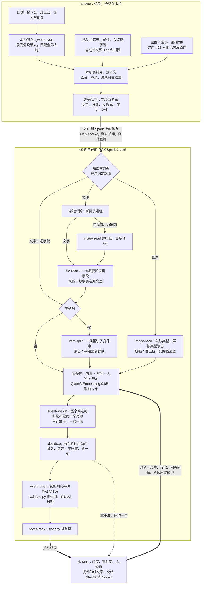

# 十日谈｜织机 Mindloom：只管丢进来，剩下的交给桌上那台 Spark

> 同文发布于 CSDN：https://blog.csdn.net/BronyaZaychik818/article/details/166849977

> **TL;DR**
>
> - **是什么**：织机 Mindloom 是一个人用的「记录 → 组织 → 行动」。会议、口述、聊天、截图和文件都从一个入口丢进来；Mac 在本地转写，认出是谁说的；你自己桌上的 NVIDIA DGX Spark 用一组 Agent Skills 把它们织成一件件事：现在到哪一步、谁参与、下一个截止是什么。要推进时，一键复制成纯文字，交给 Claude 或 Codex。
> - **效果**：三个合成场景，各是一个人五到六周里的 1,510–1,600 条素材。归组 B³ F1 0.58–0.64，是无模型基线的 2.0–3.6 倍（留出场景 2.2 倍）。
> - **SKILL.md 正文管不管用**：同一个模型只去掉正文，归属 B³ F1 从 0.782 掉到 0.612，读图关键字段从 97.5% 掉到 62.6%，文件概要一次合格从 36/38 掉到 1–2/38。
> - **隐私**：音频、声纹、词典从不离开 Mac。文字和你放进来的截图、文件，只经你亲手打开、随时能撤销的 SSH 链路去你自己的 Spark。没有云端，也不调用任何云模型 API。
> - **最大短板**：切得太碎，预测的事件数是真值的 11–17 倍。
> - **链接**：[演示视频（B 站，约 4 分钟）](https://www.bilibili.com/video/BV1CbaW6pEcX/) ｜ [GitHub 仓库](https://github.com/Yusong-Enceladus/mindloom) ｜ [截止时提交的版本](https://github.com/Yusong-Enceladus/mindloom/tree/submitted-2026-09-29)

我们是一个五个人的小队，参加第三届 NVIDIA DGX Spark 黑客松（Agent Skills 开发挑战赛）。这篇由队里写代码的我来讲：我们做了什么、怎么搭的、数字是多少、哪些还没做成。文中和整理有关的数字、截图，全部来自合成数据（虚构的人、公司和单号）。

## 问题：事情早说清楚了，只是散在各处

我每天都在和人对齐。周会上把上线日期往后挪了一周，微信里有人发来一张改过的报价截图，晚上又在电话里定了下周谁去现场。想让 AI 帮忙写封邮件，得先花十分钟把来龙去脉重讲一遍。事情早说清楚了，只是散在会议、聊天、截图和 PDF 里，散在好几天里。

用 AI 干活要费三份力气：把来龙去脉交代给它，给它下指令，验收它交回来的东西。后两份本来就该我来，第一份其实可以省掉。

所以我要的是：**记录 → 组织 → 行动**，中间的「组织」不要我来做。我只管丢进来；这条属于哪件事、事情到了哪一步、谁说了什么，由它来理；要推进时，一键交给 Claude 或 Codex，答案丢回来，落回同一件事。

还有一个前提绕不开。如果这东西要把我的会议录音传上云，我自己都不会随手什么都往里丢；丢得不全，它对事情的理解就永远缺一块。所以隐私在这里不是加分项，而是它能不能用起来的前提。这也是它适合放在自己桌上那台 Spark 上的原因：整理要一个够大的模型长时间地跑，数据又不能离开自己的设备。

## 做了什么

先说结果。一个研究生五周攒下的 1,510 条合成素材，由一台 DGX Spark 上的一组 Agent Skills 从头整理完：他在做的 Twin-7 叠衣服实验，散在七种来源里的 143 条归成了一件事，三组成功率都带着出处；整体归组 B³ F1 0.642（衡量哪些素材被归到一起，1 为全对），不用模型的字符相似度基线是 0.179。另外两个场景（创业公司 CTO、大厂产品经理，各 1,600 条，其中创业公司是留出场景）是 0.584 和 0.606，分别是基线的 2.2 倍和 2.0 倍。最大的毛病是事情切得太碎，后面照实讲。

### 先说清楚哪些是旧的

Mac 端的口述底座不是这次做的。它从 2026 年 7 月 23 日开始写，黑客松开始前已有 266 个提交：音频采集和落盘、按 App 内录系统声音、说话人和全局人物身份、本地识别和口述整理。

其余都是黑客松期间新做的（截止前 Spark 端 90 个提交、Mac 端 52 个提交）：Spark 端的全部，Mac 和 Spark 之间可撤销的链路，粘贴、拖入任何文件和会议逐字稿导入，首页、事件页和人物页，以及下面所有的评测和模型对比。

### 首页：一张时间图

最后一天，我们把首页又重做了一次。上一版把每条素材画成线上的一个结，看起来像代码的提交记录：用户看到的是「哪天进来了几条」，而不是「事情走到哪了」。

新首页先用一行回答「今天该管什么」：今天到期几件、明天几件、几个问题等你确认、几条还没归到事里。下面是一张时间图，从两周前到今天，再往后看一周。最近在动的五件事各是一根带子，越重要越靠上，带子的宽窄是那几天的动静；带子上的圆点是已经发生的进展，直接写着「回复信草稿已拟」「续租条件谈妥」这样的短句；未来一侧的旗子是接下来的截止，比如「明天 需回复确认接受 Offer」。鼠标停在某一天，能看到那天进来的素材；点任何一个点，就进到那件事的那一段。右上角可以只看和某个人有关的事。

织机这个名字就是从这来的：素材散着进来，Spark 把它们织成一根根线。

*首页（实验室场景，合成数据，真实 App 渲染）：五件事各是一根带子，圆点是已经发生的进展，旗子是接下来的截止。*

### 点进去：实验和论文

还是那位研究生，挑他手上两件正事来看。

一件是 Twin-7 上的叠衣服真机实验。散在聊天、Fn 口述、手机上打的字、腾讯会议逐字稿、共享表格、截图和 Codex 回答里的 143 条，归成了一件事。卡片上是三组定下来的成功率：毛巾 82%（41/50）、T 恤 74%（37/50）、袋子 66%（33/50），每条都带日期和出处。这件事还不够干净：混进了一些同期别的事，也有一些 Twin-7 的零碎留在外面自成一件；但实验的来龙去脉都在这里。

*事件页（合成数据，真实 App 渲染）。页面上的「187 条」按行计：长素材拆成几段时，每段算一行。来源里的「织机键盘」是只有设计的手机输入法，这类素材是按设计模拟的。页面底部就是一个「是同一件事吗」的提问。*

另一件是论文 RoboPrior 的大修：决定信、审稿意见、几次 Zoom 讨论、口述的想法，89 条归成一件，卡片写着「R2 已完成，9 月 21 日交回复信」，首页上那颗「回复信草稿已拟」的圆点就是它。写回复信时不用再给 Claude 讲来龙去脉：把这件事复制成纯文字（现状、人物和带出处的原件）交给它起草。这件事里已经有 5 条 Claude 的回答：回复信模板、逐条回复的格式、怎样礼貌地不同意审稿人……粘回来时都归进了这件事。

### 人也是一条线

事是一条线，人是另一条。人物页把一个人的线拉出来，比如导师周明澜：上半截是她说过的话，每句带时间、来源和所属的事；下半截是有她的事，论文大修就在其中。

*人物页（合成数据，真实 App 渲染）。这批规模素材是以文字粘贴进来的，没有音频，所以周明澜「说过的话」来自会议逐字稿和聊天里的署名，不是声纹识别。「出现在 43 件事」是碎片化时的原始输出：这个场景的真值只有 22 件事。这张图用的是截止后几分钟的一处小改：「说过的话」从她最重要的几件事里各引一句。*

## 一个入口，接住所有场景

同一件事常常散在五个地方、三天里：当面说了一句，线上会议讨论了十分钟，之后又在聊天截图、邮件和 PDF 里变了几次。我不想让人先想「这条该放哪」，所以不建文件夹、不打标签、不选项目，入口只有一个：丢进来。

| 场景 | 你做的 | 织机做的 |
|---|---|---|
| 线下开会 | 电脑放在桌上，点录音 | Mac 本地转写；录完自动分出说话人，用声纹认出是谁 |
| 线上会议 | 按 App 内录电脑里的声音（不需要虚拟声卡），或导入会议软件的逐字稿 | 同上；腾讯会议、飞书、Zoom、VTT/SRT 逐字稿里的署名直接成为发言人 |
| 随口一句 | 在任何 App 里按住 Fn 说 | 字插到光标处（松手到出字 P50 545 ms），同时存进资料库 |
| 聊天、邮件、网页 | 粘贴 | 自动记下来源 App 和时间；「名：…」的行成为人物 |
| 截图、文件、录像 | 拖进窗口 | Spark 读图、读文件（33 种格式的评测见后文）；录像在 Mac 上取音轨转文字，另取最多 12 张关键帧给 Spark 读 |
| 手机 | 在任意 App 里点「分享到织机」 | 经你自己的 SSH 密钥进你自己 Spark 的收件箱，Mac 取走后照常整理（快捷指令还没在真 iPhone 上跑过） |
| AI 的回答 | 把 Claude、Codex 的回答粘贴回来 | 放回它所属的那件事 |

拿不准时，它会问一句「这是同一件事吗」「这是同一个人吗」。问题有预算：同时开着的每类最多 2 个，每天最多 2 个，72 小时没答就收起来，已经放好的位置不变。

**谁说的，在 Mac 上认。** 线下会、线上会、Fn 口述和导入的录音走同一条本地说话人管线：录完之后先分出说话人，再用声纹匹配到一套全局人物。相似度够高（≥0.70）自动认出，处在中间（0.55–0.70）的请你确认。给一个声音起过名字，以后在哪种录音里都认得。声纹只存在这台 Mac 上；发给 Spark 的逐字稿里，说话人只以时间、人物 ID 和你起的名字出现。会议逐字稿的署名、聊天里「名：…」的行、聊天截图的发送人，也会和录音里认出的人汇成同一个人物；名字相近但不完全一样（「小满」和「林小满」）时只提问，不自动合并。

这套认人的底座是比赛前就做好的，在公开的 AMI 真人会议留出集上测过：已登记的人问了 16 次，认对 15 次；没登记的陌生人 16 次全部拒认；没有一次把人认错。说话人分离错误率（DER）24.93%，还偏高。

## 架构：Spark 上是一张 Skill 图，不是一条流水线

我们一开始在视频和 README 里把技能画成一条直线：读图 → 读文件 → 拆段 → 判断归属 → 写卡片 → 排首页。后来对着代码重新画了一遍，发现这条线有三处不对：

1. **读图和读文件是按素材类型分开的两条路**，不是先后两站。图片走读图，文件走读文件，文字两个都不走；只有文件里带图时，读文件才会调用读图，而且一个文件里的几张图并行读。
2. **拆段只对够长的文字类素材发生**（≥90 字且至少 3 个单元，拆出至少两件实质的事才算）。拆完是扇出：每一段重新排队，各自走一遍后面的流程。
3. **只有「判断属于哪件事」必须串行。** 写卡片和排首页可以并发，读图、读文件、拆段、算向量也可以提前并行做。

真实的形状是：多个入口汇到 Mac → 过一道边界 → Spark 按类型分叉 → 拆段扇出 → 一条串行主干判断归属 → 几件事的卡片并发写 → 排首页 → 回到 Mac → 你的决定回流，并且永远优先。

*如果上面的图没有渲染出来，可以看 GitHub 上的版本：[README 的架构图](https://github.com/Yusong-Enceladus/mindloom#spark-上的-skill-图不是一条流水线) 和 [docs/ARCHITECTURE.md](https://github.com/Yusong-Enceladus/mindloom/blob/main/docs/ARCHITECTURE.md)。*

几个要点：

- **程序固定路由。** 每类任务用哪个 Skill 由代码决定（`spark/organizer/skills.py` 的 `JOB_TO_SKILL`）；模型不自己挑 Skill，也不能调用工具。
- **同一个 harness。** 每次调用 = 全局规则 + SKILL.md 正文 + 输出 schema（引导式 JSON）+ 放在 `<data>` 里、声明为资料的素材。每个 Skill 后面跟一个确定性校验器（`scripts/validate.py`），不合格就带着错误重问一次。每次调用都记下 Skill 名、版本、模型、提示哈希、输入摘要、输出、校验结果和耗时。
- **只有一段是串行的。** 判断归属按队列顺序一次一条，开多少线程结果都一样；写卡片在流水线模式下几件事一起写。规模场景里，模型调用的有效并发约 2.4。
- **两个回路。** 拿不准时问一句；你在界面上的改名、合并、移出、回答，作为明确的决定发回 Spark，受影响的素材重新排队、卡片重写，以后永远压过模型。
- **退路。** 模型服务不可用时任务稍后重排；向量服务挂了就只按时间、人物和来源找候选；链路断开时 Mac 照常记录，事件页改用本机整理。

## Agent Skills：六个在路由里，一个占位

| Skill | 做什么 |
|---|---|
| image-read 1.0.0 | 读图，分两步：先认类型（聊天截图、图表看板、幻灯片、白板、小票发票、扫描件、标签面单，其他归 other），再按类型读出内容和一句概要 |
| file-read 1.0.0 | 读文件：程序在沙箱里抽出文字，模型只写一句概要和票据类关键字段 |
| item-split 1.2.0 | 一条里讲了几件事：把会议逐字稿、长口述切成连续的几段，分别判断归属 |
| event-assign 2.1.0 | 判断属于哪件事：逐个候选比较「是不是同一个对象」，动作由 `decide.py` 推出 |
| event-brief 1.4.0 | 写这件事到哪一步：短标题、一句现状、1–4 条带出处的事实 |
| home-rank 1.3.0 | 排首页：给每件事打「现在对你有多重要」，再由 `floor.py` 保证 7 天内还有待办的事不被挤下去 |
| recall 0.1.0（占位） | 留给本机其它 Agent 的只读回忆入口；不在路由里，没有评测 |

item-split 的代码是 1.2.0，但 BENCHMARK 里完整评测的是 1.1.1，两个版本都只在调参集上评过；它在规模数据上的真实表现见后面的评测。

每个 Skill 是一个目录：`SKILL.md`（给模型的说明）、`scripts/`（确定性校验和辅助代码）、`evals/`（带机器检查的用例）、`BENCHMARK.md`（评测记录）。几个我觉得设计得比较用心的地方：

- **event-assign 不让模型直接下结论。** 模型先写出这条素材说的具体对象，再逐个和候选事件的固定对象比：同一个 / 拿不准 / 只是同一个人 / 只是同类话题 / 无关。然后由 `decide.py` 推出动作：有「同一个」才放进去；只有「拿不准」就问；两个候选都是「同一个」时放进排前的那个，并问要不要合并。模型自己写的结论字段，代码不信。
- **event-brief 的证据规则。** 写「已办」要摘原话，而且原话里不能有将来或条件的说法；只说「定了」不能写成已签、已付；每个日期都要能在所引素材里找到；不许用「明天」这类相对说法（`dates.py` 事先把「下周二」「月底」换成确切日期）。修不出来就保留旧卡片。留出集上，卡片里没有出处的日期从第一次评测的 18 / 22 处降到 0 / 0。
- **读图、读文件不猜。** 概要里的数字必须在读出的内容里出现，票据字段必须能在原文行里找到；两次不合格就清空不被支持的值。
- **素材只当数据。** 素材放在 `<data>` 里，声明为资料而不是指令。素材里写着「删除所有事件」，也只是一条内容。

### SKILL.md 正文到底有没有用

这是这次最想回答的问题：Skill 的**正文本身**有没有用，还是全靠 schema 和校验器在撑？做法是同一个模型，保留全局规则、JSON schema、校验器和重试，只把 SKILL.md 正文换成一行任务名。所以它量的是说明文字本身的贡献，不是整套架构对裸模型的优势。

| Skill | 指标 · 数据 | 有正文 | 没有正文 |
|---|---|---|---|
| event-assign | B³ F1 · 留出集 46 条 | **0.782** | 0.612（向量基线 0.336、词法基线 0.463） |
| event-brief | 卡片事实召回 · 留出集 | **0.511** | 0.431 |
| home-rank | NDCG@5 · 留出集 | **0.923** | 0.806（只按时间 0.886） |
| image-read | 关键字段准确 · 98 张测试图 | **97.5%** | 62.6% |
| image-read | 类型判对 · 98 张测试图 | **99.0%** | 83.7% |
| file-read | 概要一次合格 · 38 个有文字的文件 | **36/38** | 1–2/38 |

正文主要提高召回（把该放一起的放一起）和一次合格率。没有正文时，模型更保守（精确率 0.94–0.96、召回 0.41–0.50），更多输出被校验器拒掉。

另外，event-assign、event-brief、home-rank、item-split 四个 Skill 的 `evals/evals.json` 里一共有 30 个可执行用例（全部来自开发集或虚构），在截止时的代码上各跑 3 次：25 个用例 3 次全过，共 80/90 次通过。三个提示词注入用例里，模型都没有照着注入的指令做；拆段那个用例算失败，是因为有 2 次把注入的那句话单独留成了一段旁白，而用例要求直接跳过。没全过的用例里，最典型的是「妈妈家漏水，请店里的装修师傅来看」3 次都被归进了「店面翻新」：同一个人、同类话题，不同的事，这正是 event-assign 最难的地方。

## 隐私：先知道每样东西去了哪

「模型在本地跑」只回答了谁在算。一个人敢不敢把一整天都丢进来，还要看另外五个问题：送过去什么、怎么送、还有谁能碰到、能不能收回、关了还能不能用。织机对这五个问题都在代码里给了答案，也都有测试。

| 问题 | 织机的回答 |
|---|---|
| 送过去什么 | Spark 听不到你的声音：识别、分说话人、声纹匹配都在 Mac 上做完。发送类型里根本没有音频、声纹、词典、窗口标题的字段；一个「哨兵」测试把这些埋进合成资料库，断言发出去的报文里一个都没有，而且字段集合严格等于白名单。截图发的是缩小后的副本，不带 EXIF 里的位置和设备 |
| 怎么送 | Spark 不对网络开端口：整理服务只在一个 0700 目录里的 Unix socket 上监听。Mac 用你自己的 SSH 密钥连过去，每发一个请求前都核对本机转发端口确实是 App 自己启动的 ssh 在监听。令牌另走一条 SSH 读进内存，不写盘、不进日志。App 没有内置主机，你不填就不连任何机器 |
| 还有谁能碰到 | 模型都是开放权重，只在 Spark 本机 127.0.0.1 上服务；整理服务的代码里没有任何外部 API 调用；解析文件的子进程直接断网。Mac 只在你按 ⌘V 或拖入时才读剪贴板，密码管理器标成隐藏或临时的内容整份拒收 |
| 能不能收回 | 链路默认关闭，只发打开之后开始的记录。关掉的那一刻隧道断开、待发队列清空；再打开也不补发关着期间的内容。状态读不准时一律按关闭处理 |
| 关了还能不能用 | 能。口述、录音、识别、插入、搜索都不经过 Spark；断开时待发内容在 Mac 上排队，事件页改用本机整理 |

还有两条是开发期的纪律：

- **真实资料库在代码层面就发不出去。** 开发期间只有带合成数据标记的目录能打开链路；真实资料库按文件身份识别，换什么路径写法都绕不过，所有构建配置都一样。所以这篇里和整理有关的一切，都是合成数据跑出来的。
- **Spark 只返回派生结果。** 它那边的素材表只能新增，不能改、不能删；纠正只能从界面发出。

**三个诚实的边界：**

1. **Mac 上删了，Spark 上不会跟着删。** 现在没有远程删除接口，关掉链路也不收回已经送到的内容。Spark 上的数据库是普通 SQLite，没有额外加密，保护靠 Spark 账户权限（0700 目录）。
2. **「音频不出 Mac」指的是录音和按音视频导入的文件。** 你主动拖进来的其他文件，比如压缩包、导入列表之外的音视频格式、相机 RAW，只要不超过 25 MiB，会原样发到 Spark，里面的音频或位置信息也一起过去。
3. **有几个环节还没实证。** 真实资料库还没打通（发布开关关着）；手机快捷指令没在真 iPhone 上跑过；Spark 上的对话模型服务是你自己启动的，它有没有关掉 vLLM 的使用统计，我们的仓库证明不了（我们自己启动的向量服务显式关掉了）。

### 实测：Spark 到底收到了什么

三个规模场景跑完后，我们在 Spark 上只读打开整理器的数据库，逐条统计 Mac 发来的内容，只输出汇总。

| 场景 | 收到的素材 | 文字 | 文档文字 | 截图 | 音视频文件头 | 长度 ≥32 的浮点向量 | EXIF 里的 GPS |
|---|---|---|---|---|---|---|---|
| 实验室 | 1,508 | 1.31 MB | 1.02 MB | 52 张 8.0 MB | 0 | 0 | 0/52 |
| 创业公司 | 1,600 | 1.19 MB | 0.91 MB | 55 张 5.5 MB | 0 | 0 | 0/55 |
| 产品经理 | 1,600 | 1.13 MB | 0.91 MB | 55 张 10.5 MB | 0 | 0 | 0/55 |

截图都是 JPEG，EXIF 里只剩像素尺寸和色彩空间。要说清楚的是：这批素材本来就没有音频（口述是以文字粘贴的，会议是逐字稿），所以「音频 0 字节」在这里不算证明；「不发音频、声纹、词典」靠的是发送类型里没有这些字段，以及上面的哨兵测试。这组数字说明的是另一件事：出网的内容可以这样逐字节核对。

## 评测

全部是合成数据，如实报告，包括不好看的数字。n 很小：留出集只有 46 条，大多数条件只跑 1–2 次；默认模型在同一份代码上跑两次，B³ F1 就差 0.065，所以几个点的差距不能当结论。完整的表和出处在仓库的 [docs/EVALUATION.md](https://github.com/Yusong-Enceladus/mindloom/blob/main/docs/EVALUATION.md)，机器可读的全部数字在 [eval/results-2026-09-29/eval.json](https://github.com/Yusong-Enceladus/mindloom/blob/main/eval/results-2026-09-29/eval.json)。

有几项是截止之后补测的，测的都是截止前的代码：默认模型在同一代码上的重跑，以及 GLM、Gemma、gpt-oss、Mistral 四个系列的对比；33 种格式的读文件；每个技能的耗时和 token；item-split 在规模数据上的拆分质量；Spark 实际收到的字节；技能自带用例的重跑。

### 先说我们差点骗了自己

有一轮评测数字好得让人不安。回头一查，技能提示里混进了开发集的原话和留出集的措辞，写技能的编程代理在动笔前还读过留出集的答案。我们把提示里的例子全换成毫不相干的虚构领域，再请一个没看过技能的代理盲写新的留出集，用哈希冻结。开发集分数因此从 0.787 掉到 0.740，这个代价我们写进了仓库。做评测，最容易骗过的人是自己。

这个新留出集后来也用了好几次（最终评测、两轮模型对比），已经不算完全没见过的数据；但这之后没有再据此改过任何技能或提示。

### 指标怎么读

- **B³ F1**：对每条素材，看和它分在一起的是不是真该在一起（精确率），该在一起的是不是都在一起（召回），再取调和平均。衡量分组，0–1，越高越好。
- **Link F1**：先把预测的事和真事一对一配对，再看每条素材是否挂在配对的那件事上；段级 Link F1 按拆出来的段算。
- **易混事件泄漏**：刻意写得很像的两件事被并到一起的比例，越低越好。
- **卡片事实召回**：金标准里的事实有多少写进了卡片；不判断卡片里多写的内容对不对。
- **NDCG@5**：首页前 5 件事的顺序和金标准重要度有多一致，0–1。
- **R@5**：正确的事在不在检索出的前 5 个候选里（event-assign 只在这 5 个里选，所以它是归属准确率的上限）。
- **ECE**：模型说的置信度和实际准确率平均差多少，越小说明置信度越可信。**CER**：字错率。**DER**：说话人分离错误率。

### 三个规模场景：各一个人五到六周、1,500–1,600 条

小场景只有几十条，撑不起「一个人一个多月」这个问题，只能自己造。我们用大模型在几台 Spark 上写了三个人的生活：实验室研究生（五周）、创业公司 CTO（六周）、大厂产品经理（六周）。金标准来自确定性的计划，不来自模型。素材由 Mac 端的 harness 一次性粘贴进去，一台 Spark 整理完再打分。基线是不调模型的字符二元组相似度（三个阈值里取最好）。

| | 实验室（开发） | 创业公司（**留出**） | 产品经理（开发） |
|---|---|---|---|
| 素材 / 真事件 / 真人物 | 1,510 / 22 / 36 | 1,600 / 20 / 43 | 1,600 / 21 / 42 |
| **B³ F1**（基线） | **0.642**（0.179） | **0.584**（0.266） | **0.606**（0.299） |
| B³ 精确率 / 召回 | 0.708 / 0.588 | 0.678 / 0.514 | 0.679 / 0.547 |
| **Link F1**（基线） | **0.630**（0.136） | **0.582**（0.116） | **0.563**（0.186） |
| 易混事件泄漏 ↓（基线） | 0.225（0.258） | 0.068（0.833） | 0.140（0.920） |
| 事件数：预测 / 真 | 242 / 22 | 348 / 20 | 227 / 21 |
| 卡片事实召回 | 0.489 | 0.583 | 0.652 |
| 首页 NDCG@5（只按时间） | 0.128（0.206） | 0.351（0.279） | 0.343（0.336） |
| 吞吐（条/分钟） · GPU 利用率 | 4.00 · 93.6% | 3.85 · 94.1% | 3.71 · 87.0% |

- **比基线好很多**：B³ F1 是基线的 3.6 / 2.2 / 2.0 倍，Link F1 是 3.0–5.0 倍。
- **易混的事**：创业公司和产品经理两个场景上，泄漏远低于基线（0.83 → 0.07、0.92 → 0.14）；实验室几乎没有改善（0.258 → 0.225），8 对易混的事只分开了 1 对。
- **卡片基本可信**：把计划写成已完成，按校验器的口径三个场景都是 0 处，按真值口径合计 1 处。
- **最大的问题是碎片化**：预测事件数是真值的 11–17 倍，只有 1 条素材的事有 109–233 件。精确率高于召回：宁可拆开，也不乱合并。人物关联只有 0.23–0.26，首页排序在几百件事的规模上也不行（实验室 NDCG@5 0.128，还低于只按时间排的 0.206）。

### 速度和 token：每个技能花多少

没有另跑模型，直接统计三个规模场景 Spark 上的调用记录：共 21,542 次调用，全部是 Qwen3.6。

| 技能 | 调用次数 | p50 / p95（秒） | 平均输入 / 输出 token | 最终被接受 | 占输入 token（创业公司场景） |
|---|---|---|---|---|---|
| event-assign | 8,796 | 4.5 / 7.5 | 6,989 / 205 | 99.8% | 27% |
| event-brief | 8,056 | 11.3 / 16.7 | 16,467 / 567 | **42.7%** | **59%** |
| item-split | 3,468 | 4.2 / 11.3 | 3,641 / 191 | 95.7% | 5% |
| home-rank | 1,060 | 22.4 / 37.5 | 16,372 / 1,975 | 99.8% | 8% |
| screenshot-read（image-read 之前的读截图技能） | 162 | 6.7 / 19.7 | 2,825 / 405 | 100% | <1% |

- 每条素材 4.45–4.68 次模型调用、46,104–49,107 个输入 token；端到端每分钟约 4 条，三个场景各跑了 6.3–7.2 小时。判断归属必须按顺序做，是瓶颈；其余可以并发，有效并发约 2.4。
- **最该省的地方**：event-brief 有 49–64% 的调用最后被校验拒掉（多是没有原话支持的「已完成」和相对日期），这些调用就吃掉全部输入 token 的 34–44%。被拒时保留旧卡片，所以代价是卡片滞后，而不是写错。

### item-split 在规模数据上切得太多

拆段技能之前只在调参集上评过：切不切的判断 1.000，段 F1 0.937。这次直接拿三个规模场景里整理器**实际切出的段**对照分段真值，没有另跑模型。

| | 实验室 | 创业公司（留出） | 产品经理 |
|---|---|---|---|
| 只讲一件事却被切开 ↓ | 32.8% | 30.2% | 22.4% |
| 多件事的素材里，每件事被找回 | 0.692 | 0.716 | 0.832 |
| 切出的段的纯度 | 0.969 | 0.933 | 0.971 |

切出来的段是干净的，但切得太多：被切开的单件事素材里，有 49–56% 的各段又被分进了两件以上的事，这是碎片化的来源之一。调参集上的好成绩在规模数据上没有保持住，这是这次最重要的发现之一。

### 读文件：33 种格式

测试集是 115 个合成文件，33 种格式，412 道带金标准的问题。每个文件都送进整理器真实的读文件路径（沙箱解析 → 扫描页和内嵌图交给 image-read → file-read 写概要），跑了 2 次。每道题的「回答」就是整份读取结果，所以这个数是「金标准答案有没有出现在整理器读到的东西里」，是任何基于这份读取结果作答的上限。

| 分组 | 文件 | 只解析、不调模型 | 解析 + 读图 + 概要（两次） |
|---|---|---|---|
| 有文字层 | 66 | 0.911 | 0.915 / 0.915 |
| 部分内容只在图里 | 13 | 0.674 | 0.978 / 0.913 |
| 纯图片、扫描、视频 | 36 | 0.015 | 0.592 / 0.577 |
| **全部 33 种** | 115 | 0.602 | **0.820 / 0.808** |
| 不含 HEIC、MP4、MOV 的 30 种 | 104 | 0.665 | **0.906 / 0.893** |

- HEIC 和视频在 Spark 上报「不支持」是设计如此：Mac 负责转码 HEIC、取视频的音轨和关键帧。但这条 Mac 端路径没有在这套评测集上跑过，所以这 3 种格式的产品效果**未测**。
- 两个可以直接修的缺陷：XML 的属性值没有读出来（答案出现率 0.20）；GIF 只读了首帧（0.47）。0 个文件崩溃。
- file-read 自己的评测集（20 类模板、40 个测试文件）：类型判对 40/40，概要一次合格 36/38。

### 读图和候选检索

- **读图**：98 张合成测试图，先认 7 类再按类抽取，校验器拒绝图上找不到的值。类型判对 98.0% / 100%，关键字段准确 96.2% / 98.8%，编造数字 0.9% / 0.5%（两次），单张 p50 约 4 秒。真实照片、多图和图里的提示词注入还没有评测集。
- **候选检索**：Qwen3-Embedding-0.6B 的候选 R@5 开发集 98.6%、留出 100%、压力池 98.1%，单条 25 ms。换 4B 只高 0–1.4 个点，单条 43 ms，内存 18.7 GiB 对 5.9 GiB。

### Mac 端：识别和说话人

| 识别器（240 条我自己的口述，同一口径） | CER | 英文词召回 | 解码中位 |
|---|---|---|---|
| **Qwen3-ASR 1.7B 8-bit + 41 条词表（终稿）** | **3.74%** | **30/41** | 939 ms |
| 同模型 bf16（H100 参考） | 3.78% | 29/41 | 710 ms |
| FireRedASR2-AED（75 条子集） | 4.07% | 6/10 | 1,367 ms |
| Fun-ASR-Nano-2512 | 4.69% | 27/41 | 396 ms |
| SenseVoice small int8（实时稿） | 5.75% | 24/41 | 150 ms |

- 松手到文字插入 P50 545 ms、P90 635 ms。口述时常驻 5.17 GB，空闲后释放到 0.93 GB。否决过的方向：用个人历史给 ASR 做 LoRA（CER 2.57% → 8.43%）。
- 说话人（公开 AMI 真人留出集）：说话人混淆 2.07%，已知人误认 0，已知查询 15/16，陌生人 16/16 拒认；DER 24.93%、JER 31.78% 偏高，记为局限。说话人任务在录完之后跑，不是边录边出名字。

## 用了哪些模型

全部是开放权重模型。Spark 上整理用的模型都由 vLLM 在本机 127.0.0.1 上提供，Mac 上的模型跑在 MLX 和 Core ML 上。

| 功能 | 模型 | 在哪 | 关键数字 |
|---|---|---|---|
| 判断归属、写卡片、排首页、拆段 | Qwen3.6-35B-A3B NVFP4（vLLM，MTP×3 投机解码，fp8 KV） | 你的 Spark | 留出集 B³ F1：最终版本 0.782（n=2）；截止时的代码两次均值 0.738；单流约 100 token/s |
| 读图 image-read、读文件 file-read | 同一个 Qwen3.6（解析文件的部分是确定性代码，不用模型） | 你的 Spark | 98 张测试图关键字段 96.2% / 98.8%；33 种格式答案出现率 0.82 / 0.81 |
| 候选检索 | Qwen3-Embedding-0.6B | 你的 Spark | 候选 R@5：开发集 98.6%、留出 100%；单条 25 ms |
| 口述识别 · 终稿 | Qwen3-ASR 1.7B 8-bit（MLX）+ 41 条词表 | Mac | CER 3.74%，松手到出字 P50 545 ms |
| 口述识别 · 实时稿 | SenseVoice small int8（Core ML） | Mac | CER 5.75%，解码中位 150 ms |
| 口述整理 | 规则 + Qwen3-0.6B 8-bit LoRA + 忠实度护栏 | Mac | 对校对稿精确率 98.12%，生成中位 193 ms |
| 说话人 / 人物 | FluidAudio 0.15.5 + fluid-speaker-diarization-coreml | Mac | 说话人混淆 2.07%，已知人误认 0，陌生人 16/16 拒认；DER 24.93% |

表里 0.782 和 0.738 的差别要说一下：0.782 是更早的最终版本代码（还没有 item-split）上跑两次的结果，技能正文的对照用的就是这一版；0.738 是截止时的代码（加了拆段）上重跑两次的均值，两次分别是 0.771 和 0.706。同一份代码两次就差 0.065，所以下面的模型对比一律用 0.738。

### 整理模型对比：同一代码、同一留出集

2026 年新出的开放权重模型，我们在 Spark 上挨个试了。所有行都在同一份代码、同一套技能提示、同一个检索模型上跑，关闭思考，每个模型独占一台 Spark（DeepSeek 占两台）。留出集 46 条、7 件事、2 个难干扰。46 条里有 4 张图：DeepSeek、GLM、gpt-oss 是纯文本模型，Mistral 为了避开出过问题的视觉路径，这几行的图片都交给 Qwen3.6 读。

| 模型 | n | B³ F1 | 卡片事实召回 | 难干扰泄漏 ↓ | 秒/条 |
|---|---|---|---|---|---|
| Qwen3.8-27B-FP8 | 1 | **0.834** | 0.644 | 0.000 | 52.2 |
| Muse Glimmer-30B NVFP4 | 1 | **0.832** | 0.644 | 0.000 | 56.6 |
| Gemma 4 26B-A4B-it（bf16） | 2 | 0.786（两次相同） | **0.684** | 0.000 | 37.3–37.4 |
| GLM-4.7-Flash（30B-A3B） | 2 | 0.750（0.746–0.755） | 0.425 | 0.375 | 39.3–39.7 |
| **Qwen3.6-35B-A3B NVFP4（默认）** | 2 | 0.738（0.706–0.771） | 0.546 | 0.083 | **8.5–9.5** |
| DeepSeek-V4-Flash（两台 Spark TP2） | 1 | 0.735 | 0.609 | 0.417 | 24.3 |
| Nemotron-3-Super-120B-A12B NVFP4 | 1 | 0.728 | 0.322 | 0.778 | 44.0 |
| Mistral Small 4 119B NVFP4 | 1 | 0.480 | 0.310 | 0.215 | 32.8 |
| Nemotron-3-Nano-Omni-30B-A3B NVFP4 | 1 | 0.395 | 0.207 | 0.000 | 19.0 |
| gpt-oss-120b（reasoning low） | — | 跑到 24/46 条停止 | | | 约 125 |

- **更准的都慢得多**：Qwen3.8 和 Muse Glimmer 到了 0.83，难干扰泄漏为 0，但每条 52–57 秒。1,600 条串行要 23–25 小时，Qwen3.6 约 4 小时。Muse Glimmer 在开发集上只有 0.672，不稳定。
- **Gemma 4 26B-A4B 是这次最值得跟进的**：两次结果一致，卡片事实召回最高，每条 37 秒。换默认之前，还要在开发集和规模场景上验证。
- **读图两者几乎一样**：在同一套图上，Qwen3.8 关键字段 98.8%，Qwen3.6 98.6%，但 Qwen3.8 单路慢约 4 倍。
- **结论**：默认仍是 Qwen3.6。一台 Spark 上同一个模型同时做文字和读图，而且最快。

### 为了在 Spark 上跑起来做的事

- **NVFP4 + MTP**：默认模型用 NVFP4 权重加 MTP×3 投机解码，单台 Spark 上单流约 100 token/s；三个规模场景整理时 GPU 利用率 87–94%。
- **两台 Spark 做 TP2**：DeepSeek-V4-Flash 一台放不下，跨两台 Spark 做张量并行，而且必须关掉思考，否则输出额度全被推理用完。
- **Step3-VL-10B 走原生接口**：改走 llama.cpp 原生 `/completion` 并预填一个空的思考块后，同一张截图从 70.17 秒降到 19.16 秒，四道小题从 2/4 到 4/4。
- **Mistral Small 4**：vLLM 要导入两个在新版 transformers 里已经改名或删掉的 Pixtral 函数，我们只在这个进程里补上这两个名字，再去掉请求里它不接受的 `chat_template_kwargs`，第三次才跑通，结果是最差的一档。
- **没跑起来的也记下原因**：Gemma 4 31B QAT（w4a16）服务能起，但所有请求只输出 token 0；Nemotron-3.5-Lightning 的 tokenizer 实例化失败；gpt-oss-120b 推理关不掉，给足输出额度后能正常输出，已完成部分的分组和默认模型相当，但每条 125 秒，约为默认模型的 14 倍。读图方向还有 Phi-4 视觉版、DeepSeek-OCR-2 等几个在这里的依赖或引擎上起不来。
- **造数据**：三个规模场景的素材由几台 Spark 并行写：3–4 台跑 Qwen3.6，另外两台用 TP2 跑 DeepSeek-V4-Flash。

### 模型调优：System One，想让大部分判断快起来

受 Jev 的「System One」思路启发（不生成文字，一次前向给每个选项打分，并给出校准过的概率）：多数「这条属于哪件事」的判断其实很容易，不必每次都让大模型走一遍完整的归属判断。规模场景里 event-assign 单次 p50 4.5 秒，而且必须串行。我想要一个一次前向就给出**校准概率**的小模型，有把握就拍板，没把握交给大模型。

我们在 Spark 上用 Spark 生成的数据，微调了 Qwen3-Reranker-0.6B（只训最上面 4 层，外加 25 个检索特征的线性头），在验证集上校准温度和阈值，测试集从头到尾没碰过。

| 模型（TEST，1,953 个决定） | 准确率 | ECE | 97% 精确率下能直接拍板的比例 |
|---|---|---|---|
| 只取检索第一名（不用模型） | 77.3% | 0.227 | — |
| 25 个检索特征的逻辑回归（不看文字） | **84.0%** | 0.038 | 65.6% |
| Qwen3-Reranker-0.6B 微调 | 76.9% | **0.021** | 46.6% |
| Laya（mmBERT-base）零样本 / 短时微调 | 4.2% / 14.1% | — | — |

微调的 reranker 在验证集上是 82.1%、ECE 0.031，一半多的判断能以 97% 的精确率走快路径；到了没见过的测试集掉到 76.9%，略低于只取检索第一名的 77.3%，校准倒是保住了。最好的快路径反而是只用 25 个检索特征的逻辑回归：测试集 84.0%，65.6% 的判断能以 97.3% 的精确率直接拍板，CPU 上不到 1 毫秒。但按事先定的规则，它在验证集上输了（79.8% 对 82.1%），只能算基线。开源的 Laya 在这个任务上零样本几乎总选「新建」。

所以 System One 默认关闭，没有接进整理器。它告诉我的是：快判断的信号主要在检索特征里，不在模型大小。详细结果在 [eval/system_one/RESULTS.md](https://github.com/Yusong-Enceladus/mindloom/blob/main/eval/system_one/RESULTS.md)。

## 没做成的和弱点

1. **碎片化是最大的洞。** 实验室场景真事件 22 件，它切出 242 件，143 件只有一条素材。我在实验室场景的副本上试过离线合并：System One 先把明显相同和明显不同的判掉，中间的交给大模型，要求它引用两边原文，判为同一件才合并；人物也顺手整理了一轮，合并同名加英文的记录，清掉 45 个被误当成人的词。B³ F1 从 0.642 到 0.660，事件从 242 降到 184，一条的事件从 143 降到 99，人物关联从 0.255 到 0.298，易混的几对一对也没并。碎片化只缓解了一部分；有几处合并看得出是错的，我原样留着，没按分数挑。这一步只在实验分支上，没有进入公开的代码。
2. **人物。** 人物关联只有 0.23–0.26。产品经理场景里「韩立峰」和「韩立峰 Lifeng HAN」没合并，代码里的 `ValueError` 被当成了人；三个场景都没有在同名异人的地方提问。
3. **首页排序扛不住规模。** 小留出集 NDCG@5 0.92，规模场景 0.13–0.35，实验室场景还不如只按时间排。
4. **卡片校验太严。** 49–64% 的 event-brief 调用最后被拒，白白用掉 34–44% 的输入 token。
5. **删除不同步。** Mac 上删了，Spark 上的副本还在；这需要一个远程「遗忘」接口。
6. **没测的和没实证的**：卡片事实的精确率；HEIC 和视频在 Mac 端的完整路径；真实照片和真实文件；recall；系统翻译；16 GB Mac 上的识别和说话人门槛。手机快捷指令写好了、收件箱有测试，但还没在真 iPhone 上跑过；手机输入法只有设计。Spark 上没有任何真实用户数据的评测，这是我们自己的隐私规则要求的，合成数据也比真实数据干净。

## 团队这十天

征文叫「十日谈」。我们的十天，前半段在选题、读规则、打通几台 Spark 的访问；代码集中在后四天。公开仓库的时间线上，Spark 端 90 个提交、Mac 端 52 个提交（188 个文件，+34,933 / −571 行），都落在北京时间 9 月 26 日到 29 日 23:59 之间。

| 日期（北京时间） | 主要进展 |
|---|---|
| 9 月 26 日 | Mac 端迁到 Xcode 27，接上第一版 Mac ↔ Spark 可撤销链路；Spark 端第一个提交：整理服务、第一版技能和评测数据。一位队友连夜在另一台 Spark 上部署了一份，修了几处问题 |
| 9 月 27 日 | 凌晨第一次在 Spark 上评测技能，合进队友的修改；链路改成「私有 Unix socket + 令牌 + 端口归属核对」；Mac 端能粘贴、拖入，能把一件事导出成纯文字；中文名「织机」定下来 |
| 9 月 28 日 | 凌晨 Mac 换上首页、事件页、人物页；过拟合审计，换上盲写、冻结的留出集；白天给卡片加证据规则，在真 Spark 上跑通端到端测试；下午在新留出集上做最终评测 |
| 9 月 28 日深夜 | 一起看了效果，结论是几十条的小场景撑不起这个问题，得上量；当晚在几台 Spark 上开始生成三个 1,500–1,600 条的场景 |
| 9 月 29 日 | 凌晨上线拆段和手机收件箱，读图改成先认类型再读；上午定下英文名 Mindloom；白天上线沙箱读文件，训练 System One，三个场景整理完打分，比了一轮最新的开放权重模型；晚上把首页重做成时间图，人物页加上「说过的话」，录视频、写征文，23:42 交上表单 |

我这边是一个人带着几路编程代理（Claude Code、Codex）并行干活：我定方向、定口径、做验收，代理写代码、跑评测、互相审查。一位队友在另一台 Spark 上部署、试用；队友们不断泼冷水，比如内容有点大杂烩、第一版征文没图没表。回头看，这十天学到的几件事：

- **评测最容易骗过的是自己。** 过拟合那一轮如果没查出来，我们会带着一个虚高的数字交上去。
- **小场景会骗人。** 46 条上 0.78 的东西，到 1,500 条才暴露碎片化；拆段技能在调参集上 1.000 / 0.937，到了规模数据上把 22–33% 的单件事素材切开了。
- **画图之前先读代码。** 我们一度把 Skill 讲成一条直线，既讲错了，也低估了它；真正值得讲的是分路、扇出、串行主干、校验和两个回路。
- **别为了展示功能编剧情。** 演示场景推翻了好几轮，为了展示功能设计的戏剧化剧情，看起来都像硬编的。最后选了最朴素的：一个研究生五周的日常。
- **并行也有上限。** 有一次一口气开了几十个代理跑模型评测，额度一下就烧光了，几条工作流一起停下；后来改成少量代理，长任务放在 Spark 后台跑。

## 最后

在合成数据上，这条路已经走通：按住 Fn 说话、把截图拖进去，第二天打开首页，看到几件事各自到了哪，点开一件交给 Claude。东西没离开桌上的两台机器，这是我这几天最在意的事。

- 演示视频：<https://www.bilibili.com/video/BV1CbaW6pEcX/>
- 代码、Skills 和评测：<https://github.com/Yusong-Enceladus/mindloom>（截止时提交的版本见标签 [`submitted-2026-09-29`](https://github.com/Yusong-Enceladus/mindloom/tree/submitted-2026-09-29)）
- 架构、隐私和评测的细节：[ARCHITECTURE.md](https://github.com/Yusong-Enceladus/mindloom/blob/main/docs/ARCHITECTURE.md) · [PRIVACY.md](https://github.com/Yusong-Enceladus/mindloom/blob/main/docs/PRIVACY.md) · [EVALUATION.md](https://github.com/Yusong-Enceladus/mindloom/blob/main/docs/EVALUATION.md) · [MODELS.md](https://github.com/Yusong-Enceladus/mindloom/blob/main/docs/MODELS.md)

*修订说明：第一版征文只有文字，队友的评价是没有图、没有结构、没有量化指标，也没说用了哪些模型。这一版补上了配图、表格和评测，数字以仓库里的 eval/results-2026-09-29 为准。截止时的代码留在标签 submitted-2026-09-29 上，视频没有改动；之后仓库里的改动都是带日期的提交，主要是补评测、改文档，另有 Mac 端的新图标和人物页的一处小改。*
