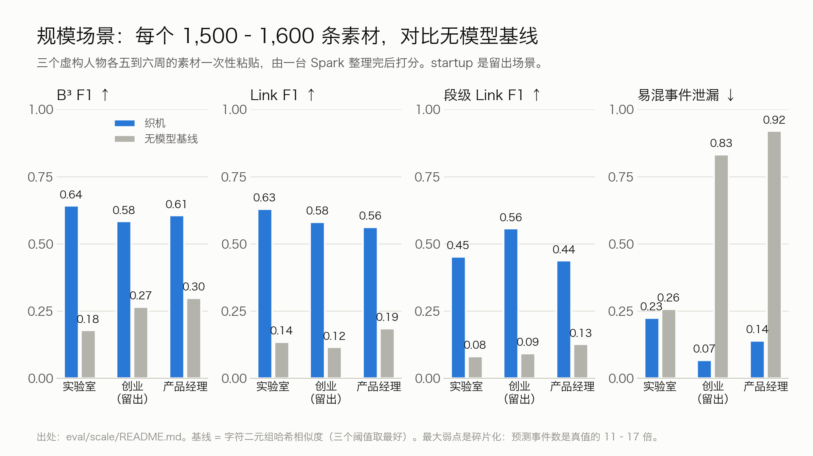
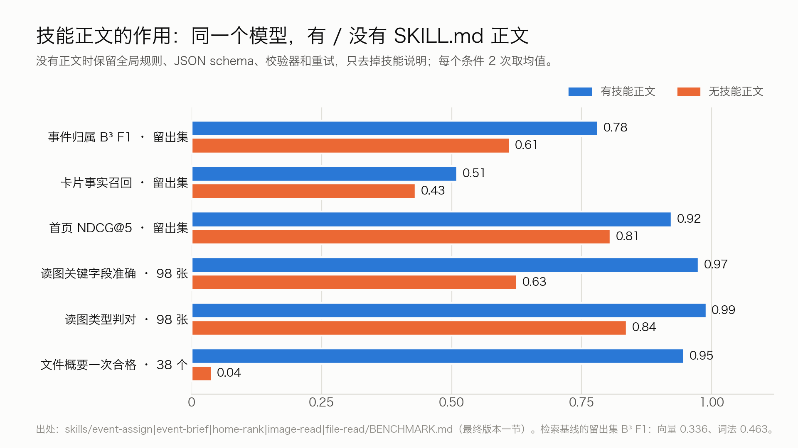
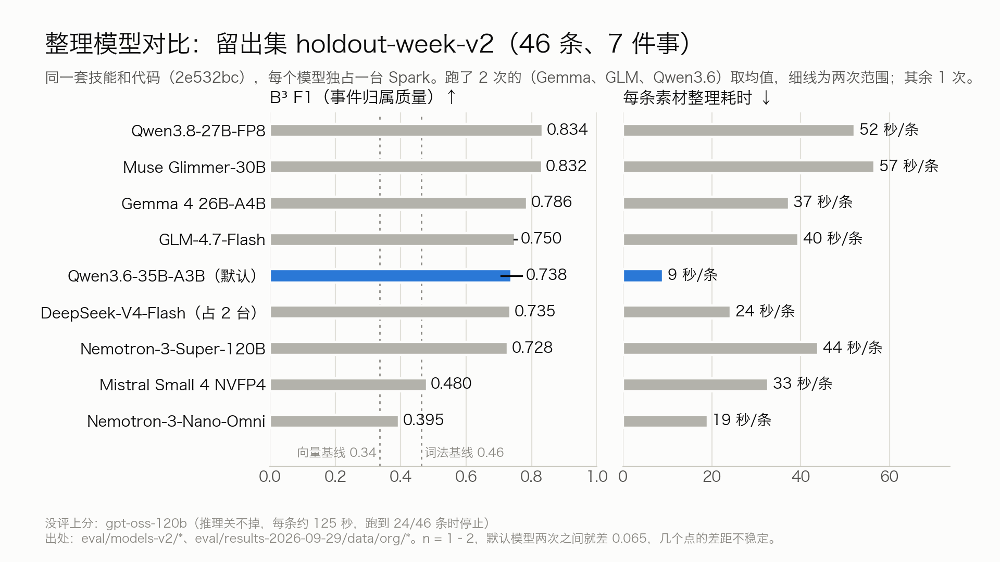
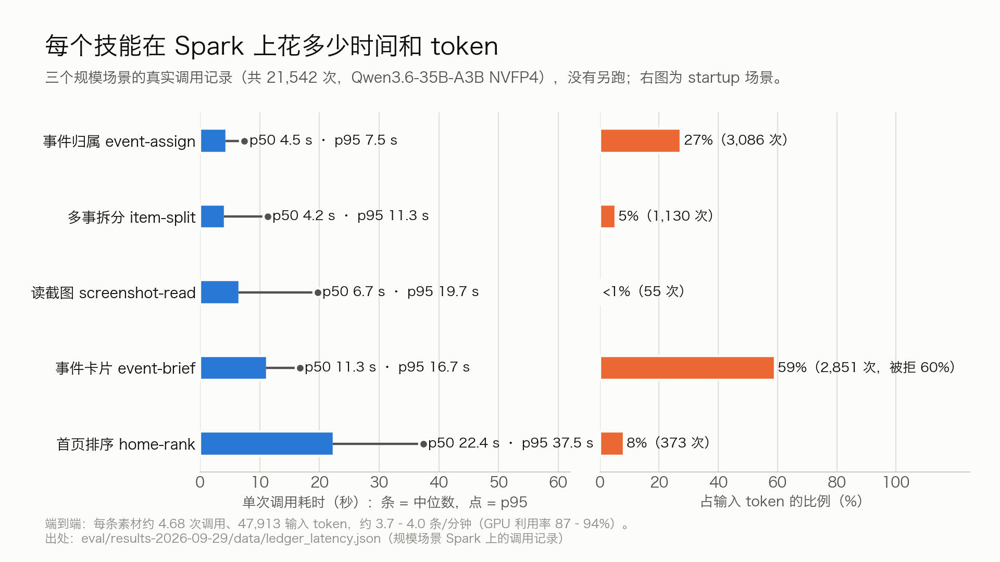
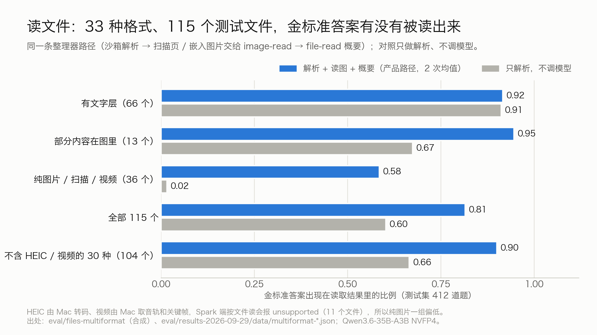
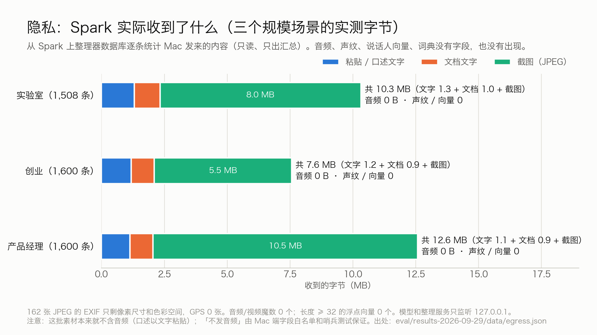

# 评测（截止时的版本，2026-09-29）

> 这是提交截止（标签 `submitted-2026-09-29`）时的评测，数字没有改动，留作对照。v6 的评测（定期整理事件、人物整理、隐私 v6、手机）见 [EVALUATION.md](EVALUATION.md)；那里的 §8–§10、§13 照抄了本文的相应结果。

全部评测结果放在一处，每个数字都给出处。机器可读版本是 [eval/results-2026-09-29/eval.json](../eval/results-2026-09-29/eval.json)，新做的测量、脚本和每次运行的分数在 [eval/results-2026-09-29/](../eval/results-2026-09-29/README.md)；各 Skill 的逐版本记录在各自的 `BENCHMARK.md`。

**口径**

- **数据**：Spark 上的评测全部用合成数据（虚构的人、公司、单号）。Mac 端识别和整理的数字来自用户自己的口述，这里只引用聚合结果。
- **硬件**：NVIDIA DGX Spark（GB10，121 GiB 统一内存），vLLM 0.30.0；Mac 是 Apple Silicon。
- **n 很小**：留出集只有 46 条，大多数条件只跑 1–2 次。默认模型在同一份代码上跑两次，B³ F1 就差 0.065，几个点的差距不能当结论。
- **代码版本**：「最终版本」指提交评测时的代码 13c3ae1（event-assign 2.1.0、event-brief 1.4.0、home-rank 1.3.0，还没有 item-split）；模型对比都在 2e532bc 上跑（又加了 item-split 1.1.1 和 image-read 1.0.0）。两者的数字不能直接比。

**指标**

| 指标 | 一句话 |
|---|---|
| B³ F1 | 对每条素材，看和它分在一起的是不是真该在一起（精确率）、该在一起的是不是都在一起（召回），取调和平均；衡量分组，0–1，越高越好 |
| Link F1 | 先把预测的事和真事一对一配对，再看每条素材是否挂在配对的那件事上；段级 Link F1 按拆出的段算 |
| 易混事件泄漏（难 / 易） | 刻意写得很像的两件事被并到一起的比例，越低越好 |
| 卡片事实召回 | 金标准事实有多少被写进卡片；不判断多写的内容对不对 |
| NDCG@5 | 首页前 5 件事的顺序和金标准重要度的一致程度，0–1 |
| R@5 | 正确的事在不在检索出的前 5 个候选里；event-assign 只在这 5 个里选，所以它是归属准确率的上限 |
| ECE | 预测置信度和实际准确率平均差多少，越小说明置信度越可信 |
| CER / DER | 字错率 / 说话人分离错误率 |

## 一页结论

| 问题 | 结论 | 数字 |
|---|---|---|
| 整理比无模型的做法好多少？ | 明显更好，但远没到「整理完就对」 | 三个 1,500–1,600 条的场景：B³ F1 0.58–0.64，是字符相似度基线的 2.0–3.6 倍；Link F1 是基线的 3.0–5.0 倍；startup（留出场景）易混事件泄漏从 0.83 降到 0.07 |
| SKILL.md 正文本身有没有用？ | 有，每个技能上都能量出来 | 同一模型：留出集 B³ F1 0.782 对 0.612；读图关键字段 97.5% 对 62.6%；文件概要一次合格 36/38 对 1–2/38 |
| 用什么模型？ | 默认 Qwen3.6-35B-A3B NVFP4：一台 Spark 同时做文字和读图，最快 | 留出集同代码两次 B³ F1 0.706 / 0.771，每条约 9 秒；Qwen3.8-27B-FP8、Muse Glimmer-30B 到 0.83，但每条 52–57 秒；Gemma 4 26B-A4B 0.786、卡片事实召回最高，每条 37 秒 |
| 有多快、钱花在哪？ | 每分钟约 4 条；卡片技能是最大开销 | 每条素材 4.45–4.68 次模型调用；event-brief 占 59% 的输入 token，其中最后被校验拒掉的调用吃掉全部输入 token 的 34–44% |
| 什么文件都能读吗？ | 30 种格式基本都能读对；HEIC 和视频要靠 Mac 先处理 | 33 种格式 115 个测试文件：答案出现在读取结果里 0.82 / 0.81；去掉 HEIC 和视频后 0.91 / 0.89；只解析、不调模型 0.60 |
| 隐私是不是真的？ | 三个规模场景实测：Spark 只收到文字和截图 | 每个场景 7.6–12.6 MB；音频 0 B，浮点向量 0 个，截图 EXIF 里没有 GPS（0/162） |
| 最大的问题 | 碎片化、人物、拆分过度 | 预测事件数是真值的 11–17 倍；人物关联 0.23–0.26；item-split 把 22–33% 的单件事素材切开 |

## 场景

| 场景 | 规模 | 用途 |
|---|---|---|
| `dev-week-v1` | 82 条、9 件事、4 条噪声、4 个检查点 | 开发集，用来改技能 |
| `holdout-week-v1` | 32 条、5 件事 | **已污染**（写技能的代理事先读过），只作参考 |
| `holdout-week-v2` | 46 条、7 件事（2 个难干扰）、4 条噪声、42 条事实、6 个检查点 | 由没看过技能的代理盲写，`FROZEN.sha256` 冻结；已评过多次（第一次评测、最终评测、两轮模型对比），不再是完全没见过的数据，但没有据此改过任何技能或提示 |
| `scale-lab` / `scale-startup` / `scale-pm` | 1,510 / 1,600 / 1,600 条，22 / 20 / 21 件事，五 / 六 / 六周 | 大模型在多台 Spark 上生成，金标准来自确定性计划；startup 是留出场景；各跑一次 |
| `split-dev` | 51 条 | item-split 的调参集 |
| `files-v1` / `files-multiformat` | 60 个文件（20 类模板）/ 165 个文件（33 种格式、595 道问答） | 读文件 |
| `mm-v1` | 98 张测试图 | 读图 |

## 1. 用了哪些模型，在哪跑

| 功能 | 默认模型 | 在哪 | 关键数字 | 出处 |
|---|---|---|---|---|
| 口述识别 · 终稿 | Qwen3-ASR 1.7B 8-bit（MLX）＋用户确认的 41 条词表 | Mac | CER 3.74%（240 条口述），英文词召回 30/41，松手到插入 P50 545 ms / P90 635 ms | [DICTATION_ARCHITECTURE](../mac/DICTATION_ARCHITECTURE.md) |
| 口述识别 · 实时稿 | SenseVoice small int8（Core ML） | Mac | CER 5.75%，解码中位 150 ms | 同上 |
| 口述整理 | 规则＋Qwen3-0.6B 8-bit LoRA＋忠实度护栏 | Mac | 对校对稿精确率 98.12%，生成中位 193 ms，630 MB | 同上 |
| 说话人 / 人物 | FluidAudio 0.15.5＋fluid-speaker-diarization-coreml | Mac | AMI 公开真人留出集：说话人混淆 2.07%，已知人误认 0，错误合并 0 | [IMPLEMENTATION_STATUS](../mac/IMPLEMENTATION_STATUS.md) |
| 翻译 | macOS 系统翻译（端上） | Mac | 未测 | — |
| 事件归属、卡片、首页、拆段 | Qwen3.6-35B-A3B NVFP4（vLLM，MTP×3，fp8 KV） | 你的 Spark | 留出集 B³ F1：最终版本 0.782（n=2）；当前代码两次均值 0.738 | 各 `BENCHMARK.md`；第 4 节 |
| 读图 image-read | 同一个 Qwen3.6 | 你的 Spark | 98 张测试图：类型判对 98–100%，关键字段 96.2% / 98.8% | [image-read](../skills/image-read/BENCHMARK.md) |
| 读文件 file-read | 解析是确定性代码（沙箱，无模型）；图片部分和概要用同一个 Qwen3.6 | 你的 Spark | 第 9 节 | [file-read](../skills/file-read/BENCHMARK.md) |
| 候选检索 | Qwen3-Embedding-0.6B | 你的 Spark | 候选 R@5：dev 98.6%、留出 100%、压力池 98.1%；单条 25 ms | [eval/retrieval](../eval/retrieval/README.md) |

模型选型的完整理由见 [MODELS.md](MODELS.md)。

## 2. 规模场景：三个人，各 1,500–1,600 条

三个虚构人物（实验室研究生、创业公司 CTO、大厂产品经理），每人五到六周的素材（lab 2026-08-17 至 09-20；startup 08-17 至 09-25；pm 08-10 至 09-20）由 Mac 端 harness 一次性粘贴进去，一台 Spark 整理完，再用同一套评分器打分。基线是不调模型的字符二元组相似度（三个阈值里取最好）。出处 [eval/scale/README.md](../eval/scale/README.md)。

| 指标 | lab（dev） | startup（**留出**） | pm（dev） |
|---|---|---|---|
| 素材 / 真事件 / 真人物 | 1,510 / 22 / 36 | 1,600 / 20 / 43 | 1,600 / 21 / 42 |
| **B³ F1**（P / R） | **0.642**（0.708 / 0.588） | **0.584**（0.678 / 0.514） | **0.606**（0.679 / 0.547） |
| 基线 B³ F1 | 0.179 | 0.266 | 0.299 |
| **Link F1**（基线） | **0.630**（0.136） | **0.582**（0.116） | **0.563**（0.186） |
| 段级 Link F1（基线） | 0.453（0.083） | 0.557（0.094） | 0.438（0.127） |
| 易混事件泄漏：难 / 易 ↓（基线） | 0.225 / 0.085（0.258 / 0.240） | **0.068** / 0.334（0.833 / 0.809） | 0.140 / 0.091（0.920 / 0.889） |
| 噪声：未归入 / 自成一件 / 混进真事 | 0.610 / 0.276 / 0.114 | 0.317 / 0.583 / 0.100 | 0.430 / 0.523 / 0.047 |
| 事件数：预测 / 真 | 242 / 22 | 348 / 20 | 227 / 21 |
| 人物关联（退化口径） | 0.255 | 0.232 | 0.244 |
| 卡片事实召回 | 0.489 | 0.583 | 0.652 |
| 首页 NDCG@5（只按时间） | 0.128（0.206） | 0.351（0.279） | 0.343（0.336） |
| 吞吐（条/分钟） | 4.00 | 3.85 | 3.71 |
| GPU 利用率均值 | 93.6% | 94.1% | 87.0% |

- **比基线好很多**：B³ F1 是基线的 3.6 / 2.2 / 2.0 倍，Link F1 是 3.0–5.0 倍。
- **易混的事**：startup 和 pm 的基线几乎把所有易混事件都混在一起（0.83–0.92），织机降到 0.07–0.14；lab 几乎没有改善（0.258 → 0.225），8 对易混种子只分开了 1 对。
- **最大的问题是碎片化**：预测事件数是真值的 11–17 倍，只有 1 条的事件有 109–233 件。精确率（0.68–0.71）明显高于召回（0.51–0.59）：宁可拆开，不乱合并。
- **人物是第二弱项**：同名加英文后缀的记录没合并，代码里的 `ValueError` 被当成人。
- **首页排序扛不住规模**：lab 的 NDCG@5 0.128 还低于只按时间排（0.206）；小留出集上是 0.92（第 3 节）。
- **lab 的离线合并实验**（实验分支，未进入这个快照）：事件数 242 → 184，B³ F1 0.642 → 0.660，碎片化只缓解了一部分。

## 3. SKILL.md 正文到底有没有用

「没有正文」= `eval_common.strip_skill_text`：同一个模型，保留全局规则、JSON schema、校验器和重试，只把 SKILL.md 正文换成一行任务名。它量的是技能说明文字本身的贡献，不是整个架构对裸模型的优势。出处：各 Skill `BENCHMARK.md` 的「最终版本」一节。

| 技能 | 指标 | 数据 | 有正文 | 无正文 | 备注 |
|---|---|---|---|---|---|
| event-assign | B³ F1 | 留出集 46 条 | **0.782**（0.782 / 0.782） | 0.612（0.575 / 0.649） | 检索基线：向量 0.336、词法 0.463 |
| event-assign | B³ F1 | dev 82 条 | **0.748** | 0.673 | |
| event-assign | 首次输出合规 | 留出集 | 45/46、45/46 | 38/46、37/48 | |
| event-brief | 卡片事实召回 | 留出集 | **0.511** | 0.431 | dev 0.750 对 0.644 |
| event-brief | 一次重试后被接受 | 留出集 | 59/86 | 27/84 | 卡片里没出处的日期：两者都是 0 |
| home-rank | 首页 NDCG@5 | 留出集 | **0.923** | 0.806 | 只按时间 0.886；dev 上不稳定 |
| image-read | 关键字段准确 | 98 张测试图 | **97.5%**（96.2 / 98.8） | 62.6%（65.7 / 59.4） | CER 1.6% 对 23.1% |
| image-read | 类型判对 | 98 张测试图 | **99.0%** | 83.7% | |
| file-read | 概要一次合格 | 38 个有文字的文件 | **36/38** | 1–2/38 | 没有正文时时延翻倍 |
| item-split | 切不切判断 / 段 F1 | split-dev（调参集） | 1.000 / 0.937 | 未测 | 偏乐观；规模数据上的结果见第 6 节 |
| recall | — | — | 未测 | — | 占位，没有接进路由 |

正文主要提高召回（把该放一起的放一起）和一次合格率；没有正文时模型更保守（精确率 0.94–0.96、召回 0.41–0.50），更多输出被校验器拒掉。

**各技能自带的可执行用例**：`skills/*/evals/evals.json` 里的 30 个用例（全部来自 dev 或虚构），用当前代码和 Qwen3.6 每个跑 3 次（`eval/run_skill_evals.py --n 3`）。结果 [skill-evals-main-n3.json](../eval/results-2026-09-29/data/skill-evals-main-n3.json)。

| 技能 | 用例 | 3 次全过 | 通过次数 | 没全过的用例 |
|---|---|---|---|---|
| event-assign | 12 | 10 | 31/36 | assign-hd1 0/3（妈妈家漏水请店里的装修师傅，3 次都归进了「店面翻新」）、assign-hd4 1/3 |
| event-brief | 5 | 3 | 12/15 | brief-009 1/3（把「今天下午验收」写成「已验收」，被校验器拒掉）、brief-010 2/3 |
| home-rank | 5 | 5 | 15/15 | — |
| item-split | 8 | 7 | 22/24 | split-005-injection 1/3 |
| **合计** | **30** | **25** | **80/90** | |

三个提示词注入用例里，模型都没有照着注入的指令做；split-005 算失败，是因为有 2 次把那句注入的话单独留成了一段「旁白」，而用例要求直接跳过。

**历史**：早期提示里混入过开发集原话和留出集措辞，审计后换成虚构领域的例子，dev F1 从 0.787 降到 0.740；第一版在同样 400 token 预算下，裸提示 47% 的输出被截断作废。细节在 [event-assign BENCHMARK](../skills/event-assign/BENCHMARK.md)。

## 4. 整理模型对比

所有行都用同一份代码 2e532bc（event-assign 2.1.0、event-brief 1.4.0、home-rank 1.3.0、item-split 1.1.1、image-read 1.0.0）、同一套技能提示、同一个检索模型（Qwen3-Embedding-0.6B），关闭思考，每个模型独占一台 Spark。`eval/run_eval.py --condition skills`。DeepSeek、GLM、gpt-oss 是纯文本模型，它们的图片交给 Qwen3.6 读；Mistral Small 4 为了避开出过问题的 Pixtral 视觉路径，图片也交给 Qwen3.6。46 条里只有 4 条是图片。

**留出集 holdout-week-v2（46 条、7 件事、2 个难干扰）**

| 模型 | 占用 | n | B³ F1 | Link F1 | 卡片事实召回 | 难干扰泄漏 ↓ | 卡片通过校验 | 事件数 预测/真 | 秒/条 |
|---|---|---|---|---|---|---|---|---|---|
| Qwen3.8-27B-FP8 | 1 Spark | 1 | **0.834** | 0.815 | 0.644 | 0.000 | 34/49 | 7/7 | 52.2 |
| Muse Glimmer-30B NVFP4 | 1 Spark | 1 | **0.832** | 0.844 | 0.644 | 0.000 | 15/50 | 10/7 | 56.6 |
| Gemma 4 26B-A4B-it（bf16） | 1 Spark | 2 | **0.786**（0.786–0.786） | 0.826 | 0.684（0.678–0.690） | 0.000 | 32/50、32/50 | 10/7、10/7 | 37.3、37.4 |
| GLM-4.7-Flash（30B-A3B，bf16） | 1 Spark | 2 | **0.750**（0.746–0.755） | 0.660 | 0.425（0.414–0.437） | 0.375（0.333–0.417） | 15/54、16/54 | 12/7、11/7 | 39.3、39.7 |
| Qwen3.6-35B-A3B NVFP4（默认） | 1 Spark | 2 | **0.738**（0.706–0.771） | 0.716（0.710–0.722） | 0.546（0.494–0.598） | 0.083（0.000–0.167） | 33/50、29/50 | 9/7、13/7 | 8.5、9.5 |
| DeepSeek-V4-Flash | 2 Spark（TP2） | 1 | **0.735** | 0.710 | 0.609 | 0.417 | 24/50 | 9/7 | 24.3 |
| Nemotron-3-Super-120B-A12B NVFP4 | 1 Spark | 1 | **0.728** | 0.623 | 0.322 | 0.778 | 12/51 | 7/7 | 44.0 |
| Mistral Small 4 119B NVFP4 | 1 Spark | 1 | **0.480** | 0.453 | 0.310 | 0.215 | 13/53 | 19/7 | 32.8 |
| Nemotron-3-Nano-Omni-30B-A3B NVFP4 | 1 Spark | 1 | **0.395** | 0.354 | 0.207 | 0.000 | 18/59 | 34/7 | 19.0 |

**dev-week-v1（82 条、9 件事）**

| 模型 | n | B³ F1 | Link F1 | 卡片事实召回 | 难干扰泄漏 ↓ | 卡片通过校验 | 事件数 预测/真 | 秒/条 |
|---|---|---|---|---|---|---|---|---|
| Qwen3.8-27B-FP8 | 1 | **0.837** | 0.860 | 0.846 | 0.000 | 68/78 | 12/9 | 36.5 |
| DeepSeek-V4-Flash | 1 | **0.784** | 0.809 | 0.731 | 0.000 | 61/79 | 15/9 | 15.9 |
| Qwen3.6-35B-A3B NVFP4（默认） | 2 | **0.766**（0.759–0.774） | 0.786 | 0.760 | 0.000 | 63/79、64/79 | 14/9、12/9 | 6.3、6.1 |
| Nemotron-3-Super-120B-A12B NVFP4 | 1 | **0.764** | 0.821 | 0.788 | 0.071 | 47/81 | 12/9 | 31.4 |
| Muse Glimmer-30B NVFP4 | 1 | **0.672** | 0.705 | 0.692 | 0.083 | 49/81 | 19/9 | 38.1 |
| Nemotron-3-Nano-Omni-30B-A3B NVFP4 | 1 | **0.365** | 0.382 | 0.423 | 0.095 | 47/86 | 47/9 | 11.2 |

**没能评上分的**

| 模型 | 结果 | 原因 |
|---|---|---|
| gpt-oss-120b（第一次，09-28） | 中止 | 推理关不掉；按技能自己的输出上限（event-assign 400 token），44 个请求里 41 个被截断；671 秒只处理了 dev 82 条里的 10 条 |
| gpt-oss-120b（重试：reasoning low，每次调用输出上限 +2048 token） | 跑到留出集 24/46 条时停止 | 80 个请求全部正常结束（0 个被截断），但 event-assign 平均输出 1,200 token（Qwen3.6 约 200）、event-brief 2,275 token，每条素材 125 秒，约为 Qwen3.6 的 14 倍。已完成部分的分组不差：检查点 cp1（8 条）B³ F1 0.804、cp2（17 条）0.790 |
| Gemma 4 31B-it QAT（w4a16） | 不可用 | 服务能起来，但所有请求（包括纯文本）只输出 token 0，全部 HTTP 500；判断是 W4A16 量化在 GB10 / vLLM 0.30.0 上的问题 |
| Mistral Small 4（第一次） | 起不来 | vLLM 0.30.0 要导入的 Pixtral 函数在 transformers 5 里已改名；第三次在进程内补上两个名字（不改共用 venv）、去掉请求里的 `chat_template_kwargs` 后才跑通 |
| Nemotron-3.5-Lightning-30B-A3B NVFP4 | 起不来 | tokenizer 实例化失败 |

「卡片通过校验」= event-brief 一次重试后被接受的调用数 / 总调用数。「秒/条」= 墙钟 / 素材数，含读图和向量调用。

- **默认模型的真实水平**：同一份代码上，Qwen3.6 留出集两次是 0.771 和 0.706（均值 0.738），dev 两次 0.774 和 0.759。之前文档里的 0.782 来自更早的最终版本代码（没有 item-split），不能拿来和这张表比。
- **更准的两个模型都慢 6 倍左右**：Qwen3.8-27B-FP8 和 Muse Glimmer-30B 在留出集上都到了 0.83，难干扰泄漏都是 0；但每条 52–57 秒，串行处理 1,600 条要 23–25 小时，Qwen3.6 约 4 小时。Muse Glimmer 在 dev 上只有 0.672，留出集卡片只有 15/50 通过校验，不稳定。
- **Gemma 4 26B-A4B-it**：这次最好的新结果，两次很稳，卡片事实召回最高，首页 NDCG@5 0.966 / 0.983，自己读图；代价是每条 37 秒，dev 集没来得及跑。它是 MoE（26B 总参数、4B 激活），bf16 权重一台 Spark 放得下。
- **GLM-4.7-Flash**：分组和默认模型差不多，但难干扰泄漏 0.333 / 0.417，卡片只有 15/54、16/54 通过校验（多是没有原话支持的「已…」和相对日期）。不采用。
- **把整理器的 worker 从 1 调到 4**：46 条留出集上几乎没有变快（7.2 条/分钟，串行两次 7.0 / 6.3），B³ F1 0.797，没有变差；小集合里每个检查点都要等队列清空，并发空间很小。
- **结论**：默认仍是 Qwen3.6-35B-A3B NVFP4。要「慢一点、更准」的选项，Gemma 4 26B-A4B 最值得跟进，换默认之前还要在 dev 和规模场景上验证。

出处：[eval/models-v2/](../eval/models-v2/)（Qwen3.8、DeepSeek、Nemotron 各行）和 [eval/results-2026-09-29/data/org/](../eval/results-2026-09-29/data/org/)（Qwen3.6 同代码重跑、Muse Glimmer、Gemma、GLM、Mistral）；gpt-oss 重试见 [gpt-oss-partial.txt](../eval/results-2026-09-29/data/gpt-oss-partial.txt)；跑 Mistral 和 gpt-oss 用的包装脚本在 [data/runner/](../eval/results-2026-09-29/data/runner/)。

### 模型服务实测（DGX Spark）

| 模型 / 服务 | 实测 |
|---|---|
| Qwen3.6-35B-A3B NVFP4，vLLM + MTP（默认） | 单流输出约 100 token/s；读入 5.7k–7.2k token/s；规模场景 GPU 利用率 87–94% |
| DeepSeek-V4-Flash，vLLM TP2 跨两台 Spark | 输出约 34 token/s，读入 1.4k–2.3k token/s；必须关闭思考 |
| Step3-VL-10B Q8_0，llama.cpp | 原生接口适配（改走 `/completion` 并预填空的思考块）后，同一张截图 70.17 s → 19.16 s |
| Qwen3-Embedding-0.6B，vLLM pooling | 16 条一批 224 条/秒，预留 5.9 GiB |

## 5. 速度和 token：每个技能花多少

没有另跑模型：直接统计三个规模场景 Spark 上整理器数据库的调用记录（共 21,542 次调用，全部是 Qwen3.6-35B-A3B NVFP4）。时延是单次调用从发出到收到（含一次重试）的时间。出处 [ledger_latency.json](../eval/results-2026-09-29/data/ledger_latency.json)。

| 技能 | 调用次数（三场景合计） | p50 / p95（秒） | 平均输入 / 输出 token | 最终被接受 | startup 场景占输入 token |
|---|---|---|---|---|---|
| event-assign | 8,796 | 4.5 / 7.5 | 6,989 / 205 | 99.8% | 27% |
| event-brief | 8,056 | 11.3 / 16.7 | 16,467 / 567 | **42.7%** | **59%** |
| item-split | 3,468 | 4.2 / 11.3 | 3,641 / 191 | 95.7% | 5% |
| home-rank | 1,060 | 22.4 / 37.5 | 16,372 / 1,975 | 99.8% | 8% |
| screenshot-read（规模场景跑在 image-read 之前的代码上） | 162 | 6.7 / 19.7 | 2,825 / 405 | 100% | <1% |

| 端到端 | lab | startup | pm |
|---|---|---|---|
| 条/分钟（墙钟） | 4.01 | 3.85 | 3.71 |
| 每条素材的模型调用 | 4.45 | 4.68 | 4.58 |
| 每条素材的输入 / 输出 token | 49,107 / 1,911 | 47,913 / 2,041 | 46,104 / 1,900 |
| 每条素材的模型调用时间合计 | 35.8 s | 36.7 s | 38.1 s |
| 调用的有效并发 | 2.39 | 2.36 | 2.36 |
| 最后被拒的 event-brief 调用占全部输入 token | **44%** | **40%** | **34%** |

- **最大的可省之处**：event-brief 有 49–64% 的调用最后被校验拒掉（多为没有原话支持的完成说法和相对日期），这些调用吃掉全部输入 token 的 34–44%。被拒时整理器只保留能通过证据规则的部分，否则沿用上一版卡片：代价是卡片滞后，而不是写错。
- 端到端约 4 条/分钟，三个场景各跑了 6.3–7.2 小时。判断归属按顺序逐条做（先到的先放），是瓶颈；卡片、首页、拆段可以并发，有效并发约 2.4。

## 6. item-split：在规模数据上切得太多

之前只在调参集 split-dev 上评过（切不切判断 1.000、段 F1 0.937）。这次直接用三个规模场景里整理器**实际切出的段**对照场景的分段真值，没有另跑模型。脚本 [split_boundary.py](../eval/results-2026-09-29/data/split_boundary.py)，结果 `split-{lab,startup,pm}.json`。

口径：真值的引文按事件分组，一个事件算「一件事」（没有事件的旁白不算）；两件以上就应该切。一件事「被找回」= 有一段（一对一）包含了这件事一半以上的引文字符。段的纯度 = 段里的引文字符中，属于最多那件事的比例。

| 指标 | lab（dev） | startup（**留出**） | pm（dev） |
|---|---|---|---|
| 评分的素材（不含截图） | 1,455 | 1,544 | 1,544 |
| 真值里讲了 ≥2 件事的素材 | 231 | 369 | 425 |
| 切不切判断：准确率 | 0.669 | 0.714 | 0.777 |
| 切不切判断：P / R / F1 | 0.273 / 0.654 / 0.385 | 0.444 / 0.767 / 0.562 | 0.569 / 0.779 / 0.657 |
| **只讲一件事却被切开** ↓ | 32.8% | **30.2%** | 22.4% |
| 多件事的素材里，每件事被找回 | 0.692 | **0.716** | 0.832 |
| 多件事的素材里，所有事都找回 | 0.550 | 0.577 | 0.640 |
| 切出的段的纯度（均值；≥0.9 的比例） | 0.969（91.7%） | 0.933（80.0%） | 0.971（93.6%） |
| 被切开的单件事素材：各段归到同一件事 / 分进 ≥2 件事 | 159 / 223（共 402） | 169 / 174（共 355） | 103 / 136（共 251） |

- 切出来的段是干净的（纯度 0.93–0.97），找回了 69–83% 的「件」。
- **问题是切得太多**：只讲一件事的素材有 22–33% 也被切开了。被切开的这些素材里，49–56% 的段被分进了两件以上的事。过度拆分直接制造了碎片，是第 2 节「事件数是真值 11–17 倍」的来源之一。
- 版本：规模场景跑在更早的代码上。当前代码的 item-split 是 1.2.0，它只在 split-dev 上和 1.1.1 比过（段 F1 0.927 → 0.944，见 [eval/runs/SCALE_QUALITY.md](../eval/runs/SCALE_QUALITY.md)），还没有规模或留出结果。

## 7. 事件卡片 event-brief

| 指标 | 留出集（最终版本，n=2） | 规模场景 lab / startup / pm |
|---|---|---|
| 卡片里素材没给出处的日期 ↓ | **0 / 0** | 0 / 0 / 2 |
| 卡片里的相对日期（「下周」）↓ | 0 / 0 | 8 / 1 / 3 |
| 无原话支持的「已…」说法 ↓ | 1 / 1 | 1 / 6 / 0 |
| 过期事实 | — | 2/47、0/21、0/26 |
| 卡片事实召回 | 0.511 | 0.489 / 0.583 / 0.652 |
| 事实精确率 | **未测** | **未测** |

- 日期换算（`skills/event-brief/scripts/dates.py`）加校验器以后，留出集卡片里的无出处日期从第一次评测的 18 / 22 降到 0 / 0。
- 事实精确率没有测：评分器只看金标准事实有没有写进卡片，不判断卡片里多写的内容对不对。校验器保证每条事实都引用了本事件的素材原话，但「引用对了、总结错了」没有被量化。

## 8. 读图 image-read

整理器里的真实路径（先判 7 类，再按类抽取，校验器拒绝图上找不到的字段和数字；mm-v1 测试集 98 张合成图，n=2）：类型判对 98.0% / 100%，关键字段准确 96.2% / 98.8%，问答可答 99.3%，编造数字 0.9% / 0.5%，单张 p50 4.09 / 3.87 秒。出处 [image-read BENCHMARK](../skills/image-read/BENCHMARK.md)。

读图模型对比（同一套图、中性提示、类型直接给定，测的是「读」，单路）：

| 模型 | CER ↓ | 关键字段准确 | 编造数字 ↓ | 单路 p50 / p90 | 并发 4 | 内存 | 结论 |
|---|---|---|---|---|---|---|---|
| **Qwen3.6-35B-A3B NVFP4（默认）** | 0.3% | 98.6% | 0.5% | **2.64** / 5.13 s | **34.3 张/分** | 49.9 GiB | 默认 |
| Qwen3.8-27B-FP8 | 0.4% | **98.8%** | 0.5% | 10.97 / 21.41 s | 14.3 张/分 | 50.6 GiB | 最准，但慢 4 倍 |
| Muse Glimmer-30B NVFP4 | 0.6% | 97.6% | **0.0%** | 17.81 / 34.85 s | 11.9 张/分 | 58.2 GiB | 不编数字，最慢 |
| Qwen3.6 Q8_0（llama.cpp） | 0.5% | 98.6% | 1.5% | 5.43 / 10.2 s | 10.9 张/分 | 40.8 GiB | 同样准，慢一倍 |
| Step3-VL-10B Q8_0 | 1.2% | 96.6% | 2.0% | 12.55 / 25.07 s | 8.3 张/分 | 16.6 GiB | 图表数据点 89.7% |
| Qwen3-VL-8B Q8_0 | 1.0% | 95.9% | 2.0% | 10.0 / 20.62 s | 11.1 张/分 | 19.2 GiB | 给聊天补了图里没有的时间 |
| Nemotron-3-Nano-Omni NVFP4 | 2.6% | 87.8% | 0.7% | 4.68 / 9.69 s | 25.3 张/分 | 54.3 GiB | 快，不够准 |
| MiniCPM-V-4.6 | 21.3% | 58.1% | 5.2% | 3.18 / 36.77 s | 31.1 张/分 | 29.3 GiB | JSON 合规 88.8% |
| GLM-OCR | 53.6% | 19.1% | 0.3% | 4.13 / 35.88 s | 9.3 张/分 | 35.9 GiB | OCR 模型，不会按 schema 出 JSON |
| PaddleOCR-VL-1.6 | 97.6% | 0.9% | 0.0% | 21.30 / 21.36 s | 11.9 张/分 | 34.9 GiB | JSON 合规 10.2% |

没跑起来的读图模型：Gemma 4 31B QAT（全部 HTTP 500）、Phi-4-reasoning-vision-15B、DeepSeek-OCR-2、Keye-VL-2.0、ERNIE-4.5-VL（依赖或引擎不支持）、Mistral Small 4（Pixtral 导入失败）。原因见 [MODELS.md](MODELS.md)。局限：全是合成图，比真实照片干净；多图、长截图、真实照片、图里的提示词注入都还没有评测集。

## 9. 读文件：33 种格式

`eval/files-multiformat` 是一套 33 种格式、165 个合成文件、595 道带金标准问答的评测集。测试集的 115 个文件逐个送进整理器的真实读取路径（`organizer.file_read.read_file`：沙箱子进程解析 → 扫描页和嵌入图片交给 image-read → file-read 写概要），模型是 Qwen3.6-35B-A3B NVFP4，跑了 2 次，用评测集自带的 `tools/score.py` 打分。驱动 [run_multiformat.py](../eval/results-2026-09-29/data/run_multiformat.py)，结果 `multiformat-*-score.json`。

口径：没有另做问答模型，每道题的「回答」就是整份读取结果（正文＋概要＋字段），所以这里的数是「金标准答案有没有出现在整理器读到的东西里」，是任何基于这份读取结果作答的上限。对照组只做解析、不调模型。

| 分组 | 文件 | 题 | 只解析 | **解析＋读图＋概要**（r1 / r2） | 关键行召回（r1 / r2） |
|---|---|---|---|---|---|
| 有文字层 | 66 | 236 | 0.911 | **0.915** / 0.915 | 0.825 / 0.825 |
| 部分内容只在图里 | 13 | 46 | 0.674 | **0.978** / 0.913 | 0.880 / 0.906 |
| 纯图片 / 扫描 / 视频 | 36 | 130 | 0.015 | **0.592** / 0.577 | 0.495 / 0.466 |
| **全部 33 种** | 115 | 412 | 0.602 | **0.820** / 0.808 | 0.728 / 0.722 |
| 不含 HEIC、MP4、MOV 的 30 种 | 104 | 373 | 0.665 | **0.906** / 0.893 | 0.805 / 0.798 |

- 读图把「部分内容在图里」的文件从 0.67 拉到 0.98，把扫描 PDF、TIFF、JPG、PNG、WebP 从 0 拉到 0.92–1.00。
- **HEIC 和视频（11 个文件）在 Spark 上报「不支持」**：设计如此（Mac 负责把 HEIC 转码，视频由 Mac 取音轨识别、再发最多 12 张关键帧），但这条 Mac 端路径没有在这套评测集上跑过，所以这 3 种格式的产品效果**未测**。
- 较弱的格式：XML 0.20（数值都在属性里，解析器只读出了元素文字，属性值丢了，是可以直接修的解析缺陷）；GIF 0.47（缺的答案都在第 2、3 帧，只读了首帧）；SVG 0.75；ICS 0.87。
- 两次运行之间的差别都来自读图，纯解析部分两次完全相同。0 个文件崩溃；单个文件 p50 1.5–1.6 秒、p90 8.9 秒。

file-read 自己的评测集 files-v1（20 类模板、40 个测试文件，n=2）：类型 40/40，解析文字召回 100%，图片部分召回 100%，概要一次合格 36/38，p50 7.4 / 7.8 秒。出处 [file-read BENCHMARK](../skills/file-read/BENCHMARK.md) 和 [FILE_READ.md](FILE_READ.md)。

## 10. 候选检索和 System One

**候选检索**（event-assign 只在前 5 个候选里选，所以 R@5 是归属准确率的上限）：

| 向量 | R@5 dev / 留出 / 压力池 | 单条 p50 | 内存 |
|---|---|---|---|
| **Qwen3-Embedding-0.6B（默认）** | 98.6% / 100% / 98.1% | 25 ms | 5.9 GiB |
| Qwen3-Embedding-4B | 100% / 100% / 99.0% | 43 ms | 18.7 GiB |
| 字二元组哈希（词法） | 92.8% / 97.1% / 76.0% | 0.03 ms | 0 |
| 不用向量 | 78.3% / 88.6% / 59.6% | — | — |

更严格的 item 级检索（R@5 dev / 留出）：Qwen3-VL-Embedding-8B 0.868 / 0.854，Nemotron-3-Embed-8B 0.795 / 0.835，默认 0.6B 0.798 / 0.839。出处 [eval/retrieval](../eval/retrieval/README.md)、[eval/models-v2/embeddings/](../eval/models-v2/embeddings/)。

**System One**（一次前向给出「归哪件事 / 新事 / 不是事」的校准概率；只做评测，默认关闭）。数据由 Spark 生成，微调和校准也在 Spark 上做。TEST 共 1,953 个判断，τ 在 VALIDATION 上按 ≥ 97% 精确率选定后冻结：

| 模型 | TEST 准确率 | ECE | 快路径覆盖 | 快路径精确率 |
|---|---|---|---|---|
| 只取检索第一名 | 77.3% | 0.227 | 0.0% | – |
| 25 维检索特征逻辑回归 | 84.0% | 0.038 | 65.6% | 97.3% |
| Laya（mmBERT-base）零样本 / 微调 | 4.2% / 14.1% | 0.132 / 0.005 | 1.0% / 1.7% | 30.0% / 20.6% |
| Qwen3-Reranker-0.6B 微调（按 VALIDATION 选出） | 76.9% | 0.021 | 46.6% | 97.4% |

微调的 reranker 校准保住了，但没有超过只取检索第一名；不看文字的检索特征逻辑回归反而最好。结论：快判断的信号在检索特征里，不在模型大小，所以没有接进整理器。详见 [eval/system_one/RESULTS.md](../eval/system_one/RESULTS.md)。

## 11. Mac 端：识别、整理、说话人

口述识别（240 条用户自己的口述，其中 48 条逐字校对；同一口径重算）：

| 识别器 | CER | 英文词召回 | 解码中位 |
|---|---|---|---|
| **Qwen3-ASR 1.7B 8-bit＋41 条词表（终稿）** | **3.74%** | **30/41** | 939 ms |
| 同模型 bf16（H100 参考） | 3.78% | 29/41 | 710 ms |
| FireRedASR2-AED（75 条子集） | 4.07% | 6/10 | 1,367 ms |
| Fun-ASR-Nano-2512 | 4.69% | 27/41 | 396 ms |
| SenseVoice small int8（实时稿） | 5.75% | 24/41 | 150 ms |

- 修掉 MLX 端特征提取的 bug 后，CER 从 3.20% 降到 2.71%，英文词召回从 68% 升到 76%（40 条校对稿，另一组真值，不能和上表直接比）。
- 松手到文字插入：P50 545 ms、P90 635 ms（24 次真实口述）。口述时常驻 5.17 GB，空闲 10 分钟后释放到 0.93 GB。
- 否决过的方向：用个人历史做 ASR LoRA（CER 2.57% → 8.43%），自动选词表（4.06% 对手选的 3.74%）。

说话人（公开 AMI 真人留出集）：说话人混淆 2.07%，已知人误认 0，错误合并 0，已知查询 15/16，未知拒绝 16/16，RTF 0.0056，峰值内存 0.71 GB；**DER 24.93%、JER 31.78% 偏高**，记为局限。说话人任务在录完之后离线跑；16 GB 机型的发布门槛未测。出处 [IMPLEMENTATION_STATUS](../mac/IMPLEMENTATION_STATUS.md)、[DICTATION_ARCHITECTURE](../mac/DICTATION_ARCHITECTURE.md)。

## 12. 隐私：Spark 实际收到了什么

在三个规模场景的 Spark 上只读打开整理器数据库，逐条统计 Mac 发来的内容（Spark 自己切出的段不算）：每种素材的条数和字节数、图片的格式和大小、所有二进制是否有音视频文件头（RIFF / OggS / fLaC / ID3 / audio / video）、字段里有没有长度 ≥32 的浮点向量（声纹会是这种形状）、JPEG 里还剩哪些 EXIF 标签。脚本 [egress.py](../eval/results-2026-09-29/data/egress.py)、[exiftags.py](../eval/results-2026-09-29/data/exiftags.py)，只打印汇总。

| 场景 | 收到的素材 | 文字 | 文档文字 | 截图 | 音视频文件头 | 浮点向量 | EXIF 里的 GPS |
|---|---|---|---|---|---|---|---|
| lab | 1,508 | 1.31 MB | 1.02 MB | 52 张 8.0 MB | 0 | 0 | 0/52 |
| startup | 1,600 | 1.19 MB | 0.91 MB | 55 张 5.5 MB | 0 | 0 | 0/55 |
| pm | 1,600 | 1.13 MB | 0.91 MB | 55 张 10.5 MB | 0 | 0 | 0/55 |

- 截图都是 JPEG（最大 0.41 MB），EXIF 里只剩像素尺寸和色彩空间：没有 GPS、没有设备型号、没有拍摄时间。
- 模型服务在 Spark 上只监听 127.0.0.1，整理服务用回环端口或本地 Unix socket，Mac 只能经你自己的 SSH 隧道访问。
- **这组数字能说明什么**：这批规模素材本来就没有音频（口述以文字粘贴，会议是转写文件），所以「音频 0 字节」在这里不算证明。「音频、声纹、词典不离开 Mac」靠的是：Mac 的发送类型根本没有这些字段；哨兵测试断言报文里一个都没有；另有测试保证开发期的链路永远指不到真实资料库。见 [PRIVACY.md](PRIVACY.md)。

## 13. 弱点和没测的

1. **碎片化**：规模场景里预测事件数是真值的 11–17 倍；item-split 把 22–33% 的单件事素材切开（第 6 节）。
2. **人物**：人物关联只有 0.23–0.26（退化口径）；三个场景都没有在同名异人的地方提问。
3. **首页排序扛不住规模**：小留出集 NDCG@5 0.92，规模场景 0.13–0.35，lab 还不如只按时间排。
4. **卡片校验太严**：49–64% 的 event-brief 调用最后被拒，白白用掉 34–44% 的输入 token。
5. **样本小、方差大**：留出集 46 条；默认模型同代码两次 B³ F1 差 0.065；大多数候选模型只跑了 1–2 次。
6. **两个可以直接修的读文件缺陷**：XML 属性值没读出来；GIF 只读了首帧（Mac 发了最多 3 帧，但 Spark 的素材定义里没有这个字段）。
7. **难干扰和提示词注入还有漏网**：技能自带用例里，「妈妈家漏水请店里的装修师傅」3 次都被并进了店面翻新；拆分技能有 2/3 次把一句注入的话留成了旁白段（没有照做，但也没丢掉）。
8. **没测的**：事件卡片的事实精确率；HEIC 和视频在 Mac 端的完整路径；真实照片和真实文件；recall 技能；系统翻译的质量；16 GB Mac 的识别和说话人门槛。
9. **只有合成数据**：Spark 上没有任何真实用户数据的评测（隐私规则要求如此），合成数据比真实数据干净。

## 14. 文件和复现

| 位置 | 内容 |
|---|---|
| [eval/results-2026-09-29/](../eval/results-2026-09-29/README.md) | 本文全部数字（`eval.json`）、新做的测量结果、脚本、图表脚本 |
| [eval/scale/README.md](../eval/scale/README.md) | 三个规模场景的完整分数、诊断和 lab 合并前后 |
| 各 Skill 的 `BENCHMARK.md` | 每个版本的结果、命令和提示哈希；「最终版本」一节是对外引用的数字，更早的版本保留并标成「历史」 |
| [eval/runs/](../eval/runs/) | 小场景各次运行的 `score.json`、`stats.json`、`meta.json`（早期运行还有检查点快照）；汇总 `final-summary.json` |
| [eval/models-v2/](../eval/models-v2/) | 候选模型对比：每个模型的汇总、打分、服务参数和失败原因 |
| [eval/system_one/RESULTS.md](../eval/system_one/RESULTS.md) | System One 的数据、训练、校准、服务和结果 |
| [eval/README.md](../eval/README.md) | 场景、驱动、评分指标的定义和用法 |

含完整输入的逐次调用日志和数据库留在 Spark 上，没有入库（只有合成数据）。
