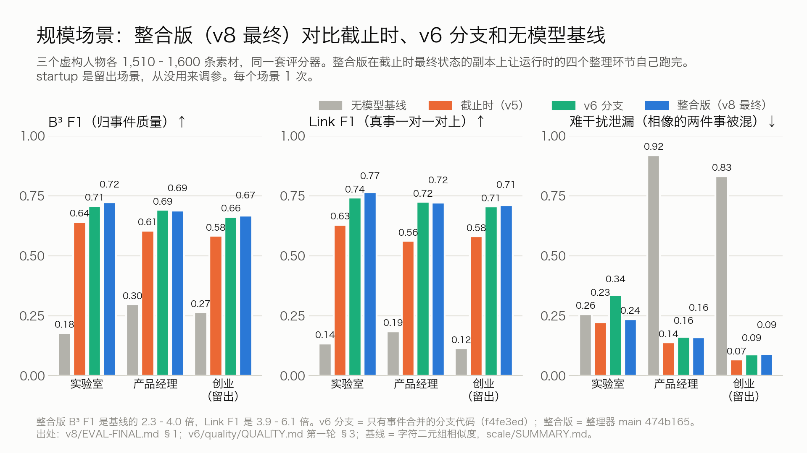
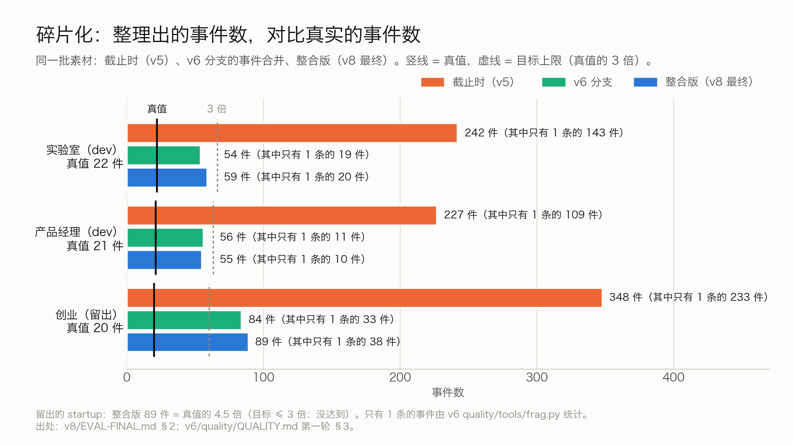
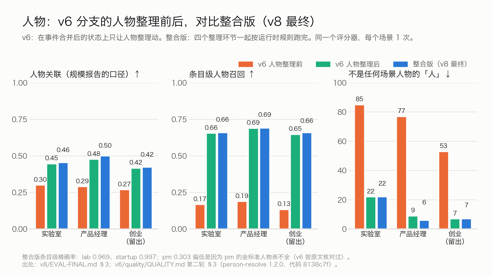
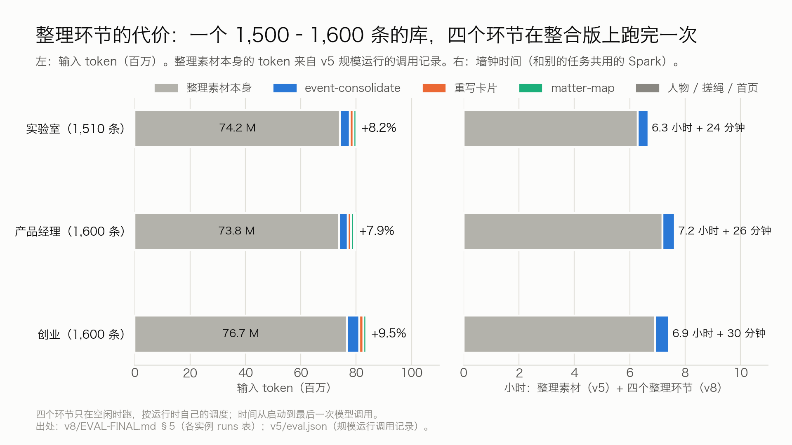
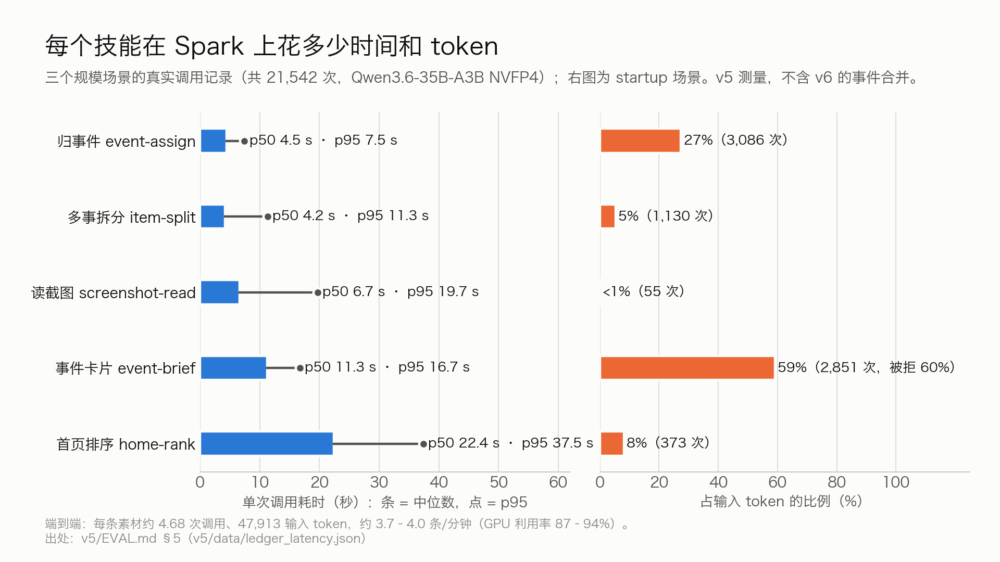
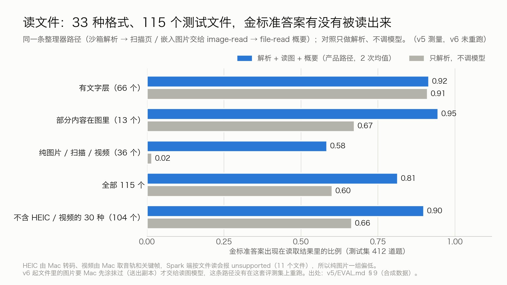
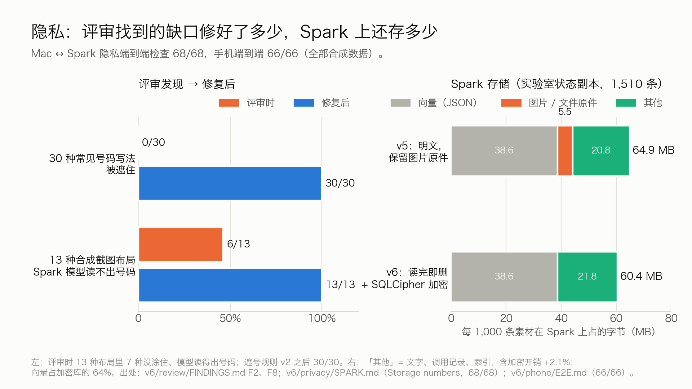
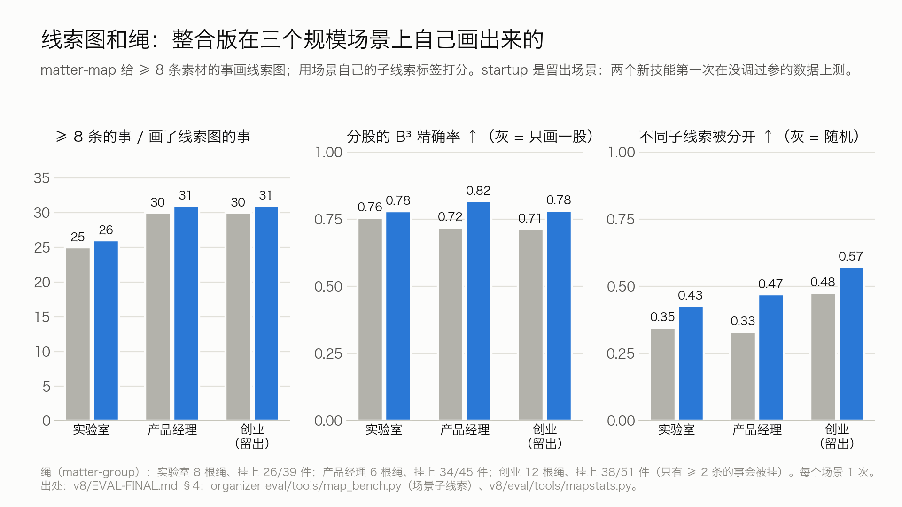

# 评测（v6，2026-09-30；规模场景 2026-10-01 在整合版上重跑）

这份文档把提交之后（v6）新做的测量和截止时仍然有效的结果放在一起，每个数字都给出处。机器可读版本是 [eval/results-2026-09-30/eval.json](../eval/results-2026-09-30/eval.json)（下文写成 `eval.json` 加键名），整合版上的测试和端到端在 [eval/results-2026-09-30/integration.json](../eval/results-2026-09-30/integration.json)；图由 [eval/results-2026-09-30/data/make_charts.py](../eval/results-2026-09-30/data/make_charts.py) 从 `eval.json` 画出。2026-10-01 在合并后的整体版本上重跑了三个规模场景（§1、§2、§5、§7 和新的 §17），新数字在 [eval/results-2026-10-01/eval.json](../eval/results-2026-10-01/eval.json) 的 `final_v8`（其余各节和 v6 的 `eval.json` 相同），图由 [eval/results-2026-10-01/data/make_charts.py](../eval/results-2026-10-01/data/make_charts.py) 画出。截止时的完整评测（读图、候选检索、System One、识别器对比等）原样留在 [EVALUATION-2026-09-29.md](EVALUATION-2026-09-29.md)。

**口径**

- **数据**：Spark 上的评测全部用合成数据（虚构的人、公司、号码）。手机端到端用的是 iOS 模拟器里的合成素材。Mac 端的识别数字是截止时的结果，来自用户自己口述的聚合统计。
- **硬件和模型**：NVIDIA DGX Spark（GB10，121 GiB 统一内存），vLLM 0.30.0。v6 所有整理器数字都用 Qwen3.6-35B-A3B NVFP4（关闭思考，temperature 0）和 Qwen3-Embedding-0.6B。
- **n 很小**：运行时的事件合并每个规模场景只跑了 1 次；遮号评测每个条件 5 次；小留出集只有 46 条。同一设计两次运行之间 B³ F1 就能差 0.01–0.02（规模场景）到 0.065（46 条的留出集），几个点的差距不能当结论。
- **代码**：每组数字在各自的分支上测得（事件合并和人物在整理器的 `claude/quality-v6`，隐私在两边的 `claude/privacy-v6`，手机在 `claude/phone-v6` / `claude/phone-link-v6`），`eval.json` 的 `meta.code` 写了具体提交。三条分支随后合进了整理器的 `main` 和 Mac 客户端的 `hackathon/base`。规模场景（§1、§2、§5、§7、§17）的数字已在合并后的整体版本上重跑（2026-10-01，整理器 `main` 474b165，四个整理环节一起按运行时调度跑，每个场景 1 次）；其余各节仍是各自分支上的测量。
- 标「截止时」的小节是 2026-09-29 的结果，v6 没有重测，数字照抄 [EVALUATION-2026-09-29.md](EVALUATION-2026-09-29.md)（`eval.json` 的 `v5_carried_over`）。

**指标**：B³ F1 衡量分组（和一条素材分在一起的是不是真该在一起、该在一起的是不是都在一起，0–1，越高越好）；Link F1 先把预测的事和真事一对一配对，再看每条素材是否挂在配对的那件事上；难干扰泄漏是刻意写得很像的两件事被并到一起的比例（越低越好）；卡片事实召回是金标准事实有多少写进了卡片。完整定义见 [EVALUATION-2026-09-29.md](EVALUATION-2026-09-29.md) 开头。

## 一页结论

| 问题 | 结论 | 数字（出处见各节） |
|---|---|---|
| 整理比无模型的做法好多少？ | 加了事件合并以后，三个规模场景都更好了，留出场景也一样；整合版和 v6 分支基本一样 | 三个 1,510–1,600 条的场景 B³ F1（整合版）：lab 0.642 → **0.724**、pm 0.606 → **0.689**、startup（留出）0.584 → **0.668**（v6 分支 0.709 / 0.692 / 0.663，演示副本 0.660 → 0.712）；是无模型基线（0.179 / 0.299 / 0.266）的 **2.3–4.0 倍**；Link F1 **0.711–0.766**，是基线的 3.9–6.1 倍（§1） |
| 截止时最大的问题「碎片化」解决了吗？ | 大部分解决了，留出场景还差一点 | 事件数 **59 / 55 / 89**，真值 22 / 21 / 20（截止时 242 / 227 / 348）；只有 1 条的事件 **20 / 10 / 38**（截止时 143 / 109 / 233）。目标「≤ 真值 3 倍」：两个 dev 场景达到，留出的 startup 是 **4.45 倍**，没达到（§2） |
| 合并有代价吗？ | 有：精确率没提高，相像的事偶尔被合在一起 | B³ 的提高几乎全部来自召回；v6 分支 lab 的难干扰泄漏 0.225 → 0.338（一件演示被并进了它演示的实验），整合版这次没并（**0.237**），护栏没变；噪声混进真事 lab 0.114 → **0.133**、startup 0.100 → **0.225**（§1） |
| 多事拆分还切得太多吗？ | 少了约三分之一到一半，找回的件数不变 | 只讲一件事却被切开：lab 32.8% → **20.6%**、pm 22.4% → **10.6%**、startup（留出）30.2% → **17.7%**（只切不归的重放，item-split 1.1.1 → 1.3.0）；留出场景完整运行 27.9% → **13.5%**；每件事被找回 0.69–0.83，基本不变（§4） |
| 人物 | 明显变好，但仍是弱项 | 人物关联（整合版）**0.455 / 0.501 / 0.424**（截止时 0.255 / 0.244 / 0.232，v6 分支 0.447 / 0.477 / 0.417）；条目级人物召回 0.13–0.19 → **0.66–0.69**，精确率 lab 0.969、startup 0.997；显示的「人」里不是任何场景人物的 85 / 77 / 53 → **22 / 6 / 7**（§5） |
| 小留出集（46 条）上是多少？ | 要分清代码和条件 | 截止时的 0.738 是旧代码 2e532bc 两次的均值（0.706 / 0.771）；v6 代码关闭事件合并时两次都是 **0.806**，打开合并两次 0.824 / 0.807，但两次都把一对难干扰合成了一件。所以相对 0.738 的提高主要来自 `main` 上别的改动（item-split 1.2.0、卡片就地修复），**不是**合并带来的（§3） |
| SKILL.md 正文本身有没有用？ | 有（截止时，未变） | 同一模型：留出集 B³ F1 0.782 对 0.612；读图关键字段 97.5% 对 62.6%；文件概要一次合格 36/38 对 1–2/38。v6 新技能的可执行用例：event-consolidate 12/12、item-split 1.3.0 10/10、person-resolve 15/15，每个 3 次全过（§8） |
| 用什么模型？ | 默认仍是 Qwen3.6-35B-A3B NVFP4（截止时，未变） | 留出集同代码两次 B³ F1 0.706 / 0.771，每条 9 秒；更准的 Qwen3.8-27B-FP8、Muse Glimmer-30B 到 0.83，但每条 52–57 秒（§9） |
| 合并贵不贵？ | 只多花 6–8%；四个环节合计 8–10% | 一个 1,500–1,600 条的库（整合版）：event-consolidate 339–473 次调用，连同重写卡片共 4.3–6.0 M 输入 token，是整理这批素材（73.8–76.7 M）的 **5.9–7.8%**；加上人物、线索图、搓绳四个环节合计 **5.8–7.3 M（7.9–9.5%）**，从启动到最后一次调用 24–30 分钟；边整理边合并的完整运行里合并占 6.0–6.3%（§7） |
| 什么文件都能读吗？ | 30 种格式基本都能读对（截止时，未变） | 33 种格式 115 个测试文件：金标准答案出现在读取结果里 81–82%；去掉 HEIC 和视频后 89–91%（§10） |
| 遮号会不会影响整理效果？ | **测不出影响** | 号码压力集各 5 次：B³ F1 **0.788 ± 0.038**（不遮）对 **0.788 ± 0.013**（遮）；成对调用里归事件决定和不遮号版本相同 **105/111**、和原样再发相同 **104/111**；输入逐字节相同的零效应对照自己就差 0.038（§11.1） |
| 号码遮得全吗？ | 复查列出的写法全覆盖；合成语料上几乎不误遮 | 遮号规范第 2 版覆盖复查列出的 **30/30** 种常见写法（修复前 0/30）；合成语料上被遮的 1,303 处里 1,302 处该遮（第 1 版规则）；整合版用第 3 版，200 条共享向量在 Swift 和 Python 里逐字节一致（§11.2） |
| 截图里的号码呢？ | 复查用的 13 种布局现在都涂住了 | 修复前 13 种合成布局里 7 种 Spark 的读图模型读得出号码；修复后 **13/13** 读不出（§11.3） |
| 端到端是真的吗？ | 整合版上两条端到端都全过 | Mac ↔ Spark 隐私端到端 **68/68**；iPhone（模拟器）→ 跳板机 → Spark → Mac 的手机端到端 **67/67**（前三次没全过，找到并修了两个 Mac 端的 bug）（§11.4、§12） |
| Spark 上存多少？ | 读完即删、加密以后每 1,000 条约 60 MB | 每 1,000 条素材 64.9 MB → **60.4 MB**；图片和文件原件 8.3 MB → 0；SQLCipher 开销 +2.1%；最大的是 JSON 形式的向量（加密库的 64%）（§11.5） |
| 线索图和绳在规模数据上能用吗？ | 能画出来、证据都对得上；分股只比画一股好一点；绳每次不一样 | 整合版：线索图 26 / 31 / 31 张（≥ 8 条的事全部画了），0 张被丢弃；分股 B³ 精确率 0.780 / 0.818 / 0.782，只画一股 0.756 / 0.719 / 0.714；绳 8 / 6 / 12 根；牵制只出现 1 条，而且连错了对象（§17） |
| 最大的问题 | 见 §15 | 留出场景事件数仍是真值 4.45 倍；相像的两件事会被合并；人物只查已知名字；每个场景只跑了 1 次；**没有在真 iPhone 上测过** |

---

## 1. 规模场景：加了事件合并之后（整合版上重跑）

三个虚构人物（实验室研究生、创业公司 CTO、大厂产品经理）五到六周的素材，截止时由 Mac 端 harness 一次性粘贴进去、由一台 Spark 整理完（[eval/scale/README.md](../eval/scale/README.md)）。v6 加了一个定期整理的环节（新 Agent Skill [event-consolidate](../skills/event-consolidate/SKILL.md)）：整理器空闲时拿小事件和「事件目录」问模型，关系是 same / part / related 中的哪一种，只有 same 才合并，并有确定性护栏（两边都 ≥ 3 条要二次确认、≥ 20 条的事件只和大小不超过 4 倍的合并、两个 ≥ 10 条的事件名字要有两个共同词、用户动过的事件不动等）。

测法：在截止时规模运行最终状态的**新副本**上起整合版的整理器（整理器 `main` 474b165，v7 整合版，没有改任何代码或提示词），什么也不发，让运行时的四个整理环节——事件合并、人物整理（§5）、线索图和搓绳（§17）——按自己的调度跑，到状态不再变化（游标、队列和四个环节的计数 10 分钟不动），再用同一个评分器打分。「v6 分支」一列是 v6 在 `claude/quality-v6` 上只跑事件合并的结果（同一个状态的另一份副本）。调参只用 lab、pm（dev）；startup 是留出场景，从没用来调过参。出处：[eval/results-2026-10-01/eval.json](../eval/results-2026-10-01/eval.json) 的 `final_v8.scenarios`（v6 分支：`eval.json` 的 `scale_consolidation`）；[skills/event-consolidate/BENCHMARK.md](../skills/event-consolidate/BENCHMARK.md)。

| 指标 | lab（dev） | pm（dev） | startup（**留出**） |
|---|---|---|---|
| 素材 / 真事件 | 1,510 / 22 | 1,600 / 21 | 1,600 / 20 |
| **B³ F1**：无模型基线 / 截止时 / v6 分支 / **整合版** | 0.179 / 0.642 / 0.709 / **0.724** | 0.299 / 0.606 / 0.692 / **0.689** | 0.266 / 0.584 / 0.663 / **0.668** |
| B³ 精确率：截止时 / v6 分支 / 整合版 | 0.708 / 0.679 / 0.710 | 0.679 / 0.683 / 0.686 | 0.678 / 0.665 / 0.666 |
| B³ 召回：截止时 / v6 分支 / 整合版 | 0.588 / 0.740 / 0.738 | 0.547 / 0.702 / 0.692 | 0.514 / 0.661 / 0.670 |
| 整合版 B³ F1 是基线的 | 4.04 倍 | 2.30 倍 | 2.51 倍 |
| **Link F1**：基线 / 截止时 / v6 分支 / **整合版** | 0.136 / 0.630 / 0.743 / **0.766** | 0.186 / 0.563 / 0.725 / **0.723** | 0.116 / 0.582 / 0.706 / **0.711** |
| 难干扰泄漏 ↓：基线 / 截止时 / v6 分支 / 整合版 | 0.258 / 0.225 / 0.338 / **0.237** | 0.920 / 0.140 / 0.164 / **0.162** | 0.833 / 0.068 / 0.089 / **0.091** |
| 易干扰泄漏 ↓：截止时 / v6 分支 / 整合版 | 0.085 / 0.111 / 0.113 | 0.091 / 0.114 / 0.116 | 0.334 / 0.362 / 0.363 |
| 噪声：未归档 / 自成一件 / 混进真事（截止时 → 整合版） | 0.610 / 0.276 / 0.114 → 0.810 / 0.057 / 0.133 | 0.430 / 0.523 / 0.047 → 0.631 / 0.309 / 0.060 | 0.317 / 0.583 / 0.100 → 0.458 / 0.317 / 0.225 |
| 真实素材被放回未归档：截止时 / v6 分支 / 整合版 | 6 / 8 / 7 | 2 / 4 / 2 | 0 / 2 / 2 |
| 卡片事实召回：截止时 / v6 分支 / 整合版 | 0.489 / 0.533 / 0.511 | 0.652 / 0.870 / 0.783 | 0.583 / 0.633 / 0.633 |

- **和 v6 分支基本一样**：B³ F1 相差 +0.015 / −0.003 / +0.005，Link F1 相差 +0.023 / −0.002 / +0.005；pm、startup 的差距在两次运行之间的波动以内。
- **提高几乎全部来自召回**：对截止时，召回 +0.150 / +0.145 / +0.156，精确率 +0.002 / +0.007 / −0.012；B³ F1 提高 0.082–0.084，三个场景几乎一样。Link F1 提高 0.13–0.16：真事对上的不再只是一个小碎片。
- **lab 这次没有错合并**：v6 分支那次把一件「开放日演示」并进了它演示的那个实验（演示卡片的标题里就有实验的名字，名字护栏拦不住，模型两次都说 same），难干扰泄漏 0.225 → 0.338。整合版这次两件事分开了，而且被 matter-group 挂在同一根绳上，难干扰泄漏只到 0.237。合并护栏没有变，这是模型这一次判断不同（每个场景只跑 1 次），**不能说这个问题修好了**。截止时 README 展示的 Twin-7 实验就是这一对，所以 v6 的 README 换了一件事展示。
- **代价**：噪声「自成一件」大幅下降，但一部分噪声被当成碎片并进了真事（「混进真事」lab 0.114 → 0.133、startup 0.100 → 0.225）；易干扰泄漏都略升；少量真素材被判成「不是事」放回未归档（截止时 6 / 2 / 0，整合版 7 / 2 / 2）。
- **卡片事实召回** pm 比 v6 分支低（0.783 对 0.870）：被合并的事件要重写卡片，每次重写都会变；一次运行看不出原因。
- **lab 演示副本**（只在 v6 分支上测过）：它是在一份已经用一次性离线合并工具合并过一次的状态（184 件，B³ F1 0.660）上继续整理的：B³ F1 0.660 → 0.712，Link F1 0.662 → 0.744，难干扰泄漏 0.227 → 0.334（`eval.json` 的 `scale_consolidation`）。
- **v6 的中间版本更激进**：事件数 47 / 39 / 68，B³ F1 0.721 / 0.708 / 0.672，但 pm 的难干扰泄漏 0.196、startup 的「噪声混进真事」0.250，而且在 dev-week-v1 和小留出集上出现了「相像的两件事被合并」「私事被当成不是事」两种错。最终版本加了「两边都 ≥ 3 条也要二次确认」「大事件名字要一致」「还有下一步的私事算事」三条，换来更稳，代价是事件多了一些。

## 2. 碎片化：整理出的事件数对比真实的事件数

| 场景 | 真事件 | 事件数：截止时 → v6 分支 → **整合版** | 只有 1 条的事件 | 只有噪声的事件 | 是真值的几倍 | 目标 ≤ 3 倍 |
|---|---|---|---|---|---|---|
| lab（dev） | 22 | 242 → 54 → **59** | 143 → 19 → 20 | 35 → 8 → 8 | 11.0 → 2.5 → 2.68 | 达到 |
| pm（dev） | 21 | 227 → 56 → **55** | 109 → 11 → 10 | 37 → 12 → 13 | 10.8 → 2.7 → 2.62 | 达到 |
| startup（**留出**） | 20 | 348 → 84 → **89** | 233 → 33 → 38 | 37 → 7 → 9 | 17.4 → 4.2 → 4.45 | **没达到** |
| lab 演示副本（v6 分支） | 22 | 184 → **59** | 99 → 21 | 33 → 10 | 8.4 → 2.7 | 达到 |

- 留出的 startup 剩下的 38 件只有 1 条的事件，大多被模型判成「保留」。没有据此调参（它是留出场景）。
- 整合版的合并在每个库上的结果（`consolidate_checks` 的最后结论）：合并 139 / 148 / 227 次、放回未归档 30 / 17 / 17 次、保留 48 / 40 / 62 次；v6 分支合并 150 / 148 / 229 次（`eval.json` 的 `consolidation_cost.per_library.*.outcomes`）。

## 3. 小留出集 holdout-week-v2 和 dev-week-v1：精确到代码和条件

小留出集 46 条、7 件事、2 个难干扰，逐条送入（`eval/run_eval.py --condition skills`，回放时钟）。这个集上碎片本来就少（不合并时 8 个事件对 7 件事），所以它测不出合并的主要作用，反而容易暴露「相像的事被合并」。出处：`eval.json` 的 `holdout_small_set`。

| 条件 | 代码 | 次数 | B³ F1 | Link F1 | 难干扰泄漏 ↓ | 事件数（真值 7） |
|---|---|---|---|---|---|---|
| 截止时的头条 | 2e532bc（没有事件合并） | 2 | **0.738**（0.706 / 0.771） | 0.716 | 0.083 | 9、13 |
| 截止时技能的最终版本 | 13c3ae1（还没有 item-split） | 2 | 0.782（0.782 / 0.782） | — | — | — |
| 隐私分支，遮号评测的对照组 | ef3392a（没有事件合并） | 3 | 0.800（0.806 / 0.786 / 0.808） | 0.766 | 0.139 | 8.0 |
| v6，**关闭**事件合并 | `ORGANIZER_CONSOLIDATE=0` | 2 | **0.806**（0.806 / 0.806） | 0.796 | 0 / 0 | 8、8 |
| v6，中间版本 | 14c661d | 2 | 0.806 / 0.773 | 0.686 / 0.642 | 0.750 / 0.396 | 6、5 |
| v6，**最终**事件合并 | f4fe3ed | 2 | **0.824 / 0.807**（均值 0.815） | 0.736 / 0.654 | **0.417 / 0.771** | 6、5 |

- **0.738 → 0.806 不是事件合并的功劳**。同一个 v6 代码关闭合并就是 0.806；这段提高来自 `main` 上后来的 item-split 1.2.0 和卡片就地修复（不再因证据或日期错误整张重问）。
- **合并在这个集上是小赚小赔**：B³ F1 +0.009（均值），召回 0.77 → 0.85–0.87、精确率 0.84 → 0.75–0.80；但两次都把一对难干扰合成了一件，Link F1 从 0.796 降到 0.736 / 0.654。
- 这个集这次又用了 4 次，加上截止前的多次使用，已经不是完全没见过的数据。中间版本的结果没有用来改设计：改设计的依据是 dev-week-v1 上同样的两种错。
- **dev-week-v1**（82 条、9 件事，dev）：不合并 0.785（事件 13），最终合并 0.787（事件 11，难干扰泄漏 0）。
- **合并在小集上的开销**：逐条送入时每条素材多约 0.6 次调用，合并占输入 token 的 14–15%（小留出集）/ 17%（dev-week-v1），比规模场景的 5–8% 高，因为小集上每几条就空闲一次。

## 4. 多事拆分 item-split 1.3.0：切得太多的问题

截止时发现 item-split 在规模数据上切得太多：只讲一件事的素材有 22–33% 被切开，而且被切开的素材里约一半的段又被分进了不同事件，直接制造了碎片。v6 的 [item-split](../skills/item-split/SKILL.md) 1.3.0：把用户当前最大的 24 件事作为 `known_matters` 给模型，同一件事的几块不切；一件事要占这条素材有事部分的 ≥ 15%（或自己 ≥ 150 字）才算「实质的事」，顺带一提不切；不合格的输出能修就修，不再整条放弃。

**只切不归的重放**：取三个规模运行里整理器实际收到的素材，用同一段代码重新切，用截止时同一套分段真值打分（重算存下的切分，三个场景都和截止时的数字一致）。出处：`eval.json` 的 `item_split`；[skills/item-split/BENCHMARK.md](../skills/item-split/BENCHMARK.md)。

| 场景 | 版本 | 只讲一件事却被切开 ↓ | 切不切判断 F1 | 多件事里每件事被找回 | 多件事全部找回 | 段纯度 |
|---|---|---|---|---|---|---|
| lab（dev） | 1.1.1（截止时存下的） | 32.8%（402/1,224） | 0.385 | 0.692 | 0.550 | 0.969 |
| lab（dev） | **1.3.0** | **20.6%**（252/1,224） | **0.464** | 0.695 | 0.537 | 0.971 |
| pm（dev） | 1.1.1 | 22.4%（251/1,119） | 0.657 | 0.832 | 0.640 | 0.971 |
| pm（dev） | **1.3.0** | **10.6%**（119/1,119） | **0.745** | 0.808 | 0.607 | 0.965 |
| startup（**留出**） | 1.1.1 | 30.2%（355/1,175） | 0.562 | 0.716 | 0.577 | 0.933 |
| startup（**留出**） | **1.3.0** | **17.7%**（208/1,175） | **0.650** | 0.720 | 0.580 | 0.932 |

- dev 场景的重放里 `known_matters` 用的是整理完的最终事件标题，对早期素材偏乐观。startup 在设计定下后只跑了一次。
- **留出场景的完整运行**（§6，实时的事件目录）：只讲一件事却被切开 27.9% → **13.5%**，其中各段被分进两个以上事件（制造碎片的那种）141 → 75 条；多件事里每件事被找回 0.717 → 0.729，没有损失。
- 剩下被切开的单件事素材，多数是模型把一条口述里的几个项目分到了不同的已知事件，而场景只给它记了一个主事件，不全是错切。「多件事全部找回」在 dev 上略降（lab 0.571 → 0.537、pm 0.645 → 0.607，对比 1.2.0）。
- 公开代码里是 1.3.1：只比 1.3.0 多一句占位符说明，没有重新评测。

## 5. 人物：说话人规则、名字合并、提及

截止时人物关联只有 0.23–0.26：一些普通词被当成说话人，同一个人的中英文名字各算一个人，一条口述里点了四个人的名字一个也连不上。v6 在运行时里加了一个定期的人物整理环节和新 Agent Skill [person-resolve](../skills/person-resolve/SKILL.md)：更严的说话人规则（也读导出聊天记录里带时间的行）；「中文名 English NAME」记成一个人；模型判断每个新「人物」是人 / 岗位 / 不是人（1.2.0 起产品、项目、AI 助手的名字也算不是人），合并要过确定性检查（两个不同全名不合、同一条素材里一起说话的两人不合、用户命名过的不动等）；被判为人的名字在素材文字里查找，找到就以「提及」连上（只用于显示，不参与归事件、卡片和首页排序）。

测法：v6 分支在 §1 合并后的状态副本上用新代码起整理器，只让人物整理动，状态不再变化后打分（「之前 → 之后」两列）；整合版的人物整理和其他三个环节一起按运行时调度跑（最后一列，口径相同）。出处：`eval.json` 的 `people`、[eval/results-2026-10-01/eval.json](../eval/results-2026-10-01/eval.json) 的 `final_v8.people`；[skills/person-resolve/BENCHMARK.md](../skills/person-resolve/BENCHMARK.md)。

| 场景 | 人物关联：之前 → v6 分支；**整合版** | 条目级召回（精确率）：之前 → v6 分支；**整合版** | 显示的人物记录 | 不是任何场景人物的 | 每个真人的记录数 | 找到的真人 |
|---|---|---|---|---|---|---|
| lab（dev） | 0.301 → 0.447；**0.455** | 0.168（0.971）→ 0.655（0.969）；**0.660**（0.969） | 157 → 65；**65** | 85 → 22；**22** | 2.40 → 1.34；**1.34** | 30 → 32；**32** / 35 |
| pm（dev） | 0.290 → 0.477；**0.501** | 0.189（0.803）→ 0.689（0.305）；**0.691**（0.303，见下） | 216 → 102；**100** | 77 → 9；**6** | 3.86 → 2.58；**2.61** | 36 → 36；**36** / 41 |
| startup（**留出**） | 0.269 → 0.417；**0.424** | 0.134（0.954）→ 0.647（0.997）；**0.660**（**0.997**） | 110 → 52；**52** | 53 → 7；**7** | 1.39 → 1.07；**1.07** | 41 → 42；**42** / 42 |
| lab 演示副本（v6 分支） | 0.304 → 0.458 | 0.244（1.000）→ 0.654（0.963） | 90 → 65 | 43 → 22 | 1.57 → 1.34 | 30 → 32 / 35 |

- 「之前」是 v6 分支 §1 合并后的状态，所以比截止时规模报告的 0.23–0.26 略高（事件对得更好了）；整合版相对截止时是 0.255 / 0.244 / 0.232 → 0.455 / 0.501 / 0.424。
- **人物关联**只算召回：预测事件对上的真事里，有多少人在这个事件的人物里、而且名字是场景给的名字或别名。**条目级**：金标准（素材, 人）对里，这条素材连着对应真人的比例；精确率是连上的对里对的比例。
- **pm 的精确率 0.303–0.305 不是错连**：pm 的金标准只列了每条素材规划时的人，生成的文字里提到的人更多。按原文核对，pm 97.9% 的连接是素材里写着的场景人物。lab 和留出 startup 的金标准完整，精确率 0.969 / 0.997。
- 提升主要来自「提及」：以前漏掉的（真事, 人）对绝大多数是「这个人在库里有记录，但没连到这件事」，不是名字变体。
- 副作用：事件里的人变多，Mac 端事件页的人物行因此限到 6 个再加「+N」，按参与程度排序；不是人的记录不显示。
- 每个场景只跑了 1 次。技能用例：person-resolve 1.2.0 的 15 个虚构用例 × 3 次全过。整合版里人物整理调用 person-resolve 78 / 155 / 65 次，规则合并 6 / 10 / 0 次、模型合并 8 / 36 / 4 次。

## 6. 留出场景完整运行：本轮之前 vs 本轮（startup，1,600 条）

§4、§5 是在已有状态上重放。为了看拆分和人物改动在「边收边整理」时的真实效果，同一个留出场景用同一个 Spark 端驱动（`eval/run_eval.py --stream --workers 4 --owner-aliases scenario`，回放时钟，1,600 条分 6 个检查点送入）跑了两次：A = 本轮之前的代码（item-split 1.2.0，没有人物整理），B = 本轮（item-split 1.3.0、person-resolve 1.1.0）。两次都开着事件合并。这条路径和 Mac 端跑出来的规模状态不同（素材格式、时钟不同），**只能 A 和 B 比**，不能和 §1 的数字比。出处：`eval.json` 的 `heldout_full_run`。

| 指标 | A | B |
|---|---|---|
| B³ P / R / **F1** | 0.693 / 0.718 / **0.705** | 0.737 / 0.747 / **0.742** |
| Link F1 / 段级 Link F1 | 0.767 / 0.703 | **0.804** / **0.748** |
| 事件数（真值 20）/ 只有 1 条的事件 | 61 / 27 | 66 / 31 |
| 难 / 易干扰泄漏 ↓ | 0.123 / 0.235 | **0.073** / 0.475 |
| 卡片事实召回 | 0.667 | 0.650 |
| **只讲一件事却被切开** ↓ | 27.9%（328/1,176） | **13.5%**（159/1,176） |
| 其中各段被分进 ≥ 2 个事件 | 141 | **75** |
| **人物关联** | 0.280 | **0.481** |
| 条目级人物召回（精确率） | 0.135（0.866） | **0.735**（**0.998**） |
| 显示的人物记录 / 不是场景里任何人 | 111 / 54 | **52** / **7** |
| 用时 / 吞吐 | 18,642.3 秒 / 5.15 条/分 | 16,068.6 秒 / 5.97 条/分 |
| 模型输入 token 合计 | 57.7 M | 54.6 M |

- 每个检查点 B 的 B³ F1 都更高。
- 少切带来更少的归事件和卡片调用（assign 3,005 → 2,572、brief 2,955 → 2,582），所以虽然切分本身每次多约 1,200 输入 token，整体输入 token 反而少了 3.1 M。
- **退步**：易干扰泄漏 0.235 → 0.475（一对易混事件被合成一件；每个场景只有几对，一对就能让这个数翻倍），卡片事实召回 0.667 → 0.650。
- A、B 各只跑了一次，在不同的 Spark 上跑，吞吐只作参考。

## 7. 速度和成本

**整理本身（截止时，未变）**：三个规模场景的真实调用记录（21,542 次）：约 4 条/分钟（3.71–4.01），每条素材 4.45–4.68 次模型调用；event-brief 占 startup 输入 token 的 59%，最后被校验拒掉的 event-brief 调用就吃掉全部输入 token 的 34–44%。

**事件合并（整合版，2026-10-01）**：一个库整理一次（运行时路径，四个环节一起跑）。「占整理的比例」=（event-consolidate + 合并后重写卡片的输入 token）÷（截止时规模运行里整理这批素材的输入 token）。出处：[eval/results-2026-10-01/eval.json](../eval/results-2026-10-01/eval.json) 的 `final_v8.cost`；演示副本一行是 v6 分支（`eval.json` 的 `consolidation_cost`）。

| 场景 | 整理轮数 | event-consolidate 调用 | 其输入 token | p50 / p95（秒） | 合并后重写卡片调用 / 输入 token | 从启动到最后一次调用 | 占整理的比例 |
|---|---|---|---|---|---|---|---|
| lab | 10 | 370 | 3.59 M | 4.9 / 9.3 | 112 / 1.25 M | 23.7 分钟（四个环节） | 6.5% |
| pm | 8 | 339 | 3.18 M | 5.2 / 9.7 | 109 / 1.16 M | 26.4 分钟（四个环节） | 5.9% |
| startup | 11 | 473 | 4.47 M | 4.9 / 8.9 | 181 / 1.52 M | 30.2 分钟（四个环节） | 7.8% |
| lab 演示副本（v6 分支） | 11 | 289 | 2.85 M | 8.2 / 15.6 | 80 / 0.96 M | 20.2 分钟 | 5.1% |

**线索图和搓绳（整合版）**：matter-map 每个库画 26 / 31 / 31 张图，输入 1.04 / 1.05 / 1.07 M token，每张平均 3.4–4.0 万输入 token、约 1 分钟（大事件只给最近 160 条）；matter-group 每个库 2 次调用、约 1.4 万输入 token。四个环节合计 6.11 M / 5.84 M / 7.26 M 输入 token，占整理这批素材的 8.2% / 7.9% / 9.5%。v6 分支只跑合并时是 364 / 340 / 479 次调用、3.56 / 3.23 / 4.50 M、占 6.5% / 6.0% / 7.9%。

- 每次调用约 1 万输入 token，其中系统提示和事件目录（约 8 千）在同一轮里完全相同，可以用 vLLM 的前缀缓存。
- 时间是在和别的任务共用的 Spark 上量的，只作参考。
- **边整理边合并**（§6 的完整运行）：合并调用 463 / 419 次，占全部输入 token 的 6.3% / 6.0%。
- **人物整理**：每个库 65–155 次 person-resolve 调用，0.17–0.42 M 输入 token，不到整理的 1%（`eval.json` 的 `people_pass_cost`；整合版 `final_v8.cost`）。
- **item-split 1.3.0**：每次调用多约 1,200 输入 token（多了约 24 行事件标题），但完整运行里整体 token 反而少 5%（§6）。
- 遮号本身几乎不花时间：Python 参考实现 0.09 ms/条；Spark 上每条 13.5 对 13.3 秒（同样并发下）。

## 8. 技能正文到底有没有用（截止时，未变）

「没有技能正文」= 同一个模型，保留全局规则、JSON schema、校验器和重试，只把 SKILL.md 正文换成一行任务名。所以它量的是说明文字本身的贡献，不是整个架构对裸模型的优势。出处：各技能 `BENCHMARK.md` 的最终版本一节，[EVALUATION-2026-09-29.md §3](EVALUATION-2026-09-29.md#3-skillmd-正文到底有没有用)。

| 技能 | 指标 | 数据 | 有技能正文 | 无技能正文 |
|---|---|---|---|---|
| event-assign | B³ F1 | 留出集 46 条 | **0.782** | 0.612 |
| event-assign | B³ F1 | dev 82 条 | **0.748** | 0.673 |
| event-brief | 卡片事实召回 | 留出集 | **0.511** | 0.431 |
| home-rank | 首页 NDCG@5 | 留出集 | **0.923** | 0.806 |
| image-read | 关键字段准确 | 98 张测试图 | **97.5%** | 62.6% |
| image-read | 类型判对 | 98 张测试图 | **99.0%** | 83.7% |
| file-read | 概要一次合格 | 38 个有文字的文件 | **36/38** | 1–2/38 |

**v6 新技能的可执行用例**（全部虚构，`eval/run_skill_evals.py --n 3`，Qwen3.6；`eval.json` 的 `skill_eval_cases_v6`）：

| 技能 | 用例 | 3 次全过 |
|---|---|---|
| event-consolidate（最终版本的 SKILL.md） | 12 | 12 |
| item-split 1.3.0 | 10 | 10 |
| person-resolve 1.2.0 | 15 | 15 |

event-consolidate 和 person-resolve 没有做「有 / 没有正文」的消融。

## 9. 整理模型对比（截止时，未变）

同一份代码 2e532bc、同一套技能、同一个检索模型，关闭思考，每个模型独占一台 Spark。出处：[EVALUATION-2026-09-29.md §4](EVALUATION-2026-09-29.md#4-整理模型对比)。

| 模型 | n | 留出集 B³ F1 | 卡片事实召回 | 难干扰泄漏 ↓ | 秒/条 |
|---|---|---|---|---|---|
| Qwen3.8-27B-FP8 | 1 | **0.834** | 0.644 | 0.000 | 52.2 |
| Muse Glimmer-30B NVFP4 | 1 | **0.832** | 0.644 | 0.000 | 56.6 |
| Gemma 4 26B-A4B-it（bf16） | 2 | **0.786**（两次相同） | 0.684 | 0.000 | 37.3 |
| GLM-4.7-Flash | 2 | 0.750（0.746–0.755） | 0.425 | 0.375 | 39.5 |
| **Qwen3.6-35B-A3B NVFP4（默认）** | 2 | 0.738（0.706–0.771） | 0.546 | 0.083 | **9.0** |
| DeepSeek-V4-Flash（占 2 台） | 1 | 0.735 | 0.609 | 0.417 | 24.3 |
| Nemotron-3-Super-120B-A12B NVFP4 | 1 | 0.728 | 0.322 | 0.778 | 44.0 |
| Mistral Small 4 119B NVFP4 | 1 | 0.480 | 0.310 | 0.215 | 32.8 |
| Nemotron-3-Nano-Omni-30B-A3B NVFP4 | 1 | 0.395 | 0.207 | 0.000 | 19.0 |

- 默认仍是 Qwen3.6-35B-A3B NVFP4：一台 Spark 同时做文字和读图，最快（每条 9 秒）。更准的两个模型每条慢约 6 倍。
- 这张表是截止时代码上的对比；v6 的事件合并、item-split 1.3.0、人物整理都只在默认模型上测过。

## 10. 读文件：33 种格式（截止时，未变）

`eval/files-multiformat` 的 115 个测试文件逐个送进整理器的真实读取路径，跑了 2 次；每道题的「回答」就是整份读取结果，所以量的是「金标准答案有没有出现在读到的东西里」。出处：[EVALUATION-2026-09-29.md §9](EVALUATION-2026-09-29.md#9-读文件33-种格式)。

| 分组 | 文件 | 只解析 | 解析＋读图＋概要（两次） |
|---|---|---|---|
| 全部 33 种 | 115 | 0.602 | **0.820** / 0.808 |
| 不含 HEIC、MP4、MOV 的 30 种 | 104 | 0.665 | **0.906** / 0.893 |

- HEIC 由 Mac 转码、视频由 Mac 取音轨和关键帧，Spark 端按文件读会报不支持，这 3 种格式在 Mac 端的完整路径没有在这套评测集上跑过。
- **v6 的变化，没有重测**：文件里的图片现在只有在 Mac 做过发送副本（图片规范化并涂掉号码）、带 `pictures_redacted` 标记时，Spark 才交给读图模型。所以产品路径上，图片里的长数字会被涂掉；这套评测集在 v6 的发送副本路径上没有重跑。

## 11. 隐私

v6 的隐私设计一句话：**Mac 是保险箱，也是唯一的原件所在；Spark 是工作台，只拿整理需要的东西，用只在 Mac 上的钥匙锁着，读完原件就删，你让它忘掉就忘掉。** 七条保证和做法见 [PRIVACY.md](PRIVACY.md)；这一节只放测量。

### 11.1 遮号会不会影响整理效果

要回答的问题是「号码遮住再去 Spark，回来怎么保证不影响效果」。测法：整理器 `claude/privacy-v6`（遮号规范第 1 版），`eval/run_eval.py --condition skills`；遮号条件在评测进程里模拟 Mac（每个文字字段先遮号再发，映射表留在本地），不遮号条件让 Spark 原样收下（等于 v6 之前）。工具在 [eval/privacy/](../eval/privacy/)，出处：`eval.json` 的 `masking_eval`。

三套数据：**号码压力集**（留出集 46 条里写进 37 处、26 个不同的合成号码，事件和金标准不变）；**零效应对照**（原留出集，里面一个会被遮的号码都没有，两组发出的内容逐字节相同）；**还原探针**（13 条，「号码本身就是内容」的 5 件事）。

| 指标 | 压力集 不遮号（5 次） | 压力集 遮号（5 次） | 对照「不遮号」（3 次） | 对照「遮号」（3 次） |
|---|---|---|---|---|
| B³ F1 | **0.788 ± 0.038** | **0.788 ± 0.013** | 0.800 ± 0.012 | 0.762 ± 0.034 |
| Link F1 | 0.790 ± 0.020 | 0.771 ± 0.050 | 0.766 ± 0.030 | 0.802 ± 0.021 |
| 卡片事实召回 | 0.515 ± 0.056 | 0.508 ± 0.080 | 0.510 ± 0.048 | 0.525 ± 0.057 |
| 难干扰泄漏 ↓ | 0.017 ± 0.037 | 0.117 ± 0.126 | 0.139 ± 0.127 | 0.000 |

（± 为样本标准差。）

- **零效应对照自己就差 B³ 0.038、难干扰泄漏 0.139**：两次运行的第一次模型调用输入完全相同，返回的事件锚点却不同，之后整条运行就分叉了。压力集上遮号和不遮号的所有差距都落在这个范围里，方向也不一致。
- **成对调用**（把连锁波动去掉）：遮号运行里每个含占位符的调用，在完全相同的上下文里再发两次，一次换回原文（= 不遮号），一次原样再发（= 服务器自己的波动）。压力集 2 次运行合计：

  | 技能 | 调用数 | 与不遮号版本相同 | 与原样再发相同 |
  |---|---|---|---|
  | event-assign（决定 + 选的事件） | 111 | **105** | **104** |
  | event-brief（卡片说到的金标准事实集合） | 128 | 80 | 82 |
  | event-brief（说到的金标准事实条数合计） | 128 | 不遮号 **254** | 再发 **254** |
  | item-split（切法完全相同） | 49 | 40 | 44 |

  归事件和卡片内容上，遮号造成的差别和服务器自己的波动一样大。拆分差 4 次，逐条看过都是「最后一句要不要单独算一件事」这种边界切法；n = 49 说明不了方向。
- **检索不受影响**：同事件对和不同事件对的向量相似度差，原文 0.1746，遮号 0.1751。
- **回程**：遮号运行的 1,554 个模型输出里，占位符原样回来 23 次，全部能还原；**2 次被改坏**（多事拆分把一个验证码占位符写成了去掉括号的样子，Mac 还原不了）。整合时加了一道确定性修补：每个 Skill 的输出在校验和存盘之前，把这次输入里出现过的占位符的残骸改回完整的占位符（[PRIVACY.md](PRIVACY.md#2-遮号码)）。修补有单元测试，但没有用模型重跑这项评测。
- **看得到的代价**：模型抄真号码比抄占位符积极，遮号后结果里偶尔少写一个号码（例如「某人换号」：不遮号 5/5 次带号码，遮号 0/5）。号码仍在 Mac 的原始素材里。
- **能排除什么**：n = 5 只能排除 B³ F1 上约 0.05 以上的影响；卡片事实召回的整条运行波动（标准差 0.06–0.08）太大，这一项靠成对调用回答。只测了默认的 Qwen3.6。

### 11.2 号码遮得全不全

| 测量 | 结果 | 规则版本 |
|---|---|---|
| 复查列出的 30 种常见写法（数字在前的验证码、PIN、点号或换行分隔的手机号、全角数字、座机和境外号码、美国运通卡、对公账号、JWT、云服务密钥、PEM 私钥、15 位身份证等） | 修复前 **0/30** → 修复后 **30/30** | 第 2 版 |
| 两边共享的测试向量 | 第 2 版 **184 条**；整合版第 3 版 **200 条**，Swift 和 Python 逐字节一致（SHA-256 固定在两边的测试里） | 第 2、3 版 |
| 合成语料（三个规模场景 + 各留出集，4,971 条、3.1 M 字符）上的精确率 | 被遮的 1,303 处里 **1,302 处**是该遮的（99.9%），标签也对的 1,301 处（99.8%）；二次遮号改变 0 处 | 第 1 版 |
| 号码压力集的去程 | 37 处遮住 36 处；漏的是一个 4 位验证码（关键词和数字之间隔了 7 个字，第 1 版只允许 6 个）；不遮号时 26 个号码值全部进了模型请求，遮号后只剩这 1 个 | 第 1 版 |

- 第 2 版覆盖了「关键词离数字超过 6 个字」这种验证码写法，第 3 版又补上了聊天里后说出来的验证码（整合时在全部合成场景的文字上一处也没有新命中）；但遮号质量评测（§11.1）和语料精确率都是在第 1 版上测的，**没有在第 2、3 版上重跑**。出处：`eval.json` 的 `privacy.masking_coverage`，`integration.json` 的 `masking_spec`。
- 已知不遮：人名、日期、金额、地址（整理需要它们）；手写体和 Apple Vision 读不出的文字（截图）。

### 11.3 截图涂抹

截图里的号码由 Mac 用 Apple Vision 识别后涂掉，只发涂过的副本。复查用 13 种合成布局（长聊天截图、身份证号写在 18 个格子里、号码分在表格的几格、竖排文字、换行的卡号、点号分隔的号码、数字在前的验证码等）测：**修复前 7 种没涂住，Spark 的读图模型（Qwen3.6）读得出号码；修复后 13/13 都读不出**（放大后分块识别、按行 / 列 / 阅读顺序拼接、≥ 7 位连续数字一律涂掉，日期、时间、金额保留）。出处：`eval.json` 的 `privacy.screenshot_redaction`。局限：手写体和 Vision 完全读不出的版式仍然涂不到（Spark 会对读图结果再遮一次，作为第二道防线）。

### 11.4 Mac ↔ Spark 隐私端到端

`PrivacyEndToEndTests`：Mac 端全部是真实代码（真实的资料库、链路、SSH 转发、截图涂抹），Spark 端是一个真实的 v6 整理器实例。五条合成素材（口述、粘贴文字、PDF、聊天截图、xlsx），每条带 7 种哨兵号码和一个随机明文标记。检查：线路上每个请求都没有哨兵；第一个数据请求是解锁；只有链路令牌、没有钥匙推出的访问凭证时得到 403；Spark 磁盘上明文扫描 0 处命中，用钥匙解密逐行扫描也 0 处哨兵，同时标记能找到（证明扫描有效）；Mac 上显示的是原文；删除、断开链路（上锁，423）、断开时删除（重连后删除先发）、「忘掉我」、锁着时清空，都按设计生效。

- 分支上第一次全绿 67/67（过程中找到并修了一个真 bug：聊天气泡把卡号和密钥折到第二行时截图没涂住）；复查修复后 68/68。
- **整合版（最终代码）68/68**：5 条合成素材 78.6 秒整理完；Spark 上 9,554 个文件（240.8 MB）明文扫描 0 处命中；解密后 87 行 0 处哨兵；删除 3.8 秒内清干净。出处：`integration.json` 的 `end_to_end.privacy`。

**对抗式复查**：16 条发现（3 高、7 中、6 低），14 条已修并有回归测试；手机收件箱明文那一条由手机端的封存投递解决，另一条（短占位符可以用 Spark 持有的钥匙暴力试出，例如 6 位验证码约 100 万次）作为已知局限写明。一处残留：同一个 Spark 账户下的其他程序可以停掉整理服务、冒充它的 socket，在 Mac 下次连接时拿到钥匙；只有给整理服务单独的系统账户才能防住（`eval.json` 的 `privacy.review`；[PRIVACY.md](PRIVACY.md#复查之后2026-09-30)）。

### 11.5 Spark 上存多少

在实验室演示状态的副本上（1,510 条素材）测：出处 `eval.json` 的 `privacy.spark_storage`，[eval/privacy/storage-lab.json](../eval/privacy/storage-lab.json)。

| | 库大小 | 每 1,000 条素材 |
|---|---|---|
| 截止时：明文，保留图片和文件原件 | 98.0 MB | **64.9 MB** |
| 读完即删（明文，VACUUM 后） | 89.3 MB | — |
| **v6：读完即删 + SQLCipher 加密** | 91.2 MB | **60.4 MB** |

- 图片和文件原件 8.3 MB（52 张图 + 2 个文件）→ **0**；总共减少 6.9%，加密开销 +2.1%。
- 最大的一块不是原件，而是以 JSON 文本存的向量：58.3 MB，占加密库的 **64%**。改成 float32 存储大约能再减一半，还没做。
- Mac 端：同样的字节只存一份（按 SHA-256 硬链接）。实验室的 78 个文件第二次导入，资料库增加 **0 字节**（不去重会从 15.2 MB 变成 30.4 MB）。

## 12. 手机：织机键盘和「收进织机」

v6 新增的 iPhone App：系统级的语音键盘（按住说话，文字直接进微信、邮件等正在输入的 App，同时被收进织机）和分享扩展。语音在手机上识别；每条内容用 Mac 的公钥封好（`mlseal1`）后经 SSH 放进 Spark 的收件箱，Spark 只转交密文，Mac 取走后删除。手机的 SSH 钥匙在 Spark 上只能投递，在跳板机上只能转发到 Spark。设计见 [PHONE.md](PHONE.md)。

**手机端到端**（`PhoneEndToEndTests`，iOS 26.5 模拟器 → 跳板机 → 真实 Spark 收件箱 → Mac）：

- 分支上：66/66（第一次 64/64，找到并修了手机上的两个 bug），Spark 上 9,234 个文件 0 处明文。
- **整合版（最终代码）67/67**，第四次才全过：第一、三次是分享的照片在 Mac 上卡住（Mac 端认字在两个识别同时进行时失败，被当成永久失败；修成暂时失败就重试，并且认字一次只跑一个、失败时退到 GPU 再退到 CPU），第二次是测试自己的时间比较太严。出处：`integration.json` 的 `end_to_end.phone`。
- 配对：Mac 上「连接 iPhone」在 Spark 和跳板机上各加一行受限的钥匙，其他行不变；手机粘贴配对码完成配对，2.4 秒。
- 投递：3 条合成内容（分享的文字、分享的照片、键盘口述）在链路关着时发出；收件箱里只有 3 个封好的数据块；Spark 上 9,552 个文件（239 MB）明文扫描 0 处命中；照片的拍摄地点和说明字段在手机上就去掉了。
- Mac 取走：3 条都变成对应来源（「iPhone 分享」/「iPhone 键盘」）的素材，时间和手机上的创建时间一致（误差 0.0 秒）；之后像其他素材一样遮号、整理（46.3 秒），号码在 Spark 解密后的库里也不存在。
- 断开：「断开 iPhone」之后手机再发一次被拒（认证失败），什么也没进收件箱；两台主机的 `authorized_keys` 每次运行后都和开始时逐字节相同。

**没测的**：

- **没有在真 iPhone 上跑过**（签名需要自己的开发者账号）。所以端上中文识别的准确率和时延、麦克风行为、后台音频能不能保持、后台刷新的时机都**没有测过**。
- 端到端里的键盘口述用的是 DEBUG 下的脚本转写（模拟器没有任何语言的端上语音模型），其余（键盘和 App 之间的协议、插入文字、封存、发件箱、SSH）都是真实路径。
- 模拟器用的是 Mac 的网络；蜂窝网络、没有这条路由的网络没有测。

## 13. Mac 端：识别、整理、说话人（截止时，未变）

| 功能 | 模型 | 关键数字 |
|---|---|---|
| 口述识别 · 终稿 | Qwen3-ASR 1.7B 8-bit（MLX）＋用户确认的 41 条词表 | CER 3.74%（240 条口述），英文词召回 30/41，松手到插入 P50 545 ms / P90 635 ms |
| 口述识别 · 实时稿 | SenseVoice small int8（Core ML） | CER 5.75%，解码中位 150 ms |
| 口述整理 | 规则＋Qwen3-0.6B 8-bit LoRA＋忠实度护栏 | 对校对稿精确率 98.12%，生成中位 193 ms |
| 说话人 / 人物 | FluidAudio 0.15.5＋fluid-speaker-diarization-coreml | AMI 公开真人留出集：说话人混淆 2.07%，已知人误认 0，错误合并 0；DER 24.93% 偏高 |

v6 没有改 Mac 端的识别、整理和说话人；Mac 上新增的是遮号、截图涂抹、文件发送副本、钥匙、删除同步、手机配对和打开封存条目，以及人物显示（不是人的记录不显示、事件页人物行限数），测试见 §11、§12、§14。完整的识别器对比见 [EVALUATION-2026-09-29.md §11](EVALUATION-2026-09-29.md#11-mac-端识别整理说话人)。

## 14. 测试

整合版（整理器 `main`，Mac 客户端 `hackathon/base`）上的结果，出处 `integration.json` 的 `tests`：

| 测试 | 结果 |
|---|---|
| Spark 整理器（Mac 上，Python 3.12，SQLCipher 4.12.0） | 543 过、1 跳过、1 预期失败 |
| 同上（Spark 上，aarch64） | 542 过、1 预期失败 |
| Mac Swift 包 | 829 过、19 跳过、0 失败 |
| Mac App Debug 构建 | 成功 |
| iPhone App（iOS 26.5 模拟器） | 157 过、1 跳过、0 失败 |
| 隐私扫描脚本（整个 Mac 仓库） | 0 处 |
| Mac ↔ Spark 隐私端到端 | 68/68 |
| 手机端到端 | 67/67 |
| 截图涂抹探针（复查的 13 种布局） | 0/13 读得出（修复前 7/13） |

跳过的是只在 Linux 上生效的资源限制用例、需要 Metal 或端上语音模型的用例；预期失败是「短占位符可被持有钥匙的一方试出」的复查证明，作为已知局限保留。各分支合并前的测试数在 `eval.json` 的 `tests`。之后 v7、v8 两次整合的测试和端到端在 [eval/results-2026-10-01/](../eval/results-2026-10-01/README.md)（`integration-v7.json`、`integration-v8.json`）。

## 15. 弱点和没测的（照实写）

**整理质量**

1. **留出场景的事件数仍是真值的 4.45 倍**（89 / 20，整合版），没达到 3 倍的目标；只有 1 条的事件还有 38 件。
2. **相像的两件事会被合并**：v6 分支 lab 的难干扰泄漏 0.225 → 0.338（整合版这次 0.237，护栏没变）；小留出集上两次都把一对难干扰合成一件；完整运行里易干扰泄漏 0.235 → 0.475。名字护栏只在两个事件都 ≥ 10 条、名字不像时起作用。
3. **精确率没有提高**：B³ 的提高全部来自召回；一部分噪声被并进了真事，少量真素材被判成「不是事」（整合版 lab 6 → 7、pm 2 → 2、startup 0 → 2）。
4. **拆分仍有 10–21%（dev）/ 17.7%（留出）的单件事素材被切开**；dev 的重放对早期素材偏乐观。
5. **人物只查库里已知的名字**：从没说过话、只被点名的人查不到；模型偶尔把产品或项目的昵称当成人；同一个人的昵称（「X 哥」这类）有些仍是单独的记录，同姓两人的「X 总」「X 老师」也留作单独记录；事件里的人变多。
6. **样本小、方差大**：整合版在每个规模场景上只跑了 1 次，完整运行 A、B 各 1 次，遮号 5 + 5 次；小留出集已经用过很多次。
7. **数据定义有冲突**：规模场景把「给猫驱虫」「健身卡续卡」之类的私事算噪声，dev-week-v1 把「家用磨豆机退货」算一件事；最终版本按「还有下一步的私事算事」处理。

**隐私**

8. 模型改坏的占位符现在由确定性修补改回来，但这项修补没有用模型重跑遮号评测。
9. 遮号质量评测和语料精确率都是在**第 1 版规则**上测的，第 2、3 版只在复查的 30 种写法和共享向量上验证过。第 3 版会把「提到验证码的一句话里，『是』『为』或冒号后面的 4–8 位数字」也遮住，哪怕它是房间号。
10. 新技能 SKILL.md 里的占位符说明是一行补丁，技能评测没有因此重跑。
11. 截图涂抹依赖 Apple Vision 读得出文字；手写体读不出就涂不到。
12. 同一个 Spark 账户下的其他程序仍能冒充整理服务；短占位符可被持有钥匙的一方试出；开锁期间明文在进程内存里，Spark 上的模型服务看得到遮过号的提示词。

**没测的**

13. **真 iPhone**：端上中文识别、麦克风、后台、蜂窝网络（§12）。
14. **遮号没有参与规模场景的重跑**：整合版在规模场景上的数字（§1、§2、§5、§7、§17）开着加密存储和绑定开锁会话，但素材是截止时没遮号的状态，不是从 Mac 新送来的；遮号对质量的影响只在 46 条的集上测过（§11.1）。§3、§4、§6 仍是 `claude/quality-v6` 上的数字。
15. 事件卡片的事实精确率；HEIC 和视频在 Mac 端的完整路径；v6 发送副本路径上的读文件效果（§10）；真实照片和真实文件；recall；系统翻译；16 GB Mac 的识别和说话人门槛。
16. **只有合成数据**：Spark 上没有任何真实用户数据的评测（这是隐私规则要求的），合成数据比真实数据干净。

## 16. 文件和复现

| 文件 | 内容 |
|---|---|
| [eval/results-2026-09-30/eval.json](../eval/results-2026-09-30/eval.json) | 本文 §1–§13 的全部数字，每节带 `src`；截止时没有重测的部分在 `v5_carried_over` |
| [eval/results-2026-09-30/integration.json](../eval/results-2026-09-30/integration.json) | 整合版上的测试和端到端（§11.4、§12、§14） |
| [eval/results-2026-09-30/data/make_charts.py](../eval/results-2026-09-30/data/make_charts.py) | 从 `eval.json` 画图；`docs/img/eval-v6/` 是浅色版 |
| [eval/results-2026-10-01/eval.json](../eval/results-2026-10-01/eval.json) | 整合版在三个规模场景上的数字（`final_v8`、`headline_final`；§1、§2、§5、§7、§17），其余各节和 v6 的 `eval.json` 相同 |
| [eval/results-2026-10-01/data/make_charts.py](../eval/results-2026-10-01/data/make_charts.py) | 从它画图；`docs/img/eval-v8/` 是 01、02、05、06、12 的浅色版 |
| [eval/results-2026-09-29/](../eval/results-2026-09-29/README.md) | 截止时的评测数据、脚本和每次运行的分数 |
| [eval/privacy/](../eval/privacy/) | 遮号评测工具和存储测量结果 |
| `skills/*/BENCHMARK.md` | 各技能的逐版本记录，包括 v6 的 event-consolidate、item-split 1.3.0、person-resolve |

规模场景的状态库、调用记录原文和运行日志留在 Spark 上，没有入库（量大，而且只有合成数据）；`eval.json` 的 `src` 指向的是这些运行的报告。

## 17. 线索图和绳：整合版第一次在三个规模场景上跑（2026-10-01）

v7 的 [matter-map](../skills/matter-map/SKILL.md) 和 [matter-group](../skills/matter-group/SKILL.md) 以前只在两份开发副本上用离线驱动测过（[matter-map 的 BENCHMARK](../skills/matter-map/BENCHMARK.md)）。这次它们在整合版里按运行时规则自己触发（卡片重写后、≥ 8 条的事排队画图，空闲时补画；搓绳每 50 条和空闲时跑），对这两个技能来说 startup 是第一个留出场景。出处：[eval/results-2026-10-01/eval.json](../eval/results-2026-10-01/eval.json) 的 `final_v8.maps_ropes`。

| 指标 | lab（dev） | pm（dev） | startup（**留出**） |
|---|---|---|---|
| ≥ 8 条的事 / 画了线索图的事 | 25 / 26 | 30 / 31 | 30 / 31 |
| 结果：完全通过 / 修补后通过 / 重问后删掉不合格的结 / 丢弃 | 8 / 2 / 16 / 0 | 8 / 1 / 22 / 0 | 6 / 3 / 22 / 0 |
| 结：总数 / 每张图 | 173 / 6.65 | 189 / 6.10 | 212 / 6.84 |
| **分股的 B³ 精确率**（只画一股） | **0.780**（0.756） | **0.818**（0.719） | **0.782**（0.714） |
| **不同子线索被分到不同股**（同样大小的随机分股） | **0.428**（0.347） | **0.470**（0.331） | **0.573**（0.476） |
| 场景事实被某个结引用 | 0.486 | 0.601 | 0.452 |
| 绳：根数（嵌套的） | 8（1） | 6（2） | 12（1） |
| 挂上绳的事 / ≥ 2 条的事 | 26 / 39 | 34 / 45 | 38 / 51 |
| 同一根绳上两件事和场景自己的关联对得上 | 18/32 | 场景没有标关联 | 18/51 |
| 牵制 | 0 | 0 | 1 |

- 多出的 1 件（画了图但按条数是 7 条）是拆出的段分开算够了 8 条。
- **证据都对得上**：校验器保证每个结的原话逐字出自它的证据素材、证据都在这件事里；没有一张图被丢弃。但第一次就完全合格的很少，重问之后再删掉不合格的结是最常见的结果。
- **分股只比画一股好一点**：分股的 B³ 精确率比只画一股高 0.02–0.10，不同子线索被分开的比例比随机高 0.08–0.14；留出的 startup 和两个 dev 场景差不多，没有看到对 dev 调过头。
- **绳每次不一样**：lab 的 8 根里有「Twin-7真机实验」（实验、开放日演示、联合数据采集、视频彩排）；startup 的 12 根全是项目。v7 分支上同一份 lab 副本跑 5 次在 7/19 到 13/15 之间摇摆，这次每个场景只跑 1 次。
- **牵制只出现 1 条，而且连错了对象**（startup）：原话说的是二期要等进场，却被连成一期尾款牵制另一件事。校验器只检查原话逐字、有依赖的说法、提到另一件事的名字，没法判断连的是不是那件事。
