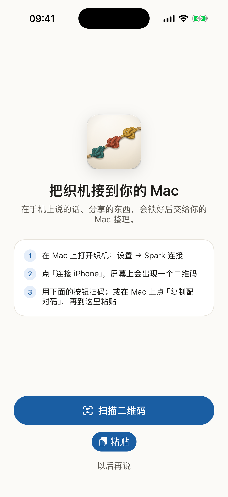
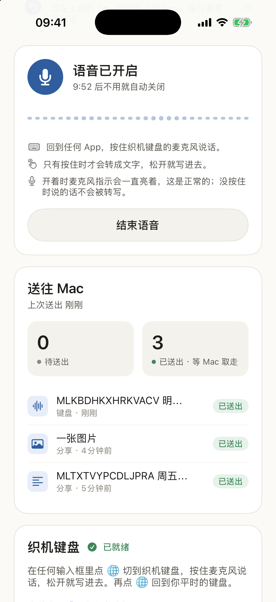
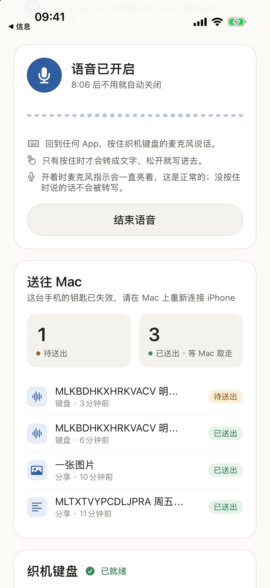

# 手机入口：织机键盘和「收进织机」

手机上聊天最多，所以手机上也要有同一个入口，而且不多费一点事。主路径是 iPhone App「织机」：

- **织机键盘**：在微信、邮件或任何 App 里切到织机键盘，按住麦克风键说话，松开，文字就进了输入框；地球键回到你平常的键盘。
  识别在手机本机做，声音不离开手机。键盘插进去的每一段话，同时收进织机。
- **「收进织机」分享扩展**：手机上看到的其他东西（一段文字、一个链接、一张图、一个文档）点「分享」→「收进织机」。
- 每一条在**手机上就封好**，只有你的 Mac 能打开；经**你自己的 SSH 密钥**送到**你自己的 Spark**，在 Spark 的收件箱里等 Mac 取走。
  Spark 只转交封好的密文，打不开；Mac 取走后 Spark 立刻删掉。

<p>


</p>

*iOS 26.5 模拟器里的 Debug 版，合成数据。模拟器没有端上语音模型，所以键盘里的文字是 DEBUG 下的脚本转写（Release 版没有这个开关）；键盘和 App 之间的协议、插入文字、在手机上封好、发件箱都是真实代码。*

以前的 iOS 快捷指令「分享到织机」**已停用**：它没法在手机上封存，内容在 Spark 收件箱里等 Mac 取走时是明文。现在 Spark 只收封好的条目（见文末「为什么没有快捷指令了」）。

隐私上的五条保证、怎么做到、边界在哪，见 [PRIVACY.md 的「手机」一节](PRIVACY.md#手机)。

**已做 / 未做**
- Spark 端（本仓库）已实现并有测试：收件箱收封存条目（`zhiji-inbox add --sealed`）、给手机密钥用的 `gate`、配对命令
  `authorize-phone` / `revoke-phone` / `list-phones`、跳板机助手 `spark/relay-authorize`。`spark/tests/test_phone_link.py` 里除了单元测试，
  还用**真的 OpenSSH sshd**（本机临时起在 127.0.0.1 上）验证：手机密钥在 Spark 上只能跑 `gate`、不能转发端口；在跳板机上只能开一条到 Spark SSH 端口的隧道，
  不能执行命令、不能开监听端口；解除配对后连不上；最大的封存条目能经 sshd 的强制命令完整送进收件箱。
- iPhone App（Mac 客户端仓库的 `iOS/`，封存和配对码在共享包 `Packages/MindloomLink`，发件箱、SSH 发送和分享转换在 `Packages/MindloomPhoneKit`）：
  键盘、分享扩展、配对、发件箱、SSH 发送都有测试（iOS 26.5 模拟器上 157 过、1 跳过：端上中文识别，模拟器没有语音模型），
  **没在真 iPhone 上跑过**，所以真机上的识别效果、麦克风、后台和蜂窝网络都还没验证。
- Mac 端（「连接 iPhone」配对、打开封存条目、「断开 iPhone」）已实现并有测试。
- **端到端**：模拟器里的 App → 跳板机 → 真实 Spark 收件箱 → Mac，整合版 67/67：配对、链路关着时发出 3 条（分享的文字、分享的照片、键盘口述）、
  收件箱里只有封好的数据块、Spark 上 9,552 个文件扫描 0 处明文、Mac 取走后来源和时间都对、断开 iPhone 后手机的钥匙被拒。
  前三次没全过，找到并修了 Mac 端的两个 bug（见 [EVALUATION.md §12](EVALUATION.md#12-手机织机键盘和收进织机)）。
- 还没有的：按 App 单独关闭「收进」、一键暂停收进、撤回还在 Spark 收件箱里没被取走的条目。

## 装 iPhone App（从源码构建）

还没有发布安装包，也还没有在真 iPhone 上构建和运行过。工程在公开仓库的 `mac/iOS/`，和 Mac 工程分开：

- 需要：Xcode 27、XcodeGen 2.45.3（只在改了 `project.yml` 时需要，生成好的 `MindloomPhone.xcodeproj` 已入库）、iOS 26.0 以上
  （端上中文识别用的是 iOS 26 的离线语音识别）。
- **模拟器**：`mac/iOS/script/xcodebuild.sh build`（或 `test`）。脚本把构建产物、包缓存和临时文件都放在
  `PHONE_BUILD_ROOT` 指定的外置卷目录里（例如 `PHONE_BUILD_ROOT=/Volumes/<卷名>/ios-build/phone`），卷没挂上就拒绝构建，
  不会退回系统盘；需要时自动建一个 iOS 26.5 的 iPhone 17 模拟器。两个 Swift 包单独测：`mac/iOS/script/swift_package.sh MindloomLink test`。
- **真机**：用 Xcode 打开 `mac/iOS/MindloomPhone.xcodeproj`，给 App、键盘扩展、分享扩展三个 target 选你自己的开发者团队。
  Bundle ID（`com.bestasr.phone` 及其 `.keyboard`、`.share`）和 App Group（`group.com.bestasr.phone`）要换成你团队下的：
  改 `mac/iOS/project.yml`（三个 target 的 ID 和 `application-groups`）、三个 `.entitlements` 文件和
  `mac/Packages/MindloomPhoneKit/Sources/MindloomPhoneKit/PhoneAppGroup.swift`，再运行 `mac/iOS/script/generate_project.sh`。
- 装好后：设置 → 通用 → 键盘 → 添加「织机键盘」并打开「允许完全访问」（键盘和 App 共享 App Group 需要它：键盘把你用麦克风说出、
  插进输入框的那几句封好放进 App Group 里的发件箱，发送由 App 做；你用别的键盘打的字，织机看不到）。然后在 Mac 上打开 Spark 链路，点「连接 iPhone」，在手机上扫码或粘贴配对码。

<p>



</p>

*左：配对页。中、右：端到端运行里的截图（没有 DEBUG 的本地回环，「已送出」表示 Spark 的收件箱确实经 SSH 收下了封好的条目）；右边是在 Mac 上「断开 iPhone」之后，手机的下一条被拒。*

## 数据怎么走

```
iPhone
  织机键盘：按住麦克风键说话 → App 在本机识别（音频只在内存里，从不写盘、从不发出）→ 文字插进当前输入框
  收进织机：文字 · 链接（不打开） · 图片（在手机上重新编码，去掉拍摄地点等元数据） · 文档（≤ 25 MiB）；音视频不收
     └─ 在手机上封好：mlseal1（X25519 + HKDF-SHA256 + ChaCha20-Poly1305，封给 Mac 的公钥；条目 id 也在认证范围里）
     └─ 发件箱（App 和扩展共用，重启不丢；送达后只留 7 天的文字预览，图片不留）
        └─ SSH：手机专用的 ed25519 密钥；Spark（和跳板机）的主机密钥在配对时就固定下来，对不上就不连，没有「第一次连接就信任」
             [Spark 只能经跳板机访问时：跳板机只放行一条到 Spark SSH 端口的隧道，手机和 Spark 之间是端到端的 SSH]
             └─ Spark：强制命令 zhiji-inbox gate → zhiji-inbox add --sealed --id <条目 id> --json，封好的字符串从 stdin 进来
                  └─ inbox.db 原样存下（kind "sealed"）；Spark 没有能打开它的钥匙
Mac（已有的 SSH 隧道，链路开着时）
   └─ GET /v1/inbox → 用 Mac 自己的封存私钥和条目 id 打开 → 作为素材写进本地库
        来源 App = 手机写在封条里的来源（「iPhone 键盘」「iPhone 分享」），时间 = 手机上的 created_at
        └─ 写成功后 POST /v1/inbox/{id}/ack → Spark 删掉封存的字符串，只留一条不含内容的记录用来去重
   └─ 之后和其他素材一样：出门前遮号码，送去整理
```

- 没有第三方服务：手机直接连你的 Spark（同一局域网、你自己的 VPN，或你自己的跳板机）。不要为此把 Spark 的 SSH 暴露到公网。
- 收件箱是单独的小库 `inbox.db`，不跟整理库一起加密：整理库在 Spark 重启后、Mac 连上之前是锁着的，这时手机照样要能送进来（`add` 和 `status` 不受锁影响）。
  这里只收封好的密文，明文条目一律拒收（接口回答 422，`zhiji-inbox add` 回答 `not_sealed`），所以收件箱里没有明文。
- Spark 能看到的只有：条目 id（随机 UUID）、收到的时间、封好之后的大小。看不到是文字还是图片、来自哪个 App、写了什么。
- Spark 不整理收件箱里的东西。整理只发生在 Mac 打开它、作为素材送回来之后，所以撤销、删除、导出都以 Mac 为准。
- 同一条重发（比如回复在路上丢了）：条目 id 相同，Spark 不存第二遍，回答「重复」，手机按送达处理；Mac 取走以后再重发也一样。

## 配对：在 Mac 上「连接 iPhone」

Mac 设置 → Spark 链路 →「连接 iPhone」（链路开着时才能点）。Mac 用它自己的 SSH 连接完成下面几步，Spark 和跳板机上不用手动改任何东西：

1. 为手机生成一把 ed25519 密钥和一个钥匙编号（`<id>`：1–64 个 `A-Z a-z 0-9 . _ -`，以字母或数字开头）。
2. 在 Spark 上把公钥装成只能跑 `gate` 的一行：

   ```bash
   zhiji-inbox authorize-phone --key-id <id> --pubkey "ssh-ed25519 AAAA…"     # 或 --pubkey - 从标准输入读
   ```

   它往 `~/.ssh/authorized_keys` 里写（路径是 Spark 上 `zhiji-inbox` 的绝对路径）：

   ```
   command="/home/你/hack/organizer/spark/zhiji-inbox gate",restrict ssh-ed25519 AAAA… mindloom-phone:<id>
   ```

   - 可以重复执行：同一个编号、同一把钥匙再装一次什么都不变；同一个编号换了钥匙（重新配对），就地替换那一行。
   - 只动带 `mindloom-phone:<id>` 标记的那一行，其他每一行一个字节都不改（最后一行没有换行时，只补一个换行）。
   - 同一把钥匙已经出现在别的行上（例如一行没有限制的普通授权），直接拒绝，免得这把钥匙绕过限制。
   - 写入是原子的：同目录下权限 0600 的临时文件、fsync、改名；并发执行由锁文件排队。`~/.ssh` 不存在时以 0700 新建。
   - 钥匙编号和公钥文本都严格校验（只收 `ssh-ed25519`，编码必须规范），没有任何部分会交给 shell。
   - 输出一行 JSON，例如 `{"ok":true,"key_id":"<id>","changed":true,"replaced":false,"fingerprint":"SHA256:…"}`；
     拒绝时 `{"ok":false,"error":"bad_key_id|bad_pubkey|bad_gate_path|key_in_use"}`，退出码 1。

3. Spark 只能经跳板机访问时（Mac 的 SSH 配置里 Spark 用了 ProxyJump），在**跳板机**上也装一行。跳板机上什么都不用预先安装：
   Mac 把 `spark/relay-authorize`（一个自包含的 POSIX sh 脚本）通过 SSH 的标准输入交给跳板机执行，参数都是不需要引号的单词：

   ```bash
   ssh <跳板机> sh -s -- add <id> <Spark 地址> <Spark 端口> ssh-ed25519 AAAA… < spark/relay-authorize
   ```

   写入跳板机 `~/.ssh/authorized_keys` 的一行：

   ```
   restrict,port-forwarding,permitopen="<Spark 地址>:<Spark 端口>",permitlisten="127.0.0.1:1",command="false" ssh-ed25519 AAAA… mindloom-phone:<id>
   ```

   - `restrict` 关掉终端、代理和 X11 转发、`~/.ssh/rc`；`port-forwarding` 再打开转发，由 `permitopen` 限定只能连 Spark 的这一个地址和端口。
   - `command="false"`：这把钥匙在跳板机上要执行任何命令、要 shell，都只会执行 `false`（隧道不是命令，不受影响）。只写 `restrict,port-forwarding,permitopen=…`
     是不够的：测试里用真的 sshd 验证过，那样手机钥匙还能在跳板机上执行任意命令。
   - `permitlisten="127.0.0.1:1"`：反向转发（`ssh -R`）只能在一个普通用户绑不上的特权端口上监听，所以这把钥匙在跳板机上开不了监听端口。
   - `<Spark 地址>` 必须和配对码里的 Spark 地址逐字一致：sshd 按字符串比对隧道目标。IPv6 地址写成 `[地址]:端口`（脚本自动加方括号）。
   - 和 Spark 上一样：可重复执行、就地替换、不动其他行、钥匙已在别处就拒绝、临时文件加改名、锁目录排队；输出一行 JSON。
   - `ssh <跳板机> sh -s -- list < spark/relay-authorize` 列出跳板机上的手机钥匙编号。

4. Mac 显示二维码和「复制配对码」按钮：`mlpair1.` 加上 base64url 编码的 JSON，里面有 Spark（和跳板机）的地址、端口、用户名、主机密钥、手机私钥、钥匙编号、
   Mac 的封存公钥和 `gate` 命令。主机密钥取自 Mac 的 `known_hosts`，只用 ed25519 或 ECDSA（手机上的 SSH 实现验不了 `ssh-rsa`）；取不到就拒绝配对，
   不会退回到「第一次连接就信任」。手机扫码或粘贴后，私钥进钥匙串，其余（不含任何秘密）进 App Group。

**断开 iPhone**：Mac 在 Spark 上运行 `zhiji-inbox revoke-phone --key-id <id>`，经跳板机时再运行
`ssh <跳板机> sh -s -- remove <id> < spark/relay-authorize`；两边都只删带这个标记的行，可重复执行。之后这把钥匙在 Spark 和跳板机上都进不来。
`zhiji-inbox list-phones` 列出 Spark 上已配对的手机（编号、指纹、强制命令）。

**不在默认目录的整理服务实例**：强制命令只能是一个绝对路径，所以先给实例生成一个自带数据目录和虚拟环境的包装脚本，再用它配对：

```bash
ORGANIZER_VENV=~/hack/<实例>/venv ORGANIZER_DATA_DIR=~/hack/<实例>/data \
  ~/hack/<实例>/app/spark/ctl.sh gate-wrapper /home/你/hack/<实例>/bin/zhiji-inbox
/home/你/hack/<实例>/bin/zhiji-inbox authorize-phone --key-id <id> --pubkey -    # 写进去的是这个包装脚本的路径
```

## gate 放行什么

`command="…/zhiji-inbox gate"` 只执行 `SSH_ORIGINAL_COMMAND` 里的这两种命令（`add` 的几个选项顺序不限，每个最多一次，`--sealed` 和 `--id` 必须有）：

| 命令 | 用途 |
|---|---|
| `zhiji-inbox add --sealed --id <小写 UUID> --json` | App 送来的封存条目，标准输入是 `mlseal1.…` 字符串 |
| `zhiji-inbox status` | 还有几条等 Mac 取走 |

其他一律拒绝：没有 `--sealed` 的 `add`（以前快捷指令的 `--source` / `--image` / 标准输入里的明文）、`authorize-phone`、`revoke-phone`、`list-phones` 这些配对命令、文件路径、`--id=…` 这类写法、任何 shell。

`add --sealed --json` 的回答是一行 JSON：

- 收下：`{"ok":true,"id":"<条目 id>","inbox_id":"<条目 id>","duplicate":false}`；同一 id 重发时 `"duplicate":true`，退出码都是 0。
- 拒绝：`{"ok":false,"error":"<原因>"}`，退出码 1。原因：`bad_id`（没有 `--id`，或不是小写 UUID）、`bad_args`（和 `--source` / `--image` 混用）、
  `not_sealed`（没有 `--sealed` 的明文 `add`，或者不是封存字符串的样子）、`malformed` / `too_short` / `too_large`（封存字符串的样子不对）、`rejected`（整理服务拒收）、`not_allowed`（gate 不放行）。
- 整理服务没在运行：`{"ok":false,"error":"unavailable"}`，退出码 2。

## Spark 收件箱怎么存封存条目

- `inbox.db` 的一行：`{inbox_id, source:"sealed", kind:"sealed", blob, received_at}`，`blob` 就是手机发来的字符串，原样保存。
- **只检查样子**：以 `mlseal1.` 开头，后面是不带填充的 base64url 字符，长度合法。从不解码、不解析、不尝试打开。
- **大小**：封好的二进制最多 36,000,000 字节（这样一个 25 MiB 的文档装得下），所以字符串最多 48,000,008 个字符。`zhiji-inbox` 从标准输入最多只读这么多（再多一个字节就拒绝），
  不会把无限长的输入读进内存。
- **条目 id 原样保存**：它是封条认证数据的一部分（`mindloom-inbox-v1|<id>`），改一个字母 Mac 就打不开。所以只收小写的 UUID，大写的直接拒绝，而不是悄悄改成小写。
- 锁着的时候也收；Mac 确认（ack）后删掉 `blob`；「让 Spark 忘掉我的内容」会删掉还没取走的条目。

## Mac 端要做的（接口约定）

- `GET /v1/inbox?since=<游标>&limit=20` → `{cursor, items, pending, more}`。封存条目是
  `{"inbox_id","kind":"sealed","blob","received_at","seq"}`。只有从旧版本升级时，旧整理库里还没取走的快捷指令条目会在第一次开锁时交接过来一次，形如 `{inbox_id, source, kind: text|image, text, image_b64, received_at, seq}`；Mac 照旧取走、确认。
  只返回未确认的条目；`since=0` 总能取回全部未确认的，所以丢了游标也不会漏。
- 一页的内容超过约 6 MB 就停（至少一条），所以一个大的封存条目（最大约 48 MB）会单独成一页；Mac 取件的超时要够它传完。
- 封存条目：用封存私钥和 `inbox_id` 打开（`MindloomSeal.open(blob, entryID: inbox_id, …)`），得到 `{"v":1,"kind":"text|link|image|file","source","created_at",…}`；
  文字、链接、图片、文件各走本地的正常路径。打不开的（例如封给了旧配对的钥匙）也要确认并丢掉，计入可见的状态：「N 条手机内容无法打开（配对已更换）」。
- 每条先写进本地库，**写成功后**再 `POST /v1/inbox/{inbox_id}/ack`；确认可重复调用，未知 id 返回 404。没写成功就不确认，下次再取。
- `/v1/health` 的 `inbox_pending` 是还在等 Mac 取走的条数。

## 为什么没有快捷指令了

以前还没装 App 时，可以用 iOS 快捷指令「分享到织机」经 SSH 运行 `zhiji-inbox add --source iPhone`。快捷指令没法在手机上用 Mac 的公钥封存，
所以它送来的内容在 Spark 收件箱里等 Mac 取走的这段时间是明文，同一台 Spark 账户下的程序读得到（隐私复查 F9）。这条路现在关掉了：

- Spark 只收 `add --sealed --id <UUID>`；快捷指令还在跑的 `zhiji-inbox add --source …` 会被 `gate` 拒绝（`not_allowed`），直接在 Spark 上执行也只会得到 `not_sealed`，什么都不存。
- 接口 `POST /v1/inbox` 对 `kind: text|image` 的条目回答 422，错误里不回显内容。
- 以前给快捷指令装过的钥匙用 `zhiji-inbox revoke-phone --key-id <它的编号>` 删掉；经跳板机转发快捷指令的那一行（`command="ssh -T …-inbox …"`）请在跳板机上手动删掉。
- iPad 等其他设备：装 iPhone App 后在 Mac 上配对，和 iPhone 走同一条封存的路。

排错：「organizer socket not found」→ Spark 上整理服务没启动；「Permission denied」→ 公钥没装对或已被吊销；
「this key may only run …」→ 发来的不是 `add --sealed --id …` 或 `status`；`not_sealed` → 发来的是明文；一直转圈 → 手机连不到 Spark。
