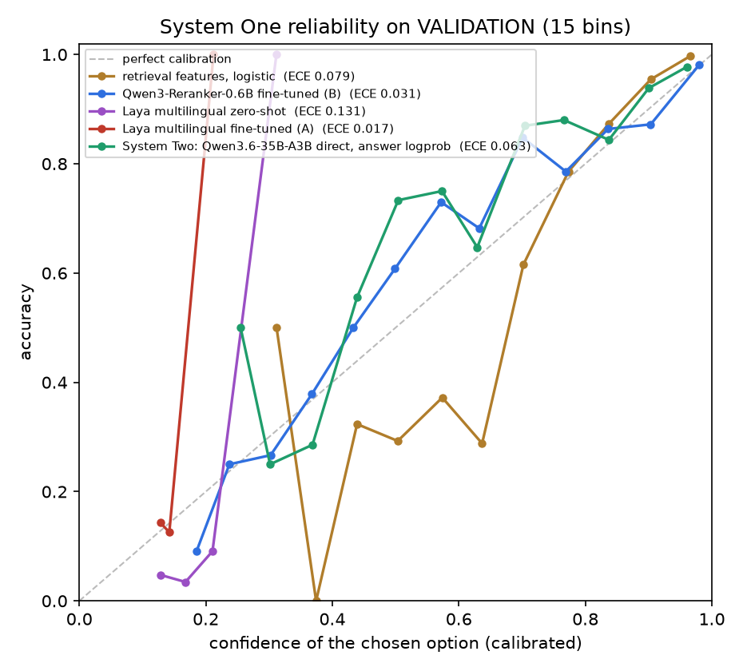
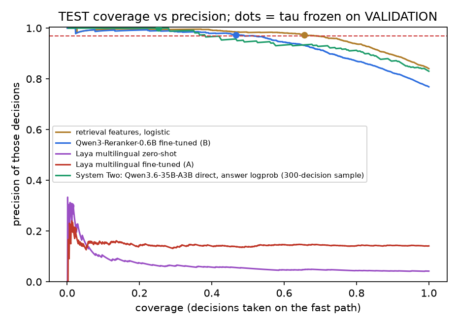

# System One: fast, calibrated organizing decisions

System One makes the organizer's routine decision in one pass: which ongoing matter a new item belongs to, whether it starts a new matter (NEW), or whether it is not a matter at all (NONE). It returns a calibrated probability for every option. When the top probability clears a threshold τ, the decision is taken on the fast path. Otherwise it goes to System Two, the LLM `event-assign` skill. Both a person-merge judge and an event-merge judge use the same model.

**Status: evaluation only, off by default.** The organizer does not call System One; every decision still goes through `event-assign`. The cascade did not pass on TEST: the reranker scored 76.9%, just below retrieval top-1 (77.3%), and the no-text logistic baseline scored higher (84.0%). Wiring it in waits for a cascade that beats System Two alone on TEST.

Everything here uses synthetic data only. Training uses TRAIN streams. Temperatures and τ are fitted on VALIDATION. TEST is scale-lab plus holdout-week-v2, and it was never used for training, calibration or model choice. All models ran on the shared GB10 (spark), next to the shared Qwen3.6-35B-A3B on :8000.

## Data

The datasets are built by `build_units.py`, `make_choice.py` and `make_pairs.py`.

| split | decisions | attach / NEW / NONE | retrieval recall@8 |
|---|---|---|---|
| train (startup, pm before cutoff, dev-week-v1, split-dev) | 3,649 | 3,236 / 184 / 229 | 96.3% |
| val (last ~20% of startup and pm, by time) | 977 | 896 / 37 / 44 | 96.0% |
| test: scale-lab | 1,907 | 1,729 / 73 / 105 | 97.1% |
| test: holdout-week-v2 | 46 | 35 / 7 / 4 | 100% |

Each decision offers 2 to 10 options (9.9 on average): up to 8 retrieved event cards, plus NEW and NONE. Retrieval order puts the right card first about 70% of the time. Both candidates therefore train with the option order shuffled. The reranker scores each option on its own; Laya shows the cards shuffled. The retrieval score is kept as an input feature, so the prior is learned rather than memorised as a position.

## Candidates

- **(A) Laya multilingual** (`convaiinnovations/laya`, mmBERT-base 322M, Apache-2.0, Jev-compatible). Each decision is one `choice` question: the state holds the item and every card, and the options are A–H, NEW and NONE, all in one forward pass. Fine-tuning follows Laya's own RLCD recipe (REINFORCE on perturbed logits, rewarded by a proper scoring rule, plus CE guidance). On the shared node the frozen weights are kept in bf16 and only the top 6 encoder layers and the head are trained, under a 22-minute guard. Temperatures are fitted per (question type, option-count bucket) on VALIDATION, as the Laya docs prescribe. Code: `laya_s1.py`, `laya_calibrate.py`, `laya_ft2.sh`.
- **(B) Qwen3-Reranker-0.6B, fine-tuned listwise.** Each (item, option) pair gives a yes/no logit. A linear head over 25 retrieval features (score, similarity, time, same source, rank, pool size and so on) is added, and one softmax runs over all k+2 options, trained on listwise CE plus pointwise BCE. The top 4 of 28 layers are trained for 1 epoch (40 min). One temperature is fitted on VALIDATION. Code: `train_s1.py`, `calibrate_s1.py`.
- **Baselines.** Retrieval top-1 (no model). A logistic model over the same 25 retrieval features (no text), fitted on TRAIN with a temperature from VALIDATION.
- **System Two**, run on a 300-decision TEST sample: all 46 holdout-week-v2 decisions plus 254 seeded scale-lab decisions, with the same options. It has two forms. (1) The organizer's real `event-assign` skill, run through its Harness with SKILL.md, schema-guided JSON, validate.py and one retry; the action comes from `decide.derive`. (2) The same LLM given the direct "answer with the option code" prompt, with confidence taken from the answer-token logprob and a temperature and τ fitted on a 300-decision VALIDATION sample. Code: `s2_llm_eval.py`.

## Results

ECE uses 15 bins. Coverage is the share of decisions taken on the fast path at τ, which is chosen on VALIDATION for ≥ 97% precision and then frozen. Precision is measured on those fast decisions.

**VALIDATION** (977 decisions; System Two direct: 300-decision val sample)

| model | acc | ECE | Brier | τ | coverage @≥97% | precision | latency p50 / p90 (GB10) |
|---|---|---|---|---|---|---|---|
| retrieval top-1 (no model) | 74.2% | 0.258 | 0.516 | none | 0.0% | – | – |
| retrieval features, logistic | 79.8% | 0.079 | 0.280 | 0.830 | 62.5% | 97.1% | – |
| Laya multilingual zero-shot | 4.1% | 0.131 | 0.931 | 0.312 | 0.1% | 100.0% | 51 / 62 ms |
| Laya multilingual fine-tuned (A) | 13.5% | 0.017 | 0.891 | 0.212 | 0.1% | 100.0% | 46 / 51 ms |
| Qwen3-Reranker-0.6B fine-tuned (B) | 82.1% | 0.031 | 0.264 | 0.897 | 54.8% | 97.0% | 419 / 480 ms |
| System Two: Qwen3.6-35B-A3B direct, answer logprob | 85.7% | 0.063 | 0.246 | 0.912 | 38.3% | 97.4% | 1330 / 2166 ms |

**TEST**, all 1,953 decisions (scale-lab 1,907 + holdout-week-v2 46), with τ frozen from VALIDATION

| model | acc | ECE | Brier | coverage | precision | acc scale-lab | acc holdout-v2 | holdout-v2 fast precision |
|---|---|---|---|---|---|---|---|---|
| retrieval top-1 (no model) | 77.3% | 0.227 | 0.455 | 0.0% | – | 77.8% | 54.3% | – (0) |
| retrieval features, logistic | 84.0% | 0.038 | 0.224 | 65.6% | 97.3% | 84.4% | 67.4% | 92.0% (25) |
| Laya multilingual zero-shot | 4.2% | 0.132 | 0.927 | 1.0% | 30.0% | 3.9% | 17.4% | 80.0% (5) |
| Laya multilingual fine-tuned (A) | 14.1% | 0.005 | 0.890 | 1.7% | 20.6% | 13.8% | 28.3% | 14.3% (7) |
| Qwen3-Reranker-0.6B fine-tuned (B) | 76.9% | 0.021 | 0.324 | 46.6% | 97.4% | 77.0% | 69.6% | 84.2% (19) |

**TEST, 300-decision sample** (46 holdout-week-v2 + 254 scale-lab), all models on the same options

| model | acc | ECE | Brier | coverage | precision | latency p50 / p90 |
|---|---|---|---|---|---|---|
| retrieval top-1 (no model) | 73.7% | 0.263 | 0.527 | 0.0% | – | – |
| retrieval features, logistic | 82.7% | 0.052 | 0.233 | 61.3% | 96.2% | – |
| Laya multilingual zero-shot | 5.3% | 0.138 | 0.919 | 3.3% | 50.0% | 51 / 62 ms |
| Laya multilingual fine-tuned (A) | 16.3% | 0.035 | 0.887 | 4.7% | 21.4% | 46 / 51 ms |
| Qwen3-Reranker-0.6B fine-tuned (B) | 76.3% | 0.060 | 0.345 | 46.0% | 94.9% | 419 / 480 ms |
| System Two: Qwen3.6-35B-A3B direct, answer logprob | 83.0% | 0.085 | 0.261 | 25.3% | 100.0% | 1330 / 2166 ms |
| System Two: event-assign skill (organizer Harness) | 79.7% | no probabilities | – | decides 88.7% (asks 11.0%) | 89.8% | 13955 / 17149 ms |




### What the numbers say

1. **The reranker (B) wins on VALIDATION, so it is the one served.** It reaches 82.1% accuracy with ECE 0.031, and at τ = 0.897 it takes 54.8% of decisions on the fast path at 97.0% precision. Laya did not come close. Zero-shot it scored 4.1%, because it almost always chose the NEW option, and its merge AUC was about 0.5. Its docs warn that it starts near chance. Fine-tuned it reached 13.5%, barely above the 1-in-10 option rate. On the shared node it could only be trained briefly: the top 6 encoder layers plus the head, for about half an epoch in 13 minutes, with CE falling from 2.3 to about 1.9. More training might help, but not on this budget.
2. **Calibration transfers to TEST; accuracy transfers less well.** The reranker's ECE on TEST is 0.021, and the frozen τ keeps 46.6% of decisions on the fast path at 97.4% precision (scale-lab 97.6%). That matches the promise. But its accuracy drops from 82.1% on val to 76.9% on test, just below the retrieval top-1 baseline of 77.3%. On the unseen lab scenario it is well calibrated but not more accurate than retrieval.
3. **A 25-feature logistic model with no text is the strongest fast scorer on TEST.** It reaches 84.0% accuracy with ECE 0.038, and 65.6% coverage at 97.3% precision, in under 1 ms on CPU. It lost on VALIDATION (79.8% vs 82.1%), so under the protocol it is a baseline, not the pick. Two cheap next steps: use it as the fast path, or retrain the reranker's head with more weight on these features.
4. **holdout-week-v2 (46 decisions) is harder for everyone.** The reranker scores 69.6%, the feature model 67.4%, the LLM 67.4% and retrieval top-1 54.3%. The fast path's precision there is lower: 84% for the reranker (16 of 19 correct) and 92% for the feature model (23 of 25). With n this small that is ±8 points. So when routing a new person's week, τ should be kept conservative or re-fitted.
5. **System Two against System One on the same 300 TEST decisions.** The direct LLM is the most accurate at 83.0%, but it needs 1.3 s per decision (p50) with nothing else running. The organizer's full `event-assign` skill scores 79.7%: it decides 88.7% of the time at 89.8% precision and asks about the other 11.0%, and takes 14 s p50. The reranker's fast path covers 46% of decisions at 95% precision in about 0.42 s. Sending only the remaining 54% to System Two cuts LLM calls roughly in half. Replacing the skill with System One outright would cost accuracy.
6. **Merge judges.** The reranker is the only usable one: person AUC 0.872, event AUC 0.794, and ECE 0.02–0.03 after cross-fitted calibration. At 97% precision it confirms only 16% of true person merges and 3% of true event merges automatically. Its "keep apart" side is stronger: 25% and 18% of all pairs are decided either way. So its practical role is to clear obvious non-merges and pass real merge candidates to the LLM or the user. It should not auto-merge.


## Merge judges (VALIDATION; there is no merge TEST set)

These use the same model as the choice decision. The temperature and bias are fitted with 2-fold cross-fitting, so ECE is out-of-sample. The thresholds are for ≥ 97% precision: merge when p ≥ the merge threshold, and keep the two apart when p ≤ the apart threshold.

| judge | task | n (same) | acc | AUC | ECE | Brier | merge threshold → recall | apart threshold | decided both ways |
|---|---|---|---|---|---|---|---|---|---|
| reranker | person | 1226 (317) | 85.2% | 0.872 | 0.019 | 0.110 | 0.978 → 16.4% | 0.044 | 25.0% |
| reranker | event | 461 (66) | 88.3% | 0.794 | 0.030 | 0.093 | 0.964 → 3.0% | 0.018 | 18.0% |
| Laya zero-shot | person | 1226 (317) | 74.1% | 0.530 | 0.017 | 0.192 | 1.010 → 0.0% | 0.166 | 0.2% |
| Laya zero-shot | event | 461 (66) | 85.7% | 0.469 | 0.004 | 0.123 | 0.195 → 1.5% | 0.120 | 2.4% |
| Laya fine-tuned | person | 1226 (317) | 74.0% | 0.579 | 0.023 | 0.189 | 1.010 → 0.0% | 0.000 | 0.2% |
| Laya fine-tuned | event | 461 (66) | 85.7% | 0.551 | 0.070 | 0.125 | 0.683 → 1.5% | 0.001 | 0.4% |

## Serving (for the consolidation step)

The winner, the reranker with its feature head, is served by `serve_rr.py` on **`127.0.0.1:8021`** (loopback only) on the DGX Spark:

| endpoint | request | response |
|---|---|---|
| `GET /health` | – | `{"ok": true, "model": "s1-reranker", "tau": 0.897}` |
| `POST /v1/choose` | `{"row": <CHOICE row: query + options with card and retrieval>}` | `{"probs": {A..H, NEW, NONE}, "choice", "confidence", "fast", "tau", "escalate_to": null or "system-two", "latency_ms"}` |
| `POST /v1/merge` | `{"row": <pair row>, "task": "person" or "event"}` | `{"p_same", "merge", "threshold"}`, where merge means p_same ≥ 0.978 (person) or ≥ 0.964 (event) |
| `POST /classify` | `{"input": [pair texts]}` | vLLM wire shape `{"data": [{"probs": [p_no, p_yes]}]}`, so `s1_client.py` works unchanged |

- Parameters: `results/r1_serving.json` (T = 1.19, τ = 0.897, merge T/bias/thresholds) and `results/r1_head.json`. The weights stay on the Spark in `runs/r1/model` (1.2 GB) and are not in Git.
- Latency on GB10 through HTTP, with all k+2 options in one request (10 on average): p50 419 ms, p90 480 ms, over 295 VALIDATION decisions. Parity against the offline dump: largest probability difference 0.014, argmax identical on 295 of 295.
- The process caps itself at 2.5 GB. vLLM's fixed pool does not fit in the free memory of the shared node; `serve_s1.sh` keeps the vLLM route for a node that has room.
- Laya is not served: it lost on VALIDATION. `laya_serve_s1.py` would serve the fine-tuned checkpoint through Laya's own Jev-compatible `/v1/systemone`. In-process latency is 46 / 51 ms, and the served probabilities match the dump within 0.004.


## Reproduce (on the DGX Spark, in the System One work directory)

```
python code/train_s1.py --base models/Qwen3-Reranker-0.6B --data data --out runs/r1            # (B) train
python code/train_s1.py --base runs/r1/model --data data --out runs/r1 --eval-only --dump --mem-gb 3
tools/bin/python code/calibrate_s1.py --run runs/r1 --data data                                  # merge + feature model
bash code/laya_chain.sh; bash code/laya_ft2.sh                                                   # (A) zero-shot, fine-tune
org-venv/bin/python code/s2_llm_eval.py --data data --repo repo --out runs/s2 [--split val --only logprob]
tools/bin/python code/report_s1.py --runs runs --data data --out runs/report                     # table + figures
python code/serve_rr.py --run runs/r1 --port 8021; python code/rr_latency.py --run runs/r1 --data data
```

## Caveats

- The replay cards have no event title, anchor or status line, because event-brief output is not in the replay. The skill therefore sees the seed item and the two latest items of each event. The live organizer gives it more.
- holdout-week-v2 has only 46 decisions, so its per-stream numbers have wide error bars (±7 points at 1σ).
- Latencies were measured on a shared node. The LLM was serving other jobs, and GPU work from other processes was running.
- vLLM could not host the reranker. Its fixed memory pool (≥ 4.9 GB) was larger than what the shared node had free. A plain PyTorch server (`serve_rr.py`) serves it with the same scoring code as the offline dump, and the parity check is below.
