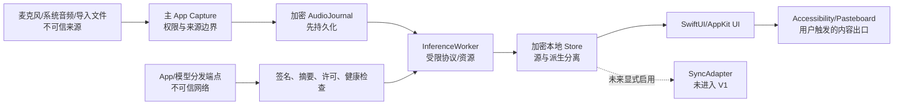

# bestASR V1 威胁模型

> 版本：0.1  
> 日期：2026-07-22  
> 范围：macOS V1、本地模型与更新链路；未来同步只评估架构约束，不视为 V1 已实现能力。

## 1. 安全目标与不变量

1. 未经用户明确选择的 App、音频源或文件不得被捕获。
2. 音频、逐字稿、摘要、词典、人物关系和声纹均按最高敏感等级处理；“只在本机”不等于“可以明文或写日志”。
3. 推理、UI、worker 或更新失败不得破坏已经提交的源录音和用户编辑。
4. 转写内容、导入媒体的元数据和模型输出都是不可信输入，不能触发命令、网络请求、权限扩大或代码执行。
5. 插入文本只能写入用户当下明确聚焦且允许编辑的目标；secure field、焦点竞争或身份不明时 fail closed。
6. 模型与 App artifact 未通过来源、签名/摘要、许可和兼容性校验不得激活。
7. V1 正常运行没有用户内容网络出口；未来同步必须显式启用、可关闭且不能让本地读取依赖网络。
8. 声纹只用于保守的历史归类，不作为认证、访问控制或现实身份的证明；口述、线下录音、系统音频和导入媒体使用同一全局人物空间与防污染门槛，来源不得成为放宽身份判断的理由。

## 2. 数据分类与默认处理

| 等级 | 数据 | 默认处理 |
|---|---|---|
| Restricted | 原始/分块音频、逐字稿、摘要/待办、声纹 embedding、人物姓名/关系、词典、导出包、加密密钥 | 本地加密；不进 Git、普通日志、默认诊断或网络；删除/恢复语义可审计 |
| Sensitive | App/窗口身份、焦点目标、时间线、设备信息、change log、错误上下文 | 最小收集；日志只留 opaque ID/类别；不保留窗口标题和绝对私人路径 |
| Internal | 模型/依赖 manifest、artifact digest、性能数据、匿名失败 sample UUID | 可进入仓库或证据包，但必须经过内容与路径扫描 |
| Public | 开源许可、公开文档、无用户内容的合成 fixture | 可提交；仍验证来源和许可 |

派生文本仍继承源音频的 Restricted 等级。删除源数据前必须明确派生数据、索引、备份、tombstone 和未来同步副本的影响。

## 3. 信任边界与数据流

主要边界：外部音频/文件→Capture、主 App→XPC worker、worker→本地 store、UI→其他 App、网络→artifact staging、以及未来本地 store→SyncAdapter。Keychain 是密钥信任根；Git、日志、诊断包和 benchmark 输出都视为较低信任区。

## 4. 威胁与验证矩阵

| ID | 威胁/失败方式 | 主要控制 | 必须保留的验证证据 |
|---|---|---|---|
| TM-01 | Process Tap 捕获未选择 App、helper 扩张或切换后继续捕获旧来源 | 选择对象绑定、生命周期重建、可见录音状态、默认停止而非扩大范围 | `SPIKE-CAP-001` 水印矩阵：选中/未选中 App、helper、新 PID、退出重启、设备切换、权限撤销 |
| TM-02 | 麦克风和系统音频混成一轨，导致错误人物归属或无法审计来源 | 独立 source track、单调时间、gap/discontinuity 事件、来源标签 | 双轨脉冲对齐、漂移、设备热插拔与 2 小时报告 |
| TM-03 | 崩溃、磁盘满或慢模型造成录音丢失/损坏 | 短块原子 rename、逐条 `fsync` 的本地提交日志、残尾耐久截断、状态 manifest、bounded queue、先提交后推理、恢复器 | `SPIKE-JRN-001` 随机 kill、截断/损坏块、提交日志尾部半条记录与恢复后续录、磁盘水位、worker crash 与损失上界 |
| TM-04 | AX 把文本写入错误窗口、secure field，或 pasteboard race 覆盖他人内容 | 校验 target PID/focus/editability/secure subrole；写前后 `changeCount`；冲突即不恢复/不插入 | `SPIKE-INS-001` secure field、焦点竞争、权限拒绝和目标 App 兼容矩阵 |
| TM-05 | 转写/媒体内容提示注入本地 LLM，改变事实或诱发外部动作 | 内容仅作数据、固定模板、无工具/网络能力、源与派生分离、危险事实 hard gate | 数字/日期/否定/人物/责任人 regression suite；网络 deny-all 报告 |
| TM-06 | 恶意或损坏媒体触发解析器漏洞、资源耗尽或超大输出 | AVFoundation/系统解码优先、大小/时长/格式上限、超时/取消、隔离解码候选 | 畸形/截断/超长/压缩炸弹式 fixtures、峰值资源与取消测试 |
| TM-07 | 恶意模型、SDK 或更新替换本地代码/权重 | 固定来源、EdDSA/Developer ID、SHA-256、许可/SBOM、staging、health check、last-known-good | 篡改、缺许可、部分下载、回滚、codesign/notary/Gatekeeper 证据 |
| TM-08 | XPC 对端伪造、协议反序列化或 worker 越权访问 | 版本化 allowlisted value types、输入上限、code-signing requirement/audit identity Spike、最小 entitlement、无网络客户端 | `SPIKE-XPC-001` 不兼容协议、超大消息、伪造/断连、crash/replay 测试 |
| TM-09 | 数据库、临时文件、swap/备份或文件名泄漏用户内容 | SQLCipher 与 AES-GCM Spike、Keychain、随机文件名、最小 metadata、临时文件保护和清理 | `SPIKE-SEC-001` 错密钥、迁移中断、备份/恢复、文件系统与日志内容扫描 |
| TM-10 | 私人语料、transcript、路径或声纹进入 Git/日志/诊断 | ignore + fail-closed scanner、privacy-safe Logger、诊断预览、opaque sample UUID | planted-secret/redaction tests、tracked-files scan 与诊断包 schema test |
| TM-11 | 任一入口的自动声纹误合并导致全局隐私和历史污染，或默认纯文字插入使内部人物证据被错误丢弃 | 四入口共用未知优先、高精度阈值与跨通道校准；证据展示、用户决定优先、merge/split 可撤销；输出格式不改变内部出现关系 | 四入口配对语料的 false merge/split/reject 指标、1/2/3 人口述、乱序重放、label-free insertion→history evidence、merge→split property tests |
| TM-12 | 本地恶意进程或设备丢失读取历史 | 应用层加密、Keychain、最小文件权限、Hardened Runtime；建议用户启用 FileVault | 锁屏/重启后的密钥可用性、文件权限、直接复制 store 后不可读测试；记录残余风险 |
| TM-13 | 资源耗尽导致无限队列、系统卡死或数据盘填满 | 下载/录音水位、bounded queue、优先级调度、模型档位和可取消后台任务 | 磁盘/RSS/thermal/backlog 故障注入，证明 journal 优先且恢复可观察 |
| TM-14 | 未来同步泄漏高敏感资产、错误删除或冲突覆盖用户编辑 | SyncAdapter、显式 opt-in、字段级范围、稳定 UUID/revision/tombstone、用户操作优先、密钥恢复设计 | 同步立项时独立 threat model；迁移 round-trip、乱序/重复/删除恢复 fixtures 现在先做 |
| TM-15 | 完整归档被窃、口令错误/过弱、篡改、截断或导入一半后破坏现有库 | portable archive secret、内存/计算成本可调 KDF、AEAD、版本化 manifest、逐项 digest、无明文 staging、空间预检、原子 commit | `SPIKE-MIG-001` 跨测试用户恢复、错误口令、篡改/截断、磁盘不足、取消/kill、N-1→N 与重复导入矩阵 |

## 5. 权限与最小能力

- 麦克风、系统音频与辅助功能分别解释、分别请求；用户拒绝后不循环弹窗或偷偷降级到更宽来源。
- 捕获模块不能访问更新网络；推理 worker 默认不能发起网络连接；更新模块不能读取 history/corpus store。
- DMG 使用 Hardened Runtime、Developer ID 与 notarization；entitlements 逐项由真实 Spike 证明，不能用宽 entitlement 解决测试失败。
- 是否启用 App Sandbox 由 Process Tap、AX、文件导入与 XPC 的实机矩阵决定。未启用时仍必须维持应用内最小权限和进程边界。
- 调试、benchmark、签名和模型管理入口不得存在于 release UI，且 release 包中不含私人 fixture、调试服务或通用脚本执行能力。

## 6. 未来同步的安全前置条件

V1 只完成 sync-ready 语义。真正开启 iPhone↔Mac 或多 Mac 同步前，必须重新冻结：身份提供者、同步字段、音频/声纹默认值、服务端可见性、端到端加密、设备加入/移除、密钥恢复、账号注销、远端删除、冲突策略、配额与离线回滚。

CloudKit 或产品后端都不能改变以下规则：本地先提交；不启用同步时完全本地可用；删除和人物操作可重放；派生模型输出不覆盖源事实；服务端不得需要明文声纹进行自动身份判定。

## 7. 安全发布 Gate

- 所有 TM-01..15 的适用证据由 PRD requirement、test/probe 和 artifact digest 追踪；`conditional` 风险有明确限制和回滚，`fail` 不能靠关闭测试变绿。
- Codex Security 对权限、捕获、持久化/加密、更新、签名和同步相关 diff 执行扫描；P0/P1 finding 修复或有可审计的阻断理由。
- 正常离线套件在 deny-all 网络下通过，网络审计未出现用户内容、路径、标题或身份数据。
- 签名、公证、Gatekeeper、全新用户、权限拒绝/撤销、旧 schema 迁移、模型损坏、worker crash、随机 kill 和长录音全部通过。
- 发布包、SBOM、NOTICE、模型 manifest 与实际文件逐项一致；不存在未登记可执行文件、动态库或模型。

## 8. 已知残余风险

2026-09-22 历史/词典交互修正的本地 diff 复核：TM-07/09/10/13 适用。查询的阶段、来源、搜索、时间、LIMIT/OFFSET 使用绑定参数，重试候选的 OR 不绕过其他条件；取消与查询版本校验阻止旧页面混入，词典批量操作仍检查 expectedRevision。新日志仅记录耗时与条数，无用户内容、来源标识或私人路径。没有新增网络出口、源音删除/覆盖或 schema 迁移。安装仍验证稳定 Apple Development 签名、bundle ID 与不可变 revision，并保留可回滚 App；取消隐式缓存迁移，避免替换 App 时改动用户数据位置。本次运行环境无可调用的 Codex Security threat-model/diff-scan 服务，因此这是本地复核，不代表该服务扫描通过。

2026-08-30 手动重新识别的本地复核：TM-09/10/11 适用。新文字与同 revision 的人物任务在一个数据库事务内发布；任务输入冲突必须同时回滚新文字，不能留下只有一半更新的状态。事务重新核对原音保留标记，并拒绝晚于人工修改才返回的旧识别结果。已有人工确认人物时保留原分段及关系；推理期间新增的确认若不再被新输出包含，人物提交整体拒绝，不删除人工来源锚点。资料库异步完成反馈绑定发起记录，不污染后来选中的记录。权限、用户 schema、网络和声纹空间没有改变；九项受影响 SQLite 回归、两项 App 回归及静态隐私检查通过。真实安装版在断网条件下完成两人重处理；测试记录经生产删除 API 清除，原八条记录不变，无本轮活跃孤立声纹。不声称不可用的 Codex Security 服务通过。

2026-08-30 原音时长索引修正的本地边界复核：TM-03/09/10 适用。同步只接收已耐久提交块的采样数、时间、格式、摘要和相对路径，不读取或记录音频/逐字稿；高频捕获 append 不依赖 SQLite 索引写入。密封/恢复时补齐既有表，同一轨/序号冲突必须回滚整批元数据，不覆盖来源证据；重复同步保持原记录修订。数据库事务重新核对保留状态，拒绝复活用户已明确删除的原音句柄。失败仍保留密封 journal 并可重试。时长取源区间并集，禁止用包含暂停的墙钟时间或 ASR 语音长度伪造采集时间；未获取时长的记录明确显示未知。五项真实临时数据库/journal 回归及一项 App 时长筛选回归通过，真实安装版验证待执行；未声称通过不可用的 Codex Security 服务。

2026-08-30 聚类阈值单位修正的本地复核：TM-10/11 适用。转换 community-1 的距离单位不改变模型文件、全局身份空间、匹配阈值或人工确认关系；新作业配置单独版本化，已有用户音频/结果不会自动重处理。公开语料在断网沙箱中运行，取消评估时四人上限，避免把真实参与人数泄漏给模型。三项配置回归、两项评估协议回归以及固定身份阈值的 AMI 无人数提示回归通过；输出只保留匿名计数/误差，私人音频与声纹不进入 Git。安装版只对明确归属本次测试的录音进行重处理。

2026-08-30 资料库人物展示/检索修正的本地复核：TM-09/10/11 适用。姓名只作展示，按完整身份 ID 保留成对投影，避免逗号拆分或同名去重把内容指向另一人物；待命名标签不暴露 UUID。搜索修正只在本机事务中重建派生 FTS 行，人物、出现记录、声纹、逐字稿和音频资产不变；查询参数仍绑定，不拼接用户内容。旧索引升级、同名和含逗号姓名、候选拒绝和事件关联的四项临时数据库回归通过。此处仍是本地复核，不是不可用的 Codex Security 服务扫描。

2026-08-30 Qwen 原生最终稿接入的本地边界复核：TM-05/07/10/13 适用，权限、采集边界和用户数据 schema 不变。模型只允许 file URL 且生产工厂逐个核对 ModelManager 的固定版本/树摘要；tokenizer 在内存构造，不调用 SDK Hub 下载或修改已验证目录。解码任务与 KV cache 由同一 actor/调用任务持有，token 之间检查取消，不使用不可等待结束的 detached SDK producer。模型控制文本、越界或未覆盖原文的对齐不能形成完成修订；回退保存旧识别器的真实 artifact，取消不会启动回退。公开测试语料和含文字诊断留在外置本地目录，Git 仅保存无内容聚合；原音不删除、不上传。当前会话没有可调用的 Codex Security threat-model/diff-scan 工具，因此这里只记录本地实现复核与待执行回归，不能声称通过了该服务的扫描。

- 同一 macOS 用户下的高权限恶意软件、root、内核级攻击和已解锁设备的物理控制无法由本 App 完全防御；应用层加密与最小权限用于降低暴露，不声称提供取证级隔离。
- 声纹匹配永远存在跨麦克风、噪声、短语音和模仿造成的错误；只能用于整理，不作为身份认证。
- Accessibility 权限天然强大；即使实现目标校验，第三方 App 的非标准可访问性树仍会产生兼容性风险，因此必须保留明确失败和手动复制路径。
- 未来同步会新增云端、账号与多设备攻击面；本文件只冻结 V1 的兼容语义，不能替代同步版本的独立威胁建模和隐私评审。
