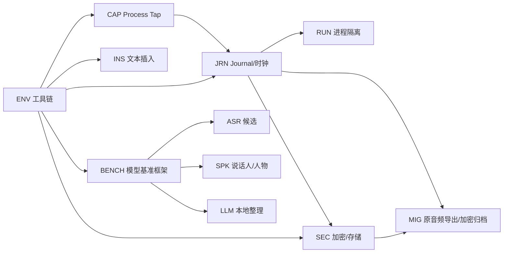

# V1 风险 Spike 计划

> 目标：用最小可丢弃代码回答会改变架构的未知问题。Spike 代码不得直接当生产实现，除非随后通过 PRD 对应验收、测试和 review 收编。

## 执行顺序

## SPIKE-ENV-001：完整构建链

**问题**：当前机器能否可重复构建、测试、签名和运行 macOS 14.2 deployment target？

**步骤/产物**：

- 记录已通过的 Xcode 26.6 安装/选择、许可和首次组件检查；建立最小 app、Swift package、XPC、unit/UI test target。
- 生成 `script/bootstrap.sh`、`script/check.sh`、`script/build_and_run.sh`。
- 验证 Debug/Release、arm64、macOS 14.2 deployment、Hardened Runtime 占位和无网络单测。

**通过**：一条命令能从干净 DerivedData 构建并运行测试；失败日志可由 Codex 读取；不依赖 Xcode GUI 手工改工程。

## SPIKE-CAP-001：Core Audio Process Tap

**问题**：是否能可靠捕获指定 App/整机而不混入其他 App？

**矩阵**：腾讯会议、Zoom、Chrome（会议 + 另一个播放标签）、QuickTime/VLC、整个系统；来源静音、退出、重开、helper 新 PID、输出设备切换、蓝牙切换、本 App 播放提示音。

**证据**：进程/tap 生命周期事件、轨道摘要、波形/能量、捕获边界人工标记、权限状态、CPU/内存、2 小时运行结果。

**通过**：

- 指定 App 测试中没有检测到专门注入到其他 App 的水印音频；
- Chrome 边界与 UI 文案一致（整个 Chrome，不声称标签页隔离）；
- 来源退出/新 PID/设备切换不破坏已提交音频；
- 不产生本 App 音频反馈环；
- 2 小时无持续增长积压或资源泄漏。

## SPIKE-JRN-001：双轨时钟与 AudioJournal

**问题**：怎样以可接受磁盘/CPU 开销实现 ≤1 个短块损失和可重放时间轴？

**候选**：PCM/WAV 短块、CAF/ALAC 短块、其他可验证容器；0.5/1/2/5 秒块；不同 fsync 策略。

**故障注入**：随机 `kill -9`、写入中断、电源休眠、磁盘硬水位、摘要损坏、块缺失、设备采样率变化。

**通过**：

- 随机 kill 后已提交块全部可读，损失不超过一个目标短块；
- manifest/DB 可自动重建，损坏块形成显式 gap；
- 双轨在 2 小时测试的对齐 drift 满足字幕/回放体验门槛，且有校正策略；
- 空间预估、软/硬水位与最终封装可测。

## SPIKE-INS-001：任意 App 插入

**矩阵**：Codex、TextEdit、Safari/Chrome 普通输入框、ContentEditable、富文本编辑器、VS Code/Xcode、Terminal、Electron App、密码框；录音期间切 App、移动光标、输入文字、复制新剪贴板内容。

**通过**：

- 支持的目标只插入一次且不发送；
- 密码/安全字段零自动插入；
- 冲突时不覆盖用户新文字；
- 剪贴板兜底不覆盖用户期间的新复制内容，并能恢复多 item/type 快照；
- 1/2/3 人口述默认只向目标 App 插入一份无说话人标签的纯文字，人物后台处理不会阻塞或重复插入；bestASR 历史最终仍保留全部说话人片段与人物关系；
- 不支持目标有一致、可恢复的提示。

## SPIKE-RUN-001：InferenceWorker 隔离

**问题**：XPC 是否能稳定承载 Core ML/MLX/第三方 runtime，并在崩溃后恢复任务？

**通过**：worker 被强制终止时捕获不停止；主进程检测断连、重启 worker、用同一 job ID 恢复，结果只提交一次；签名、公证和共享资产访问无临时例外。

若不通过：V1 可同进程运行，但必须保留协议、有界队列、模型卸载和 durable job；记录拒绝 XPC 的具体证据。

## SPIKE-ASR-001：三阶段 ASR

**候选起点**：FluidAudio 中文/英文组合、Argmax OSS/WhisperKit、sherpa-onnx；Qwen3-ASR 作为高质量对照或仅在原生端口可发布时入围。

**通过**：

- 在同一 corpus 上输出 CER/WER/MER、关键实体错误、首字/句末延迟、RTF、峰值内存、功耗代理和草稿抖动；
- 参考 M4 Pro 达到 PRD 延迟与 RTF 目标；
- 2 小时流式不形成持续积压；
- 词典/上下文不会显著提高幻觉或数字/否定错误；
- release 候选不要求用户 token/Python/Homebrew。

## SPIKE-SPK-001：实时/离线分段与全局人物

**场景**：四类入口共用同一批已授权说话人与脚本；口述覆盖 1/2/3 人、快速轮流、短发言、重叠和背景声，线下/系统/导入覆盖 2/4 人近场与远场、远端混音、压缩、噪声、长沉默和相似声音，并测试同一人跨入口、跨通道出现。

**通过**：

- 输出 DER/JER、speaker confusion、fragmentation、重叠表现；
- 最终单场混淆时间达到 PRD 目标或给出可解释的范围修订；
- 口述中的每个稳定说话人最终形成可检索的 `SessionSpeaker`/`SpeakerOccurrence`，并与其他入口使用相同 Person 空间、置信层级和纠错操作；
- 单人样本只产生一个说话人簇，不走专用人物类型；等价证据经四类入口路由后具有等价身份语义；
- 默认纯文字插入不等待全局匹配，且异步最终处理不重复或改写目标 App 文本；
- release calibration set 中自动高置信合并零已知错合；
- 中/低置信正确降级，用户合并/拆分/否认可撤销；
- 模型升级能双索引重建且 Person UUID 不变。

2026-07-24 推荐内存检查点：三套固定版本候选已完成九样本合成 diarization 和 22 样本 identity 的断网真实推理，结果固定在 `artifacts/evidence/SPIKE-SPK-001/recommended-memory-synthetic-smoke-summary.json`。该检查点只完成可复现的合成 smoke 子门槛；授权真人、16 GB、device-lab/private-consented、release-holdout、纠错 UX、长会话/热降级和许可/包装仍属于本 spike 的未完成通过条件。

## SPIKE-LLM-001：本地润色与会议整理

**候选 runtime**：MLX Swift、llama.cpp、LiteRT-LM（后者仅在 Swift preview 达到稳定门槛时）。

**通过**：

- 中文/英文/混输逐字稿上输出结构化、可解析结果；
- 数字、日期、金额、否定、姓名和行动责任人没有超过门槛的事实改变；
- 摘要/决策/待办的每项引用有效 transcript segment；
- 16 GB 候选机器不持续 swap，录音时可安全降级/延后；
- 模型和 prompt 版本化，失败不修改源逐字稿。

## SPIKE-SEC-001：加密存储、搜索与恢复

**候选**：GRDB + SQLCipher；CryptoKit AES-GCM 音频/备份分块；Keychain 主密钥。

**通过**：

- 关闭 App 后直接读取数据库/资产看不到文本或可播放音频；
- 10,000 口述 + 1,000 小时元数据的 FTS 首屏达到 PRD 目标；
- kill/migration/错误 key/Keychain 丢失都产生明确、不会静默清库的行为；
- XPC、备份 round-trip、签名与公证可用；
- 日志、文件名、临时文件和诊断包没有旁路泄漏。

## SPIKE-MIG-001：原始音频导出与完整加密迁移包

**矩阵**：导入媒体原文件/本机捕获音轨/选定区间导出；完整库与原始音频；无来源 Keychain 的另一测试用户；正确/错误口令；篡改/截断/未知版本/磁盘不足；取消/kill；N-1→N；同一归档重复导入。

**通过**：整段源音频保持原资产，区间导出不改写源且必要转码有明确标记；完整 `.bestasrarchive` 不落地明文临时目录，凭 portable archive secret 在无原 Keychain 的另一台 Mac 恢复；UUID、逐字稿修订、人物关系、词典、时间轴、原始音频 digest 和摘要一致；可重建项不入包；错误口令、摘要/认证失败、版本不兼容或空间不足在 commit 前拒绝，现有历史不被部分覆盖。

## Spike 完成规则

- 保存源代码、命令、环境、输入 manifest、聚合结果和失败日志。
- 结论必须是 pass/fail/conditional，不能只写“看起来可行”。
- 每个条件结论更新对应 ADR、技术方案、PRD 或 `IMPLEMENTATION_STATUS.md`；无证据不冻结依赖。
